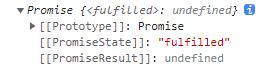
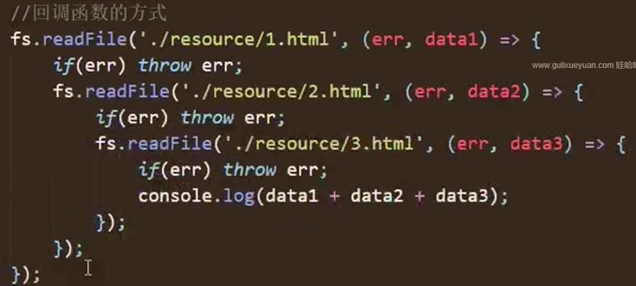

## async await

### async 函数

用来标记一个函数成为 async 函数, 函数的返回值是 promise 对象. 而且 promise 对象结果由 async 函数执行的返回值决定

```js
async function main() {}

let result = main();
console.log(result); // 打印结果见下图
```



这个 promise 对象的状态是 fulfilled, 由谁决定的?

由函数内部的 return 决定的

```js
async function main() {
  // 1. 如果返回值是一个非Promise类型的数据, 包括undefined, promise对象的状态就是fulfilled, 结果也是return的值
  return 521;

  // 2. 如果返回的是一个promise对象, 此时return的结果决定了main函数返回的结果的状态
  return new Promise((resolve, reject) => {
    resolve("ok");
  });

  // 3. 抛出异常
  throw "oh";
}

let result = main();
console.log(result); // 打印结果见下图
```

### await 表达式

1. await 右侧的表达式 一般为 promise 对象, 但也可以是其他的值, 比如数字, 字符串, 布尔值, 运算等等

2. 如果 await 右侧是一个 promise 对象, awiat 返回的是 promise 成功的值

3. 如果表达式是其他值, 直接将这个值作为 await 的返回值

注意:

1. await 必须写在 async 函数中, 但是 async 函数中可以没有 await

2. 如果 awiat 的 promise 失败了, 就会抛出异常, 需要通过 try...catch 捕获处理

```js
async function main() {
  let p = new Promise((resolve, reject) => {
    // resolve('ok')
    reject("error");
  });
  // 1. 右侧为promise的情况
  let res = await p;
  console.log(res); // ok

  // 2. 右侧为其他类型的数据
  let res2 = await 20;
  console.log(res2);

  // 3. 如果promise是失败的状态
  let res3 = await p;
  console.log(res3); // 抛出错误Uncaught(in promise) Error
}
main();
```

上面 res3 抛出错误, 那么怎么捕获呢?

```js
async function main() {
  let p = new Promise((resolve, reject) => {
    reject("error");
  });

  try {
    let res = await p;
    console.log(res);
  } catch (error) {
    console.log(error);
  }
}

main();
```

## async 与 await 结合实践

### 回调函数方式读取 3 个文件内容拼接



### async 与 await

```js
async function main() {
  try {
    let data1 = await mineReadFile("路径");
    let data2 = await mineReadFile("路径");
    let data3 = await mineReadFile("路径");
    console.log(data1 + data2 + data3);
  } catch (e) {
    console.log(e);
  }
}

main();
```
