## 请说明 Ajax Fetch Axios 三者的区别

三者都用于网络请求, 但是不同维度

Ajax (Asyncchronous Javascript and XML)是个技术统称

Fetch, 一个具体的 API

Axios, 第三方库

### 面试题: 用 XMLHttpRequest 实现 Ajax

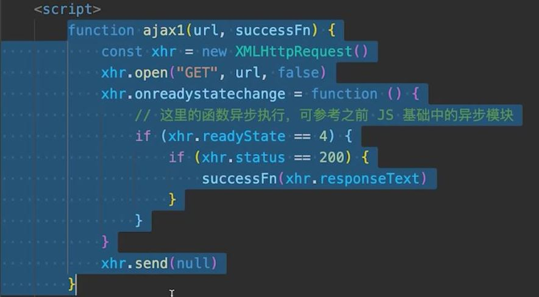

### Fetch

浏览器原生 API, 用于网络请求

和 XMLHttpRequest 一个级别, 或者说是 XMLHttpRequest 的升级版

Fetch 语法更简洁, 易用, 支持 Promise

```js
function ajax2(url) {
  return fetch(url).then((res) => res.json());
}
```

### Axios

底层可以用 XMLHttpRequest 或者 fetch 去实现

## 防抖和节流

### 防抖

防抖: "你先抖动着, 啥时候停了, 再执行下一步"

例如: 一个搜索框, 等输入停止之后, 再触发搜索

```js
// 搜索 <input id="input1" />

function debounce(fn, delay = 200) {
  let timer = 0;

  return function () {
    if (timer) clearTimeout(timer);

    timer = setTimeout(() => {
      fn.apply(this, arguments); // 透传 this 和参数
      timer = 0;
    }, delay);
  };
}

const input1 = document.getElementById("input1");
input1.addEventListener(
  "keyup",
  debounce(() => {
    console.log("发起搜索", input1.value);
  }, 300)
);
```

### 节流

```js
// 可拖拽
// <div id="div1" draggable="true" style="width: 100px; height: 50px; background-color: #ccc" padding: 10px></div>

function throttle(fn, delay = 100) {
  let timer = 0;

  return function () {
    if (timer) return;

    timer = setTimeout(() => {
      fn.apply(this, arguments); // 透传 this 和参数
      timer = 0;
    }, delay);
  };
}

const div1 = document.getElementById("div1");
div1.addEventListener(
  "drag",
  throttle((e) => {
    console.log(e.offsetX, e.offsetY);
  }, 200)
);
```

### 两者有什么区别

:::tip
防抖: 限制执行次数, 多次密集的触发只执行一次. 搜索框, 防抖关注结果.

节流: 限制执行频率, 有节奏的执行. 拖拽事件 , 节流关注过程, 让变得有节奏
:::

## px 百分比 em rem vw/vh 有什么区别

### px 和 %

px 是基本单位, 也是绝对单位 (其他的都是相对单位), px 的长度是固定的

% 是相对于父元素的宽度比例

### em 和 rem

em 相对于当前元素的 font-size

rem 相对于根节点的 font-size

### vw 和 vh

vw 屏幕宽度的 1%

vh 屏幕宽度的 1%

vmin 两者的最小值, vmax 两者的最大值

## 什么时候不能用箭头函数

1. 对象方法, 对象原型, 构造函数

2. 动态上下文中的回调函数

3. vue 生命周期和 method, 因为 vue 组件本质是个 js 对象, 跟第一点一样. 但是 react 组件(非 hooks)本质上是一个 es6 class, 所以 react 中可以用箭头函数

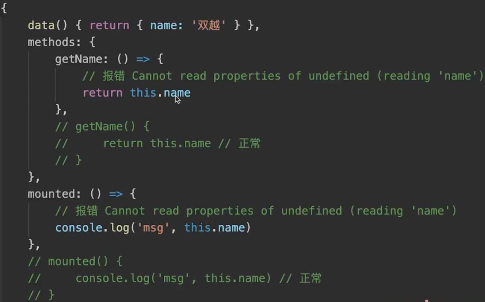

```js
const btn1 = document.getElementById('btn1)
btn1.addEventListener('click', () => {
  // console.log(this === window)
  this.innerHTML = 'clicked'
})
```

### 箭头函数有什么缺点?

1. 没有 arguments

```js
const fn1 = () => {
  console.log(arguments); // arguments is not defined
};
fn1(100, 200);

function fn1() {
  console.log(arguments); // 100 200
}
```

2. 无法通过 apply call bind 改变 this
   箭头函数的 this 永远指向定义时的父作用域

```js
const fn1 = () => {
  console.log(this); // window
};
fn1();

function fn1() {
  console.log(this); // x:100
}
fn1.call({ x: 100 });
```

## 请描述 TCP 三次握手和四次挥手

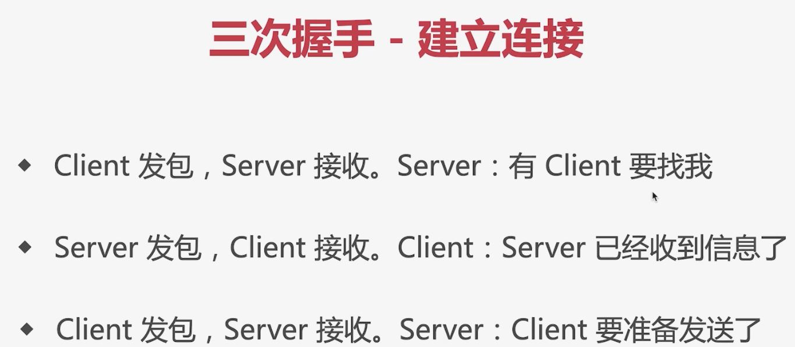

todo..

## for...in 和 for..of 有什么区别

for...in 遍历 得到 key

for...of 遍历 得到 value

```js
const arr = [10, 20, 30];

for (let val of arr) {
  console.log(val);
}
```

for...in 用于可枚举数据, 如对象, 数组, 字符串

for...of 用于可迭代数据, 如数组, 字符串, Map, Set

## offsetHeight clientHeight scrollHeight 区别

offsetHeight: 在 box-sizing 设置为 border-box 的时候, 为 border + padding + content 也就是 width 和 height 的值

clientHeight: padding + content

scrollHeight: padding + 实际内容尺寸

## HTMLCollection 和 NodeList 区别

### Node 和 Element

DOM 是一棵树, 所有节点都是 Node

Node 是 Element 的基类

Element 是其他 HTML 元素的基类, 如 HTMLDivElement

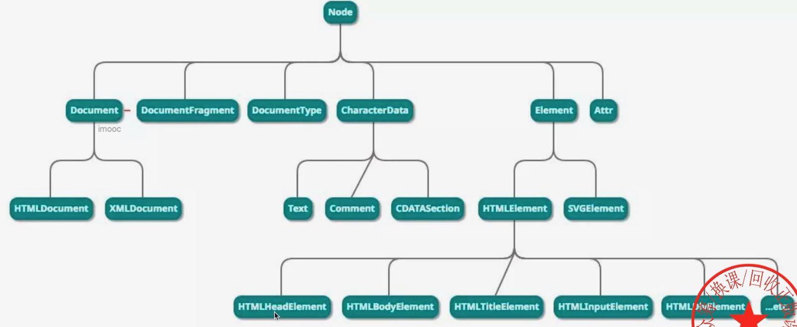

## http 跨域时发送的 options 请求

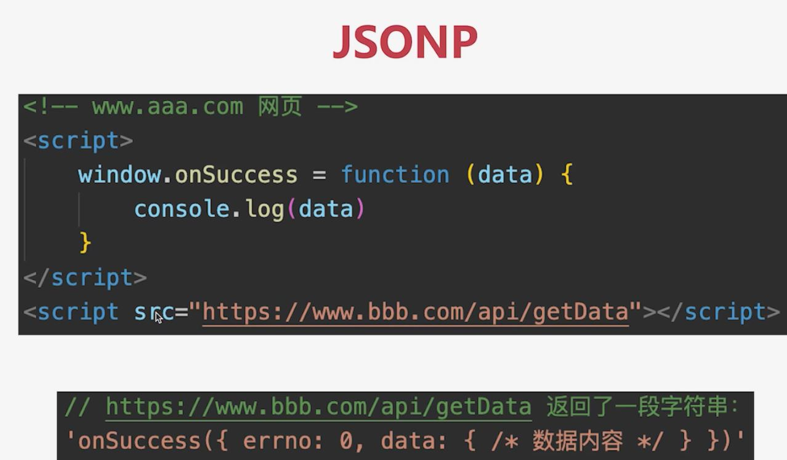

:::tip 流程
aaa 网页中先定义一个全局函数, 接口地址放在 script 中去请求, 因为 script 不会跨域, 所以会请求这个地址, 这个地址的接口会返回一段字符串, 字符串内容就是调用这个函数. 并且这个字符串在 script 中, 会被当做 js 来执行, 一执行就调用了上面定义的方法, 得到数据
:::

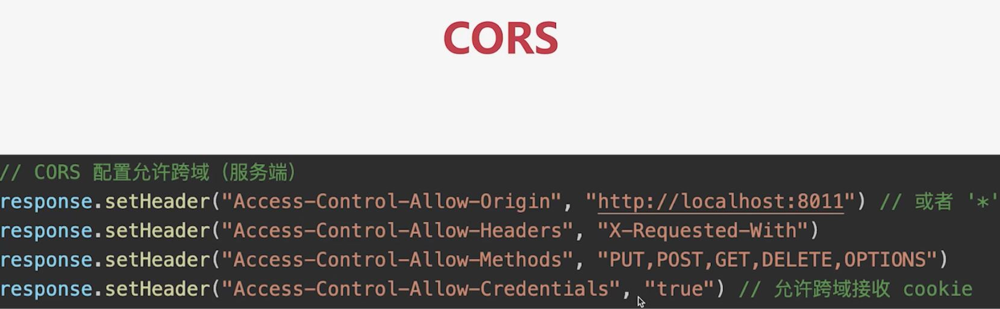

options 请求, 是跨域请求之前的预检查, 浏览器自行发起的, 无需我们干预

## 如何检测 JS 内存泄漏? JS 内存泄漏场景有哪些?

```js
function fn() {
  const a = "a";
  console.log(a);

  const obj = { x: 100 };
  console.log(obj);
}
fn();
```

上面代码的 fn 函数执行完之后变量 a, obj 这些用完就要销毁了

但是有时不会回收, 看下面情况

```js
function fn2() {
  const obj = { x: 100 };
  window.obj = obj;

  // 因为window引用了这个对象, obj有可能未来还会用到. 便不会回收
}
fn2();
```

```js
function getData() {
  const data = {}; // 闭包, 它会被函数填充数据或者获取数据
  return {
    get(key) {
      return data[key];
    },
    set(key, value) {
      data[key] = value;
    },
  };
}

const { get, set } = getData();
set("x", 100);
get("x");

// data不会被回收, 因为return的get和方法都在引用. 所以闭包的东西一直驻在内存
```

### 垃圾回收算法

引用记数(之前)

标记清除(现代)

### JS 内存泄漏如何检测?

检测内存变化

### 内存泄漏的场景(vue 为例)

- 被全局变量, 函数引用, 组件销毁时未清除

- 被全局事件, 定时器引用, 组件销毁时未清除

- 被自定义事件引用, 组件销毁时未清除

### 如何防止内存泄漏 (vue 为例)

定时器销毁:

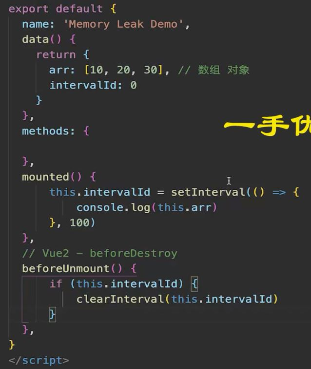

监听事件销毁:

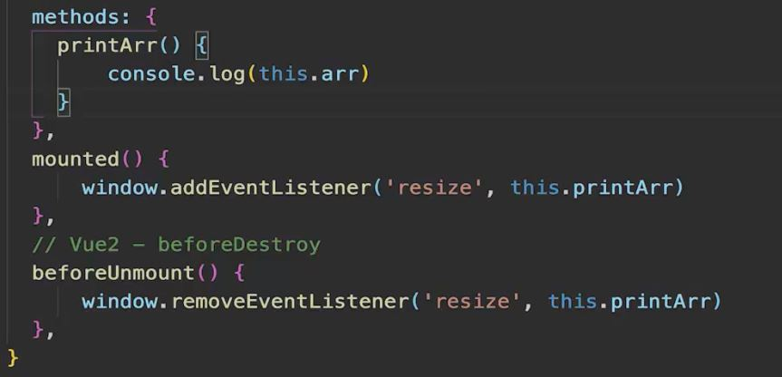

### WeakMap WeakSet 弱引用

```js
const data = {};
function fn1() {
  const obj = { x: 100 };
  data.obj = obj;
}
fn1();

// 上面这代码的变量 无法被垃圾回收
// 包括使用Map来引用

const map = new Map();
function fn1() {
  const obj = { x: 100 };
  map.set("", obj);
}
fn1();

// 但是使用WeakMap就可以清除

const map = new WeakMap();
function fn1() {
  const obj = { x: 100 };
  map.set("", obj);
}
fn1();
```

## vdom 真的快吗?

数据驱动视图的技术方案: vdom

vdom 并不快, JS 直接操作 DOM 才是最快的.

但数据驱动视图需要合适的技术方案, 不能全部 dom 重建 vdom 就是目前最合适的技术方案

### 数据驱动视图的过程

data 变化 --> 生成 vnode 触发 diff 算法 vnode , 生成新 vnode --> 更新 DOM

上面其中重要的一环就是 vdom

### 扩展 svelte 就不用 vdom

## for 和 forEach 哪个快?

```js
const arr = [];
for (let i = 0; i < 100 * 10000; i++) {
  arr.push(i);
}
const length = arr.length;

console.time("for");
let n1 = 0;
for (let i = 0; i < length; i++) {
  n1++;
}
console.timeEnd("for");

console.time("forEach");
let n2 = 0;
arr.forEach(() => n2++);
console.timeEnd("forEach");
```

for 比 forEach 快

因为 for 同在一个函数中, forEach 每次都要创建一个函数来调用, 而 for 不会创建函数. 函数需要独立的作用域, 会有额外的开销

越低级的代码, 性能往往越好

## JS Bridge 原理

网页中 JS 无法调用 native API (手机 app)

需要通过一些特定的"格式"来调用

这些"格式"就统称 JS-Bridge, 例如微信 SDK.

JS-Bridge 本质还是一堆 js, 只不过对 app 提供能力的一种封装

### JS Bridge 的常见实现方式

- 注册全局 API

不太适合处理异步情况, 可能导致卡顿

- URL Scheme

原理就是自造一个协议标准

比如

weixin:// 打开微信

weixin://dl/scan 扫一扫

...

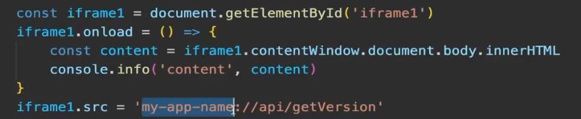

上面是伪代码, 一般都是封装 sdk

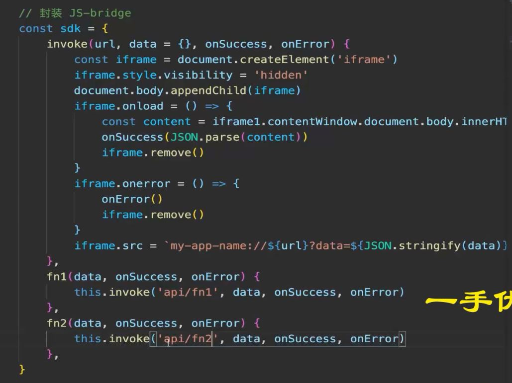

## requestIdleCallback 和 requestAnimationFrame

### requestIdleCallback

由 React fiber 引起的关注

:::tip fiber 机制
将 react 虚拟 dom 树转换为链表, 可分段渲染. 如果是个大组件树, 可以先渲染一部分, 等待其他任务执行完之后再渲染一部分. 等待的任务就是高优先级任务, 比如文字显示, 动画执行. 空闲时再继续渲染

如何判断空闲?

通过 requestIdleCallback
:::

### 两者区别

requestIdleCallback 空闲时才执行, 低优

requestAnimationFrame 每`帧`渲染完都会执行, 高优

两者都是宏任务

因为都是等 dom 渲染完之后再执行

### 代码演示

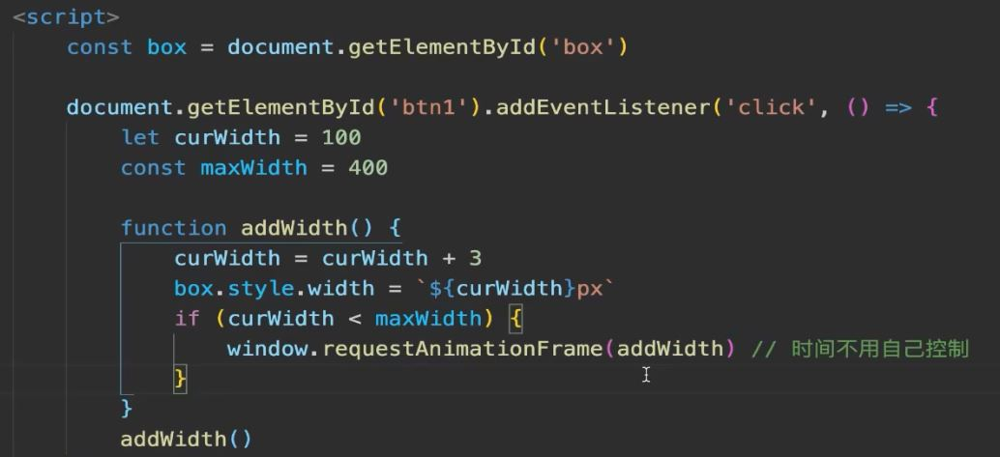

## JS 严格模式有什么特点

1. 全局变量必须先声明

2. 禁止用 with

3. 创建 eval 作用域

4. 禁止 this 指向 window

5. 函数参数不能重名

## Session 和 JWT 哪个更好?

### Session

Session 用户信息存储在服务端, 可快速封禁某个用户

占用服务端内存, 硬件成本高

多进程, 多服务器时, 不好同步 -- 需使用三方缓存, 如 redis

默认有跨域限制

### JWT

JWT 不占用服务端内存

多进程, 多服务器不受影响

没有跨域限制

缺点: 用户信息存储在客户端, 无法快速封禁某用户. 需要建立黑名单机制

万一服务端秘钥被泄露, 则用户信息全部丢失. 因为 JWTtoken 存储所有用户信息

## 如何实现 SSO 单点登录?

### 基于 cookie

cookie 默认不可跨域共享, 但有些情况下可设置为共享

主域名相同, 如www.baidu.com image.baidu.com

设置 cookie domain 为主域名, 即可共享 cookie

## HTTP 协议 1.0 1.1 2.0 有什么区别?

### 1.0

支持基础的 get post 方法

### 1.1

增加缓存策略 cache-control Etag 等

支持长链接 Connection: keep-alive, 一次 TCP 连接多次请求

断点续传, 状态码 206

支持新的方法 PUT DELETE 等, 可用于 Restful API

### 2.0

可压缩 header, 减少体积

多路复用, 一次 TCP 连接中可以多个 HTTP 并行请求

服务端推送

## script defer 和 async 有什么区别?

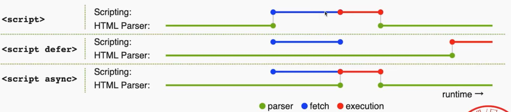

HTML 和 JS 不能并行解析, 只能并行下载

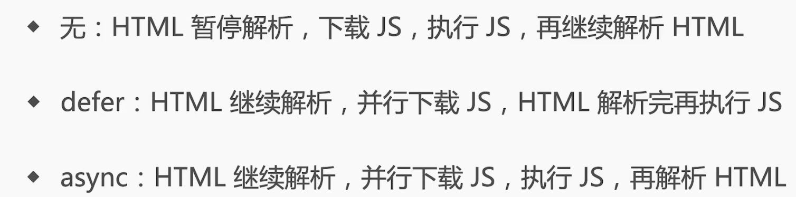

## 前端攻击, 该如何预防

### XSS

Cross Site Script 跨站脚本攻击

手段: 黑客将 JS 代码插入到网页内容中, 渲染时执行 js 代码

预防: 特殊字符替换(前端或者后端)

### CSRF

手段: 黑客诱导用户去访问另一个网站的接口, 伪造请求

举例: 用户登录了 A 网站, 有了 cookie. 黑客诱导用户到 B 网站, 并发起 A 网站的请求. A 网站的 API 发现有 cookie, 认为是用户自己操作的

预防: 严格的跨域限制, 比如判断 referer(请求来源), 为 cookie 设置 SameSite, 禁止跨域传递 cookie + 验证码机制

### 点击劫持

手段: 诱导界面上蒙一个透明 iframe, 诱导用户点击

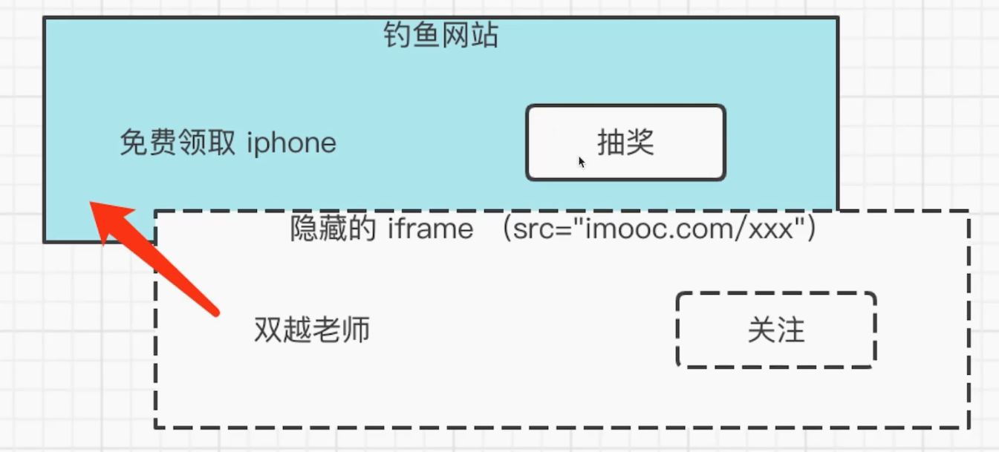

预防: 让 iframe 不能跨域加载

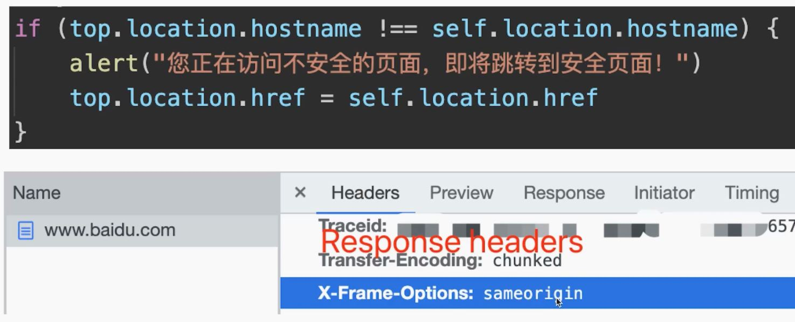

### DDos

分布式拒绝服务

手段: 分布式, 大规模的流量访问, 让服务器瘫痪

预防: 软件层不好做, 需硬件预防 (如阿里云 WAF)

### SQL 注入

手段: 黑客提交内容时写入 SQL 语句, 操作数据库

预防: 处理输入的内容, 替换特殊字符

## WebSocket

支持端对端通讯

可以由 client 发起, 也可以由 server 发起

用于: 消息通知, 直播间讨论区, 聊天室, 协同编辑

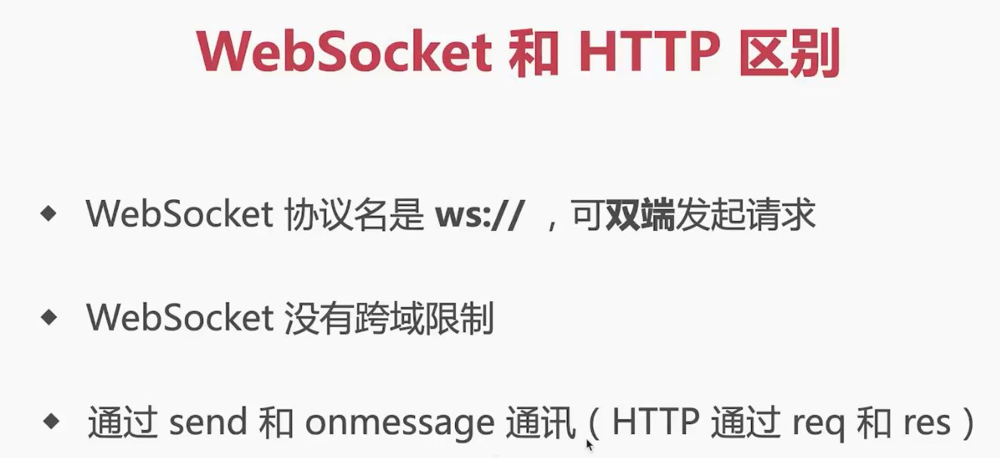

ws 可以升级为 wss

### WebSocket 和 HTTP 长轮询的区别?

略

## 如何实现网页多标签tab通讯


