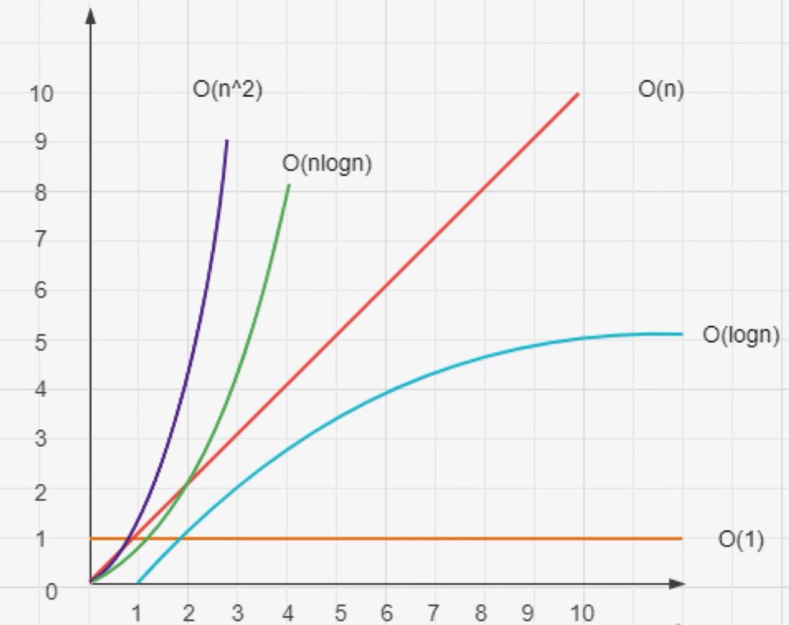
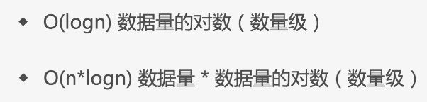

## 算法复杂度

什么是复杂度: 程序执行时需要的计算量和内存空间 (和代码是否简洁程度无关)

复杂度是数量级(方便记忆, 科普), 不是具体的数字



### 时间复杂度




代码演示:

```js
// O(1)

function fn(obj = {}) {
  return obj.a + obj.b + obj.c;
}
```

```js
// O(n)

function fn(arr = []) {
  for (let i = 0; i < arr.length; i++) {
    console.log(arr[i]);
  }
}
```

```js
// O(n^2)

function fn(arr = []) {
  for(let i = 0; i < arr.length; i++) {
    for(let j = 0; j < arr.length; j++>) {
      console.info(arr[j])
    }
  }
}
```

```js
// O(n*logN)

function fn(arr = []) {
  for (let i = 0; i < arr.length; i++) {
    // 二分
  }
}
```

### 空间复杂度

程序执行时需要的内存空间

前端领域重时间轻空间, 因为前端的内存空间一般够用

和时间复杂度的对数图一样

```js
// O(1)

function fn(arr = []) {
  const a = arr[0]

  const b = arr[1]

  ...
}
```

```js
// O(n)

function fn(arr = []) {
  const arr2 = [];

  for (let i = 0; i < arr.length; i++) {
    arr2[i] = arr[i];
  }
  // ...
}
```

Todo..