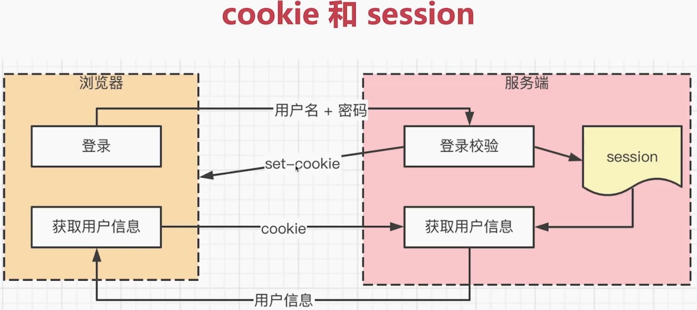
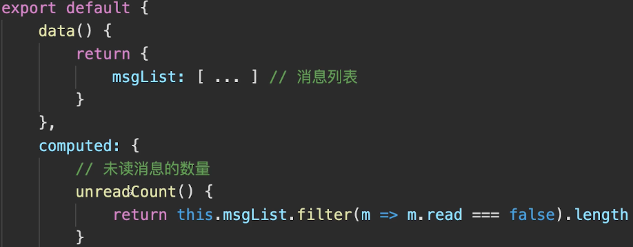
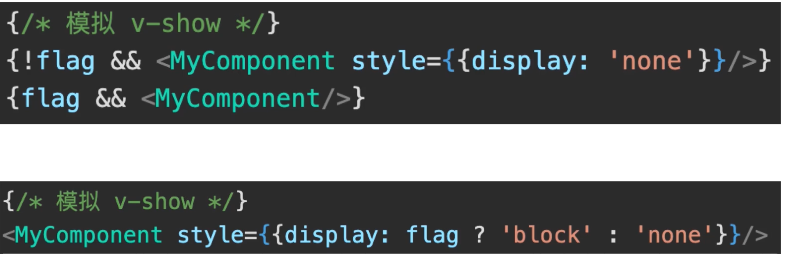
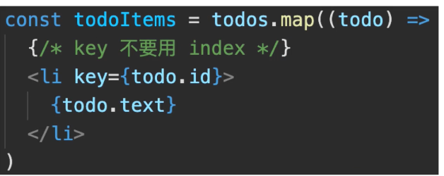
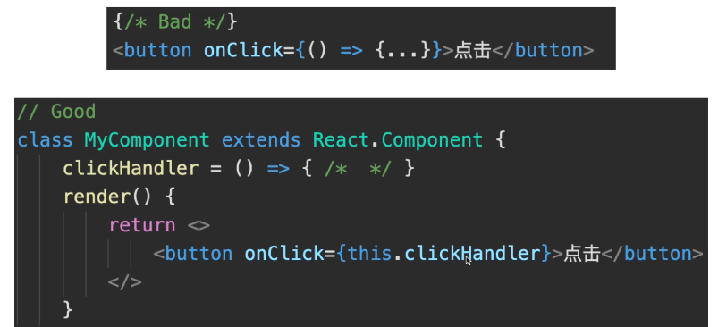
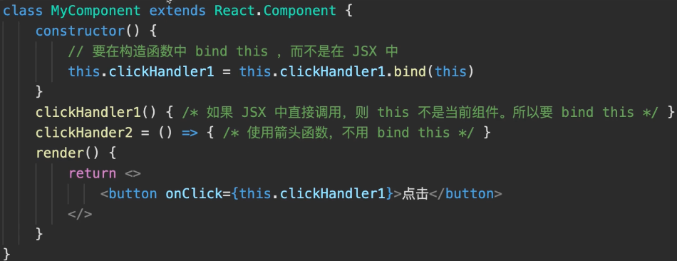
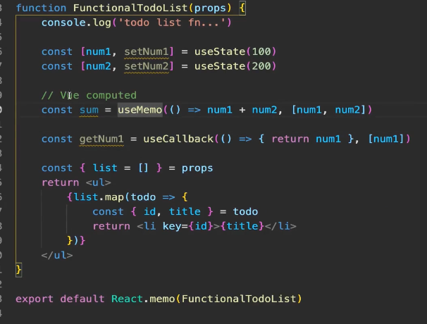
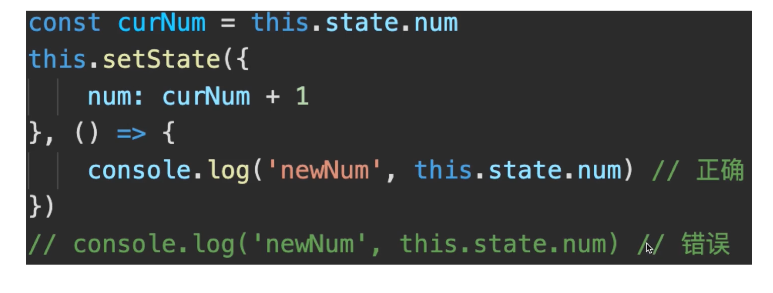
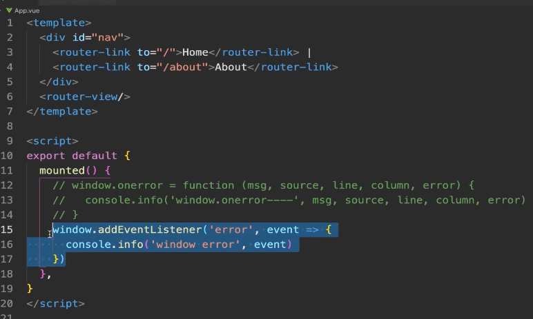
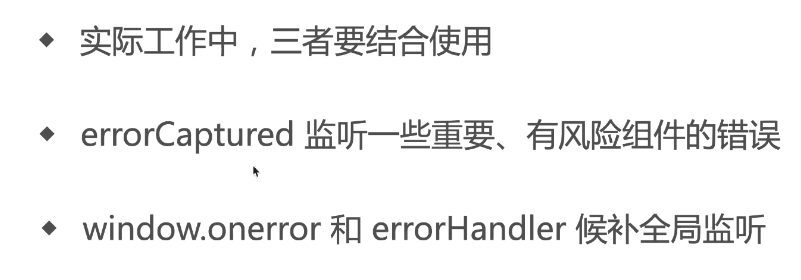

## Vue 中 computed 和 watch 区别

computed 用于计算产生`新数据`

watch 用于监听现有数据


## Vuex 中 mutation actiion 区别

mutation: 原子操作, 必须同步代码

action: 可包含多个 mutation; 可包含异步代码

## Vue 各个生命周期

#### beforeCreate

创建一个空白的 Vue 实例

data method 尚未被初始化, 不可使用

#### created

Vue 实例(或者说 Vue js 对象)初始化完成,完成响应式绑定

data method 初始化完成, 可以调用

尚未开始渲染模板

该生命周期可以做一些与页面, dom 无关的操作

#### beforeMount

编译模板, 调用 render 生成 vdom

但是还没有开始渲染 DOM, 也就是说此时 vdom 还是 js 级别, 不是 dom 级别

#### Mounted

完成 dom 渲染

组件创建完成

开始由创建阶段进入运行阶段

#### beforeUpdate

data 发生变化之后

准备更新 dom (尚未更新)

#### updated

data 发生变化, 且 dom 更新完成

不要在 updated 中修改 data, 可能会导致死循环

#### beforeUnmount

组件进入销毁阶段(尚未销毁, 可正常使用) 可移除, 解绑一些全局事件, 定时器, 自定义事件等

#### unmounted

组件个子组件被销毁了

#### keep-alive 组件

onActivated 缓存组件被激活

onDeactivated 缓存组件被隐藏

### Vue 什么时候操作 dom 比较合适

mounted 和 updated 都不能保证子组件全部挂载完成

应使用$nextTick 渲染 DOM


### Vue3 Composition API 生命周期有何区别?

- 用 setup 代替了 beforeCreate 和 created
- 使用 Hooks 函数的形式, 如 mounted 改为 onMounted()

## Vue2 Vue3 React 三者 diff 算法有何区别?

react 仅右移

vue 双端比较

vue3 最长递增子序列

### Vue React 为何循环时必须使用 key?

vdom diff 算法会根据 key 判断元素是否要删除

未匹配 key, 则删除重建 - 性能较差

匹配了 key, 则只移动元素 - 性能好

## 移动端 H5 click 有 300ms 延迟, 如何解决?

背景: double tap to zoom

为了让双击功能实现

解决方案:


原理:


进化:

 有这个属性手机就认为已经对网页做了响应式布局, 已经不需要 300 毫秒的延迟了

## 网络请求中, token 和 cookie 有什么区别?

### cookie

HTTP 无状态, 每次请求都要带 cookie, 以帮助识别身份

服务端也可以向客户端 set-cookie

默认有跨域限制: 不可跨域共享, 传递 cookie. 如果要跨域共享, 需要设置 withCredentials

现代浏览器开始禁止第三方 cookie, 和跨域限制不同. 这里是禁止网页引入的第三方 js 设置 cookie. 比如说做了个个人网站, 在上面挂了广告, 这个广告是通过第三方 js 引入的, 这个第三方 js 是可以设置 cookie 的. 这个 cookie 就可以记录下当前用户访问的一些信息, 比如说这个个人网站的文章是关于手机的, cookie 记录下这个用户有买手机的倾向 .那么为了打击第三方广告, 保护隐私. 不过这个禁止可以通过 SameSite: Strict / Lax / None;来选择禁止程度, None 就是不禁止

### cookie 和 session

cookie 用于登录验证, 存储用户标识(如 userid)

session 在服务端, 存储用户详细信息, 和 cookie 信息一一对应

cookie + session 是常见登录验证解决方案



## 对 Vue 做过哪些优化

- v-if 和 v-show

- v-for 用 key

- 使用 computed 缓存



- keep-alive 缓存组件

- 异步组件

## 使用 Vue 中遇到过哪些坑

- 内存泄露

  - 原因: 一些全局变量, 全局事件, 全局定时器, 自定义事件没有及时销毁

- Vue2 响应式的缺陷 (Vue3 不再有)

  - 原因: data 新增属性用 Vue.set, data 删除属性用 Vue.delete. 无法直接修改数组 arr[index] = value

- 路由切换时 scroll 到顶部

  - 原因: spa 通病, 不仅是 vue. 如, 列表页, 滚动到第二屏, 点击进入详情页. 再返回到列表页(此时组件重新渲染)就 scroll 到顶部

  - 解决: 在列表页缓存数据和 scrollTop 值

  - 终极解决方案: MPA + App WebView. 因为触发 new Webview , 相当于一个新页面放在第一个页面的上面

## 做过哪些 react 优化

- 使用 CSS 模拟 v-show



- 循环使用 key



- 使用 Fragment

- JSX 中不定义函数

  - 原因: 因为 react 中的 jsx 会被频繁执行, state 更改一次, jsx 就被执行一次, 因为 jsx 本质是一个函数, 这个函数执行生成虚拟 dom 节点, 所以避免执行的时候就新建函数



- 要在构造函数中 bind this

  - 原因: 跟上面一样, 总之避免在 jsx 中频繁新建函数



- 使用 SCU, 或者直接使用 PureComponent, 函数组件使用 React.memo

  - 原因: 使用 setState 的时候要使用不可变数据, 不能修改当前 state 的值. 所以要使用不影响原数据的方法比如 concat. 同时 react 默认会让所有的子组件都更新, 无论涉及的数据是否变化. 而实际上无需更新, 所以用 SCU 比较新老 props. 使用 immer 第三方库保证写法

- Hooks 缓存数据和函数

  - 使用 useMemo, useCallback



- setState 是异步更新的



## 如何统一监听 Vue 组件报错

### 方式一: window.onerror

全局监听所有 JS 错误, 但它是 JS 级别的, 识别不了 Vue 组件信息, 捕捉一些 Vue 监听不到的错误



注意 try...catch... 捕获的 error, 无法被 window.onerror 监听到

### 方式二: errorCaptured 生命周期

监听所有下级组件的错误

返回 false 会阻止向上传播

```js
// App.js

errorCaptured: (err, vm, info) => {
  console.info("errorCaptured---", err, vm, info);
  return false;
};
```

### 方式三: errorHandler 配置

Vue 全局错误监听, 所有组件错误都会汇总到这里, 但 errorCaptured 返回 false, 不会传播到这里

`异步回调里的错误`, errorHandler 监听不到, 需要使用 window.onerror



## 如何统一监听 React 组件报错

### ErrorBoundary 组件

- 监听所有下级组件报错, 可降级展示 UI

- 只监听组件渲染时报错, `不监听DOM事件(Vue可以监听dom事件错误)`, 异步错误

- 只在 production 环境生效, dev 会直接抛出错误

## 如果一个 H5 很慢, 如何排查性能问题

### 前端性能指标

Chrome devTools - Performance

- First Paint(FP) 第一次渲染

- First Contentful Paint(FCP) 第一次有内容渲染

- LCP 第一次有意义的渲染

- DCL

....
