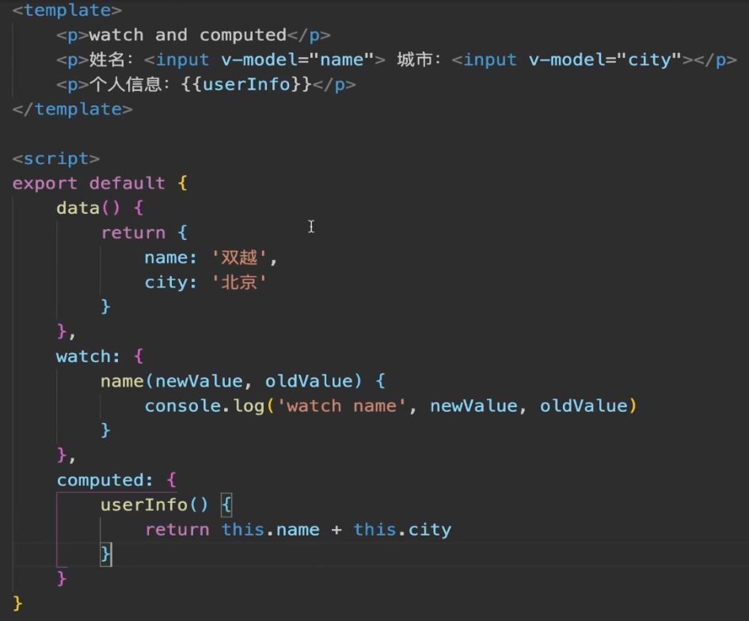
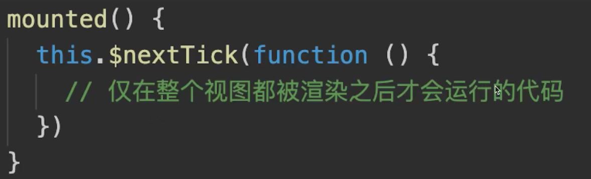
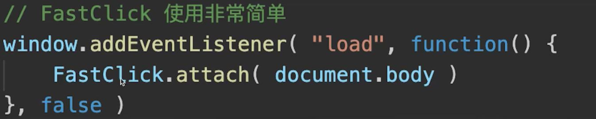
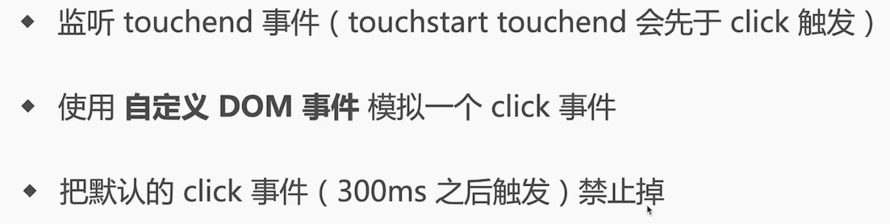
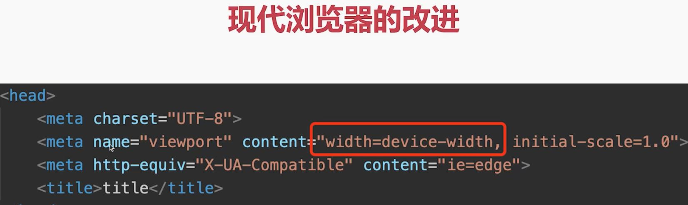

## Vue 中 computed 和 watch 区别

computed 用于计算产生`新数据`

watch 用于监听现有数据

## Vuex 中 mutation actiion 区别

mutation: 原子操作, 必须同步代码

action: 可包含多个 mutation; 可包含异步代码

## Vue 各个生命周期

#### beforeCreate

创建一个空白的 Vue 实例

data method 尚未被初始化, 不可使用

#### created

Vue 实例(或者说 Vue js 对象)初始化完成,完成响应式绑定

data method 初始化完成, 可以调用

尚未开始渲染模板

该生命周期可以做一些与页面, dom 无关的操作

#### beforeMount

编译模板, 调用 render 生成 vdom

但是还没有开始渲染 DOM, 也就是说此时 vdom 还是 js 级别, 不是 dom 级别

#### Mounted

完成 dom 渲染

组件创建完成

开始由创建阶段进入运行阶段

#### beforeUpdate

data 发生变化之后

准备更新 dom (尚未更新)

#### updated

data 发生变化, 且 dom 更新完成

不要在 updated 中修改 data, 可能会导致死循环

#### beforeUnmount

组件进入销毁阶段(尚未销毁, 可正常使用) 可移除, 解绑一些全局事件, 定时器, 自定义事件等

#### unmounted

组件个子组件被销毁了

#### keep-alive 组件

onActivated 缓存组件被激活

onDeactivated 缓存组件被隐藏

### Vue 什么时候操作 dom 比较合适

mounted 和 updated 都不能保证子组件全部挂载完成

应使用$nextTick 渲染 DOM

### Vue3 Composition API 生命周期有何区别?

- 用 setup 代替了 beforeCreate 和 created
- 使用 Hooks 函数的形式, 如 mounted 改为 onMounted()

## Vue2 Vue3 React 三者 diff 算法有何区别?

react 仅右移

vue 双端比较

vue3 最长递增子序列

### Vue React 为何循环时必须使用 key?

vdom diff 算法会根据 key 判断元素是否要删除

未匹配 key, 则删除重建 - 性能较差

匹配了 key, 则只移动元素 - 性能好

## 移动端 H5 click 有 300ms 延迟, 如何解决?

背景: double tap to zoom

为了让双击功能实现

解决方案:

原理:

进化:

 有这个属性手机就认为已经对网页做了响应式布局, 已经不需要 300 毫秒的延迟了

## 网络请求中, token 和 cookie 有什么区别?

### cookie

HTTP 无状态, 每次请求都要带 cookie, 以帮助识别身份

服务端也可以向客户端 set-cookie

默认有跨域限制: 不可跨域共享, 传递 cookie. 如果要跨域共享, 需要设置 withCredentials
