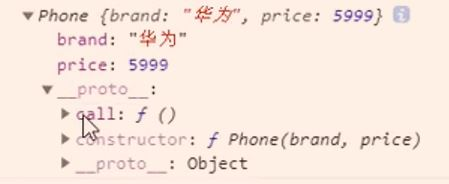
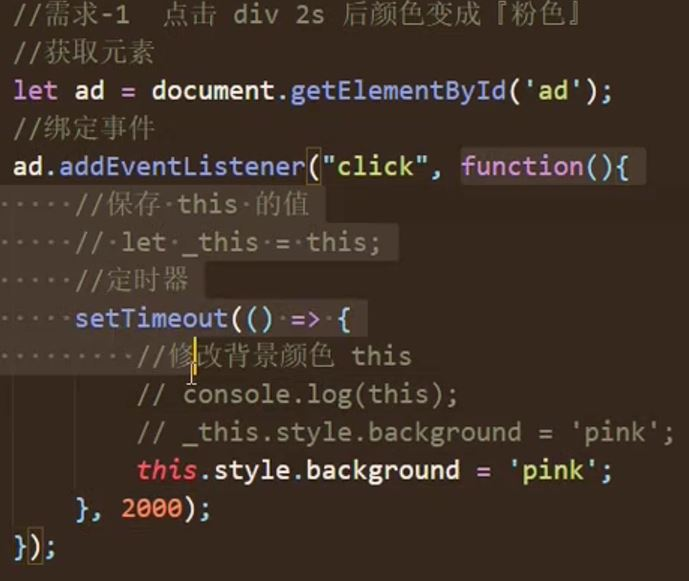
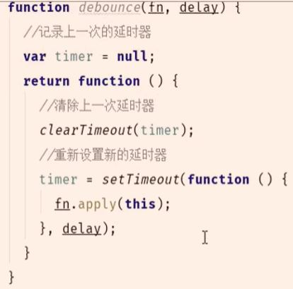
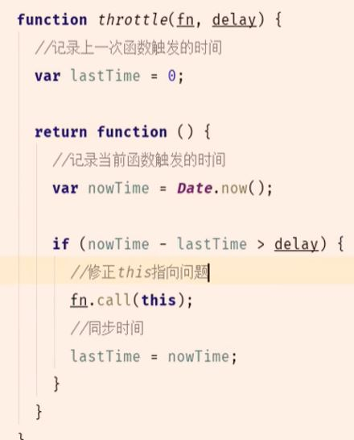

## class

### ES5 通过构造函数实例化对象的方式

```js
function Phone(brand, price) {
  // 对实例对象的属性进行初始化
  this.brand = brand;
  this.price = price;
}

// 添加打电话方法
// 通过原型对象方法添加
Phone.prototype.ring = function () {
  console.log("我可以打电话");
};

// 实例化对象
let Huawei = new Phone("华为", 5999);

console.log(Huawei);
```



### ES6 class 语法实现

```js
class Phone {
  // constructor构造方法
  // 名字固定不能更改
  // 它会自动执行
  // 当我们使用new + 类名的时候自动执行实例对象上的constructor方法

  // 这是添加属性
  constructor(brand，price) {
    this.brand = brand;
    this.price = price;
  }

  // 这是添加方法的形式
  ring() {
    console.log('我可以打电话')
  }
}

let onePlus = new Phone('一加', 1999)

console.log(onePlus)
```

## 静态成员

### ES5 形式

```js
function Phone(brand, price) {}

Phone.name = "手机";
Phone.change = function () {
  console.log("我可以打电话");
};

// 实例化对象
let Nokia = new Phone();

console.log(Nokia.name); // undefined
Nokia.change(); // 报错 Nokia.change is not a function

// 输出undefined, 也就是说实例对象(Nokia)身上没有构造函数(Phoner.name)上面的属性的. 实例对象和函数对象上的属性不通. 只跟构造函数原型对象通, 比如

Phone.prototype.size = "5";
console.log(Nokia.size); //5

// 我们把这样的属性(name和change这两个属性属于函数对象的, 不属于实例对象, 这样的属性)称为静态成员或者静态属性

// 放到面向对象里的表现就是 这个属性是属于类的, 不属于实例对象, 代码演示

class Phone {
  // 静态属性
  static name = "手机";
  static change() {
    console.log("我可以打电话");
  }
}

let Nokia = new Phone();
console.log(Nokia.name); // undefined
console.log(Phone.name); // 手机
```

## 继承

### ES5 里使用构造函数实现继承

```js
function Phone(brand, price) {
  this.brand = brand;
  this.price = price;
}

Phone.prototype.call = function () {
  console.log("我可以打电话");
};

function SmartPhone(brand, price, color, size) {
  Phone.call(this, brand, price);
  this.color = color;
  this.size = size;
}

SmartPhone.prototype = new Phone();
```

### ES6 类继承

```js
class Phone {
  constructor(brand, price) {
    this.brand = brand;
    this.price = price;
  }

  call() {
    console.log("我可以打电话");
  }
}

class SmartPhone extends Phone {
  constructor(brand, price, color, size) {
    super(brand, price); // Phone.call(this, brand, price)
    this.color = color;
    this.size = size;
  }

  photo() {
    console.log("我可以拍照");
  }
}

const xiaomi = new SmartPhone("小米", 799, "黑色", "6");
console.log(xiaomi);
```

## 箭头函数

特性 1: 箭头函数 this 是静态的, this 始终指向函数声明时所在作用域下的 this 值

```js
function getName() {
  console.log(this.name);
}

let getName2 = () => {
  console.log(this.name);
};

window.name = "哈哈";
const school = {
  name: "娃娃",
};

getName(); // '哈哈'
getName2(); // '哈哈'

getName.call(school); // '娃娃'
getName2.call(school); // '哈哈'
```

特性 2: 箭头函数不能作为构造函数去实例化对象

```js
ket Person = (name, age) => {
  this.name = name;
  this.age = age;
}

let me = new Person('HA', 19)
console.log(me)  //报错
```

特性 3: 不能使用 arguments

```js
let fn = () => {
  console.log(arguments); // 报错 arguments is not defined
};
fn();
```

### 箭头函数使用场景

案例 1:



## 防抖 节流

防抖



节流



## 闭包

1. 密闭的容器, 存储数据的

2. 闭包可以认为是个对象, key: value

形成的条件:

1. 函数嵌套

2. 内部函数引用外部函数的局部变量

```js
function fun() {
  var count = 1;
  function fun1() {
    console.log(count);
  }
  // fun2()  虽然fun2没执行,但此时已形成闭包
}

fun();
```

闭包常见的真实场景: 把内部函数返到外部

```js
function fun() {
  var count = 1;
  return function () {
    count++;
    console.log(count);
  };
}

var fun2 = fun();
fun2(); //2
fun2(); //3
```

### 闭包的优点

延长外部函数局部变量的生命周期

## 变量提升

执行上下文: execute context

理解: 代码执行的环境

时机: 代码正式执行之前会进入到执行环境

执行上下文是在代码要执行的时候产生的

工作:

1. 创建 1 个变量对象, 收集变量, 函数, 函数的参数

2. 确认 this 的指向, 全局: this --> window, 局部: this --> 调用的对象

3. 创建作用域链 (父级作用域链 + 当前的变量对象)

4. 扩展: 执行上下文 EC = {变量对象, scopechian, this}

### 作用域

在代码定义的时候产生的

## 宏任务微任务

微任务: new Promise().then(回调)    process.nextTick

宏任务: setTimeout ..