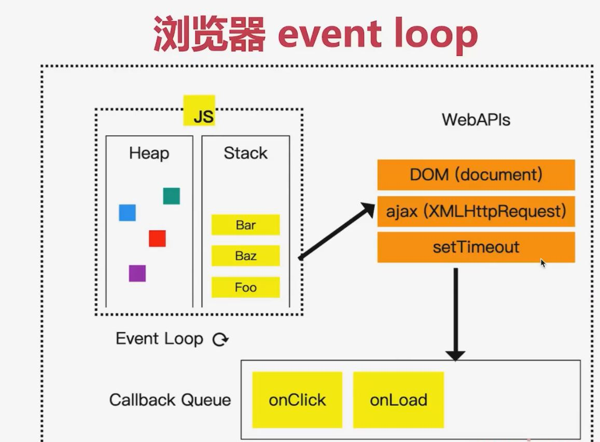
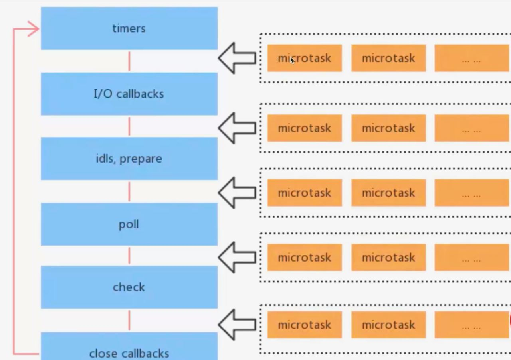

## 浏览器和 nodejs 的事件循环有什么区别?

JS 是单线程的(无论在浏览器还是 nodejs)

浏览器中 JS 执行和 DOM 渲染共用一个线程

异步是单线程解决方案

### 宏任务和微任务

宏任务: setTimeout setInterval 网络请求

微任务: 如 promise async/await MutationObserver

微任务在下一轮 DOM 渲染之前执行, 宏任务在之后执行. 所以微任务某种程度上说要比宏任务要快

代码演示:

```js
console.log("start");
setTimeout(() => {
  console.log("timeout");
});
Promise.resolve().then(() => {
  console.log("promise then");
});
console.log("end");

// start end promisethen timeout
```

```js
const p = document.createElement("p");
p.innerHTML = "new paragraph";
document.body.appendChild(p);
const list = document.getElementsByTagName("p");
console.log("length", list.length);

console.log("start");
setTimeout(() => {
  const list = document.getElementsByTagName("p");
  console.log("length on timeout--", list.length);
  alert("阻塞 timeout");
});
Promise.resolve().then(() => {
  const list = document.getElementsByTagName("p");
  console.log("length on promise.then--", list.length);
  alert("阻塞 promise");
});
console.log("end");
```

### 浏览器 Event Loop 执行过程



上图 左侧 JS 框里的同步代码先执行, 一旦遇到一些比如像 ajax, settimeout 这种异步会通过 web api 的能力把这些异步任务放在 callback queue 里, 等到同步代码执行完再通过 event loop 机制把这些异步函数拿出来放到 stack 里执行.

同时 callback queue 队列又分微任务队列和宏任务队列, 先进先出队列

### nodejs 异步

Nodejs 同样使用 ES 语法, 也是单线程, 也需要异步

异步任务也分: 宏任务 + 微任务

但是, 它的宏任务和微任务, 分不同类型, 有不同优先级

```js
console.log("start");
setImmediate(() => {
  console.log("setImmediate");
});
setTimeout(() => {
  console.log("setTimeout");
});
Promise.resolve().then(() => {
  console.log("promise then");
});
process.nextTick(() => {
  console.log("nextTick");
});
console.log("end");

// start
// end
// nextTick
// promise then
// setTimeout
// setImmediate
```

#### nodejs 宏任务类型和优先级

- Timers: setTimeout setInterval

- I/O callbacks: 处理网络, 流, TCP 的错误回调

- Idle, prepare: 闲置状态(nodejs 内部使用)

- Poll 轮询: 执行 poll 中的 I/O 队列

- Check 检查: 存储 setImmediate 回调

- Close callbacks: 关闭回调, 如 socket.on('close')

#### nodejs 微任务类型和优先级

包括: process.nextTick, promise, async/await

注意: process.nextTick 优先级最高

### nodejs event loop 执行过程

执行同步代码

执行微任务(process.nextTick 优先级最高)

按顺序执行 6 个类型的宏任务 (每个下一个宏任务开始前都执行当前的微任务)



### 注意事项

- 推荐使用 setImmediate 代替 process.nextTick

- nodejs 高低版本有差异

## nodejs 如何开启进程, 进程如何通讯?

进程: process, OS(操作系统)进行资源分配和调度的最小单位, 有独立内存空间

线程: thread, OS 进行运算调度的最小单位, 共享进程内存空间

JS 是单线程的(在进程中只有 1 个线程进行计算, 如果出现更多线程是其他工具帮助的), 但可以开启多进程执行, 如 WebWorker. Java 是多线程的, 提供了很多 api 帮助开启线程和进程

### 为何需要多进程?

多核 cpu, 适合处理多进程. 内存大, 多个进程才能更好利用(单进程有内存上限)

### nodejs 如何开启进程 cluster fork

获取当前进程 id

```js
// 获取当前进程id
console.info(process.pid);
// 目前nodejs没有和thread相关的api, 所以没有办法开启多线程
```

浏览器中通过 webworker 可以开启另一个进程

nodejs 可以通过 `fork` 或者 `cluster` 开启多个进程

开启子进程 child_process.fork 和 cluster.fork, 使用 send 和 on 传递消息

进程是资源调度单位, 是分配内存的. 线程是计算单位, 用于计算的
