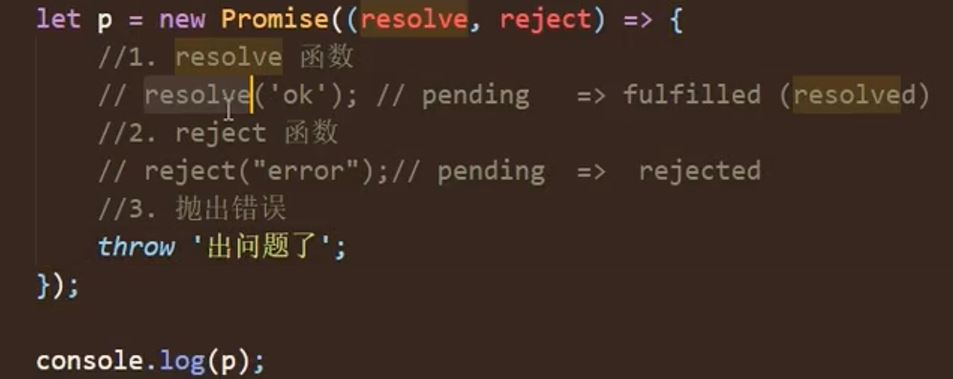

## Promise 表达

1. 从语法上来说: promise 是一个构造函数
2. 从功能上来说: promise 对象用来封装一个异步操作并可以获取其成功/失败的结果值

## 为什么要用 promise?

1. 支持链式调用, 可以解决回调地狱问题

## Promise 初体验

### 定时器模拟

定时器模拟 2 秒延时抽奖结果

```js
btn.addEventListener("click", function () {
  // 定时器
  setTimeout(() => {
    //30%  1-100  1 2 30
    //获取从1 - 100的一个随机数
    let n = rand(1, 100);
    //判断
    if (n <= 30) {
      alert("恭喜恭喜, 奖品为 10万 RMB 劳斯莱斯优惠券");
    } else {
      alert("再接再厉");
    }
  }, 1000);
});
```

### Promise 形式实现

```js
// resolve和reject 都是函数类型的数据
const p = new Promise((resolve, reject) => {
  // 当异步任务成功的时候调用resolve
  // 当异步任务失败的时候调用reject

  // Promise可以包裹一个异步操作
  setTimeout(() => {
    //30%  1-100  1 2 30
    //获取从1 - 100的一个随机数
    let n = rand(1, 100);
    //判断
    if (n <= 30) {
      resolve(); // resolve有个特点, 调用时可以将promise对象的状态设置为成功, promise对象就是上面定义的p, 所以resolve可以将promise的状态改为成功
    } else {
      reject(); // 同上面相反
    }
  }, 1000);
});

// 此时完成了对异步任务的一个封装, 但是此时没有完成, 因为还要对成功和失败之后的需求去做一个实现, 成功输出恭喜, 失败输出再接再厉 , 那么在哪进行这俩输出呢? 需要借助另外的方法 , then方法, 这个方法也是promise对象上的方法, 该方法执行时需要接收2个参数, 而且两个参数都是函数类型的值

p.then(
  () => {}, // 第一个函数参数是对象成功时候的回调, 也就是p对象成功时的回调
  () => {} // 第一个函数参数是对象失败时候的回调, 也就是p对象失败的回调
  // 也就是说, 如果p成功就执行第一个回调函数, 如果失败就执行第二个回调函数
);

p.then(
  () => {
    alert("恭喜恭喜, 奖品为 10万 RMB 劳斯莱斯优惠券);
  },
  () => {
    alert("再接再厉" );
  }
);
```

### Promise 形式实现 补充

```js
// promise的作用除了封装异步操作之外, 还可以获取异步任务当中成功和失败的结果值
// 把n当做结果值, 传递给resolve和reject两个函数
const p = new Promise((resolve, reject) => {
  // 当异步任务成功的时候调用resolve
  // 当异步任务失败的时候调用reject

  // Promise可以包裹一个异步操作
  setTimeout(() => {
    //30%  1-100  1 2 30
    //获取从1 - 100的一个随机数
    let n = rand(1, 100);
    //判断
    if (n <= 30) {
      resolve(n);
    } else {
      reject(n);
    }
  }, 1000);
});

p.then(
  (value) => {
    alert("恭喜恭喜, 奖品为 10万 RMB 劳斯莱斯优惠券, 您的中奖数字为" + value);
  },
  (reason) => {
    alert("再接再厉, 您的号码为 " + reason);
  }
);
```

## Promise 实践练习 - fs 模块

### 回调函数形式

```js
fs.readFile("./xx", (err, data) => {
  if (err) throw err;
  console.log(data.toString());
});
```

### Promise 形式

```js
let p = new Promise((resolve, reject) => {
  fs.readFile("./", (err, data) => {
    if (err) reject(err);
    resolve(data);
  });
});

p.then(
  (value) => {
    console.log(data.toString());
  },
  (err) => {
    console.log(err);
  }
);
```

## Promise 实践练习 - 封装 ajax

### 普通 ajax 形式

```js
btn.addEventListener("click", function () {
  // 1. 创建对象
  const xhr = new XMLHttpRequest();
  // 2. 初始化
  xhr.open('GET', '请求地址')
  // 3. 发送
  xhr.send(null);
  // 4. 处理响应结果
  xhr.onreadystatechange = function() {
    if (xhr.readyState === 4) {
      // 判断响应状态码
      if(xhr.status >=200 && xhr.status < 300>) {
        // 控制台输出响应体
        console.log(xhr.response)
      } else {
        // 控制台输出响应状态码
        console.log(xhr.status)
      }
    }
  }
})
```

### Promise 方式

```js
btn.addEventListener("click", function () {
  const p = new Promise((resolve, reject) => {
    // 1. 创建对象
    const xhr = new XMLHttpRequest();
    // 2. 初始化
    xhr.open("GET", "请求地址");
    // 3. 发送
    xhr.send(null);
    // 4. 处理响应结果
    xhr.onreadystatechange = function () {
      if (xhr.readyState === 4) {
        // 判断响应状态码
        if (xhr.status >= 200 && xhr.status < 300) {
          // 控制台输出响应体
          resolve(xhr.response);
        } else {
          // 控制台输出响应状态码
          reject(xhr.status);
        }
      }
    };
  });
  // 调用then方法
  p.then(
    (value) => {
      console.log(value);
    },
    (reason) => {
      console.log(reason);
    }
  );
});
```

## Promise 封装练习

### 封装一个函数 - fs 模块

```js
function mineReadFile(path) {
  return new Promise((resolve, reject) => {
    require("fs").readFile(path, (err, data) => {
      if (err) reject(err);
      resolve(data);
    });
  });
}

mineReadFile("路径").then(
  (value) => {
    console.log(value.toString());
  },
  (reason) => {
    console.log(reason);
  }
);
```

### 封装 ajax

```js
function sendAjax(url) {
  return new Promise((resolve, reject) => {
    const xhr = new XMLHttpRequest();
    xhr.responseType = "json";
    xhr.open("GET", url);
    xhr.send();
    xhr.onreadystatechange = function () {
      if (xhr.readyState === 4) {
        // 判断成功
        if (xhr.status >= 200 && xhr.status < 300) {
          resolve(xhr.response);
        } else {
          reject(xhr.status);
        }
      }
    };
  });
}

// 某地方使用
sendAjax("地址").then(
  (response) => {},
  (reason) => {}
);
```

## --------------------

## Promise 的状态

### 状态值 PromiseState

状态是 promise 对象当中的一个属性, 准确来说是 `promise 实例对象当中的一个属性`.

这个属性叫 PromiseState


这个状态包括几种值?

总共有 3 种 `pending`, `fullfiled(也叫resolved)`, `rejected`

初始值是 pending

只有两种变化可能

1. pending 变为 fullfiled
2. pending 变为 rejected

状态只能改变一次

## Promise 对象的值

实例对象中的另一个属性 PromiseResult

它`保存着异步任务成功或者失败的结果`

谁可以修改这个属性的值?

有 2 个函数

1. resolve
2. reject

一旦通过这两个函数设置完毕之后, 在后续的 then 方法的回调函数中, 就可以把这个值取出来

## Promise 的基本流程


:::tip
首先通过 new Promise 创建一个对象, 在 promise 内部封装异步操作, 如果异步操作成功, 则调用 resolve 函数, resolve 一调用, 则将 promise 的状态改为成功, 成功再调用 then 方法时, 将调用第一个参数, 也就是第一个回调函数中的代码, 然后返回一个新的 promise 对象, then 方法的返回结果是一个新的 promise
:::

## 如何使用 promise api

### 1. Promise 构造函数: Promise(excutor) {}


```js
let p = new Promise((resolve, reject) => {});

// (resolve, reject) => {
//    resolve()
// }

// 我们把注释的这段代码称为执行器函数.
// 注意执行器函数在promise内部同步调用
// 示例:
let p = new Promise((resolve, reject) => {
  // 同步调用
  console.log(1111);
});
console.log(222);
// 先1 后2
```

### 2. Promise.prototype.then 方法


### 3. Promise.prototype.catch


说明: then()的语法糖, 相当于 then(undefined, onRejected)

### 4. Promise.resolve


它属于 Promise 函数对象的, 并不属于实例对象, 作用是为了快速得到一个 成功 promise 对象, 而且能够封装一个值, 将这个值转化成 promise 对象

说明: 返回一个成功的 promise 对象


p1 控制台是一个 Promise 对象, 而且状态是成功. 成功的值是传入的数字

注意: 如果传入的参数为 非 promise 类型的对象, 则返回的结果为成功 promise 对象

如果传入的参数为 Promise 对象, 则参数的结果决定了 resolve 的结果, 比如下面的代码

```js
let p2 = Promise.resolve(new Promise((resolve, reject)) => {

})
// 传入进来的 new Promise((resolve, reject) => {}) 这个对象的结果决定了 resolve返回的结果. 比如

let p2 = Promise.resolve(new Promise((resolve, reject)) => {
  resolve('ok')
})
console.log(p2)  // 见下图
```


### 5. Promise.reject

它属于 Promise 函数对象的, 并不属于实例对象, 作用是为了快速得到一个 失败的 promise 对象, 而且能够封装一个值, 将这个值转化成 promise 对象. 只不过这个 promise 是失败的


首先返回的 promise, 状态 PromiseState 是个失败的状态: rejected, 而结果 PromiseResult 是传递进来的成功的 promise 对象

### 6. Promise.all


只要有一个失败就返回那一个失败的 promise 对象的结果, 如果都成功的结果是每一个 promise 对象成功的结果组成的数组

```js
let p1 = new Promise((resolve, reject) => {
  resolve("ok");
});
let p2 = new Promise((resolve, reject) => {
  resolve("Success");
});
let p3 = new Promise((resolve, reject) => {
  resolve("Oh Year");
});
const result = Promise.all([p1, p2, p3]); // 他们3个都成功, 返回结果才是一个成功的promise对象. 而且这个成功的结果值是p1, p2, p3 他们的结果组成的数组

console.log(result);
```


如果有一个失败

```js
let p1 = new Promise((resolve, reject) => {
  resolve("ok");
});
let p2 = Promise.reject("Error");
let p3 = new Promise((resolve, reject) => {
  resolve("Oh Year");
});
const result = Promise.all([p1, p2, p3]); // 他们3个都成功, 返回结果才是一个成功的promise对象. 而且这个成功的结果值是p1, p2, p3 他们的结果组成的数组

console.log(result);
```


### 7. Promise.race


## --------------------------------

## Promise 的几个关键问题

### 1. Promise 对象状态改变的方式 - 3 种



### 2. 一个 Promise 指定多个成功/失败回调函数, 都会调用嘛?

答案: 当 promise 改变为对应状态时都会调用


### 3. 改变 promise 状态和指定回调函数谁先谁后?

这个题目可以换种方式来说: 我的 promise 代码在运行时, resolve 改变状态先执行还是 then 方法这个指定回调先执行? 代码如下


答案: 两种情况都有可能出现. 所以就是说有可能 resolve 先改变状态, 再执行 then 方法. 也有可能先执行 then 方法指定回调, 再去 resolve 改变状态

todo..

### 4. promise then 方法的返回的新 promise 的结果状态由什么决定?


### 5. promise 如何串联多个操作任务?

(1) promise 的 then()返回一个新的 promise, 可以看成 then()的链式调用

(2) 通过 then 的链式调用串联多个同步/异步任务


`then方法的返回结果也是一个promise对象`

### 6. 异常穿透

(1) 当使用 promise 的 then 链式调用时, 可以在最后指定失败的回调

(2) 前面任何操作出了异常, 都会传到最后失败的回调中处理


### 7. 中断 promise 链


上面的代码执行完 console.log(111)就不想输出 2 和 3 了, 如何做

有且只有一种方式: 返回一个 pending 状态的 promise, 才能中断 promise 链


## --------------------

## 手写 Promise

### 定义整体结构

```js
function Promise(executor) {}

Promise.prototype.then = function (onResolved, onRejected) {};
```

### resolve 与 reject 结构搭建

```js
function Promise(executor) {
  function resolve(data) {}
  function reject(data) {}
  // 执行器函数是同步调用的
  executor(resolve, reject);
}
```

### resolve 与 reject 代码实现

```js
// resolve一执行, 首先 promise的状态先发生改变, 另外, 它还可以设置 promise成功的结果为ok

function Promise(executor) {
  // 添加属性
  this.PromiseState = "pending";
  this.PromiseResult = null;

  function resolve(data) {
    // 1. 修改实例对象的状态
    // 冒出一个问题, 怎么为实例对象添加属性呢?
    // 上面添加属性的代码
    this.PromiseState = "fulfilled";
    // 2. 设置对象结果值
    this.PromiseResult = data;
  }
  function reject(data) {}
  // 执行器函数是同步调用的
  executor(resolve, reject);
}
```

### throw 抛出异常改变状态

之前我们提到改变 promise 状态有三种方式

1. resolve 2. rejected 3. throw 抛出异常

```js
let p = new Promise((resolve, reject) => {
  throw "error";
});
console.log(p); // 正常的话应该是个失败的promise对象
```

只有 try catch 才能处理 throw 抛出的异常, 那 try catch 往哪加, 看下面代码

```js
function Promise(executor) {
  // 添加属性
  this.PromiseState = "pending";
  this.PromiseResult = null;

  function resolve(data) {
    this.PromiseState = "fulfilled";

    this.PromiseResult = data;
  }
  function reject(data) {
    this.PromiseState = "rejected";

    this.PromiseResult = data;
  }

  try {
    executor(resolve, reject);
  } catch (e) {
    // 上面throw出来的'error'会传递给e
    // 修改promise对象状态为失败
    reject(e);
  }
}
```

### Promise 对象状态只能修改一次的功能

思路在改变状态之前判断状态有没有被改过

```js
function resolve(data) {
  // 判断
  if (self.PromiseState !== "pending") return;

  this.PromiseState = "fulfilled";

  this.PromiseResult = data;
}
```

### then 方法执行回调

```js
// 开始写原型上的then方法

Promise.prototype.then = function (onResolved, onRejected) {
  // 调用回调函数
  // if判断的条件是实例上的PromiseState属性, 那么then方法上如何获取这个属性
  // 可以用this获取
  // 因为这个方法是谁调用的? 是p对象调用的, 所以在现在这个then函数内部, this就指向实例对象p
  if (this.PromiseState === "fulfilled") {
    onResolved(this.PromiseResult);
  }
  if (this.PromiseState === "rejected") {
    onRejected(this.PromiseResult);
  }
};
```

### 异步任务回调的执行

这节我们把执行器函数当中的任务由同步变为异步, 就是不直接改变对象状态, 而是加一个异步

看视频

### 指定多个回调的实现

之前关键问题中有这样一个问题, 如果为一个 promise 对象去指定多个回调, 这些回调都会执行吗? 答案是 只要状态一发生改变, 他们都会执行

看视频

### 同步修改状态 then 方法结果返回

首先回顾一下, 下面这段代码 p 的返回结果

```js
let p = new Promise((resolve, reject) => {
  resolve("ok");
});

let result = p.then(
  (value) => {
    console.log(value)
  },
  (reason) => {
    console.log(reason)
  }
);

console.log(result)  // result是由then方法指定的回调函数的执行结果来决定的. 
// 这回调函数中, 它执行时返回一个非promise类型的数据, 比如undefined, 数字, 字符串等等, result就是一个成功的promise, 如果返回一个promise, xxx看视频
```


### 异步任务修改then方法结果

todo...