## jsx 循环渲染列表

```js

render() {
  return (
    <ul>
      {this.state.list.map((item, index) => {
        return <li key={item.id}>{item.data}</li>
      })}
    </ul>
  )
}
```

## JSX 本质

React.createElement, 返回 vnode

## React 事件为何 bind

默认 this 是 undefined

## React 事件是合成的

1. React event 是合成的, 模拟原生 dom 事件能力
2. event.nativeEvent 才是原生事件对象
3. 所有事件都被挂载到 document 上, 但是 17 绑定到 root 组件(初始化的时候传的 root dom 节点), 这样有利于多个 React 版本并存, 例如微前端. 因为 document 只有一个, root 组件可以有多个

### 为何要合成事件机制

更好的兼容性和跨平台

载到 document, 减少内存消耗, 避免捆绑解绑

方便事件的统一管理(如事务机制)

比如现在事件挂载完毕, 挂载完毕之后触发事件 div, 因为 dom 事件会冒泡, 最终冒泡到 document 上, 因为 react 事件全部绑定到 document 上, document 会生成一个统一的 event 也就是合成事件对象, 在合成事件这一层会派发事件, 比如可以通过 target 知道哪个元素触发的事件, 所以通过判断 target 知道了元素所在位置和绑定关系,就会知道所有绑定了该事件的元素, 然后把合成事件的 event 传递进 来去执行该函数

### 什么是事务机制

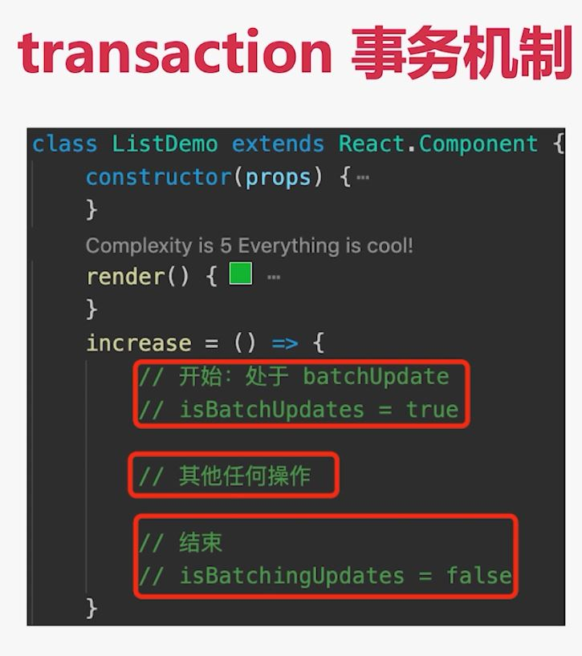

## React 组件渲染过程

拿到 props 和 state 然后 render（）解析 jsx 结构生成 vnode， 再去 patch（elem，vnode）

## React 组件更新过程

先 setState（newstate）生成 dirtyComponents（可能有子组件）然后遍历所有组件去 render（）根据 jsx 结构生成 newVnode，然后 patch

## 受控组件和非受控组件

受控组件:

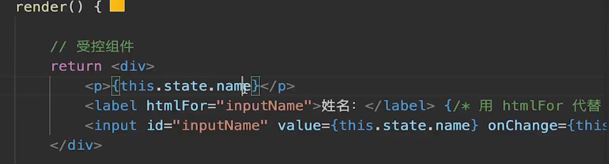

把 input 和 p 标签的值关联起来, 关联之后就能控制 p 标签里的值来控制 input 的值, 也就是说这样关联好之后能通过 this.state 来控制

非受控组件:

React.createRef()

defaultValued defalutedChecked

手动操作 dom 元素

使用场景:

1. 必须手动操作 dom 元素, setState 实现不了

2. 富文本编辑器, 需要传入 dom 元素

3. 上传`<input type=file>`

## setState

### setState 不可变值

不可变值: 操作 state 的时候要是临时的新值, 不影响之前的值

操作数组 不能用 push, 要用下图的方法

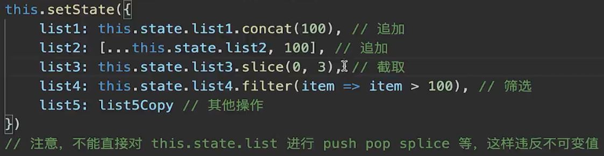

操作对象 要用下面

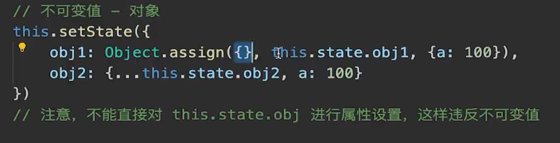

### setState 同步还是异步

正常是异步的, 但是在第二个参数里是同步, 比如下图

```js
this.setState(
  {
    count: this.state.count + 1,
  },
  () => {
    // vue $nextTick
    console.log(this.state.count);
  }
);
```

在 setTimeout 里也是同步

在自定义 dom 事件也是同步

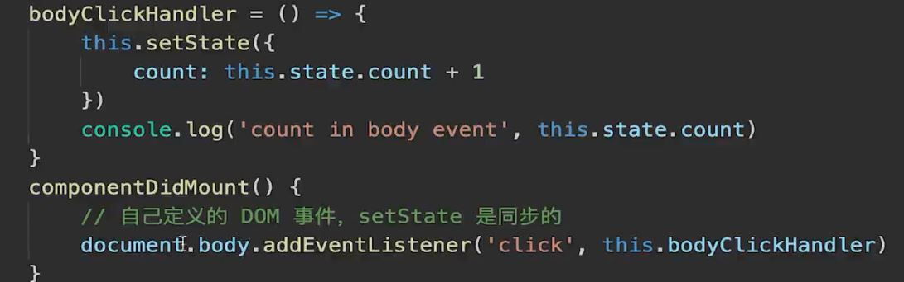

### state 何时会合并

类似 Object.assign({}, xx)

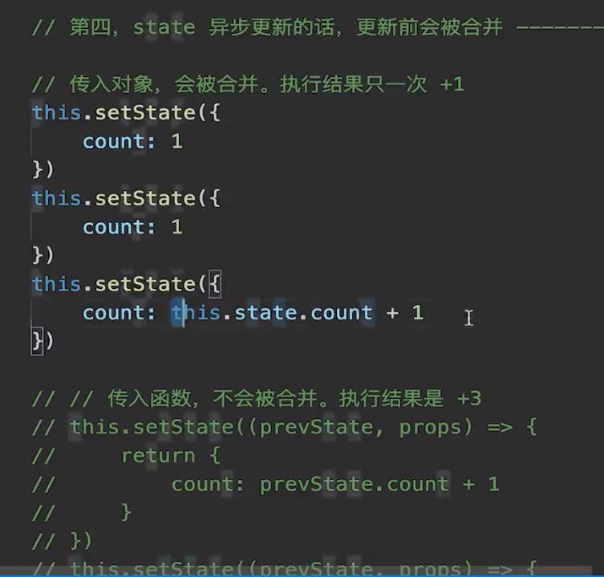

传入函数不会合并, 因为函数是个可执行代码 , 没法合并

回顾 setState 三个特点:

1. 不可变值

2. 可能异步更新

3. 可能被合并

## React 异步组件

React.lazy React.suspense


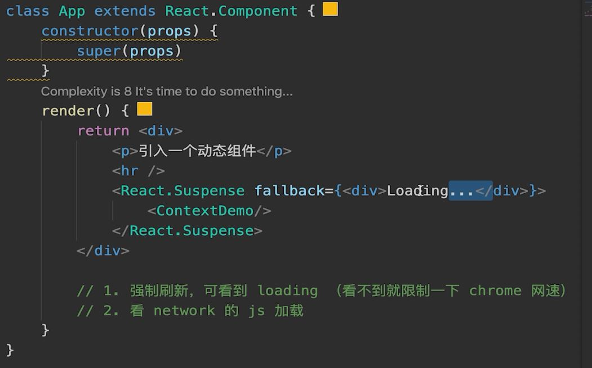

## 性能优化

1. SCU

2. PureComponent 和 React.memo

3. 减少函数 bind this 的次数

4. 渲染列表加 key

5. 异步组件, dom 事件和自定义事件及时销毁

### PureComponent

实现了浅比较的 SCU, 就是对 props 的第一层数据进行比较, 没有进行深比较

### SCU

SCU 默认返回 true , 实现的是浅比较

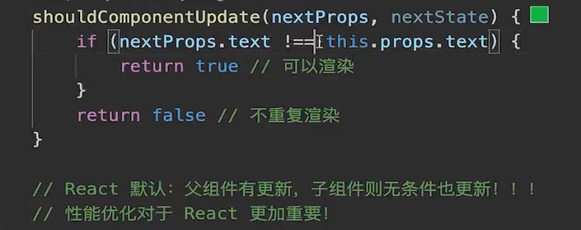

## Redux

### 单项数据流概述

### 三大原则

1. 单一数据源

2. state 是只读的 唯一改变 state 的方法就是触发 action，action 是一个用于描述已发生事件的普通对象。

3. 使用纯函数来执行修改 为了描述 action 如何改变 state tree ，需要用 reducers。

## React-router

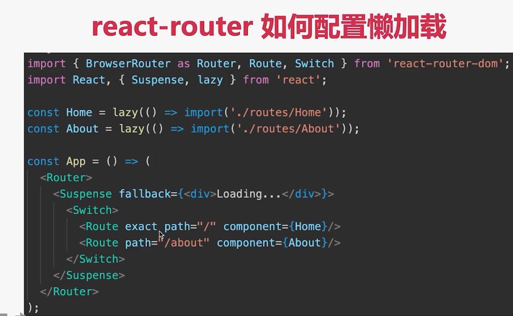

## React 和 Vue 区别

相同:

都支持组件化, 都是数据驱动视图, 都使用 vdom 操作 dom

不同:

jsx 和 template

react 函数式编程, vue 声明式编程

## Hooks

### class 组件存在什么问题

大型组件很难拆分和重构, 不好测试(即 class 不易拆分)

相同业务逻辑, 分散到各个方法中, 逻辑混乱

复杂逻辑变得复杂, HOC, render props

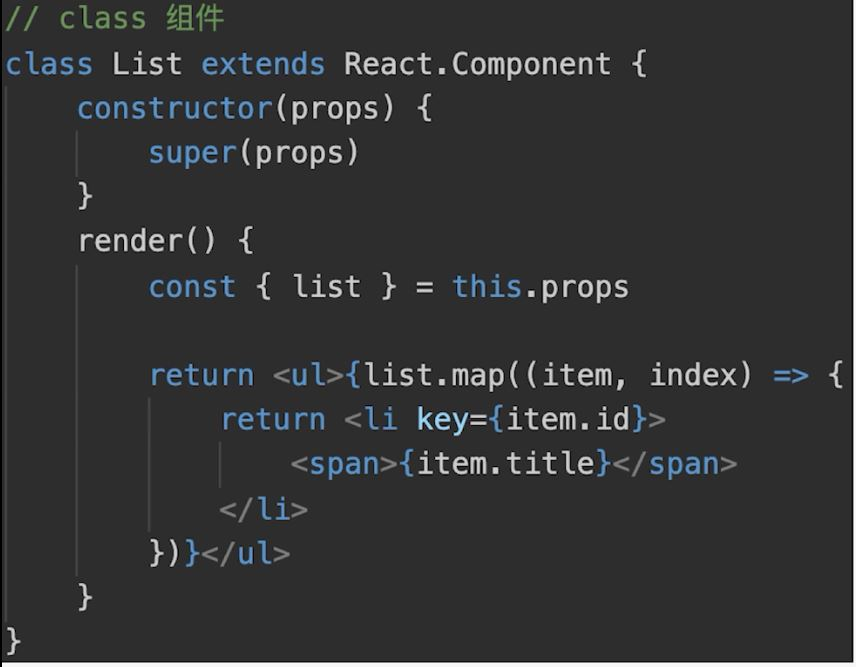

### 没有 hooks 的函数组件存在什么问题

函数组件没有生命周期, 没有组件实例, 没有 state 和 setState, 只能接收 props 返回 jsx, 函数组件是一个纯函数, 无法存储 state, 执行就销毁了

### useState

让函数组件实现 state 和 setState


### useEffect

让函数组件模拟生命周期

1. 模拟 class 组件的 DidMount 和 DidUpdate

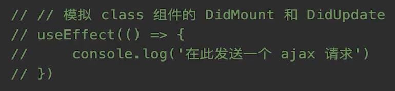

2. 模拟 DidMount

就传一个空数组, 不依赖于任何 state, 就一次

3. 模拟 DidUpdate

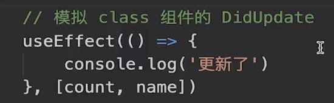

4. 模拟 WillUnmount

在第一个函数参数里返回一个函数, 组件销毁的时候就能执行这个函数.

注意: 这个函数其实也会在下一次 effect 执行之前, 被执行. 无论更新或卸载

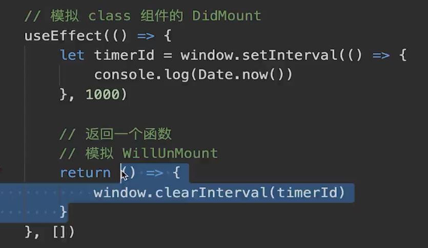

总结:

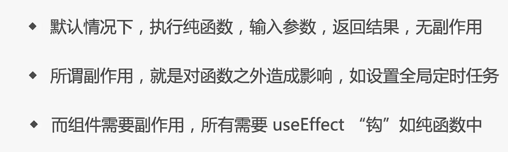

### useRef

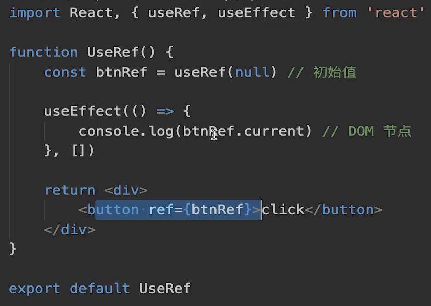

### useReducer 能代替 redux 嘛

不能, useReducer 是单个组件状态管理, 组件通讯还需要 props

redux 是全局的状态管理, 多组件共享数据

### 使用 useMemo

使用第一步: 类似 class PureComponent, 对 props 进行浅层比较, 用 memo 把组件包裹起来

第二步: 对 props 进行 useMemo 包裹


### 什么是自定义 hook

封装通用功能

开发和使用第三方 hook

解耦代码, 增加无限扩展性

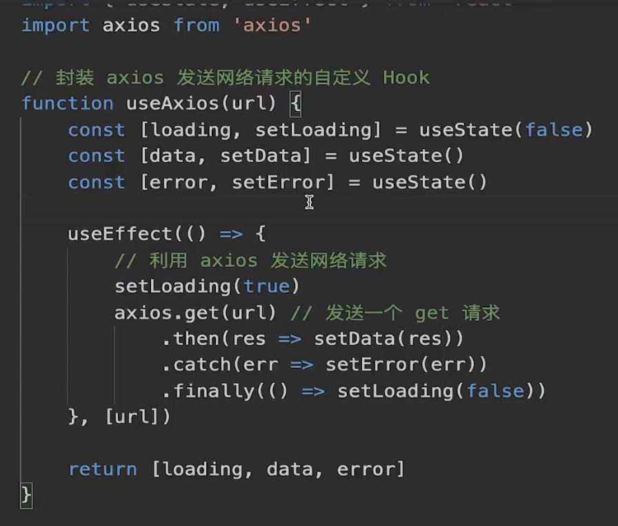

### hooks 使用规范

只能用于函数组件和自定义 hook 中, 其他地方不可以

只能用于顶层代码, 不能在循环, 判断中使用 hooks

### 为什么不能在循环, 判断中使用 hooks

函数组件, 是纯函数, 执行完就销毁

所以, 无论组件初始化(render)还是组件更新(re-render)

都会重新执行一次这个函数, 获取最新的组件

这一点和 class 组件不一样, class 组件有实例, 只要组件不销毁, 无论更新多少次, 实例都不销毁

因为 hook 依赖顺序执行, 调用顺序必须保持一致

### Hooks 使用中的几个坑

1. useState 初始化值, 只有第一次有效

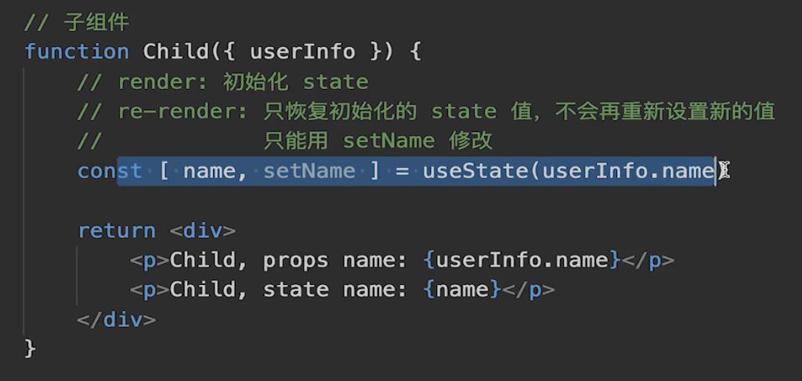

2. useEffect 可能出现死循环

依赖[]里有引用类型就会出现死循环

因为react通过Object.is方法进行比较, 引用类型

3. useEffect 第二个参数是空数组 内部不能修改 state

因为依赖为 [] 空数组, re-render 不会重新执行 effect 函数

如果没有依赖, re-render 会重新执行 effect 函数
