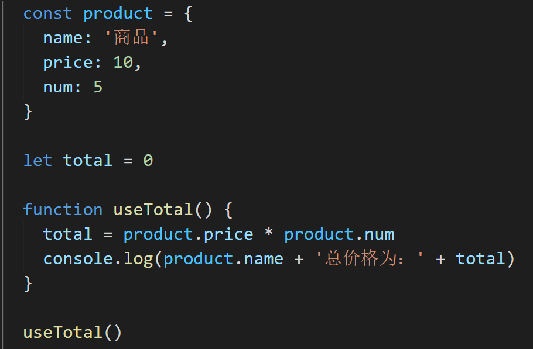
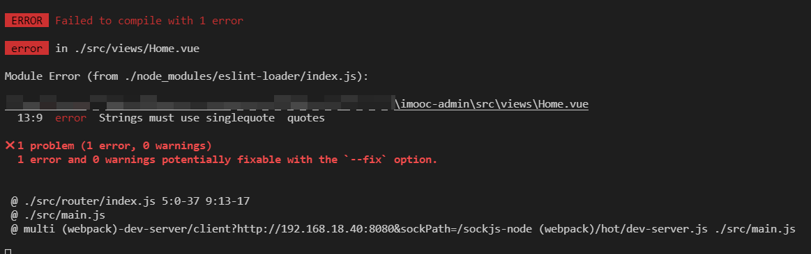

`标准化大厂编程规范解决方案之 ESLint + Git Hooks(1)`

<!--truncate-->

## 前言-为何需要编程规范

**工欲善其事，必先利其器**

对于一些大型的企业级项目而言，通常情况下我们都是需要一个团队来进行开发的。而又因为团队人员对技术理解上的参差不齐，所以就会导致出现一种情况，那就是《**一个项目无法具备统一的编程规范，导致项目的代码像多个不同材质的补丁拼接起来一样**》

设想一下，有一个团队进行开发，没有具备统一的代码标准，生成了下面的代码：


这段代码可以正常运行没有问题，但是整体的代码结构却非常的难看。

> 有的地方有空格进行分割，有的地方却没有
>
> 有的地方是单引号，有的地方却是双引号
>
> 有的地方有分号，有的地方没有分号
>
> ....

这样的项目虽然可以正常运行，但是如果把它放到商业项目中，确实 **不及格** 的，它会被认为是 **不可维护、不可扩展的代码内容**

那么所谓的标准的代码结构应该是什么样子的呢？

我们把上面的代码进行一下修正，做一个对比：



修改之后的代码具备了统一的规范之后，看起来就舒服多了！

并且以上所列举出来的只是《编程规范》中的一小部分内容！

但是指望人主动的遵守这些规范不太现实

那怎么办呢？

那么可不可以让程序自动处理规范化的内容呢？

答案是：可以的！

这些也是所需要讲解的重点内容！

接下来会讲解，如何自动化的对代码进行规范，其中主要包括：

1. 编码规范
2. git 规范

## ESlint 简介

一般创建项目的时候，脚手架工具已经帮助我们安装了 `ESLint` 代码检测工具。

首先著名的 `ESLint` 是 `2013年6月` 创建的一个开源项目，它的目标非常简单，只有一个，那就是 **提供一个插件化的 `javascript` 代码检测工具** ，说白了就是做 **代码格式检测使用的**

在当前的项目中，包含一个 `.eslintrc.js` 文件，这个文件就是 `eslint` 的配置文件。

随着大家对代码格式的规范性越来越重视，`eslint` 也逐渐被更多的人所接收，同时也有很多大厂在原有的 `eslint` 规则基础之上进行了一些延伸。

所以有的脚手架在手动配置创建项目会有这样的选择:

```js
?  Pick a linter / formatter config:
   ESLint with error prevention only // 仅包含错误的 ESLint
   ESLint + Airbnb config // Airbnb 的 ESLint 延伸规则
>  ESLint + Standard config // 标准的 ESLint 规则
```

假设选择了 **标准的 ESLint 规则** ，那么接下来就在该规则之下，看一看 `ESLint` 它的一些配置都有什么？

打开项目中的 `.eslintrc.js` 文件

## 标准 ESLint 规则下的配置

### .eslintrc.js

中文配置文档：https://eslint.bootcss.com/docs/user-guide/configuring

```js title="eslintrc.js文件"
// ESLint 配置文件遵循 commonJS 的导出规则，所导出的对象就是 ESLint 的配置对象
// 中文配置文档：https://eslint.bootcss.com/docs/user-guide/configuring
module.exports = {
  // 表示eslintrc.js文件当前所在文件夹即为根目录，ESLint 规则将被限制到该目录下
  root: true,
  // env 表示启用 ESLint 检测的环境
  env: {
    // 在 node 环境下启动 ESLint 检测
    node: true,
  },
  // ESLint 中基础配置需要继承的配置
  extends: ["plugin:vue/vue3-essential", "@vue/standard"],
  // 解析器
  parserOptions: {
    parser: "babel-eslint",
  },
  // 需要修改的启用规则及其各自的错误级别
  /**
   * 错误级别分为三种：
   * "off" 或 0 - 关闭规则
   * "warn" 或 1 - 开启规则，使用警告级别的错误：warn (不会导致程序退出)
   * "error" 或 2 - 开启规则，使用错误级别的错误：error (当被触发的时候，程序会退出)
   */
  rules: {
    "no-console": process.env.NODE_ENV === "production" ? "warn" : "off",
    "no-debugger": process.env.NODE_ENV === "production" ? "warn" : "off",
  },
};
```

那么到这里已经大致的了解了`.eslintrc.js` 文件，基于 `ESLint` 如果我们出现不符合规范的代码格式时，那么就会得到一个对应的错误。

比如：

> 我们可以把 `Home.vue` 中的 `name` 属性值，由单引号改为双引号

此时，只要我们一保存代码，那么就会得到一个对应的错误



这个错误表示：

1. 此时我们触发了一个 《错误级别的错误》
2. 触发该错误的位置是 在 `Home.vue` 的第 13 行 第九列 中
3. 错误描述为：字符串必须使用单引号
4. 错误规则为：`quotes`

那么想要解决这个错误，通常情况下我们有两种方式：

1. 按照 `ESLint` 的要求修改代码
2. 修改 `ESLint` 的验证规则

**按照 `ESLint` 的要求修改代码：**

> 在 `Home.vue` 的第 13 行中把双引号改为单引号

**修改 `ESLint` 的验证规则：**

1. 在 `.eslintrc.js` 文件中，新增一条验证规则

   ```json
   "quotes": "error" // 默认
   "quotes": "warn" // 修改为警告
   "quotes": "off" // 修改不校验
   ```

### 引出 Prettier

那么通过这一部分，我们了解了 `vue-cli` 创建 `vue3` 项目时，`Standard config` 的 `ESLint` 配置，并且知道了如何解决 `ESLint` 报错的问题。

但是一个团队中，人员的水平高低不齐，大量的 `ESLint` 规则校验，会让很多的开发者头疼不已，从而大大影响了项目的开发进度。

试想一下，在你去完成项目代码的同时，还需要时时刻刻注意代码的格式问题，这将是一件多么痛苦的事情！

那么有没有什么办法，既可以保证 `ESLint` 规则校验，又可以解决严苛的格式规则导致的影响项目进度的问题呢？

那么就需要[`Prettier`](./prettier.md) ，让你的代码变得更漂亮！

:::info
配置 eslintrc 文件将帮助我们进行一些代码格式的规则配置  
但同时也带来编码复杂度上升的问题, 比如要时刻注意单双引号等问题  
所以我们需要一种既可以保证 ESLint 规则校验, 又能让开发者在开发时无需关注这些格式问题
从而顺畅开发  
因此需要 Prettier
:::
