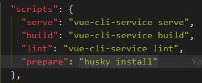

对于 **`git` 提交规范** 来说，不同的团队可能会有不同的标准，目前使用较多的 [Angular 团队规范](https://github.com/angular/angular.js/blob/master/DEVELOPERS.md#-git-commit-guidelines) 延伸出的 [Conventional Commits specification（约定式提交）](https://www.conventionalcommits.org/zh-hans/v1.0.0/) 为例，详解 **`git` 提交规范**

## 约定式提交

约定式提交规范要求如下：

```js
<type>[optional scope]: <description>

[optional body]

[optional footer(s)]

--------  翻译 -------------

<类型>[可选 范围]: <描述>

[可选 正文]

[可选 脚注]
```

其中 `<type>` 类型，必须是一个可选的值，比如：

1. 新功能：`feat`
2. 修复：`fix`
3. 文档变更：`docs`
4. ....

也就是说，如果要按照 **约定式提交规范** 来去做的化，那么你的一次提交描述应该式这个样子的：


要是每次都这么写，写到猴年马月了！

所以需要使用 Commitizen 解决这个问题

## Commitizen

如果严格安装 **约定式提交规范**， 来手动进行代码提交的话，那么是一件非常痛苦的事情，但是 **git 提交规范的处理** 又势在必行，那么怎么办呢？
经过很多人的冥思苦想, 出现了一种叫做 **git 提交规范化工具** 的东西，而 `commitizen` 就是其中的佼佼者！
`commitizen` 仓库名为 [cz-cli](https://github.com/commitizen/cz-cli) ，它提供了一个 `git cz` 的指令用于代替 `git commit`，简单一句话介绍它：

> 当你使用 `commitizen` 进行代码提交（git commit）时，`commitizen` 会提交你在提交时填写所有必需的提交字段！

这句话怎么解释呢？不用着急，下面就来安装并且使用一下 `commitizen` ，使用完成之后自然就明白了这句话的意思！

1. 全局安装`Commitizen`

   ```js
   npm install -g commitizen@4.2.4
   ```

2. 安装并配置 `cz-customizable` 插件

   1. 使用 `npm` 下载 `cz-customizable`

      ```node
      npm i cz-customizable@6.3.0 --save-dev
      ```

   2. 添加以下配置到 `package.json ` 中

      ```json
      ...
        "config": {
          "commitizen": {
            "path": "node_modules/cz-customizable"
          }
        }
      ```

3. 项目根目录下创建 `.cz-config.js` 自定义提示文件

   ```js
   module.exports = {
     // 可选类型
     types: [
       { value: "feat", name: "feat:     新功能" },
       { value: "fix", name: "fix:      修复" },
       { value: "docs", name: "docs:     文档变更" },
       { value: "style", name: "style:    代码格式(不影响代码运行的变动)" },
       {
         value: "refactor",
         name: "refactor: 重构(既不是增加feature，也不是修复bug)",
       },
       { value: "perf", name: "perf:     性能优化" },
       { value: "test", name: "test:     增加测试" },
       { value: "chore", name: "chore:    构建过程或辅助工具的变动" },
       { value: "revert", name: "revert:   回退" },
       { value: "build", name: "build:    打包" },
     ],
     // 消息步骤
     messages: {
       type: "请选择提交类型:",
       customScope: "请输入修改范围(可选):",
       subject: "请简要描述提交(必填):",
       body: "请输入详细描述(可选):",
       footer: "请输入要关闭的issue(可选):",
       confirmCommit: "确认使用以上信息提交？(y/n/e/h)",
     },
     // 选择跳过的问题
     skipQuestions: ["body", "footer"],
     // subject文字长度默认是72
     subjectLimit: 72,
   };
   ```

4. 使用 `git cz` 代替 `git commit`
   使用 `git cz` 代替 `git commit`，即可看到提示内容

那么到这里就可以使用`git cz` 来代替了 `git commit` 实现了规范化的提交诉求了，但是当前依然存在着一个问题，那就是必须要通过 `git cz` 指令才可以完成规范化提交！

那么如果有马虎的同事，忘记了使用 `git cz` 指令，直接就提交了怎么办呢？

那么有没有方式来限制这种错误的出现呢？

所以需要 Git Hooks

## Git Hooks

> 我们希望：
>
> 当《提交描述信息》不符合 [约定式提交规范](https://www.conventionalcommits.org/zh-hans/v1.0.0/) 的时候，阻止当前的提交，并抛出对应的错误提示

而要实现这个目的，就需要先来了解一个概念，叫做 `Git hooks（git 钩子 || git 回调方法）`
也就是：**`git` 在执行某个事件之前或之后进行一些其他额外的操作**

而我们所期望的 **阻止不合规的提交消息**，那么就需要使用到 `hooks` 的钩子函数。

下面是我整理出来的所有的 `hooks` ，其中加粗的是常用到的 `hooks`：

| Git Hook              | 调用时机                                                                                                                                                    | 说明                                                         |
| :-------------------- | ----------------------------------------------------------------------------------------------------------------------------------------------------------- | ------------------------------------------------------------ |
| pre-applypatch        | `git am`执行前                                                                                                                                              |                                                              |
| applypatch-msg        | `git am`执行前                                                                                                                                              |                                                              |
| post-applypatch       | `git am`执行后                                                                                                                                              | 不影响`git am`的结果                                         |
| **pre-commit**        | `git commit`执行前                                                                                                                                          | 可以用`git commit --no-verify`绕过                           |
| **commit-msg**        | `git commit`执行前                                                                                                                                          | 可以用`git commit --no-verify`绕过                           |
| post-commit           | `git commit`执行后                                                                                                                                          | 不影响`git commit`的结果                                     |
| pre-merge-commit      | `git merge`执行前                                                                                                                                           | 可以用`git merge --no-verify`绕过。                          |
| prepare-commit-msg    | `git commit`执行后，编辑器打开之前                                                                                                                          |                                                              |
| pre-rebase            | `git rebase`执行前                                                                                                                                          |                                                              |
| post-checkout         | `git checkout`或`git switch`执行后                                                                                                                          | 如果不使用`--no-checkout`参数，则在`git clone`之后也会执行。 |
| post-merge            | `git commit`执行后                                                                                                                                          | 在执行`git pull`时也会被调用                                 |
| pre-push              | `git push`执行前                                                                                                                                            |                                                              |
| pre-receive           | `git-receive-pack`执行前                                                                                                                                    |                                                              |
| update                |                                                                                                                                                             |                                                              |
| post-receive          | `git-receive-pack`执行后                                                                                                                                    | 不影响`git-receive-pack`的结果                               |
| post-update           | 当 `git-receive-pack`对 `git push` 作出反应并更新仓库中的引用时                                                                                             |                                                              |
| push-to-checkout      | 当``git-receive-pack`对`git push`做出反应并更新仓库中的引用时，以及当推送试图更新当前被签出的分支且`receive.denyCurrentBranch`配置被设置为`updateInstead`时 |                                                              |
| pre-auto-gc           | `git gc --auto`执行前                                                                                                                                       |                                                              |
| post-rewrite          | 执行`git commit --amend`或`git rebase`时                                                                                                                    |                                                              |
| sendemail-validate    | `git send-email`执行前                                                                                                                                      |                                                              |
| fsmonitor-watchman    | 配置`core.fsmonitor`被设置为`.git/hooks/fsmonitor-watchman`或`.git/hooks/fsmonitor-watchmanv2`时                                                            |                                                              |
| p4-pre-submit         | `git-p4 submit`执行前                                                                                                                                       | 可以用`git-p4 submit --no-verify`绕过                        |
| p4-prepare-changelist | `git-p4 submit`执行后，编辑器启动前                                                                                                                         | 可以用`git-p4 submit --no-verify`绕过                        |
| p4-changelist         | `git-p4 submit`执行并编辑完`changelist message`后                                                                                                           | 可以用`git-p4 submit --no-verify`绕过                        |
| p4-post-changelist    | `git-p4 submit`执行后                                                                                                                                       |                                                              |
| post-index-change     | 索引被写入到`read-cache.c do_write_locked_index`后                                                                                                          |                                                              |

:::tip
详细的 `HOOKS介绍` 可点击[这里](https://git-scm.com/docs/githooks)查看
:::

整体的 `hooks` 非常多，其中用的比较多的其实只有两个：

| Git Hook       | 调用时机                                                                                                                                           | 说明                               |
| :------------- | -------------------------------------------------------------------------------------------------------------------------------------------------- | ---------------------------------- |
| **pre-commit** | `git commit`执行前<br />它不接受任何参数，并且在获取提交日志消息并进行提交之前被调用。脚本`git commit`以非零状态退出会导致命令在创建提交之前中止。 | 可以用`git commit --no-verify`绕过 |
| **commit-msg** | `git commit`执行前<br />可用于将消息规范化为某种项目标准格式。<br />还可用于在检查消息文件后拒绝提交。                                             | 可以用`git commit --no-verify`绕过 |

简单来说这两个钩子：

1. `commit-msg`：可以用来规范化标准格式，并且可以按需指定是否要拒绝本次提交
2. `pre-commit`：会在提交前被调用，并且可以按需指定是否要拒绝本次提交

而接下来要做的关键，就在这两个钩子上面。

## 使用 husky + commitlint 检查提交描述是否符合规范要求

了解了 `git hooks` 的概念，那么接下来就使用 `git hooks` 来去校验提交信息。

要完成这么个目标，需要使用两个工具：

1. [commitlint](https://github.com/conventional-changelog/commitlint)：用于检查提交信息

2. [husky](https://github.com/typicode/husky)：是`git hooks`工具

:::tip 两个包的说明

1. commitlint 它可以检查提交信息, 但是只能起到检查的效果, 那么在何时进行检查就需要用到第二个库
2. husky 来指定当前的 commit lint, 在 git hook 的 commit-msg 的 hooks 下执行, 来达到执行 git commit 的时候通过第一个库 commitlint 来进行提交信息校验的功能

:::

注意：**`npm` 需要在 7.x 以上版本！！！！！**

那么下面分别来去安装一下这两个工具：

### commitlint

1. 安装依赖：

```

npm install --save-dev @commitlint/config-conventional@12.1.4 @commitlint/cli@12.1.4

```

2. 创建 `commitlint.config.js` 文件

```

echo "module.exports = {extends: ['@commitlint/config-conventional']}" > commitlint.config.js

// 这句命令对外导出一个对象, 这个对象继承了这个包

```

3. 打开 `commitlint.config.js` ， 增加配置项（ [config-conventional 默认配置点击可查看](https://github.com/conventional-changelog/commitlint/blob/master/@commitlint/config-conventional/index.js) ）：

```js
module.exports = {
  // 继承的规则
  extends: ["@commitlint/config-conventional"],
  // 定义规则类型
  rules: {
    // type 类型定义，表示 git 提交的 type 必须在以下类型范围内
    "type-enum": [
      // 当前验证的错误级别, 2表示错误级别
      2,
      // 在什么情况下进行验证
      "always",
      // 泛型内容, 这里应该在之前定义的cz types里一样
      [
        "feat", // 新功能 feature
        "fix", // 修复 bug
        "docs", // 文档注释
        "style", // 代码格式(不影响代码运行的变动)
        "refactor", // 重构(既不增加新功能，也不是修复bug)
        "perf", // 性能优化
        "test", // 增加测试
        "chore", // 构建过程或辅助工具的变动
        "revert", // 回退
        "build", // 打包
      ],
    ],
    // subject 大小写不做校验
    "subject-case": [0],
  },
};
```

**注意：确保保存为 `UTF-8` 的编码格式**，否则可能会出现以下错误：


那么如何确定当前保存文件编码格式是`UTF-8`?

在 VSCODE 右下角


此时, commitlint 已经安装并且配置完成了, 但是如果希望使用 commitlint 加入到 git hooks 里面, 还需要使用到另外一个库`husky`

### husky

它是一个可以用来检测 git hooks 工具的东西

1. 安装依赖：

   ```
   npm install husky@7.0.1 --save-dev
   ```

2. 启动 `hooks` ， 生成 `.husky` 文件夹

   ```
   npx husky install
   ```

   

3. 在 `package.json` 中生成 `prepare` 指令（ **需要 npm > 7.0 版本** ）

   ```
   npm set-script prepare "husky install"
   ```

   

4. 执行 `prepare` 指令

   ```
   npm run prepare
   ```

5. 执行成功，提示 `husky - Git hooks installed`

6. 执行以下指令, 指令的作用是添加 `commitlint` 的 `hook` 到 `husky`中，也就是通过`husky`来监听`git hooks`的`commit-msg`的回调里去执行 commit linint 来完成提交代码的检测. 并指令在 `commit-msg` 的 `hooks` 下执行 `npx --no-install commitlint --edit "$1"` 指令

   ```
   npx husky add .husky/commit-msg 'npx --no-install commitlint --edit "$1"'
   ```

7. 此时的 `.husky` 的文件结构
   
   多出的 commit-msg 这个文件会在 commit-msg 的 git hook 里执行, 执行的时候会去执行这个文件里的 `npx --no-install commitlint --edit "$1"`这句指令

8. commit-msg 的文件内容
   

至此， 不符合规范的 commit 将不再可提交：

```
PS F:\xxxxxxxxxxxxxxxxxxxxx\目录> git commit -m "测试"
⧗   input: 测试
✖   subject may not be empty [subject-empty]
✖   type may not be empty [type-empty]

✖   found 2 problems, 0 warnings
ⓘ   Get help: https://github.com/conventional-changelog/commitlint/#what-is-commitlint

husky - commit-msg hook exited with code 1 (error)
```

那么至此，就已经处理好了 **强制规范化的提交要求**，到现在 **不符合规范的提交信息，将不可在被提交！**

那么到这里 **规范化目标** 就完成了吗？

当然没有！

现在还缺少一个 **规范化的处理** ，那就是 **代码格式提交规范处理！**

也就是说目前位置做的都是**git 的消息提交规范**, 但是我们的**代码格式提交规范**还没有做
