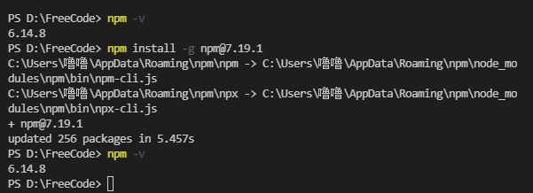

## 现象描述

原 npm 版本为`6.14.8`, 需要升级到 7 以上版本, 因此执行`npm install -g npm`, 安装成功后, 执行`npm -v`检测版本, 仍然显示`6.14.8`的老版本, 如图:


## 原因

因为此时系统中存在两个 npm 文件, 其中一个在`npm安装路径`, 另一个在`npm全局安装路径`, 两个 npm 的路径并不一致.  
刚刚安装更新的是 npm 安装路径下的 npm, 而执行`npm -v`命令使用的 npm 是我们在安装 node 时全局安装路径下的 npm

## 解决方法一

将 npm 全局安装的路径修改为 npm 的安装路径

### 1.查看路径

```js
npm root -g   // 查看npm的安装路径
npm config get prefix //查看npm的全局安装路径
```


### 2.修改 npm 全局安装路径

```js
npm config set prefix npm的安装路径

// npm config set prefix C:\Users\xx\AppData\Roaming\npm\node_modules
```

### 3.重新执行 npm 升级命令

```js
npm install -g npm
```

再次查看`npm -v`发现版本成功更新

## 解决方法二

使用`git bash`终端, 而不是 cmd 里执行`npm install -g npm`命令
