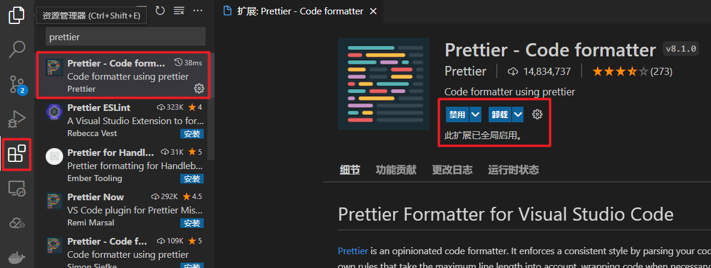
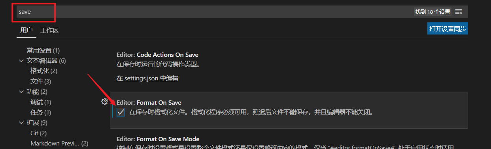
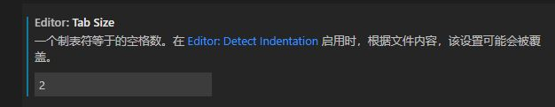

`标准化大厂编程规范解决方案之 ESLint + Git Hooks(2)`

<!--truncate-->

## Prettier {#prettier}

在上一小节中，我们知道了 `ESLint` 可以让我们的代码格式变得更加规范，但是同样的它也会带来开发时编码复杂度上升的问题。

那么有没有办法既可以保证 `ESLint` 规则校验，又可以让开发者无需关注格式问题来进行顺畅的开发呢？

答案是：有的！

而解决这个问题的关键就是 `prettier`！（点击 [这里](https://www.prettier.cn/) 进入 `prettier` 中文官网！）

### **`prettier` 是什么？**

1. 一个代码格式化工具
2. 开箱即用
3. 可以直接集成到 `VSCode` 之中
4. 在保存时，让代码直接符合 `ESLint` 标准（需要通过一些简单配置）

那么这些简单配置具体指的是什么呢？

### ESLint 与 Prettier 配合解决代码格式问题

如何实现`prettier` 可以在保存代码时，让我们的代码直接符合 `ESLint` 标准, 有以下几步:

1. 在 `VSCode` 中安装 `prettier` 插件（搜索 `prettier`），这个插件可以帮助我们在配置 `prettier` 的时候获得提示
   

2. 在项目中新建 `.prettierrc` 文件，该文件为 `perttier` 默认配置文件

3. 在该文件中写入如下配置：

   ```json
   {
     // 在每段代码后面是否尾随分号
     "semi": false,
     // 是否使用单引号代替双引号
     "singleQuote": true,
     // 多行逗号分割的语法中，最后一行不加逗号
     // none 表示不添加
     "trailingComma": "none"
   }
   ```

4. 打开 `VSCode` 《设置面板》 在设置中，搜索 `save` ，勾选 `Format On Save`
   

至此，即可在 **`VSCode` 保存时，自动格式化代码！**

**但是！** 只做到这样还不够！

> 1. VSCode 而言，默认一个 tab 等于 4 个空格，而 ESLint 希望一个 tab 为两个空格
>    
> 2. 如果 VSCode 安装了多个代码格式化工具的话 需要手动选择默认格式化程序
>
> 3. ESLint 和 prettier 之间的冲突问题, 比如如下空格问题

我们尝试在 `Home.vue` 中写入一个 `created` 方法，写入完成之后，打开我们的控制台我们会发现，此时代码抛出了一个 `ESLint` 的错误


这个错误的意思是说：**`created` 这个方法名和后面的小括号之间，应该有一个空格！**

但是当我们加入了这个空格之后，只要一保存代码，就会发现 `prettier` 会自动帮助我们去除掉这个空格。

那么此时的这个问题就是 `prettier` 和 `ESLint` 的冲突问题。

针对于这个问题我们想要解决也非常简单：

1. 打开 `.eslintrc.js` 配置文件

2. 在 `rules` 规则下，新增一条规则

   ```json
   // 关闭《方法名后增加空格》的规则
   'space-before-function-paren': 'off'
   ```

3. 该规则表示关闭《方法名后增加空格》的规则

4. 重启项目

至此我们整个的 `perttier` 和 `ESLint` 的配合使用就算是全部完成了。

在之后我们写代码的过程中，只需要保存代码，那么 `perttier` 就会帮助我们自动格式化代码，使其符合 `ESLint` 的校验规则。而无需我们手动进行更改了。
