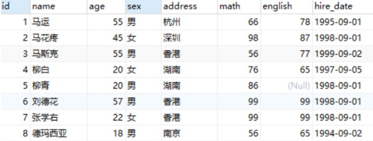

## 数据类型


## DQL

## 基础查询

### 查询name、age两列

```sql
select name,age from stu;
```

### 去除重复记录

```sql
select distinct address from stu;
```

### 查询姓名、数学成绩、英语成绩。并通过as给math和english起别名（as关键字可以省略）

```sql
select name,math as 数学成绩,english as 英文成绩 from stu;
select name,math 数学成绩,english 英文成绩 from stu;
```

## 条件查询

### 查询年龄大于20岁的学员信息, 查询年龄大于等于20岁的学员信息

```sql
select * from stu where age > 20;
select * from stu where age >= 20;
```

### 查询年龄大于等于20岁 并且 年龄 小于等于 30岁 的学员信息

```sql
select * from stu where age >= 20 && age <= 30;
select * from stu where age >= 20 and age <= 30;
select * from stu where age BETWEEN 20 and 30;
```

### 查询入学日期在'1998-09-01' 到 '1999-09-01' 之间的学员信息

```sql
select * from stu where hire_date BETWEEN '1998-09-01' and '1999-09-01';
```

### 查询年龄等于18岁的学员信息, 不等于

```sql
-- 等于
select * from stu where age = 18;
-- 不等于
select * from stu where age != 18;
select * from stu where age <> 18;
```

### 查询年龄等于18岁 或者 年龄等于20岁 或者 年龄等于22岁的学员信息

```sql
select * from stu where age = 18 or age = 20 or age = 22;
select * from stu where age in (18,20 ,22);
```

### 查询英语成绩为 null的学员信息

null值的比较不能使用 = 或者 != 。需要使用 is 或者 is not

```sql
select * from stu where english = null; -- 这个语句是不行的
select * from stu where english is null;
select * from stu where english is not null;
```

## 模糊查询

模糊查询使用like关键字，可以使用通配符进行占位:
（1）_ : 代表单个任意字符
（2）% : 代表任意个数字符

### 查询姓'马'的学员信息

```sql
select * from stu where name like '马%';
```

### 查询第二个字是'花'的学员信息

```sql
select * from stu where name like '_花%';
```

### 查询名字中包含 '德' 的学员信息

```sql
select * from stu where name like '%德%';
```


## 排序查询

- ASC ： 升序排列 （默认值）
- DESC ： 降序排列

### 查询学生信息，按照年龄升序排列

```sql
select * from stu order by age;
select * from stu order by age asc;
```

### 查询学生信息，按照数学成绩降序排列

```sql
select * from stu order by math desc ;
```

### 查询学生信息，按照数学成绩降序排列，如果数学成绩一样，再按照英语成绩升序排列

```sql
select * from stu order by math desc , english asc ;
```

## 聚合函数

### 概念

将一列数据作为一个整体，进行纵向计算。如何理解呢？假设有如下表



现有一需求让我们求表中所有数据的数学成绩的总和。这就是对math字段进行纵向求和。

### 统计班级一共有多少个学生

```sql
select count(id) from stu;  // 8
select count(english) from stu; // 7
```

上面语句根据某个字段进行统计，如果该字段某一行的值为null的话，将不会被统计。所以可以在`count(*) 来实现`。* 表
示所有字段数据，一行中也不可能所有的数据都为null，所以建议使用 count(*)

```sql
select count(*) from stu;
```

### 查询数学成绩的最高分, 最低分, 总分, 平均分

```sql
select max(math) from stu;
select min(math) from stu;
select sum(math) from stu;
select avg(math) from stu;
```

注意: null值不参与所有聚合函数运算

## 分组查询

### 查询男同学和女同学各自的数学平均分

```sql
select sex, avg(math) from stu group by sex;
```


注意: 分组之后，查询的字段为聚合函数和分组字段，查询其他字段无任何意义, 比如下面

```sql
select name, sex, avg(math) from stu group by sex;

-- name跟sex没任何关系, 因为分完组之后把所有女当成整体来看, 所有女同学不应该有一个名字, 所以这样写没有意义
-- 代码提示颜色name也是黑色
```

### 查询男同学和女同学各自的数学平均分，以及各自人数

```sql
select sex, avg(math),count(*) from stu group by sex;
```

### 查询男同学和女同学各自的数学平均分，以及各自人数，要求：分数低于70分的不参与分组

```sql
select sex, avg(math),count(*) from stu where math > 70 group by sex;
```

### 查询男同学和女同学各自的数学平均分，以及各自人数，要求：分数低于70分的不参与分组，分组之后人数大于2个的

```sql
select sex, avg(math),count(*) from stu where math > 70 group by sex having count(*) > 2;
```

执行顺序: where > 聚合函数 > having

### where 和 having 区别

- 执行时机不一样：where 是分组之前进行限定，不满足where条件，则不参与分组，而having是分组之后对结果进行过滤。
- 可判断的条件不一样：where 不能对聚合函数进行判断，having 可以。

## 分页查询

注意： 上述语句中的起始索引是从0开始

### 从0开始查询，查询3条数据

```sql
select * from stu limit 0 , 3;
```

### 每页显示3条数据，查询第1页数据

```sql
select * from stu limit 0 , 3;
```

### 每页显示3条数据，查询第2页数据

```sql
select * from stu limit 3 , 3;
```

### 每页显示3条数据，查询第3页数据

```sql
select * from stu limit 6 , 3;
```

### 起始索引公式

起始索引 = (当前页码 - 1) * 每页显示的条数

:::tip
分页查询 limit 是MySQL数据库的方言
Oracle分页查询使用 rownumber
SQL Server分页查询使用top
:::
