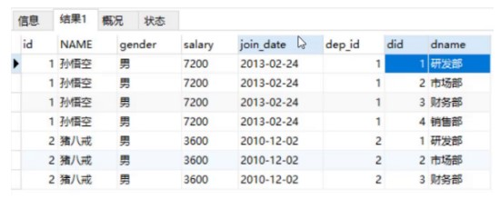
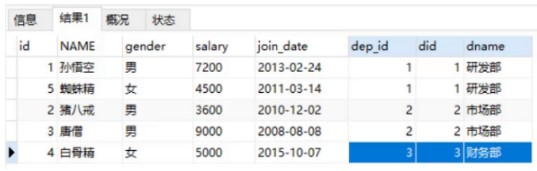
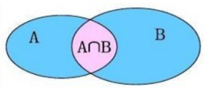
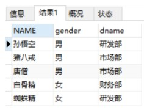
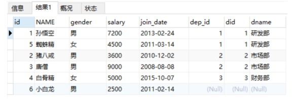
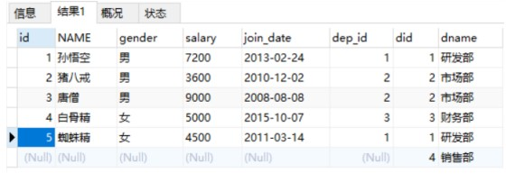

多表查询顾名思义就是从多张表中一次性的查询出我们想要的数据。

准备数据

```sql
DROP TABLE IF EXISTS emp;
DROP TABLE IF EXISTS dept;
-- 创建部门表
CREATE TABLE dept(
did INT PRIMARY KEY AUTO_INCREMENT,
dname VARCHAR(20)
);

-- 创建员工表
CREATE TABLE emp (
id INT PRIMARY KEY AUTO_INCREMENT,
NAME VARCHAR(10),
gender CHAR(1), -- 性别
salary DOUBLE, -- 工资
join_date DATE, -- 入职日期
dep_id INT,
FOREIGN KEY (dep_id) REFERENCES dept(did) -- 外键，关联部门表(部门表的主键)
);
```

执行下面的多表查询语句

```sql
select * from emp , dept; -- 从emp和dept表中查询所有的字段数据
```

结果如下：



笛卡尔积: 有A,B两个集合 取A,B所有的组合情况

从上面的结果我们看到一共产生了24条数据, 其中有一些无效的数据，如 孙悟空 这个员工属于1号部门，但也同时关联的2、3、4号部门。所以我们要通过限制员工表中的 dep_id 字段的值和部门表 did 字段的值相等来消除这些无效的数据，

```sql
select * from emp , dept where emp.dep_id = dept.did;
```

执行后结果如下：



## 多表查询分类

### 连接查询

  - 内连接查询: 相当于查询AB交集数据
    - 

  - 外连接查询: 
    - 左外连接查询 ：相当于查询A表所有数据和交集部门数据
    - 右外连接查询 ：相当于查询B表所有数据和交集部分数据

### 子查询

概念: `查询中嵌套查询，称嵌套查询为子查询。`

什么是查询中嵌套查询呢？我们通过一个例子来看：

需求：查询工资高于猪八戒的员工信息。

来实现这个需求，我们就可以通过二步实现，第一步：先查询出来 猪八戒的工资

```sql
select salary from emp where name = '猪八戒'
```

第二步：查询工资高于猪八戒的员工信息

```sql
select * from emp where salary > 3600;
```

第二步中的3600可以通过第一步的sql查询出来，所以将3600用第一步的sql语句进行替换

```sql
select * from emp where salary > (select salary from emp where name = '猪八戒');
```

这就是查询语句中嵌套查询语句

## - 案例 -

### 连接查询 - 内连接

#### 隐式内连接

```sql
SELECT
  *
FROM
  emp,
  dept
WHERE
  emp.dep_id = dept.did;
```

执行上述语句结果如下：


但有些字段我们不需要查询, 如果仅查询 emp的 name， gender，dept表的dname 这些部分字段信息

```sql
SELECT
  emp.NAME,
  emp.gender,
  dept.dname
FROM
  emp,
  dept
WHERE
  emp.dep_id = dept.did;
```

执行语句结果如下：



上面语句中使用表名指定字段所属有点麻烦，sql也支持给表指别名，上述语句可以改进为

```sql
SELECT
  t1. NAME,
  t1.gender,
  t2.dname
FROM
  emp t1,
  dept t2
WHERE
  t1.dep_id = t2.did;
```

#### 显式内连接

```sql
select * from emp inner join dept on emp.dep_id = dept.did;
-- 上面语句中的inner可以省略，可以书写为如下语句
select * from emp join dept on emp.dep_id = dept.did;
```

### 连接查询 - 外连接

左外连接：相当于查询A表所有数据和交集部分数据

右外连接：相当于查询B表所有数据和交集部分数据

- 查询emp表所有数据和对应的部门信息（左外连接）:

```sql
select * from emp left join dept on emp.dep_id = dept.did;
```

执行语句结果如下：



结果显示查询到了左表（emp）中所有的数据及两张表能关联的数据。

- 查询dept表所有数据和对应的员工信息（右外连接）

```sql
select * from emp right join dept on emp.dep_id = dept.did;
```

执行语句结果如下：



结果显示查询到了右表（dept）中所有的数据及两张表能关联的数据。

要查询出部门表中所有的数据，也可以通过左外连接实现，只需要将两个表的位置进行互换：

```sql
select * from dept left join emp on emp.dep_id = dept.did;
```

### 子查询

- 查询 '财务部' 和 '市场部' 所有的员工信息

```sql
-- 查询 '财务部' 或者 '市场部' 所有的员工的部门did
select did from dept where dname = '财务部' or dname = '市场部';
select * from emp where dep_id in (select did from dept where dname = '财务部' or dname = '市场部');
```

- 查询入职日期是 '2011-11-11' 之后的员工信息和部门信息

```sql
-- 查询入职日期是 '2011-11-11' 之后的员工信息
select * from emp where join_date > '2011-11-11' ;
-- 将上面语句的结果作为虚拟表和dept表进行内连接查询
select * from (select * from emp where join_date > '2011-11-11' ) t1, dept where t1.dep_id = dept.did;
```

## 综合案例

数据准备:

```sql
DROP TABLE IF EXISTS emp;
DROP TABLE IF EXISTS dept;
DROP TABLE IF EXISTS job;
DROP TABLE IF EXISTS salarygrade;


-- 部门表
CREATE TABLE dept (
  id INT PRIMARY KEY PRIMARY KEY, -- 部门id
  dname VARCHAR(50), -- 部门名称
  loc VARCHAR(50) -- 部门所在地
);


-- 职务表，职务名称，职务描述
CREATE TABLE job (
  id INT PRIMARY KEY,
  jname VARCHAR(20),
  description VARCHAR(50)
);

-- 员工表
CREATE TABLE emp (
  id INT PRIMARY KEY, -- 员工id
  ename VARCHAR(50), -- 员工姓名
  job_id INT, -- 职务id
  mgr INT , -- 上级领导
  joindate DATE, -- 入职日期
  salary DECIMAL(7,2), -- 工资
  bonus DECIMAL(7,2), -- 奖金
  dept_id INT, -- 所在部门编号
  CONSTRAINT emp_jobid_ref_job_id_fk FOREIGN KEY (job_id) REFERENCES job (id),
  CONSTRAINT emp_deptid_ref_dept_id_fk FOREIGN KEY (dept_id) REFERENCES dept (id)
);
-- 工资等级表
CREATE TABLE salarygrade (
  grade INT PRIMARY KEY,   -- 级别
  losalary INT,  -- 最低工资
  hisalary INT -- 最高工资
);
				
-- 添加4个部门
INSERT INTO dept(id,dname,loc) VALUES 
(10,'教研部','北京'),
(20,'学工部','上海'),
(30,'销售部','广州'),
(40,'财务部','深圳');

-- 添加4个职务
INSERT INTO job (id, jname, description) VALUES
(1, '董事长', '管理整个公司，接单'),
(2, '经理', '管理部门员工'),
(3, '销售员', '向客人推销产品'),
(4, '文员', '使用办公软件');


-- 添加员工
INSERT INTO emp(id,ename,job_id,mgr,joindate,salary,bonus,dept_id) VALUES 
(1001,'孙悟空',4,1004,'2000-12-17','8000.00',NULL,20),
(1002,'卢俊义',3,1006,'2001-02-20','16000.00','3000.00',30),
(1003,'林冲',3,1006,'2001-02-22','12500.00','5000.00',30),
(1004,'唐僧',2,1009,'2001-04-02','29750.00',NULL,20),
(1005,'李逵',4,1006,'2001-09-28','12500.00','14000.00',30),
(1006,'宋江',2,1009,'2001-05-01','28500.00',NULL,30),
(1007,'刘备',2,1009,'2001-09-01','24500.00',NULL,10),
(1008,'猪八戒',4,1004,'2007-04-19','30000.00',NULL,20),
(1009,'罗贯中',1,NULL,'2001-11-17','50000.00',NULL,10),
(1010,'吴用',3,1006,'2001-09-08','15000.00','0.00',30),
(1011,'沙僧',4,1004,'2007-05-23','11000.00',NULL,20),
(1012,'李逵',4,1006,'2001-12-03','9500.00',NULL,30),
(1013,'小白龙',4,1004,'2001-12-03','30000.00',NULL,20),
(1014,'关羽',4,1007,'2002-01-23','13000.00',NULL,10);


-- 添加5个工资等级
INSERT INTO salarygrade(grade,losalary,hisalary) VALUES 
(1,7000,12000),
(2,12010,14000),
(3,14010,20000),
(4,20010,30000),
(5,30010,99990);


-- 1.查询所有员工信息。查询员工编号，员工姓名，工资，职务名称，职务描述

-- 2.查询员工编号，员工姓名，工资，职务名称，职务描述，部门名称，部门位置

-- 3.查询员工姓名，工资，工资等级

-- 4.查询员工姓名，工资，职务名称，职务描述，部门名称，部门位置，工资等级

-- 5.查询出部门编号、部门名称、部门位置、部门人数

```

方案: 

```sql

-- 1.查询所有员工信息。查询员工编号，员工姓名，工资，职务名称，职务描述
/*
	分析：
		1. 员工编号，员工姓名，工资 信息在emp 员工表中
		2. 职务名称，职务描述 信息在 job 职务表中
		3. job 职务表 和 emp 员工表 是 一对多的关系 emp.job_id = job.id

*/
-- 隐式内连接
SELECT
	emp.id,
	emp.ename,
	emp.salary,
	job.jname,
	job.description
FROM
	emp,
	job
WHERE
	emp.job_id = job.id;

SELECT
	*
FROM
	emp;

SELECT
	*
FROM
	job;

-- 显式内连接
SELECT
	emp.id,
	emp.ename,
	emp.salary,
	job.jname,
	job.description
FROM
	emp
INNER JOIN job ON emp.job_id = job.id;

-- 2.查询员工编号，员工姓名，工资，职务名称，职务描述，部门名称，部门位置
/*
	分析：
		1. 员工编号，员工姓名，工资 信息在emp 员工表中
		2. 职务名称，职务描述 信息在 job 职务表中
		3. job 职务表 和 emp 员工表 是 一对多的关系 emp.job_id = job.id

		4. 部门名称，部门位置 来自于 部门表 dept
		5. dept 和 emp 一对多关系 dept.id = emp.dept_id

*/

-- 隐式内连接
SELECT
	emp.id,
	emp.ename,
	emp.salary,
	job.jname,
	job.description,
	dept.dname,
	dept.loc
FROM
	emp,
	job,
	dept
WHERE
	emp.job_id = job.id
	and dept.id = emp.dept_id
;

-- 显式内连接
SELECT
	emp.id,
	emp.ename,
	emp.salary,
	job.jname,
	job.description,
	dept.dname,
	dept.loc
FROM
	emp
INNER JOIN job ON emp.job_id = job.id
INNER JOIN dept ON dept.id = emp.dept_id
;


-- 3.查询员工姓名，工资，工资等级
/*
	分析：
		1. 员工姓名，工资 信息在emp 员工表中
		2. 工资等级 信息在 salarygrade 工资等级表中
		3. emp.salary >= salarygrade.losalary  and emp.salary <= salarygrade.hisalary


*/


SELECT
	emp.ename,
	emp.salary,
	t2.*
FROM
	emp,
	salarygrade t2
WHERE
	emp.salary >= t2.losalary
AND emp.salary <= t2.hisalary


-- 4.查询员工姓名，工资，职务名称，职务描述，部门名称，部门位置，工资等级

/*
	分析：
		1. 员工编号，员工姓名，工资 信息在emp 员工表中
		2. 职务名称，职务描述 信息在 job 职务表中
		3. job 职务表 和 emp 员工表 是 一对多的关系 emp.job_id = job.id

		4. 部门名称，部门位置 来自于 部门表 dept
		5. dept 和 emp 一对多关系 dept.id = emp.dept_id
		6. 工资等级 信息在 salarygrade 工资等级表中
		7. emp.salary >= salarygrade.losalary  and emp.salary <= salarygrade.hisalary
*/
SELECT
	emp.id,
	emp.ename,
	emp.salary,
	job.jname,
	job.description,
	dept.dname,
	dept.loc,
	t2.grade
FROM
	emp
INNER JOIN job ON emp.job_id = job.id
INNER JOIN dept ON dept.id = emp.dept_id
INNER JOIN salarygrade t2 ON emp.salary BETWEEN t2.losalary and t2.hisalary;


-- 5.查询出部门编号、部门名称、部门位置、部门人数
/*
	分析：
		1. 部门编号、部门名称、部门位置 来自于部门 dept 表
		2. 部门人数: 在emp表中 按照dept_id 进行分组，然后count(*)统计数量
		3. 使用子查询，让部门表和分组后的表进行内连接
*/
select * from dept;

select dept_id, count(*) from emp group by dept_id;


SELECT
	dept.id,
	dept.dname,
	dept.loc,
	t1.count
FROM
	dept,
	(
		SELECT
			dept_id,
			count(*) count
		FROM
			emp
		GROUP BY
			dept_id
	) t1
WHERE
	dept.id = t1.dept_id
```