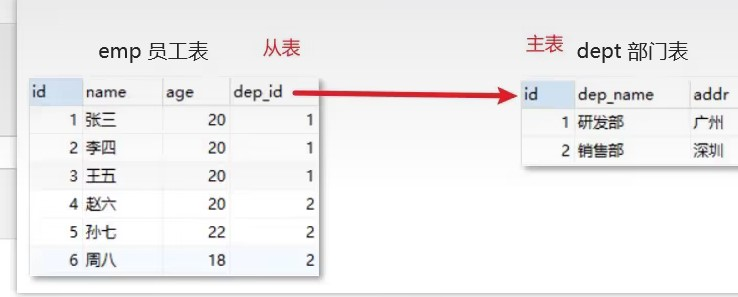

## 数据库设计简介

### 数据库设计概念

- 数据库设计就是根据业务系统的具体需求，结合我们所选用的DBMS，为这个业务系统构造出最优的数据存储模型。
- 建立数据库中的`表结构`以及`表与表之间的关联关系`的过程。
- 有哪些表？表里有哪些字段？表和表之间有什么关系？

### 数据库设计的步骤

- 需求分析（数据是什么? 数据具有哪些属性? 数据与属性的特点是什么）
- 逻辑分析（通过ER图对数据库进行逻辑建模，不需要考虑我们所选用的数据库管理系统）
  - 如下图就是ER(Entity/Relation)图：
  
- 物理设计（根据数据库自身的特点把逻辑设计转换为物理设计）
- 维护设计（1.对新的需求进行建表；2.表优化）

## 表关系

### 一对一

- 如：用户 和 用户详情
- 一对一关系多用于表拆分，将一个实体中经常使用的字段放一张表，不经常使用的字段放另一张表，用于提升查询性能
  - 
  - 上图左边是用户的详细信息，而我们真正在展示用户信息时最长用的则是上图右边红框所示，所以我们会将详细信息查分成两周那个表。

### 一对多

- 如：部门 和 员工
- 一个部门对应多个员工，一个员工对应一个部门。如下图：
  - 


### 多对多

- 如：商品 和 订单
- 一个商品对应多个订单，一个订单包含多个商品。

## 多表关系实现

### 一对多(多对一)

如: 部门表和员工表

一个部门对应多个员工, 一个员工对应一个部门

部门是1, 员工是多

- 实现方式: 在多的一方建立外键, 指向一的一方的主键
  - 

### 多对多

如: 订单和商品

一个商品对应多个订单, 一个订单包含多个商品

- 实现方式: 建立第三张中间表, 中间表至少包含两个外键, 分别关联两方主键


```sql
-- 删除表
DROP TABLE IF EXISTS tb_order_goods;
DROP TABLE IF EXISTS tb_order;
DROP TABLE IF EXISTS tb_goods;
-- 订单表
CREATE TABLE tb_order(
id int primary key auto_increment,
payment double(10,2),
payment_type TINYINT,
status TINYINT
);
-- 商品表
CREATE TABLE tb_goods(
id int primary key auto_increment,
title varchar(100),
price double(10,2)
);
-- 订单商品中间表
CREATE TABLE tb_order_goods(
id int primary key auto_increment,
order_id int,
goods_id int,
count int
);

-- 建完表后，添加外键
alter table tb_order_goods add CONSTRAINT fk_order_id FOREIGN key(order_id) REFERENCES
tb_order(id);
alter table tb_order_goods add CONSTRAINT fk_goods_id FOREIGN key(goods_id) REFERENCES
tb_goods(id);
```


### 一对一

如: 用户和用户详情

一对一关系多用于表拆分, 将一个实体中经常使用的字段放一张表, 不经常使用的字段放另一张表, 用户提升查询性能


实现方式: 在任意一方加入外键, 关联另一方主键, 并且设置外键为唯一(UNIQUE)

## 案例

根据下图设计表及表和表之间的关系：


经过分析，我们分为 专辑表 曲目表 短评表 用户表 4张表。

一个专辑可以有多个曲目，一个曲目只能属于某一张专辑，所以专辑表和曲目表的关系是一对多。

一个专辑可以被多个用户进行评论，一个用户可以对多个专辑进行评论，所以专辑表和用户表的关系是 多对多。

一个用户可以发多个短评，一个短评只能是某一个人发的，所以用户表和短评表的关系是 一对多。

音乐专辑表名：Music 

| 字段名       | 数据类型      | 说明                               |
| ------------ | ------------- | ---------------------------------- |
| title        | varchar(32)   | 专辑名                             |
| alias        | varchar(32)   | 专辑别名                           |
| image        | varchar(64)   | 封面图片                           |
| style        | varchar(8)    | 流派（如经典、流行、民谣、电子等） |
| type         | varchar(4)    | 类型（专辑、单曲等）               |
| medium       | varchar(4)    | 介质（CD、黑胶、数字等）           |
| publish_time | date          | 发行时间                           |
| publisher    | varchar(16)   | 出版者                             |
| number       | tinyint       | 唱片数                             |
| barcode      | bigint        | 条形码                             |
| summary      | varchar(1024) | 简介                               |
| artist       | varchar(16)   | 艺术家                             |
| id           | int           | 编号（唯一）                       |

曲目表名： Song

| 字段名        | 数据类型    | 说明                 |
| ------------- | ----------- | -------------------- |
| name          | varchar(32) | 歌曲名               |
| serial_number | tinyint     | 歌曲序号             |
| id            | int         | 编号（唯一）         |


评论表名：Review

| 字段名      | 数据类型     | 说明                 |
| ----------- | ------------ | -------------------- |
| content     | varchar(256) | 评论内容             |
| rating      | tinyint      | 评分（1~5）          |
| review_time | datetime     | 评论时间             |

用户表名：User

| 字段名    | 数据类型    | 说明                                    |
| --------- | ----------- | --------------------------------------- |
| username  | varchar(16) | 用户名（唯一）                          |
| image     | varchar(64) | 用户头像图片地址                        |
| signature | varchar(64) | 个人签名，例如（万般各所是 一切皆圆满） |
| nickname  | varchar(16) | 用户昵称                                |
| id        | int         | 用户编号(主键)                           |
