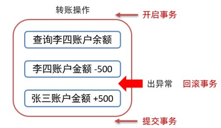

## 事务简介

:::tip
数据库的事务（Transaction）是一种机制、一个操作序列，包含了一组数据库操作命令。
事务把所有的命令作为一个整体一起向系统提交或撤销操作请求，即这一组数据库命令要么同时成功，要么同时失败。
事务是一个不可分割的工作逻辑单元。
:::

这些概念不好理解，接下来举例说明，

张三和李四账户中各有1000块钱，现李四需要转换500块钱给张三，具体的转账操作为

- 第一步：查询李四账户余额
- 第二步：从李四账户金额 -500
- 第三步：给张三账户金额 +500

现在假设在转账过程中第二步完成后出现了异常第三步没有执行，就会造成李四账户金额少了500，而张三金额并没有多500；这样的系统是有问题的。如果解决呢？使用事务可以解决上述问题



从上图可以看到在转账前开启事务，如果出现了异常回滚事务，三步正常执行就提交事务，这样就可以完美解决问题。

## 代码验证

数据准备

```sql
DROP TABLE IF EXISTS account;

-- 创建账户表
CREATE TABLE account(
	id int PRIMARY KEY auto_increment,
	name varchar(10),
	money double(10,2)
);

-- 添加数据
INSERT INTO account(name,money) values('张三',1000),('李四',1000);
```

不加事务演示问题

```sql
-- 转账操作
-- 1. 查询李四账户金额是否大于500

-- 2. 李四账户 -500
UPDATE account set money = money - 500 where name = '李四';

假设出现异常了... -- 此处不是注释，在整体执行时会出问题，后面的+500的sql则不执行

-- 3. 张三账户 +500
UPDATE account set money = money + 500 where name = '张三';
```

添加事务sql如下：

```sql
-- 开启事务
BEGIN;

-- 转账操作
-- 1. 查询李四账户金额是否大于500
-- 2. 李四账户 -500
UPDATE account set money = money - 500 where name = '李四';

假设出现异常了... -- 此处不是注释，在整体执行时会出问题，后面的+500的sql则不执行

-- 3. 张三账户 +500
UPDATE account set money = money + 500 where name = '张三';

-- 提交事务 
COMMIT;
-- 回滚事务
ROLLBACK;
```

## 事务四大特征

- 原子性（Atomicity）: 事务是不可分割的最小操作单位，要么同时成功，要么同时失败
- 一致性（Consistency） :事务完成时，必须使所有的数据都保持一致状态
- 隔离性（Isolation） :多个事务之间，操作的可见性
- 持久性（Durability） :事务一旦提交或回滚，它对数据库中的数据的改变就是永久的

:::tip
mysql中事务是自动提交的。
也就是说我们不添加事务执行sql语句，语句执行完毕会自动的提交事务。
可以通过下面语句查询默认提交方式

SELECT @@autocommit;

查询到的结果是1 则表示自动提交，结果是0表示手动提交。当然也可以通过下面语句修改提交方式

set @@autocommit = 0;
:::