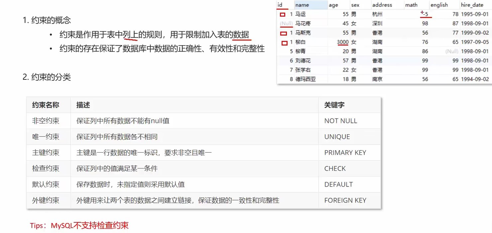
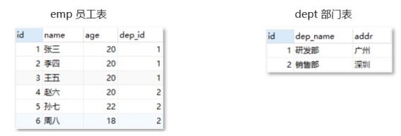
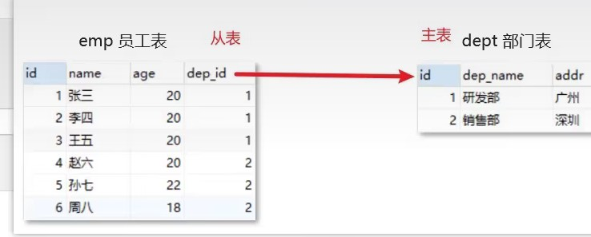

## 约束的概念和分类



上面表中可以看到表中数据存在一些问题：
- id 列一般是用标示数据的唯一性的，而上述表中的id为1的有三条数据，并且 马花疼 没有id进行标示
- 柳白 这条数据的age列的数据是3000，而人也不可能活到3000岁
- 马运 这条数据的math数学成绩是-5，而数学学得再不好也不可能出现负分
- 柳青 这条数据的english列（英文成绩）值为null，而成绩即使没考也得是0分

针对上述数据问题，我们就可以从数据库层面在添加数据的时候进行限制，这个就是约束。

## 案例

## 主键约束

- 概念: 主键是一行数据的唯一标识，要求非空且唯一. 一张表只能有一个主键

```sql
-- 创建表时添加约束
CREATE TABLE emp (
  id INT PRIMARY KEY auto_increment, -- 员工id，主键且自增长
);

-- 建完表后添加主键约束
ALTER TABLE 表名 ADD PRIMARY KEY(字段名);

-- 删除约束
ALTER TABLE 表名 DROP PRIMARY KEY;
```

## 非空约束

- 概念: 用于保证列中所有数据不能有NULL值

```sql
-- 创建表时添加非空约束
-- 员工表
CREATE TABLE emp (
  joindate DATE NOT NULL , -- 入职日期，非空
);

-- 建完表后添加非空约束
ALTER TABLE 表名 MODIFY 字段名 数据类型 NOT NULL;

-- 删除约束
ALTER TABLE 表名 MODIFY 字段名 数据类型;
```

## 唯一约束

- 概念: 唯一约束用于保证列中所有数据各不相同

```sql
-- 创建表时添加唯一约束
-- 员工表
CREATE TABLE emp (
  ename VARCHAR(50) NOT NULL UNIQUE, -- 员工姓名，非空并且唯一
);

-- 建完表后添加唯一约束
ALTER TABLE 表名 MODIFY 字段名 数据类型 UNIQUE;

-- 删除约束
ALTER TABLE 表名 DROP INDEX 字段名;
```

## 默认约束

- 概念: 保存数据时，未指定值则采用默认值

```sql
-- 创建表时添加默认约束
-- 员工表
CREATE TABLE emp (
  bonus DOUBLE(7,2) DEFAULT 0 -- 奖金，如果没有奖金默认为0
);

-- 建完表后添加唯一约束
ALTER TABLE 表名 ALTER 列名 SET DEFAULT 默认值;

-- 删除约束
ALTER TABLE 表名 ALTER 列名 DROP DEFAULT;
```

## 外键约束

### 概念

外键用来让两个表的数据之间建立链接，保证数据的一致性和完整性。
如何理解上面的概念呢？如下图有两张表，员工表和部门表：



员工表中的dep_id字段是部门表的id字段关联，也就是说1号学生张三属于1号部门研发部的员工。现在我要删除1号部门，就会出现错误的数据（员工表中属于1号部门的数据）。而我们上面说的两张表的关系只是我们认为它们有关系，此时需要通过外键让这两张表产生数据库层面的关系，这样你要删除部门表中的1号部门的数据将无法删除。

### 练习

```sql
-- 创建员工表和部门表
-- 删除表
DROP TABLE IF EXISTS emp;
DROP TABLE IF EXISTS dept;
-- 部门表
CREATE TABLE dept(
id int primary key auto_increment,
dep_name varchar(20),
addr varchar(20)
);
-- 员工表
CREATE TABLE emp(
id int primary key auto_increment,
name varchar(20),
age int,
dep_id int,
);

-- 添加 2 个部门
insert into dept(dep_name,addr) values
('研发部','广州'),('销售部', '深圳');
-- 添加员工,dep_id 表示员工所在的部门
INSERT INTO emp (NAME, age, dep_id) VALUES
('张三', 20, 1),
('李四', 20, 1),
('王五', 20, 1),
('赵六', 20, 2),
('孙七', 22, 2),
('周八', 18, 2);

-- 查看表
select * from emp;
```

此时删除1号部门, 可以删除. 而员工表中的1号部门员工仍然存在

所以尝试添加外键约束



```sql
-- 创建表时添加

CREATE TABLE emp(
id int primary key auto_increment,
name varchar(20),
age int,
dep_id int,  -- 外键

-- 添加外键 dep_id,关联 dept 表的id主键
CONSTRAINT fk_emp_dept FOREIGN KEY(dep_id) REFERENCES dept(id)
);
```

此时两个表之间存在了物理连接

### 删除外键

```sql
alter table emp drop FOREIGN key fk_emp_dept;
```

### 建完表后添加外键

```sql
alter table emp add CONSTRAINT fk_emp_dept FOREIGN key(dep_id) REFERENCES dept(id);
```

