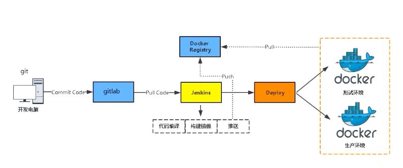
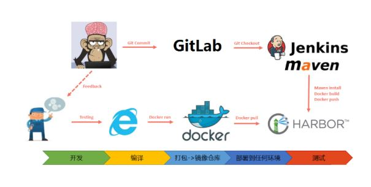
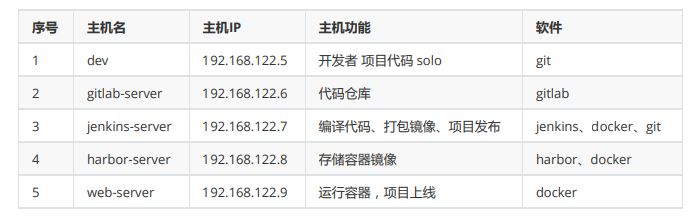

## 分析

旧：

- 代码发布环境提前准备，以主机为颗粒度
- 静态

新：

- 代码发布环境 多套，以容器为颗粒度
- 编译

## 业务发布逻辑设计图



## 工具使用流程图

- git
- gitlab
- jenkins
- tomcat
- maven
- harbor
- docker

### 流程图



### 工作流程

1. 研发提交代码到 gitlab 仓库
2. jenkins 手动或自动触发项目构建
3. jenkins 拉取代码, 代码编码, 打包镜像, 推送镜像到镜像仓库
4. jenkins 在 docker 主机创建容器并发布应用

## 主机规划及准备



### 主机名

```shell
[root@localhost ~]# hostnamectl set-hostname XXX
```

### IP

```shell
[root@localhost ~]# cat /etc/sysconfig/network-scripts/ifcfg-eth0
TYPE="Ethernet"
BOOTPROTO="dhcp"
NAME="eth0"
DEVICE="eth0"
ONBOOT="yes"
IPADDR="192.168.122.X"
PREFIX="24"
GATEWAY="192.168.122.1"
DNS1="119.29.29.29"
```

### 主机名解析

```shell
[root@localhost ~]# cat /etc/hosts
127.0.0.1 localhost localhost.localdomain localhost4 localhost4.localdomain4
::1 localhost localhost.localdomain localhost6 localhost6.localdomain6
192.168.122.5 dev
192.168.122.6 gitlab-server
192.168.122.7 jenkins-server
192.168.122.8 harbor-server
192.168.122.9 web-server
```

### 安全

```shell
[root@localhost ~]# firewall-cmd --state
not running
[root@localhost ~]# getenforce
Disabled
```

### 时间同步

```shell
[root@dev ~]# crontab -l
0 */1 * * * ntpdate time1.aliyun.com
```
