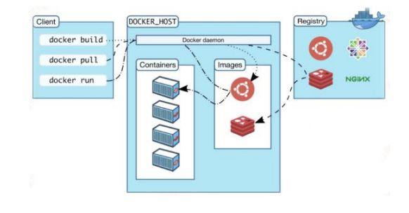

## 容器管理工具介绍

- LXC

  - 2008
  - 是第一套完整的容器管理解决方案
  - 不需要任何补丁直接运行在 linux 内核之上管理容器
  - 创建容器慢，不方便移置

- Docker
  - 2013
  - dotcloud
  - 是在 LXC 基础上发展起来的
  - 拥有一套容器管理生态系统
  - 生态系统包含：容器镜像、注册表、RESTFul API 及命令行操作界面
  - 属于容器管理系统

### Docker 版本介绍

- 2017 之前版本

  - 1.7 ,1.8,1.9,1.10,1.11,1.12,1.13

- 2017 年 3 月 1 日后
  - 把 docker 做商业开源
    - docker-ce
    - docker-ee
  - 17-03-ce
  - 17-06-ce
  - 18-03-ce
  - 18-06-ce
  - 18-09-ce

## Docker 应用

## 1. 部署 docker

**部署目的**: 用于管理容器

容器创建, 容器停止, 容器删除等

### YUM 获取

**首先卸载旧版本**:

```shell
sudo yum remove docker \
  docker-client \
  docker-client-latest \
  docker-common \
  docker-latest \
  docker-latest-logrotate \
  docker-logrotate \
  docker-engine
```

**第二步安装工具与额外软件包**:

安装 yum-utils 与 yum-config-manager

yum-utils: 为了获取到 yum-config-manager

yum-config-manager 可以帮助直接添加与管理 docker-ce 的 yum 源

device-mapper-persistent-data 为了实现设备持久映射

```shell
 [root@bogon ~]# yum install -y yum-utils device-mapper-persistent-data lvm2
```

**第三步获取 repo 文件**:

```shell
[root@bogon ~]# yum-config-manager --add-repo
https://download.docker.com/linux/centos/docker-ce.repo
```

**第四步验证源**:

```shell
[root@bogon ~]# ls /etc/yum.repos.d/
CentOS-Base.repo CentOS-Media.repo epel.repo
CentOS-CR.repo CentOS-Sources.repo epel-testing.repo
CentOS-Debuginfo.repo CentOS-Vault.repo
CentOS-fasttrack.repo docker-ce.repo
```

---

## 2. 安装 docker-ce

首先验证源是否有软件包

```shell
[root@bogon ~]# yum repolist
已加载插件：fastestmirror
Loading mirror speeds from cached hostfile
* base: mirrors.huaweicloud.com
* epel: fedora.cs.nctu.edu.tw
* extras: mirrors.163.com
* updates: mirrors.neusoft.edu.cn
docker-ce-stable | 3.5 kB 00:00
(1/2): docker-ce-stable/x86_64/primary_db | 27 kB 00:01
(2/2): docker-ce-stable/x86_64/updateinfo | 55 B 00:01
源标识 源名称 状态
base/7/x86_64 CentOS-7 - Base 10,019
docker-ce-stable/x86_64 Docker CE Stable - x86_64 41
*epel/x86_64 Extra Packages for Enterprise Linux 7 - x86_64 13,082
extras/7/x86_64 CentOS-7 - Extras 386
updates/7/x86_64 CentOS-7 - Updates 1,580
repolist: 25,108
```

安装

```shell
[root@bogon ~]# yum list | grep docker-ce
containerd.io.x86_64 1.2.5-3.1.el7 docker-c -
stable
docker-ce.x86_64 3:18.09.5-3.el7 docker-c -
stable
docker-ce-cli.x86_64 1:18.09.5-3.el7 docker-c -
stable
docker-ce-selinux.noarch 17.03.3.ce-1.el7 docker-c -
stable

[root@bogon ~]yum -y install docker-ce
```

先启动 docker 服务

```shell
[root@bogon ~]# systemctl enable docker
Created symlink from /etc/systemd/system/multi-user.target.wants/docker.service to
/usr/lib/systemd/system/docker.service.

[root@bogon ~]# systemctl start docker
```

验证是否启动

```shell
[root@bogon ~]# docker version
Client:
Version: 18.09.5
API version: 1.39
Go version: go1.10.8
Git commit: e8ff056
Built: Thu Apr 11 04:43:34 2019
OS/Arch: linux/amd64
Experimental: false
Server: Docker Engine - Community
Engine:
Version: 18.09.5
API version: 1.39 (minimum version 1.12)
Go version: go1.10.8
Git commit: e8ff056
Built: Thu Apr 11 04:13:40 2019
OS/Arch: linux/amd64
Experimental: false
```

如果服务没有启动, 比如先关闭再查看

```shell
systemctl stop docker

[root@bogon ~]# docker version
Client:
Version: 18.09.5
API version: 1.39
Go version: go1.10.8
Git commit: e8ff056
Built: Thu Apr 11 04:43:34 2019
OS/Arch: linux/amd64
Experimental: false
Cannot connect to the Docker daemon at unix:///var/run/docker.sock. Is the docker
daemon running?
#如果出现如上提示，请启动docker服务。
```

## --------------------------------

## 容器&镜像&仓库&daemon&client 之间的关系



Client 客户端指的现有的命令行界面环境, 应该输入的是命令, 这些命令发送给 docker 的守护进程, 守护进程运行在 DOCKER_HOST 上面, HVISION 2 类型虚拟机运行在宿主机上, 宿主机是 HOST_OS, 虚拟机是 GUEST_OS. 而在 docker 时代里, docker 主机是运行容器的, 这里一定安装了 docker, 并且安装了 docker 的守护进程. docker 客户端和守护进程可以分开

docker 客户端把 docker 命令发送给 docker_deamon, docker_deamon 借助于镜像启动容器, docker_deamon 会到自己的本地镜像存储目录去找镜像, 看看自己本地有没有这些镜像, 如果有直接取镜像启动容器. 如果本地没有, docker_deamon 会通过 registry 下载镜像放到本地创建启动容器

## 启动容器

第一步验证本地是否有镜像

```shell
[root@bogon ~]# docker images
REPOSITORY TAG IMAGE ID CREATED SIZE
```

本地没有任何镜像, 需要去 search 镜像

这里去仓库：dockerhub

```shell
[root@bogon ~]# docker search centos
NAME DESCRIPTION
STARS OFFICIAL AUTOMATED
centos The official build of CentOS. 5315
[OK]
```

本地没有镜像，需要下载镜像到本地

```shell
[root@bogon ~]# docker pull centos
Using default tag: latest
latest: Pulling from library/centos
8ba884070f61: Pull complete
Digest: sha256:8d487d68857f5bc9595793279b33d082b03713341ddec91054382641d14db861
Status: Downloaded newer image for centos:latest

验证是否下载成功
[root@bogon ~]# docker images
REPOSITORY TAG IMAGE ID CREATED SIZE
centos latest 9f38484d220f 5 weeks ago 202MB
```

运行容器

```shell
启动
[root@bogon ~]# docker run -it --name=c1 centos:latest /bin/bash
[root@333dce61a32d /]#

此时显示的root不是docker主机的root, 而是容器的root
```

启动命令解释

docker run /bin/bash 运行一个命令  
--name=c1 给容器起一个名字  
centos:latest 使用哪个镜像启动容器  
-i 交互  
-t 在终端交互

连起来就是 在 centos:laster 镜像启动一个容器, 在起名叫 c1 的容器中运行一个/bin/bash 命令

:::tip
容器里面没有命令在运行的时候, 容器就关掉了, 跟虚拟机不同

在机器中跑了 10 个容器, 相当于跑了 10 个虚拟机
:::

### 基础命令

docker ps // 查看正在运行的容器  
docker ps -all // 查看所有容器包括退出的  
docker start 容器名 // 启动容器  
docker attach 容器名 // 把容器的命令行附加到当前终端上来, 利用当前终端管理容器, 也就是所谓的进入容器  
exit 退出容器  
按 ctrl + p + q 不停止容器退出终端, 不要在生产环境中使用

## docker daemon 配置远程及本地管理

所以每次进行容器管理之前, 需要启动 docker 守护进程

```shell
systemctl stauts docker
如果状态是active代表启动了

第二种方法 docker version查看
```

docker daemon 管理主要能够帮助通过远程方式来管理 docker

如果通过第三方软件对 docker 主机当中的容器进行远程管理的话, 也需要配置 docker daemon, 所以实现远程管理需要有两个充分条件

- 可以把 docker client 与 docker daemon 分开部署
- 可以通过第三方软件管理 docker daemon 创建的容器

### 实现步骤

- 第一步：关闭 docker daemon

修改 docker 配置文件前，请先关闭 docker 守护进程

```shell
[root@localhost ~]#systemctl stop docker

使用docker version验证关闭是否成功
```

- 第二步：修改 docker daemon 配置文件

如果想使用/etc/docker/daemon.json 管理 docker daemon，默认情况下，/etc/docker 目录中并没有 daemon.json
文件，添加后会导致 docker daemon 无法启动，在添加 daemon.json 文件之前，请先修改如下文件内容：

```shell
修改前：
[root@localhost ~]#vim /usr/lib/systemd/system/docker.service
[Service]
Type=notify
# the default is not to use systemd for cgroups because the delegate issues still
# exists and systemd currently does not support the cgroup feature set required
# for containers run by docker
ExecStart=/usr/bin/dockerd -H unix:// #删除-H(含)后面所有内容


修改后：
[root@localhost ~]#vim /usr/lib/systemd/system/docker.service
[Service]
Type=notify
# the default is not to use systemd for cgroups because the delegate issues still
# exists and systemd currently does not support the cgroup feature set required
# for containers run by docker
ExecStart=/usr/bin/dockerd
```

- 第三步：加载配置文件

  - 修改完成后，一定要加载此配置文件

```shell
[root@localhost ~]# systemctl daemon-reload
```

- 第四步：重新开启 docker 守护进程

```shell
[root@localhost ~]# systemctl start docker
```

- 第五步：添加配置文件对 docker daemon 配置

通过/etc/docker/daemon.json 文件对 docker 守护进程文件进行配置

```shell
[root@localhost ~]#cd /etc/docker
[root@localhost docker]#vim daemon.json
{
"hosts": ["tcp://0.0.0.0:2375","unix:///var/run/docker.sock"]
}
[root@localhost ~]#ss -anput | grep ":2375"
[root@localhost ~]#ls /var/run
docker.sock
[root@localhost ~]# systemctl restart docker
```

docker daemon 默认侦听使用的是 unix 格式，侦听文件：UNIX:///run/docker.sock,添加 tcp：//0.0.0.0:2375 可实现远程管理。

- 第六步：实例远程连接方法

不要在命令行后面添加端口

```shell
[root@localhost ~]# docker -H 远程容器主机 version
```

## docker 命令行实现容器管理

### 容器镜像分类

- 系统镜像
- 应用镜像

### 容器镜像获取(搜索)

```shell
# 普通命令
[root@bogon ~]# docker search centos
```

```shell
# 管理类命令
无
```

### 容器镜像获取(pull)

```shell
# 普通命令
[root@bogon ~]# docker pull centos
Using default tag: latest
latest: Pulling from library/centos
Digest: sha256:8d487d68857f5bc9595793279b33d082b03713341ddec91054382641d14db861
Status: Image is up to date for centos:latest
```

```shell
# 管理类命令
[root@bogon ~]# docker image pull centos
Using default tag: latest
latest: Pulling from library/centos
Digest: sha256:8d487d68857f5bc9595793279b33d082b03713341ddec91054382641d14db861
Status: Image is up to date for centos:latest
```

### 容器镜像传输(一般不用这种方法传输)

- 为了获取本地容器镜像打包启动多服务

- 如何获取本地容器镜像打包

```shell
#以下为镜像打包
[root@bogon ~]# docker save -o centos.tar centos:latest
[root@bogon ~]# ls
#生成如下
centos.tar
```

- 传输

```shell
scp centos.tar 192.168.145.251:/root
```

- 获取的 tar 包导入到本地目录

```shell
docker load -i tar包名

# 查看
docker images
```

### 启动容器

- 启动一个运行 bash 命令的容器(/bin/bash 是 centos 的路径, ubuntu 不一定是这个)

```shell
# 普通类命令
[root@bogon ~]# docker run -it --name=c1 centos:latest /bin/bash
#或
# 命令类命令
[root@bogon ~]# docker container run -it --name=c2 centos:latest /bin/bash
```

如果运行`docker run -it --name=c1 centos:latest echo "hello world"`代表在容器中运行 echo 命令显示 hello world

### 启动一个运行 httpd 服务的容器

- 启动一个容器

```shell
[root@bogon ~]# docker run -it --name=c1 centos:latest /bin/bash
```

- 在容器中安装 httpd

```shell
[root@b8f1c4b45e37 /]# yum -y install httpd
[root@b8f1c4b45e37 /]# yum -y install which
[root@b8f1c4b45e37 /]# which httpd
/usr/sbin/httpd

[root@b8f1c4b45e37 /]# /usr/sbin/httpd -k start
AH00558: httpd: Could not reliably determine the server's fully qualified domain name,
using 172.17.0.3. Set the 'ServerName' directive globally to suppress this message
[root@b8f1c4b45e37 /]# curl http://localhost
container webpage
```

### 基于运行中容器生成容器镜像

```shell
[root@bogon ~]# docker export -o centos-httpd.tar c3
[root@bogon ~]# ls
centos-httpd.tar
```

生成的 tar 包对于容器来说, 并不认识, 所以需要把他导入系统变为容器

```shell
[root@bogon ~]# docker import -m httpd centos-httpd.tar centos-httpd:v1
sha256:一堆值

# 查看一下
[root@bogon ~]# docker images
REPOSITORY TAG IMAGE ID CREATED SIZE
centos-httpd v1 da4dfb859952 26 seconds ago 295MB

# 查看历史
[root@bogon ~]# docker history centos-httpd:v1
IMAGE CREATED CREATED BY SIZE COMMENT
da4dfb859952 About a minute ago 295MB httpd #httpd这就是注释

# 启动
[root@bogon ~]# docker run -it --name c4 centos-httpd:v1 /bin/bash
[root@b175010389d2 /]# httpd -k start
AH00558: httpd: Could not reliably determine the server's fully qualified domain name,
using 172.17.0.4. Set the 'ServerName' directive globally to suppress this message
[root@b175010389d2 /]# curl http://localhost
container webpage
```

### 查看容器 IP 地址

```shell
[root@bogon ~]# ip a s
3: docker0: <NO-CARRIER,BROADCAST,MULTICAST,UP> mtu 1500 qdisc noqueue state DOWN group
default
link/ether 02:42:51:3d:45:08 brd ff:ff:ff:ff:ff:ff
inet 172.17.0.1/16 brd 172.17.255.255 scope global docker0
valid_lft forever preferred_lft forever
inet6 fe80::42:51ff:fe3d:4508/64 scope link
valid_lft forever preferred_lft forever
#容器默认连接的网桥

# 172.17.0.1 是ip
```

方法一:

```shell
[root@bogon ~]# docker run -it --name c2 centos /bin/bash
[root@d56146c41f3a /]# ip a s
bash: ip: command not found #没有此命令，需要安装

[root@d56146c41f3a /]# yum -y install iproute

[root@d56146c41f3a /]# ip a s
1: lo: <LOOPBACK,UP,LOWER_UP> mtu 65536 qdisc noqueue state UNKNOWN group default qlen
1000
link/loopback 00:00:00:00:00:00 brd 00:00:00:00:00:00
inet 127.0.0.1/8 scope host lo
valid_lft forever preferred_lft forever
6: eth0@if7: <BROADCAST,MULTICAST,UP,LOWER_UP> mtu 1500 qdisc noqueue state UP group
default
link/ether 02:42:ac:11:00:02 brd ff:ff:ff:ff:ff:ff link-netnsid 0
inet 172.17.0.2/16 brd 172.17.255.255 scope global eth0
valid_lft forever preferred_lft forever
#由docker0网桥分配动态自动分配的172.17.0.2
```

方法二:

```shell
[root@bogon ~]# docker inspect c2
#查看容器详细信息
```

方法三:

```shell
#在容器外执行正在运行的容器内命令ip a s
[root@bogon ~]# docker exec c2 ip a s
1: lo: <LOOPBACK,UP,LOWER_UP> mtu 65536 qdisc noqueue state UNKNOWN group default qlen
1000
link/loopback 00:00:00:00:00:00 brd 00:00:00:00:00:00
inet 127.0.0.1/8 scope host lo
valid_lft forever preferred_lft forever
6: eth0@if7: <BROADCAST,MULTICAST,UP,LOWER_UP> mtu 1500 qdisc noqueue state UP group
default
link/ether 02:42:ac:11:00:02 brd ff:ff:ff:ff:ff:ff link-netnsid 0
inet 172.17.0.2/16 brd 172.17.255.255 scope global eth0
valid_lft forever preferred_lft forever
#在容器外执行容器内命令
```

### 停止运行中的容器

```shell
[root@bogon ~]# docker ps #查看正在运行的容器
CONTAINER ID IMAGE COMMAND CREATED STATUS
PORTS NAMES
d56146c41f3a centos "/bin/bash" 12 minutes ago Up 11
minutes c2

[root@bogon ~]# docker stop d #停止一个正在运行的容器，d是容器ID简写，也可以写容器名称，但是ID要
能够唯一识别
d
[root@bogon ~]# docker ps
CONTAINER ID IMAGE COMMAND CREATED STATUS
PORTS NAMES

[root@bogon ~]# docker ps --all
CONTAINER ID IMAGE COMMAND CREATED STATUS
PORTS NAMES
d56146c41f3a centos "/bin/bash" 13 minutes ago Exited
(137) 14 seconds ago c2
9e44437412ab centos:latest "/bin/bash" 2 hours ago Exited
(0) 18 minutes ago c1
```

```shell
#关闭多个正在运行的容器
[root@bogon ~]# docker start c1 c2
c1
c2
[root@bogon ~]# docker ps
CONTAINER ID IMAGE COMMAND CREATED STATUS
PORTS NAMES
d56146c41f3a centos "/bin/bash" 16 minutes ago Up 7
seconds c2
9e44437412ab centos:latest "/bin/bash" 2 hours ago Up 7
seconds c1
[root@bogon ~]# docker stop c1 c2
```

### 开启已停止的容器

启动

```shell
[root@bogon ~]# docker start c1
c1
```

进入

```shell
[root@bogon ~]# docker attach c1
[root@9e44437412ab /]#
```

### 删除已停止容器

```shell
docker ps

docker stop 容器名

docker rm 容器名

docker ps --all # 就没有删除的容器
```

### 容器端口映射

```shell
[root@bogon ~]# docker run -it -p 80:80 --name c101 centos:latest /bin/bash
# 80:80  第一个80是容器的80, 第二个tcp的80 也可以写成 80:80/tcp

[root@991dbf27676e /] # 此时进入到容器, 容器端口映射到真实机上了

[root@991dbf27676e /]# yum -y install httpd iproute
[root@991dbf27676e /]# echo "197-0.2-webpage" >> /var/www/html/index.html
[root@991dbf27676e /]# httpd -k start
[root@991dbf27676e /]# curl http://172.17.0.2
197-0.2-webpage
# 上面是实现了容器访问

# 如何在容器主机以外的地方访问

# 先尝试在容器主机访问
# 不停止容器并退出容器 ctrl + p + q
# 在容器主机上访问容器IP
[root@bogon ~]# curl http://172.17.0.2
197-0.2-webpage
# 所以此时容器主机也可以访问

#在容器主机上访问容器主机的80端口
[root@bogon ~]# curl http://192.168.122.197
197-0.2-webpage

#在192.168.122.185主机访问192.168.122.197，最终成功访问192.168.122.197容器主机中的容器所提供的http服务。
[root@bogon ~]# curl http://192.168.122.197
197-0.2-webpage

#192.168.122.197容器主机上查看容器的状态
[root@bogon ~]# docker ps
CONTAINER ID IMAGE COMMAND CREATED STATUS PORTS NAMES
991dbf27676e centos:latest "/bin/bash" 8 minutes ago Up 8
minutes 0.0.0.0:80->80/tcp c101
# 0.0.0.0:80是容器主机物理机的
# 物理机的80端口转发到了容器的80端口上

#请思考：如果容器主机上同时运行多个http服务的容器，请问端口怎么映射？
#TCP 1-65535
#UDP 1-65535
#端口是稀缺资源

#如果仅定义了容器的端口，那么容器主机会随机添加映射端口到容器80端口，随机端口大于或等于32768
[root@bogon ~]# docker run -it -p 80 --name c101 centos:latest /bin/bash
[root@2aae7d6217ff /]# [root@bogon ~]#
[root@bogon ~]#
[root@bogon ~]# docker ps
CONTAINER ID IMAGE COMMAND CREATED STATUS PORTS NAMES
2aae7d6217ff centos:latest "/bin/bash" 6 seconds ago Up 5
seconds 0.0.0.0:32768->80/tcp c101
# 为什么从32768开始, 因为1024以下是知名端口

#使用容器主机的某一IP地址上的端口做随机映射
[root@bogon ~]# docker run -it -p 192.168.122.197::80 --name c101 centos /bin/bash
[root@bogon ~]# docker ps
CONTAINER ID IMAGE COMMAND CREATED STATUSPORTS NAMES
b33b384c0b8a centos "/bin/bash" 7 seconds ago Up 7
seconds 192.168.122.197:32768->80/tcp c101
```

### 容器使用 Docker Host(运行 docker 的主机)存储数据

- 第一步：在 Docker Host 创建用于存储目录

```shell
[root@bogon ~]# mkdir /opt/cvolume
```

- 第二步：运行容器-v 属性并挂载上述目录, 把数据存储在真实机上

```shell
[root@bogon ~]# docker run -it -v /opt/cvloume:/data --name c103 centos:latest /bin/bash
[root@fcfb623370b6 /]# ls /
anaconda-post.log data(#新创建的目录) etc lib media opt root sbin sys usr
bin dev home lib64 mnt proc run srv tmp var

# 此时真实机的/opt/cvloume目录与容器的/data目录对应上了
```

案例：运行在容器中的 http 服务，使用 docker host 的/web 目录中的网页文件，并能够在 doker host 上进行修改，修改后立即生效。

- 第一步：创建/web 并添加网页文件

```shell
[root@bogon ~]# mkdir /web
[root@bogon ~]# echo "web" >> /web/index.html
```

- 第二步：启动容器对/web 目录进行挂载

```shell
[root@bogon ~]# docker run -it -p 8080:80/tcp -v /web:/var/www/html --name c200
centos:latest /bin/bash
[root@d96b5914ac99 /]# ls /var/www/html
index.html
```

- 第三步：访问 http 服务(在 192.168.122.185)

```shell
[root@bogon ~]# curl http://192.168.122.197:8080
web
```

### 同步容器与 docker host 时间

相差 8 小时

```shell
[root@bogon ~]# docker run -it -v /etc/localtime:/etc/localtime centos:latest /bin/bash
[root@af986201c67e /]# date
Fri Apr 26 16:20:18 CST 2019
```

### 在容器外执行容器内命令

```shell
# 在c101容器中执行 ls 查看 /
[root@bogon ~]# docker exec c101 ls /
输出
anaconda-post.log
bin
dev
etc
home
lib
lib64
```

### 容器间互联(--link)


- 第一步：创建被依赖容器

```shell
[root@bogon ~]# docker run -it --name c202 centos:latest /bin/bash
```

- 第二步：创建依赖于源容器的容器

```shell
[root@bogon ~]# docker run --link c202:mysqldb -it --name c203 centos:latest /bin/bash

# 此时在容器中可以ping mysql了
[root@759f83e2ab39 /]# ping mysqldb
PING mysqldb (172.17.0.6) 56(84) bytes of data.
64 bytes from mysqldb (172.17.0.6): icmp_seq=1 ttl=64 time=0.158 ms
64 bytes from mysqldb (172.17.0.6): icmp_seq=2 ttl=64 time=0.110 ms
^C
--- mysqldb ping statistics ---
2 packets transmitted, 2 received, 0% packet loss, time 999ms
rtt min/avg/max/mdev = 0.110/0.134/0.158/0.024 ms

# 如何ping通的? 通过查看/etc/hosts文件
# 172.17.0.6 和 别名mysqldb 映射起来了
# 172.17.0.7 是自己容器的ip
[root@759f83e2ab39 /]# cat /etc/hosts
127.0.0.1 localhost
::1 localhost ip6-localhost ip6-loopback
fe00::0 ip6-localnet
ff00::0 ip6-mcastprefix
ff02::1 ip6-allnodes
ff02::2 ip6-allrouters
172.17.0.6 mysqldb e23172d55390 c202
172.17.0.7 759f83e2ab39
```

- 第三步：验证

关闭俩容器

```shell
[root@bogon ~]# docker stop c202 c203
```

添加一个新的容器，用于抢占 c202 曾经的 IP

```shell
[root@bogon ~]# docker run -it centos /bin/bash
```

启动 c202 及 c203

```shell
[root@bogon ~]# docker start c202
c202
[root@bogon ~]# docker start c203
c203
[root@bogon ~]# docker exec c203 cat /etc/hosts
127.0.0.1 localhost
::1 localhost ip6-localhost ip6-loopback
fe00::0 ip6-localnet
ff00::0 ip6-mcastprefix
ff02::1 ip6-allnodes
ff02::2 ip6-allrouters
172.17.0.7 mysqldb e23172d55390 c202
172.17.0.8 759f83e2ab39
```
