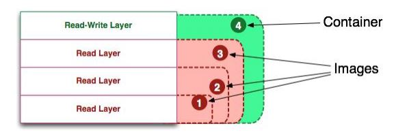
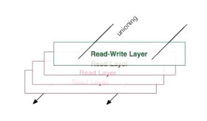
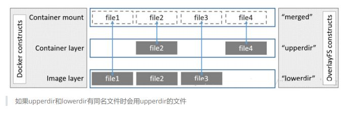

## docker 镜像

### 容器与镜像之间的关系

- docker client 向 docker daemon 发起创建容器的请求
- docker daemon 查找有无客户端需要的镜像
- 如无，则到容器的镜像仓库中下载需要的镜像
- 拿到容器镜像后，启动容器

### 容器镜像介绍

Docker 镜像就是一组只读的目录，或者叫只读的 Docker 容器模板，镜像中含有一个 Docker 容器运行所需要的文件系统，所以我们说 Docker 镜像是启动一个 Docker 容器的基础。

可以将 Docker 镜像看成是 Docker 容器的静态时，也可将 Docker 容器看成是 Docker 镜像的运行时。

从 Docker 的官方文档来看，Docker 容器的定义和 Docker 镜像的定义几乎是相同，`Docker 容器和Docker 镜像的区别主要在于docker 容器多出了一个可写层。`



容器中的进程就运行在这个可写层，这个可写层有两个状态，即运行态和退出态。当我们 docker run 运行容器后，docker 容器就进入了运行态，当我们停止正在运行中的容器时，docker 容器就进入了退出态。

我们将容器从运行态转为退出态时，期间发生的变更都会写入到容器的文件系统中(需要注意的是，此处不是写入到了 docker 镜像中)。

联合文件系统（UnionFS）是一种轻量级的高性能分层文件系统，它支持将文件系统中的修改信息作为一次提交，并层层叠加，同时可以将不同目录挂载到同一个虚拟文件系统下，应用看到的是挂载的最终结果。

联合文件系统是实现 Docker 镜像的技术基础。Docker 镜像可以通过分层来进行继承。例如，用户基于基础镜像（用来生成其他镜像的基础，往往没有父镜像）来制作各种不同的应用镜像。这些镜像共享同一个基础镜像层，提高了存储效率。此外，当用户改变了一个 Docker 镜像（比如升级程序到新的版本），则会创建一个新的层（layer）。因此，用户不用替换整个原镜像或者重新建立，只需要添加新层即可。用户分发镜像的时候，也只需要分发被改动的新层内容（增量部分）。这让 Docker 的镜像管理变得十分轻量级和快速。

## 制作基础镜像

### 1. 安装一个最小化的操作系统主机

虚拟机的镜像模板中不仅仅包含文件系统, 还包括操作系统. 但是容器的镜像模板当中仅仅包含文件系统

### 2. 打包操作系统的根目录

为什么打包根目录, 因为根目录包含了整个操作系统里面的内容

启动状态的主机一定包含这个主机的进程对应的映射, 因此需要排除/proc

启动状态的主机一定包含这个主机的对应的映射, 因此需要排除/sys

```shell
# --numeric-owner 参数指打包过程中给所有的文件夹以及文件的用户名全部替换成数字
# -cvf 创建显示文件
# / 代表打包到 / 目录
[root@bogon ~]# tar --numeric-owner --exclude=/proc --exclude=/sys -cvf centos7u6.tar /

# ll -h 查看打包好的镜像

# scp 镜像名.tar 目标ip:/目录名
```

### 3. 把获取的根打包文件导入到 Docker host 主机中

```shell
# 把上面打好的tar包导入到主机中变成基础镜像
[root@bogon ~]# docker import centos7u6.tar centos7u6:latest

[root@bogon ~]# docker image ls
REPOSITORY TAG IMAGE ID CREATED SIZE
centos7u6 latest 9223c5786c4c 15 seconds ago 1.5GB
```

### 4. 使用基础镜像启动容器

```shell
[root@bogon ~]# docker run -it --name c1000 centos7u6:latest /bin/bash
[root@f56add98265c /]# ls /proc
1 cpuinfo fs kmsg mounts slabinfo tty
22 crypto interrupts kpagecount mtrr softirqs uptime
acpi devices iomem kpageflags net stat version
asound diskstats ioports loadavg pagetypeinfo swaps
vmallocinfo
buddyinfo dma irq locks partitions sys vmstat
bus driver kallsyms mdstat sched_debug sysrq-trigger zoneinfo
cgroups execdomains kcore meminfo schedstat sysvipc
cmdline fb keys misc scsi timer_list
consoles filesystems key-users modules self timer_stats
[root@f56add98265c /]# ip a s
1: lo: <LOOPBACK,UP,LOWER_UP> mtu 65536 qdisc noqueue state UNKNOWN group default qlen
1000
link/loopback 00:00:00:00:00:00 brd 00:00:00:00:00:00
inet 127.0.0.1/8 scope host lo
valid_lft forever preferred_lft forever
38: eth0@if39: <BROADCAST,MULTICAST,UP,LOWER_UP> mtu 1500 qdisc noqueue state UP group
default
link/ether 02:42:ac:11:00:09 brd ff:ff:ff:ff:ff:ff link-netnsid 0
inet 172.17.0.9/16 brd 172.17.255.255 scope global eth0
valid_lft forever preferred_lft forever
```

---

## 制作应用镜像

应用镜像指应用程序运行的环境

### 使用 commit 提交镜像

使用容器的文件系统在基础镜像运行的容器中安装应用，此例使用 httpd

```shell
[root@f56add98265c /]# yum -y install httpd
```

此时制作了一个容器, 还需要让这个容器变成镜像

使用 commit 命令对正在运行的容器提交为一个应用镜像

```shell
[root@bogon ~]# docker commit c1000 centos7u6-httpd:v1
sha256:7bc399ab72aa3335e383e58d709770fa5c3bfeee66cccf7976776e22fe5fedc7
[root@bogon ~]# docker images
REPOSITORY TAG IMAGE ID CREATED SIZE
centos7u6-httpd v1 7bc399ab72aa 5 seconds ago 1.67GB
```

此时可以使用应用镜像

```shell
[root@bogon ~]# docker run -it centos7u6-httpd:v1 /bin/bash
[root@1abdebd392db /]# echo "ttt" >> /var/www/html/index.html
[root@1abdebd392db /]# httpd -k start
AH00558: httpd: Could not reliably determine the server's fully qualified domain name,
using 172.17.0.10. Set the 'ServerName' directive globally to suppress this message
[root@1abdebd392db /]# curl http://localhost
ttt
```

## 使用 docker build 创建指定应用容器镜像

### 1. 使用 docker build 命令

### 2. 基于 Dockerfile

### 3. Dockfile 原理

在 Dockerfile 定义所要执行的命令，使用 docker build 创建镜像，过程中会按照 Dockerfile 所定义的内容打开临时性容器(使用 docker commit 进行提交)，把 Dockerfile 文件中的命令全部执行完成，就得到了一个容器应用镜像。

:::tip
执行命令越多，最终得到的容器应用镜像越大，所以要做优化
:::

### 4. Dockerfile 关键字

#### **FROM（指定基础 image）**

`格式:`

- FROM `<image>` 指定基础 image 为该 image 的最后修改的版本
- FROM `<image>:<tag>` 指定基础 image 为该 image 的一个 tag 版本

#### **MAINTAINER（用来指定镜像创建者信息）**

`格式:`

- MAINTAINER `<name>`
- 例如: MAINTAINER "smartgo smartgodevop@126.com"

#### **RUN (运行命令)**

`格式:`

- RUN `<command>` (the command is run in a shell - /bin/sh -c)
- RUN ["executable", "param1", "param2" ...]

#### **CMD（设置 container 启动时执行的操作）**

:::tip
如果容器镜像中有此命令，启动容器时，不要手动让容器执行其它命令
:::

`格式:`

- CMD ["executable", "param1", "param2" ...]

#### ENTRYPOINT（设置 container 启动时执行的操作）

`格式:`

- ENTRYPOINT ["executable", "param1", "param2" ...]

#### USER（设置 container 容器的用户）

`格式:`

- USER daemon

#### **EXPOSE（指定容器需要映射到宿主机器的端口）**

如果真实机当中有端口, 容器里面没有开启端口, 没法做映射, 所以需要给容器开端口

`格式:`

- EXPOSE `<port> [<port>...]`

#### ENV（用于设置环境变量）

`格式:`

- ENV `<key> <value>`

#### **ADD（从 src 复制文件到 container 的 dest 路径）**

把 docker 主机的文件添加到容器里

`格式:`

- ADD `<src> <dest>`

#### VOLUME（指定挂载点）

`格式:`

- VOLUME `["<mountpoint>"]`

#### **WORKDIR（切换目录）**

比如现在登录进容器, 位于根目录, 但是脚本放到 /opt 文件夹下, 原来工作是在根目录下工作现在执行脚本要切换路径, 使用 workdir 切换到/opt

`格式:`

- WORKDIR /path/to/workdir

---

## Dockerfile 应用案例一

`目的`：通过 Dockerfile 创建一个可以在启动容器时就直接启动 httpd 应用的镜像

`步骤`：

- 创建一个目录，用于存储 Dockerfile 所使用的文件
- 在此目录中创建 Dockerfile 文件及制作镜像所使用到的文件
- 在此此目录中使用 docker build 创建镜像(读取 Dockerfile 文件)
- 使用创建的镜像启动容器

### `过程`：

1. 创建目录

```shell
[root@bogon ~]# mkdir test
[root@bogon ~]# cd test

[root@bogon ~]vim run-httpd.sh

#文件里写入
#!/bin/bash

rm -rf /run/httpd/*   #删除apache进程
exec /sbin/httpd -D FOREGROUND  # -D 用来指定apache运行在前端还是后端 FOREGROUND代表前端
```

2. 进入目录并创建用于启动 httpd 的脚本文件

```shell
[root@bogon test]# cat run-httpd.sh
#!/bin/bash
rm -rf /run/httpd/*
exec /sbin/httpd -D FOREGROUND
```

3. 创建用于测试 httpd 是否可用的 index.htm

```shell
[root@bogon test]# cat index.html
It's work!!!
```

4. 创建 Dockerfile

```shell
[root@bogon test]# vim Dockerfile

# 文件里写入
FROM centos7u6:latest
MAINTAINER "smartdocker@smartdocker@126.com"
RUN yum clean all
RUN rpm --rebuilddb && yum -y install httpd
ADD run-httpd.sh /run-httpd.sh     # 扔进来只有644权限, 也就是读读, 读写, 没有执行权限, 需要执行权限也就是下面 +x, -v 显示加权限过程
RUN chmod -v +x /run-httpd.sh
ADD index.html /var/www/html/
EXPOSE 80  # 是暴露容器的80端口
WORKDIR /  # 切换目录到根, 才能找到执行/run-httpd.sh文件 因为在上面ADD命令决定了
CMD ["/bin/bash","/run-httpd.sh"]

[root@bogon test]# cat Dockerfile
```

5. 使用 docker build 创建镜像，注意命令最后有一个点，点表示当前目录

```shell
[root@bogon test]# docker build -t centos7u6-base-httpd:v1 .
```

6. 使用上述创建的应用容器启动容器

```shell
[root@bogon test]# docker run -d centos7u6-base-httpd:v1
# -d 代表容器在后台执行
```

7. 验证容器及 httpd 是否可用

```shell
[root@bogon test]# docker inspect 31d #查看容器IP地址
[root@bogon test]# curl http://172.17.0.11
It's work!!!
```

---

## 替代原网站内容案例

```shell
[root@bogon test]# mkdir /wwwroot
[root@bogon test]# echo "wwwroot" >> /wwwroot/index.html

[root@bogon test]# docker run -d -v /wwwroot:/var/www/html centos7u6-base-httpd:v1
415e82ad0041aa18bcb92bc8edbdf9bd758915a8345c71266f51937de3a20a26
[root@bogon test]# docker inspect 415
[root@bogon test]# curl http://172.17.0.12
wwwroot
```

:::tip
如果遇到 Rpmdb 错误，可以考虑安装：yum-plugin-ovl 软件包。
:::

---

## 把 nginx 应用容器化案例

要求：

- 1、通过基础镜像做 nginx 应用镜像
- 2、使用 nginx 应用镜像启动容器时，nginx 要求启动
- 3、验证 nginx 服务是否启动

步骤：

- 1、使用哪一个基础 centos:latest
- 2、需要使用 epel YUM 源
- 3、安装 nginx
- 4、修改 nginx 配置文件，主要用于关闭 daemon 后台运行, 这样容器中有 nginx 一直在运行, 容器就不会关闭了
- 5、验证使用的测试页面

过程:

- 创建目录

```shell
[root@localhost ~]# mkdir nginxtest
[root@localhost ~]# cd nginxtest/
[root@localhost nginxtest]#
```

- 创建测试文件

```shell
[root@localhost nginxtest]# echo 'nginx s running!!!' >> index.html
[root@localhost nginxtest]# ls
index.html
```

- 创建 Dockerfile

```shell
[root@localhost nginxtest]# cat Dockerfile
FROM centos:latest

MAINTAINER "smartaiops<smartaiops@126.com>"

# yum -y install 的-y 代表非交互式
RUN yum clean all && yum -y install yum-plugin-ovl && yum -y install epel-release
RUN yum -y install nginx

ADD index.html /usr/share/nginx/html/

RUN echo "daemon off;" >> /etc/nginx/nginx.conf #取消nginx以daemon身份运行

EXPOSE 80

CMD /usr/sbin/nginx
```

- 使用 docker build 创建 nginx 应用镜像

```shell
[root@localhost nginxtest]# docker build -t centos-nginx:v1 .
# -t 代表 tag名是后面的
# 如果不加 . 可以用 -f 绝对路径代替
```

- 启动容器验证 nginx 服务是否自动开启

```shell
[root@localhost nginxtest]# docker images
REPOSITORY TAG IMAGE ID CREATED SIZE
centos-nginx v1 cf23c20ff2cd 20 seconds ago 466MB
[root@localhost nginxtest]# docker run -d centos-nginx:v1
5b1d6dae77d24d9c8dc136a5bf971ebe296e1463838bda46e586d07d6f572f6d
[root@localhost nginxtest]# docker ps
CONTAINER ID IMAGE COMMAND CREATED STATUS PORTS NAMES
5b1d6dae77d2 centos-nginx:v1 "/bin/sh -c /usr/sbi…" 9 seconds ago Up 8 seconds 80/tcp upbeat_khayyam
[root@localhost nginxtest]# docker inspect 5b1d
[root@localhost nginxtest]# curl http://172.17.0.3
nginx s running!!!
```

## 容器镜像在 docker host 存储位置



从图中可以看出除了最上面的一层为读写层之外，下面的其他的层都是只读的镜像层，并且除了最下面的一层外，其他的层都有会有一个指针指向自己下面的一层镜像。

虽然统一文件系统(union file system)技术将不同的镜像层整合成一个统一的文件系统，为构成一个完整容器镜像的层提供了一个统一的视角，隐藏了多个层的复杂性，对用户来说只存在一个文件系统，但图中的这些层并不是不能看到的，如果需要查看的话可以进入运行 Docker 的机器上进行查看，从这些层中可以看到 Docker 内部实现的一些细节。

`Docker 的容器镜像`和`容器本身的数据`都存放在服务器的 /var/lib/docker/ 这个路径下。不过不同的 linux 发行版存储方式上有差别，比如，在 ubuntu 发行版上存储方式为 AUFS，CentOS 发行版上的存储方式为 Overlay 或 Overlay2。

:::tip
centos 系统 docker 默认使用存储驱动是 devicemapper，而这种存储驱动有两种模式 loop-lvm 和 direct-lvm，不巧默认又使用了比较低效的 loop-lvm。
:::

OverlayFS 是一个类似于 AUFS 的现代联合文件系统，更快实现简单。

OverlayFS 是内核提供的文件系统，overlay 和 overlay2 是 docker 的存储驱动

### Overlay 及 Overlay2 原理

OverlayFS 将单个 Linux 主机上的两个目录合并成一个目录。这些目录被称为层，统一过程被称为联合挂载。OverlayFS 底层目录称为 lowerdir， 高层目录称为 upperdir。合并统一视图称为 merged。当需要修改一个文件时，使用 CoW 将文件从只读的 Lower 复制到可写的 Upper 进行修改，结果也保存在 Upper 层。在 Docker 中，底下的只读层就是 image，可写层就是 Container。

overlay2 是 overlay 的改进版，只支持 4.0 以上内核添加了 Multiple lower layers in overlayfs 的特性，所以 overlay2 可以直接造成 muitiple lower layers 不用像 overlay 一样要通过硬链接的方式(最大 128 层) centos 的话支持 3.10.0-514 及以上内核版本也有此特性，所以消耗更少的 inode

`本质区别是镜像层之间共享数据的方法不同`

- overlay 共享数据方式是通过硬连接，只挂载一层,其他层通过最高层通过硬连接形式共享(增加了磁盘 inode 的负担)

- 而 overlay2 是通过每层的 lower 文件



如果 upperdir 和 lowerdir 有同名文件时会用 upperdir 的文件

### 查看 docker 默认使用的存储驱动方法

```shell
[root@bogon overlay2]# docker info
Containers: 1
Running: 1
Paused: 0
Stopped: 0
Images: 1
Server Version: 18.09.5
Storage Driver: overlay2 #注意此处
Backing Filesystem: xfs
Supports d_type: true
Native Overlay Diff: true
Logging Driver: json-file
Cgroup Driver: cgroupfs
Plugins:
# 以下略
```

### docker 运行前

/var/lib/docker/overlay2 路径下的信息在不同的阶段会有变化，了解这几个阶段中新增的数据以及容器与镜像的存储结构的变化非常有利于我们对 Docker 容器以及 Docker 镜像的理解。

Docker 运行前、Docker 运行后、下载镜像后、运行容器后四个阶段中 Docker 存储的变化

- 运行前

没有启动 docker daemon 之间不会在/var/lib/目录中添加 docker 目录

- 启动后

```shell
[root@bogon ~]# systemctl start docker
[root@bogon ~]# tree /var/lib/docker
/var/lib/docker
├── builder
│ └── fscache.db
├── buildkit
│ ├── cache.db
│ ├── content
│ │ └── ingest
│ ├── executor
│ ├── metadata.db
│ └── snapshots.db
├── containers
├── image
│ └── overlay2
│ ├── distribution
│ ├── imagedb
│ │ ├── content
│ │ │ └── sha256
│ │ └── metadata
│ │ └── sha256
│ ├── layerdb
│ └── repositories.json
├── network
│ └── files
│ └── local-kv.db
├── overlay2 #下载镜像后，存储在此目录中
│ ├── backingFsBlockDev
│ └── l
├── plugins
│ ├── storage
│ │ └── blobs
│ │ └── tmp
│ └── tmp
├── runtimes
├── swarm
├── tmp
├── trust
└── volumes
└── metadata.db
29 directories, 8 files
```

- 下载镜像后

```shell
[root@bogon overlay2]# pwd
/var/lib/docker/overlay2
[root@bogon overlay2]# ls
2d297a77c653f510dce69815627fdb485462b1b2fc9e0078a9ecc5ca2d222c8d backingFsBlockDev l
[root@bogon overlay2]# ls
2d297a77c653f510dce69815627fdb485462b1b2fc9e0078a9ecc5ca2d222c8d/
diff link
[root@bogon overlay2]# ls
2d297a77c653f510dce69815627fdb485462b1b2fc9e0078a9ecc5ca2d222c8d/diff/
anaconda-post.log dev home lib64 mnt proc run srv tmp var
bin etc lib media opt root sbin sys usr
```

centos 镜像只有一层

```shell
[root@bogon overlay2]# pwd
/var/lib/docker/overlay2
[root@bogon overlay2]# ls
2d297a77c653f510dce69815627fdb485462b1b2fc9e0078a9ecc5ca2d222c8d backingFsBlockDev l
[root@bogon overlay2]# ll l
总用量 0
lrwxrwxrwx 1 root root 72 4月 26 12:58 MBRXMBFE2MYZYMO5RZLRLTMRGJ ->
../2d297a77c653f510dce69815627fdb485462b1b2fc9e0078a9ecc5ca2d222c8d/diff
```

l 目录中包含了很多多软链接，使用短名称指向了其他层，短名称用于避免 mount 参数时达到页面大小的限制

- 运行容器后

Overlay2 容器结构

```shell
#运行容器前
[root@bogon overlay2]# ls
2d297a77c653f510dce69815627fdb485462b1b2fc9e0078a9ecc5ca2d222c8d backingFsBlockDev l

#运行容器后
[root@bogon overlay2]# ls
00bd7dcc4c91f9a1a1257b8c0683fdd0b6dfe18af26597457e92b4d15c20cda0
backingFsBlockDev
00bd7dcc4c91f9a1a1257b8c0683fdd0b6dfe18af26597457e92b4d15c20cda0-init l
2d297a77c653f510dce69815627fdb485462b1b2fc9e0078a9ecc5ca2d222c8d
[root@bogon overlay2]# ll
00bd7dcc4c91f9a1a1257b8c0683fdd0b6dfe18af26597457e92b4d15c20cda0
总用量 8
drwxr-xr-x 2 root root 6 4月 26 13:15 diff
-rw-r--r-- 1 root root 26 4月 26 13:15 link
-rw-r--r-- 1 root root 57 4月 26 13:15 lower
drwxr-xr-x 1 root root 6 4月 26 13:15 merged
drwx------ 3 root root 18 4月 26 13:15 work
```

启动一个容器，也是载/var/lib/docker/overlay2 目录下生成一层容器层，目录包括 diff，link，lower，merged，work。

diff 记录每一层自己内容的数据；link 记录该层链接目录（实际是 l 目录下到层的链接），比如在容器中创建目录或在 diff 新增该目录；创建容器时将 lower-id 指向的镜像层目录以及 upper 目录联合挂载到 merged 目录；work 用来完成如 copy-on_write 的操作。

启动容器后，可以在 docker host 查看 mount 情况

```shell
[root@bogon overlay2]# mount | grep overlay
overlay on
/var/lib/docker/overlay2/00bd7dcc4c91f9a1a1257b8c0683fdd0b6dfe18af26597457e92b4d15c20cd
a0/merged type overlay
(rw,relatime,lowerdir=/var/lib/docker/overlay2/l/4GXMF7JGUPRUBLW5SM4X4FY5R2:/var/lib/do
cker/overlay2/l/MBRXMBFE2MYZYMO5RZLRLTMRGJ,upperdir=/var/lib/docker/overlay2/00bd7dcc4c
91f9a1a1257b8c0683fdd0b6dfe18af26597457e92b4d15c20cda0/diff,workdir=/var/lib/docker/ove
rlay2/00bd7dcc4c91f9a1a1257b8c0683fdd0b6dfe18af26597457e92b4d15c20cda0/work)
```
