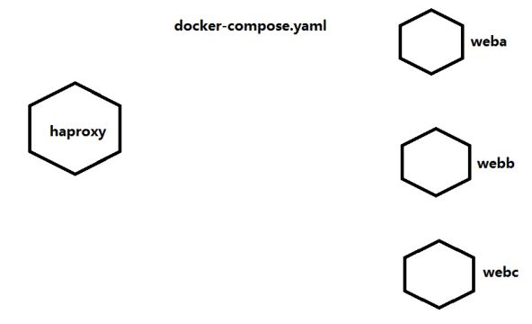

## 编排部署工具

- docker machine
- docker compose
- docker swarm
- kubernetes
- mesos + marathon

## docker compose

docker compose 是用来在 docker 中定义和运行复杂应用的小工具, 比如在一个文件中定义多个容器, 只用一行命令就可以让一切就绪并运行

Docker Compose 将所管理的容器分为三层, 工程 project, 服务 service, 容器 container

Docker Compose 运行的目录下的所有文件(docker-compose.yml, extends 文件或环境变量文件等) 组成一个工程, 若无特殊指定工程名即为当前目录名. 一个工程当中可包含多个服务, 每个服务中定义了容器运行的镜像, 参数, 依赖. 一个服务当中可包括多个容器实例, Docker Compose 并没有解决负载均衡的问题, 因此需要借助其他工具实现服务发现及负载均衡

### docker compose 作用

在一个文件中定义复杂的容器应用之间的关系, 用一个命令即可执行

- YAML，类似于 html,xml #标记类语言
- YAML 格式文件
- docker-compose 使用 yaml 文件启动容器
  - start & stop
  - down & up

### docker compose 定义方法

docker compose 将容器分三层：

- 工程 project 一个目录
- 服务 service 用于定义容器资源(镜像、网络、依赖、容器)
- 容器 container 用于运行服务

步骤：

1、创建一个目录

2、创建一个 docker-compose.yaml 文件，定义服务

3、使用 docker-compose 命令启动服务

### 使用 docker compose

```shell
# 安装epel源
[root@node2 ~]# yum -y install epel-release
[root@node2 ~]# yum -y install python2-pip
[root@node2 ~]# pip install --upgrade pip
[root@node2 ~]# pip install docker-compose
```

## docker-compose 部署应用案例一

使用 haproxy 实例 web 应用发布



步骤：

### 第一步：创建一个工程

```shell
[root@node1 ~]# mkdir docker-haproxy
[root@node1 ~]# cd docker-haproxy/
[root@node1 docker-haproxy]#
```

### 第二步：定义 web 服务

```shell
[root@node1 docker-haproxy]# mkdir web
[root@node1 docker-haproxy]# cd web
[root@node1 web]# cat Dockerfile
FROM python:2.7
WORKDIR /code
ADD . /code
EXPOSE 80
CMD python index.py
[root@node1 web]# cat index.py
#!/usr/bin/python
#date:
import sys
import BaseHTTPServer
from SimpleHTTPServer import SimpleHTTPRequestHandler
import socket
import fcntl
import struct
import pickle
from datetime import datetime
from collections import OrderedDict
class HandlerClass(SimpleHTTPRequestHandler):
def get_ip_address(self,ifname):
s = socket.socket(socket.AF_INET, socket.SOCK_DGRAM)
return socket.inet_ntoa(fcntl.ioctl(
s.fileno(),
0x8915, # SIOCGIFADDR
struct.pack('256s', ifname[:15])
)[20:24])
def log_message(self, format, *args):
if len(args) < 3 or "200" not in args[1]:
return
try:
request = pickle.load(open("pickle_data.txt","r"))
except:
request=OrderedDict()
time_now = datetime.now()
ts = time_now.strftime('%Y-%m-%d %H:%M:%S')
server = self.get_ip_address('eth0')
host=self.address_string()
addr_pair = (host,server)
if addr_pair not in request:
request[addr_pair]=[1,ts]
else:
num = request[addr_pair][0]+1
del request[addr_pair]
request[addr_pair]=[num,ts]
file=open("index.html", "w")
file.write("<!DOCTYPE html> <html> <body><center><h1><font color=\"blue\"
face=\"Georgia, Arial\" size=8><em>HA</em></font> Webpage Visit Results</h1>
</center>");
for pair in request:
if pair[0] == host:
guest = "LOCAL: "+pair[0]
else:
guest = pair[0]
if (time_now-datetime.strptime(request[pair][1],'%Y-%m-%d
%H:%M:%S')).seconds < 3:
file.write("<p style=\"font-size:150%\" >#"+ str(request[pair][1]) +":
<font color=\"red\">"+str(request[pair][0])+ "</font> requests " + "from &lt<font
color=\"blue\">"+guest+"</font>&gt to WebServer &lt<font color=\"blue\">"+pair[1]+"
</font>&gt</p>")
else:
file.write("<p style=\"font-size:150%\" >#"+ str(request[pair][1]) +":
<font color=\"maroon\">"+str(request[pair][0])+ "</font> requests " + "from &lt<font
color=\"navy\">"+guest+"</font>&gt to WebServer &lt<font color=\"navy\">"+pair[1]+"
</font>&gt</p>")
file.write("</body> </html>");
file.close()
pickle.dump(request,open("pickle_data.txt","w"))
if __name__ == '__main__':
try:
ServerClass = BaseHTTPServer.HTTPServer
Protocol = "HTTP/1.0"
addr = len(sys.argv) < 2 and "0.0.0.0" or sys.argv[1]
port = len(sys.argv) < 3 and 80 or int(sys.argv[2])
HandlerClass.protocol_version = Protocol
httpd = ServerClass((addr, port), HandlerClass)
sa = httpd.socket.getsockname()
print "Serving HTTP on", sa[0], "port", sa[1], "..."
httpd.serve_forever()
except:
exit()
```

### 第三步：定义 haproxy 服务

```shell
[root@node1 docker-haproxy]# mkdir haproxy
[root@node1 docker-haproxy]# cd haproxy/
[root@node1 haproxy]# cat haproxy.cfg
global
log 127.0.0.1 local0
log 127.0.0.1 local1 notice
defaults
log global
mode http
option httplog
option dontlognull
timeout connect 5000ms
timeout client 50000ms
timeout server 50000ms
listen stats
bind *:70
stats enable
stats uri /
frontend balancer
bind 0.0.0.0:80
mode http
default_backend web_backends
backend web_backends
mode http
option forwardfor
balance roundrobin
server weba weba:80 check
server webb webb:80 check
server webc webc:80 check
option httpchk GET /
http-check expect status 200
```

### 第四步：创建 docker-compose.yaml 文件整合以上服务

```shell
[root@node1 docker-haproxy]# cat docker-compose.yaml
weba:
build: ./web
expose:
- 80
webb:
build: ./web
expose:
- 80
webc:
build: ./web
expose:
- 80
haproxy:
image: haproxy:latest
volumes:
- ./haproxy:/haproxy-override
- ./haproxy/haproxy.cfg:/usr/local/etc/haproxy/haproxy.cfg:ro
links:
- weba
- webb
- webc
ports:
- "80:80"
- "70:70"
expose:
- "80"
- "70"
```

第五步：使用 docker-compose 命令启动工程

```shell
[root@node1 docker-haproxy]# pwd
/root/docker-haproxy
[root@node1 docker-haproxy]# docker-compose up
```

## docker-compose 部署应用案例二 redis

创建一个 python web 应用，使用 flask，把用户访问的次数写入到 redis，通过 web 首页显示访问次数。

### 第一步：创建一个工程目录

```shell
[root@node1 ~]# mkdir pythondir
[root@node1 ~]# cd pythondir
[root@node1 pythondir]#
```

### 第二步：创建一个应用

```shell
[root@node1 pythondir]# cat app.py
from flask import Flask
from redis import Redis
app = Flask(__name__)
redis = Redis(host='redis',port=6379)
@app.route('/')
def hello():
redis.incr('hits')
return 'Hello world! I have been seen %s time.' % redis.get('hits')
if __name__ == "__main__":
app.run(host="0.0.0.0",debug=True)
```

创建安装的软件需求列表

```shell
[root@node1 pythondir]# cat requirements.txt
flask
redis
```

### 第三步：Dockerfile 文件

```shell
[root@node1 pythondir]# cat Dockerfile
FROM python:2.7
ADD . /code
WORKDIR /code
RUN pip install -r requirements.txt
CMD python app.py
```

### 第四步：创建 docker-compose.yaml 文件

```shell
[root@node1 pythondir]# cat docker-compose.yaml
version: '2'
services:
web:
build: .
ports:
- "5000:5000"
volumes:
- .:/code
depends_on:
- redis
redis:
image: redis:latest
```

### 第五步：运行

```shell
[root@node1 pythondir]# pwd
/root/pythondir
[root@node1 pythondir]# docker-compose up
```

## docker-compose 部署应用案例三 wordpress

使用容器运行一个 wordpress 应用

- 语言开发环境
- 数据库

### 第一步：创建一个工程目录

```shell
[root@node1 ~]# mkdir wordpress
[root@node1 ~]# cd wordpress
[root@node1 wordpress]#
```

### 第二步：创建一个 docker-compose.yaml 文件

```shell
[root@node1 wordpress]# cat docker-compose.yaml
version: '2'
services:
db:
image: mysql:5.7
volumes:
- "./.data/db:/var/lib/mysql"
restart: always
environment:
MYSQL_ROOT_PASSWORD: wordpress
MYSQL_DATABASE: wordpress
MYSQL_USER: wordpress
MYSQL_PASSWORD: wordpress
wordpress:
depends_on:
- db
image: wordpress:latest
links:
- db
ports:
- "8000:80"
restart: always
environment:
WORDPRESS_DB_HOST: db:3306
WORDPRESS_DB_PASSWORD: wordpress
```

### 第三步：验证

```shell
[root@node1 ~]# cd wordpress/
[root@node1 wordpress]# ls -a
. .. .data docker-compose.yaml
[root@node1 wordpress]# ls .data/
db
[root@node1 wordpress]# ls .data/db/
auto.cnf client-key.pem ib_logfile1 private_key.pem sys
ca-key.pem ib_buffer_pool ibtmp1 public_key.pem wordpress
ca.pem ibdata1 mysql server-cert.pem
client-cert.pem ib_logfile0 performance_schema server-key.pem
```
