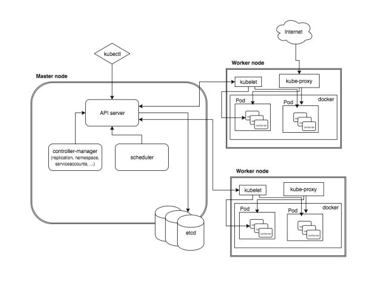
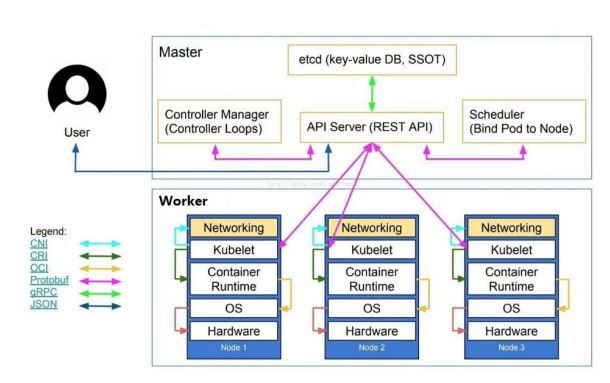

## kubernetes 简介

### 常见容器编排部署工具

- docker 三剑客
- mesos + marathon
- kubernetes

### kubernetes 用户

- 2017 年 docker 官方宣布原生支持 kubernetes
- RedHat 公司 PaaS 平台 OpenShift 核心是 kubernetes
- Rancher 平台核心是 kubernetes
- 现国内大多数公司都可使用 kubernetes 进行传统 IT 服务转换，以实现高效管理等。

### kubernetes 功能

Kubernetes 是一个轻便的和可扩展的开源平台，用于管理容器化应用和服务。通过 Kubernetes 能够进行应用的自动化部署和扩缩容。在 Kubernetes 中，会将组成应用的容器组合成一个逻辑单元以更易管理和发现。Kubernetes 积累了作为 Google 生产环境运行工作负载 15 年的经验，并吸收了来自于社区的最佳想法和实践。

- 自动装箱

  - 基于容器对应用运行环境的资源配置要求自动部署应用容器

- 自我修复(自愈能力)

  - 当容器失败时，会对容器进行重启
  - 当所部署的 Node 节点有问题时，会对容器进行重新部
  - 署和重新调度
  - 当容器未通过监控检查时，会关闭此容器
  - 直到容器正常运行时，才会对外提供服务

- 水平扩展

  - 通过简单的命令、用户 UI 界面或基于 CPU 等资源使用情况，对应用容器进行规模扩大或规模剪裁

- 服务发现

  - 用户不需要使用额外的服务发现机制，就能够基于 Kubernetes 自身能力实现服务发现和负载均衡

- 滚动更新

  - 可以根据应用的变化，对应用容器运行的应用，进行一次性或批量式更新

- 版本回退

  - 可以根据应用部署情况，对应用容器运行的应用，进行历史版本即时回退

- 密钥和配置管理

  - 在不需要重新构建镜像的情况下，可以部署和更新密钥和应用配置，类似热部署。

- 存储编排

  - 自动实现存储系统挂载及应用，特别对有状态应用实现数据持久化非常重要

  - 存储系统可以来自于本地目录、网络存储(NFS、Gluster、Ceph、Cinder 等)、公共云存储服务等

---

## k8s 架构

### 场景

播仔所在的项目研发部门最近要进行应用运行基础环境迁移，需要由原先的虚拟机环境迁移到 k8s 集群环境中，以便应对开发快速部署和快速测试的需要，因此，需要播仔准备一套可以用于开发需求的 k8s 集群，但是对于仅有容器基础应用的播仔来讲，如何去构建一套 k8s 集群呢？如果你是播仔应该从哪方面入手呢？

如果我是播仔，首先我需要了解 k8s 集群架构，这样有助于对 k8s 平台进行合理部署和应用。

### 应用部署架构分类

- 无中心节点架构

  - GlusterFS

- 有中心节点架构
  - HDFS
  - k8s

### k8s 架构

- Master Node

  - k8s 集群控制节点，对集群进行调度管理，接受集群外用户去集群操作请求；
  - Master Node 由 API Server、Scheduler、ClusterState Store（ETCD 数据库）和 Controller MangerServer 所组成；

- Worker Node
  - 集群工作节点，运行用户业务应用容器；
  - Worker Node 包含 kubelet、kube proxy 和 Container Runtime；

## TODO