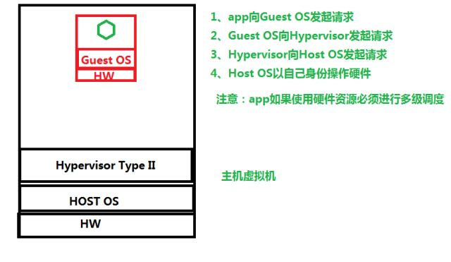

## 虚拟化分类

### 按虚拟化资源提供者分类

- 硬件平台虚拟化

- 操作系统虚拟化

### 按虚拟化实现方式

- Type I 半虚拟化
- Type II 硬件辅助全虚拟化
- Type III
  - 软件全虚拟化
  - 操作系统虚拟化

### 回顾硬件平台虚拟化与操作系统虚拟化区别




### 主机虚拟化与容器虚拟化的优缺点

- 主机虚拟化

  - 应用程序运行环境强隔离
  - 虚拟机操作系统与底层操作系统无关化
  - 虚拟机内部操作不会影响到物理机
  - 拥有操作系统会占用部署资源及存储
  - 网络传输效率低
  - 当应用程序需要调用硬件响应用户访问时间延迟大

- 容器虚拟化

  - 可以实现应用程序的隔离
  - 直接使用物理机的操作系统可以快速响应用户请求
  - 不占用部署时间
  - 占用少量磁盘空间
  - 缺点：学习成本增加、操作控制麻烦、网络控制与主机虚拟化有所区别、服务治理。

## 云平台的技术实现


- IaaS 虚拟机

  - 阿里云 ECS
  - OpenStack VM 实例

- PaaS 容器(CaaS)

  - LXC
  - Docker
  - OpenShift
  - Rancher

- SaaS 应用程序
  - 互联网中应用都是

## 容器级虚拟化

### NameSpce


虚拟机每一个隔离空间都有自己的硬件, 容器是没有的. 但是每个容器都有自己的 UTS, MOUNT, IP, USER, PID

虚拟机的名字就是域名, 容器是基于 namespace 来实现容器

- UTS:每一个 NameSpace 都拥有独立的主机或域名，可以把每个 NameSpace 认为一个独立主机。
- IPC：每个容器依旧使用 linux 内核中进程交互的方法，实现进程间通信
- Mount：每个容器的文件系统是独立的
- Net：每个容器的网络是隔离
- User:每个容器的用户和组 ID 是隔离，每个容器都拥有 root 用户
- PID：每个容器都拥有独立的进程树，由容器是物理机中的一个进程，所以容器中的进程是物理机的线程

应用程序运行环境隔离的空间，就是一个容器或者说命名空间，每一个容器都将拥有 UTS,IPC,Mount，Net,User,PID。

### CGroups(控制组)

- 作用：用于实现容器的资源隔离

- 可对进程做资源隔离

- 9大子系统
  - 把资源定义为子系统，可以通过子系统对资源进行限制
  - CPU 可以让进程使用CPU的比例
  - memory 限制内存使用，例如50Mi,150Mi
  - blkio 限制块设备的IO
  - cpuacct 生成Cgroup使用CPU的资源报告
  - cpuset 用于多CPU执行Cgroup时，对进程进行CPU分组
  - devices 允许或拒绝设备的访问
  - freezer 暂停或恢复Cgroup运行
  - net_cls
  - ns

- 应用案例一: 
  - 通过Cgroup限制进程对CPU的使用
    - 步骤
      - 部署Cgroup
      
```shell
[root@bogon ~]# yum -y install libcgroup*
[root@bogon ~]# systemctl status cgconfig
● cgconfig.service - Control Group configuration service
Loaded: loaded (/usr/lib/systemd/system/cgconfig.service;
disabled; vendor preset: disabled)
Active: inactive (dead)
[root@bogon ~]# systemctl enable cgconfig
Created symlink from
/etc/systemd/system/sysinit.target.wants/cgconfig.service to
/usr/lib/systemd/system/cgconfig.service.
[root@bogon ~]# systemctl start cgconfig
[root@bogon ~]# systemctl status cgconfig
● cgconfig.service - Control Group configuration service
Loaded: loaded (/usr/lib/systemd/system/cgconfig.service; enabled;
vendor preset: disabled)
Active: active (exited) since 四 2019-04-25 16:30:03 CST; 7s ago
Process: 17061 ExecStart=/usr/sbin/cgconfigparser -l
/etc/cgconfig.conf -L /etc/cgconfig.d -s 1664 (code=exited,
status=0/SUCCESS)
Main PID: 17061 (code=exited, status=0/SUCCESS)
4月 25 16:30:03 bogon systemd[1]: Starting Control Group
configuration ser.....
4月 25 16:30:03 bogon systemd[1]: Started Control Group configuration
service.
Hint: Some lines were ellipsized, use -l to show in full.
```

  - Cgroup限制对CPU使用的步骤
    - 第一步：创建Cgroup组
    - 第二步：把进程添加到Cgroup

```shell
#使用cpu子系统创建2个cgroup
[root@bogon ~]# vim /etc/cgconfig.conf
group lesscpu {
cpu {
cpu.shares=200;
}
}
group morecpu {
cpu {
cpu.shares=800;
}
}
[root@bogon ~]# systemctl restart cgconfig

[root@bogon ~]# cgexec -g cpu:lesscpu md5sum /dev/zero
#终端1
[root@bogon ~]# cgexec -g cpu:morecpu sha1sum /dev/zero
#终端2
[root@bogon ~]# top
#终端3

```

-------------------

- 应用案例二: 
  - 错误内存限制

```shell
[root@bogon ~]# vim /etc/cgconfig.conf
group lessmem {
memory {
memory.limit_in_bytes=268435465;
}
}
[root@bogon ~]# systemctl restart cgconfig
[root@bogon ~]# mkdir /mnt/mem_test
[root@bogon ~]# df -h
文件系统 容量 已用 可用 已用% 挂载点
/dev/mapper/centos-root 17G 1.5G 16G 9% /
devtmpfs 2.0G 0 2.0G 0% /dev
tmpfs 2.0G 0 2.0G 0% /dev/shm
tmpfs 2.0G 8.7M 2.0G 1% /run
tmpfs 2.0G 0 2.0G 0% /sys/fs/cgroup
/dev/vda1 1014M 163M 852M 17% /boot
tmpfs 336M 0 336M 0% /run/user/0
[root@bogon ~]#
[root@bogon ~]# mount -t tmpfs /dev/shm /mnt/mem_test
[root@bogon ~]# df -h
文件系统 容量 已用 可用 已用% 挂载点
/dev/mapper/centos-root 17G 1.5G 16G 9% /
devtmpfs 2.0G 0 2.0G 0% /dev
tmpfs 2.0G 0 2.0G 0% /dev/shm
tmpfs 2.0G 8.7M 2.0G 1% /run
tmpfs 2.0G 0 2.0G 0% /sys/fs/cgroup
/dev/vda1 1014M 163M 852M 17% /boot
tmpfs 336M 0 336M 0% /run/user/0
/dev/shm 952M 0 952M 0% /mnt/mem_test
[root@bogon ~]#
[root@bogon ~]# cgexec -g memory:lessmem dd if=/dev/zero of=/mnt/mem_test/file1 bs=1M
count=200
记录了200+0 的读入
记录了200+0 的写出
209715200字节(210 MB)已复制，0.100733 秒，2.1 GB/秒
[root@bogon ~]# ls /mnt/mem_test/
file1
[root@bogon ~]# rm -rf /mnt/mem_test/file1
[root@bogon ~]# cgexec -g memory:lessmem dd if=/dev/zero of=/mnt/mem_test/file1 bs=1M
count=500
记录了500+0 的读入
记录了500+0 的写出
524288000字节(524 MB)已复制，0.353956 秒，1.5 GB/秒
```

  - 正确的内存限制

```shell
[root@bogon ~]# vim /etc/cgconfig.conf
group lessmem {
memory {
memory.limit_in_bytes=268435465;
memory.memsw.limit_in_bytes=268435465;
}
}
[root@bogon ~]# systemctl restart cgconfig
[root@bogon ~]# mount -t tmpfs /dev/shm /mnt/mem_test
[root@bogon ~]# df -h
文件系统 容量 已用 可用 已用% 挂载点
/dev/mapper/centos-root 17G 1.5G 16G 9% /
devtmpfs 2.0G 0 2.0G 0% /dev
tmpfs 2.0G 0 2.0G 0% /dev/shm
tmpfs 2.0G 8.7M 2.0G 1% /run
tmpfs 2.0G 0 2.0G 0% /sys/fs/cgroup
/dev/vda1 1014M 163M 852M 17% /boot
tmpfs 336M 0 336M 0% /run/user/0
/dev/shm 952M 0 952M 0% /mnt/mem_test
[root@bogon ~]# cgexec -g memory:lessmem dd if=/dev/zero of=/mnt/mem_test/file1 bs=1M
count=200
记录了200+0 的读入
记录了200+0 的写出
209715200字节(210 MB)已复制，0.105744 秒，2.0 GB/秒
[root@bogon ~]# rm -rf /mnt/mem_test/file1
[root@bogon ~]# cgexec -g memory:lessmem dd if=/dev/zero of=/mnt/mem_test/file1 bs=1M
count=500
已杀死

```