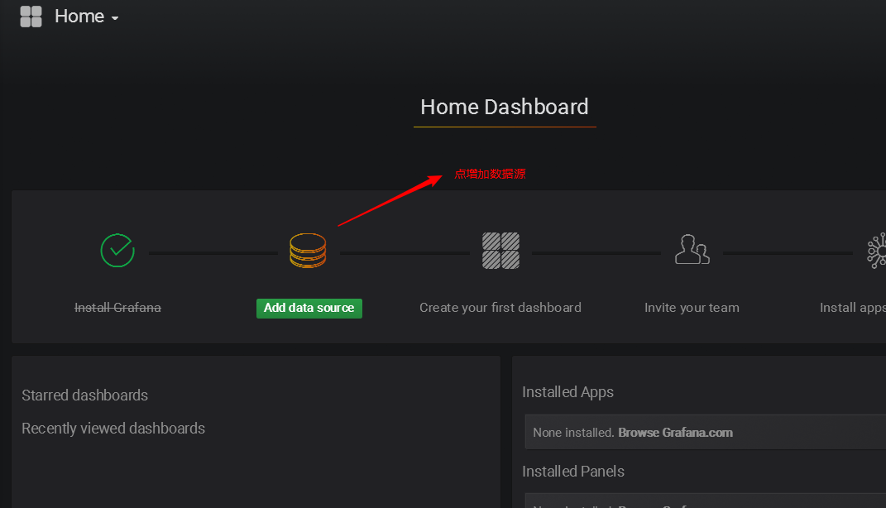

## 普罗米修斯

Prometheus(由 go 语言(golang)开发)是一套开源的监控&报警&`时间序列数据库`的组合。适合监控容器平台。因为 kubernetes(俗称 k8s)的流行带动了 prometheus 的发展。

https://prometheus.io/docs/introduction/overview/

数据库分类:

- 关系型 mysql,oracle,sql server,sybase,db2,access 等
- 非关系型(nosql)
  - key-value memcache redis etcd
  - 文档型 mongodb elasticsearch
  - 列式 hbase
  - 时序 prometheus
  - 图形数据库

**时间序列数据**(TimeSeries Data) : 按照时间顺序记录系统、设备状态变化的数据被称为时序数据.

应用的场景很多, 如:

- 无人驾驶车辆运行中要记录的经度，纬度，速度，方向，旁边物体的距离等等。每时每刻都要将数据记录下来做分析。
- 某一个地区的各车辆的行驶轨迹数据
- 传统证券行业实时交易数据
- 实时运维监控数据等

时间序列数据库的主要优点:

- 性能好

关系型数据库对于大规模数据的处理性能糟糕。NOSQL 可以比较好的处理大规模数据，让依然比不上时间序列数据库。

- 存储成本低

高效的压缩算法，节省存储空间，有效降低 IO

Prometheus 有着非常高效的时间序列数据存储方法，每个采样数据仅仅占用 3.5byte 左右空间，上百万条时间序列，30 秒间隔，保留 60 天，大概花了 200 多 G（来自官方数据)

Prometheus 的主要特征有:

1. 多维度数据模型

2. 灵活的查询语言

3. 不依赖分布式存储，单个服务器节点是自主的

4. 以 HTTP 方式，通过 pull 模型拉去时间序列数据

5. 也可以通过中间网关支持 push 模型

6. 通过服务发现或者静态配置, 来发现目标服务对象

7. 支持多种多样的图表和界面展示

## 普罗米修斯原理架构图


## 实验环境准备


1. 静态 ip(要求能上外网)

2. 主机名

```powershell
各自配置好主机名
# hostnamectl set-hostname --static server.cluster.com
三台都互相绑定IP与主机名
# vim /etc/hosts
10.1.1.13  server.cluster.com
10.1.1.14  agent1.cluster.com
10.1.1.15  grafana.cluster.com
```

3. **==时间同步==**(时间同步一定要确认一下)

```powershell
# systemctl restart ntpd
# systemctl enable ntpd
```

4. 关闭防火墙,selinux

```powershell
# systemctl stop firewalld
# systemctl disable firewalld
# iptables -F
```

## 安装 prometheus

从 https://prometheus.io/download/ 下载相应版本，安装到服务器上

官网提供的是二进制版，解压就能用，不需要编译

```powershell
[root@server ~]# tar xf prometheus-2.5.0.linux-amd64.tar.gz -C /usr/local/
[root@server ~]# mv /usr/local/prometheus-2.5.0.linux-amd64/ /usr/local/prometheus

直接使用默认配置文件启动
[root@server ~]# /usr/local/prometheus/prometheus --config.file="/usr/local/prometheus/prometheus.yml" &


确认端口(9090)
[root@server ~]# lsof -i:9090
```

## prometheus 界面

通过浏览器访问**http://服务器 IP:9090**就可以访问到 prometheus 的主界面


默认只监控了本机一台，点 Status --》点 Targets --》可以看到只监控了本机


通过**http://服务器 IP:9090/metrics**可以查看到监控的数据


在 web 主界面可以通过关键字查询监控项


## 监控远程 linux 主机

1, 在远程 linux 主机(被监控端 agent1)上安装 node_exporter 组件

下载地址: https://prometheus.io/download/

```powershell
[root@agent1 ~]# tar xf node_exporter-0.16.0.linux-amd64.tar.gz -C /usr/local/
[root@agent1 ~]# mv /usr/local/node_exporter-0.16.0.linux-amd64/ /usr/local/node_exporter

里面就一个启动命令node_exporter,可以直接使用此命令启动
[root@agent1 ~]# ls /usr/local/node_exporter/
LICENSE  node_exporter  NOTICE
[root@agent1 ~]# nohup /usr/local/node_exporter/node_exporter &

确认端口(9100)
[root@agent1 ~]# lsof -i:9100
```

扩展: **==nohup==**命令: 如果把启动 node_exporter 的终端给关闭,那么进程也会随之关闭。nohup 命令会帮你解决这个问题。

2, 通过浏览器访问**http://被监控端 IP:9100/metrics**就可以查看到 node_exporter 在被监控端收集的监控信息


3, 回到 prometheus 服务器的配置文件里添加被监控机器的配置段

```powershell
在主配置文件最后加上下面三行
[root@server ~]# vim /usr/local/prometheus/prometheus.yml
 - job_name: 'agent1'					# 取一个job名称来代表被监控的机器
   static_configs:
   - targets: ['10.1.1.14:9100']		# 这里改成被监控机器的IP，后面端口接9100

改完配置文件后,重启服务
[root@server ~]# pkill prometheus
[root@server ~]# lsof -i:9090			# 确认端口没有进程占用
[root@server ~]# /usr/local/prometheus/prometheus --config.file="/usr/local/prometheus/prometheus.yml" &
[root@server ~]# lsof -i:9090			# 确认端口被占用，说明重启成功
```

4，回到 web 管理界面 --》点 Status --》点 Targets --》可以看到多了一台监控目标


练习: 加上本机 prometheus 的监控

答: 在本机安装 node_exporter，也使用上面的方式监控起来。

## 监控远程 mysql

1,在被管理机 agent1 上安装 mysqld_exporter 组件

下载地址: https://prometheus.io/download/

```powershell
安装mysqld_exporter组件
[root@agent1 ~]# tar xf mysqld_exporter-0.11.0.linux-amd64.tar.gz -C /usr/local/
[root@agent1 ~]# mv /usr/local/mysqld_exporter-0.11.0.linux-amd64/ /usr/local/mysqld_exporter
[root@agent1 ~]# ls /usr/local/mysqld_exporter/
LICENSE  mysqld_exporter  NOTICE

安装mariadb数据库,并授权
[root@agent1 ~]# yum install mariadb-server -y
[root@agent1 ~]# systemctl restart mariadb
[root@agent1 ~]# systemctl enable mariadb
[root@agent1 ~]# mysql

MariaDB [(none)]> grant select,replication client,process ON *.* to 'mysql_monitor'@'localhost' identified by '123';
(注意:授权ip为localhost，因为不是prometheus服务器来直接找mariadb获取数据，而是prometheus服务器找mysql_exporter,mysql_exporter再找mariadb。所以这个localhost是指的mysql_exporter的IP)

MariaDB [(none)]> flush privileges;

MariaDB [(none)]> quit

创建一个mariadb配置文件，写上连接的用户名与密码(和上面的授权的用户名和密码要对应)
[root@agent1 ~]# vim /usr/local/mysqld_exporter/.my.cnf
[client]
user=mysql_monitor
password=123

启动mysqld_exporter
[root@agent1 ~]# nohup /usr/local/mysqld_exporter/mysqld_exporter --config.my-cnf=/usr/local/mysqld_exporter/.my.cnf &

确认端口(9104)
[root@agent1 ~]# lsof -i:9104
```

2, 回到 prometheus 服务器的配置文件里添加被监控的 mariadb 的配置段

```powershell
在主配置文件最后再加上下面三行
[root@server ~]# vim /usr/local/prometheus/prometheus.yml
 - job_name: 'agent1_mariadb'					# 取一个job名称来代表被监控的mariadb
   static_configs:
   - targets: ['10.1.1.14:9104']				# 这里改成被监控机器的IP，后面端口接9104


改完配置文件后,重启服务
[root@server ~]# pkill prometheus
[root@server ~]# lsof -i:9090
[root@server ~]# /usr/local/prometheus/prometheus --config.file="/usr/local/prometheus/prometheus.yml" &
[root@server ~]# lsof -i:9090
```

3, 回到 web 管理界面 --》点 Status --》点 Targets --》可以看到监控 mariadb 了


# grafana

## 使用 grafana 连接 prometheus

Grafana 是一个开源的度量分析和可视化工具，可以通过将采集的数据分析，查询，然后进行可视化的展示,并能实现报警。


网址: https://grafana.com/

1, 在 grafana 服务器上安装 grafana

下载地址:https://grafana.com/grafana/download

```powershell
我这里选择的rpm包，下载后直接rpm -ivh安装就OK
[root@grafana ~]# rpm -ivh /root/Desktop/grafana-5.3.4-1.x86_64.rpm
启动服务
[root@grafana ~]# systemctl start grafana-server
[root@grafana ~]# systemctl enable grafana-server
确认端口(3000)
[root@grafana ~]# lsof -i:3000
```

2, 通过浏览器访问 **http:// grafana 服务器 IP:3000**就到了登录界面,使用默认的 admin 用户,admin 密码就可以登陆了


3, 下面我们把 prometheus 服务器收集的数据做为一个数据源添加到 grafana,让 grafana 可以得到 prometheus 的数据。




4, 然后为添加好的数据源做图形显示


5, 保存


6，最后在 dashboard 可以查看到


**匹配条件显示**


## grafana 图形显示 mysql 监控数据

根据上面的思路，我们可以将`mysql_global_status_threads_connected`这个 metrics 加到 dashboard 实现对 mysql 数据库的当前连接数的监控。

但是 mysql 需要监控的状态非常的多(`mysql> show status`得到的状态信息几乎都可以监控)，一个个的手动添加太累了。有没有类似 zabbix 里的模板那种概念呢?

答案是有的,需要开发人员开发出相应的 json 格式的模板,然后导入进去就可以了。那么问题来了,谁开发?

有这么几种途径:

- 如果公司有这方面的专业开发支持，就可以实现定制化的监控, 运维工程师配合就好
- 当然运维工程师也可以学习并实现这方面的开发
- 寻找别人开发好的开源项目

grafana-dashboards 就是这样的开源项目

参考网址: https://github.com/percona/grafana-dashboards

1, 下载 grafana-dashboards 开源项目

**下载方法:**

```powershell
# git clone https://github.com/percona/grafana-dashboards.git
学习完git与github相关课程后就明白了
```

因为 github 下载网速非常慢, 我这里已经下载好了共享给大家


2，在 grafana 图形界面导入相关 json 文件


3,点 import 导入后,报 prometheus 数据源找不到,因为这些 json 文件里默认要找的就是叫 Prometheus 的数据源，但我们前面建立的数据源却是叫 prometheus_data

那么请自行把原来的 prometheus_data 源改名为**Prometheus**即可(注意:第一个字母 P 是大写)

然后再回去刷新,就有数据了(如下图所示)


4,过段时间再看，就会有数据了(如下图所示)


## grafana+onealert 报警

prometheus 报警需要使用 alertmanager 这个组件，而且报警规则需要手动编写(对运维来说不友好)。所以我这里选用 grafana+onealert 报警。

注意: 实现报警前把所有机器**==时间同步==**再检查一遍.

1,先在 onealert 里添加 grafana 应用(申请 onealert 账号在 zabbix 已经讲过)


2, 配置通知策略


3,在 grafana 增加通知通道


4，现在可以去设置一个报警来测试了(这里以我们前面加的 cpu 负载监控来做测试)


5，保存后就可以测试了

如果 agent1 上的 cpu 负载还没有到 0.5，你可以试试 0.1,或者运行一些程序把 agent1 负载调大。最终能测试报警成功。


**最终的邮件报警效果**


**测试 mysql 链接数报警**


## 总结报警不成功的可能原因

- 各服务器之间时间不同步，这样时序数据会出问题，也会造成报警出问题
- 必须写通知内容，留空内容是不会发报警的
- 修改完报警配置后，记得要点右上角的保存
- 保存配置后，需要由 OK 状态变为 alerting 状态才会报警(也就是说，你配置保存后，就已经是 alerting 状态是不会报警的)
- grafana 与 onealert 通信有问题

# 课外扩展

prometheus 目前还在发展中，很多相应的监控都需要开发。但在官网的 dashboard 库中,也有一些官方和社区开发人员开发的 dashboard 可以直接拿来用。

地址为: https://grafana.com/grafana/dashboards


**示例:**


