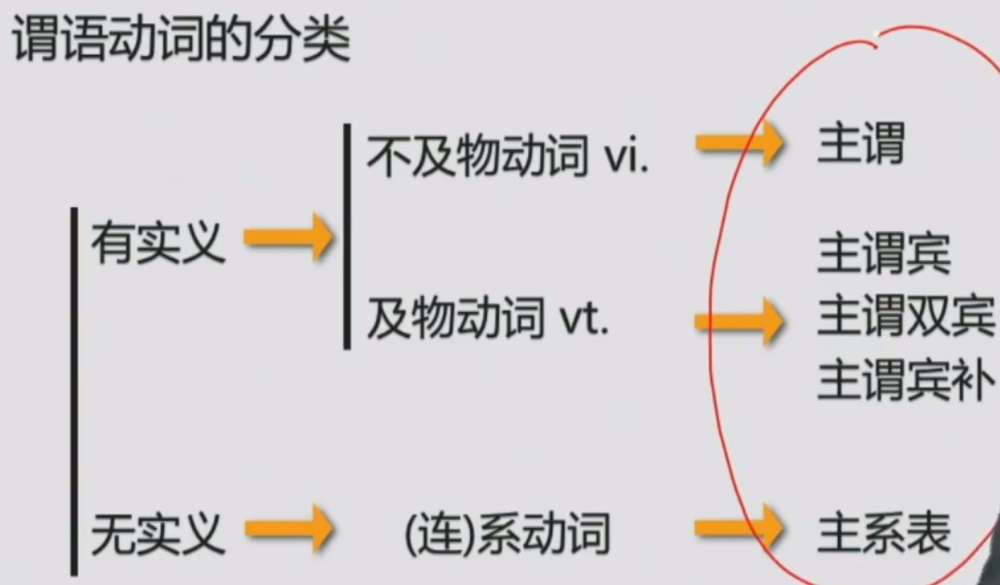
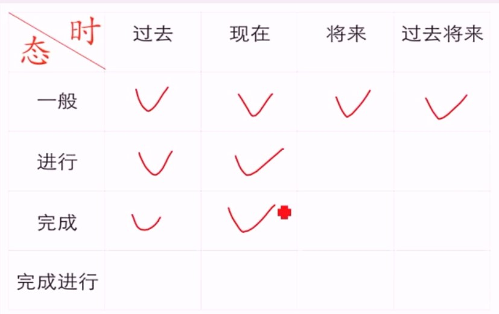
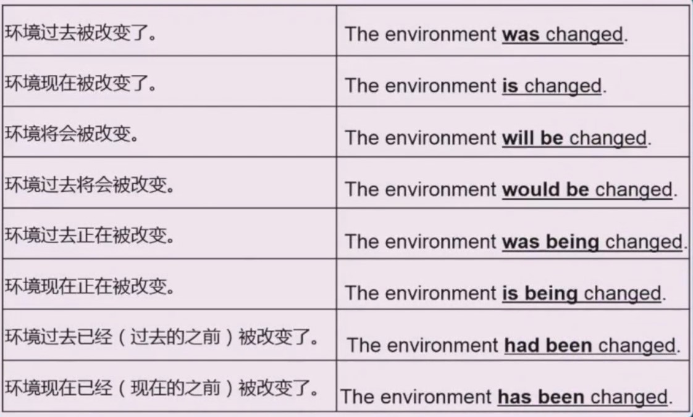
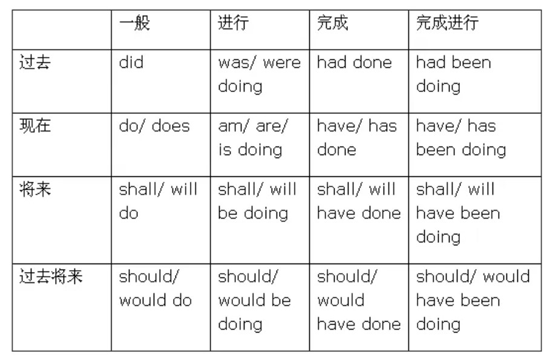
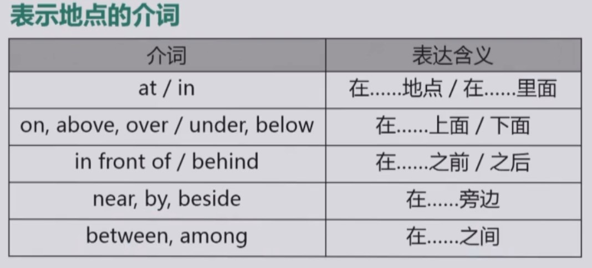
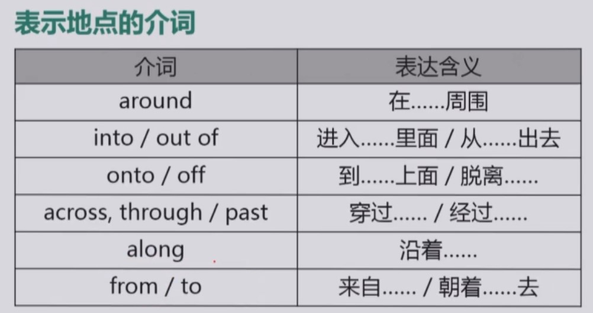
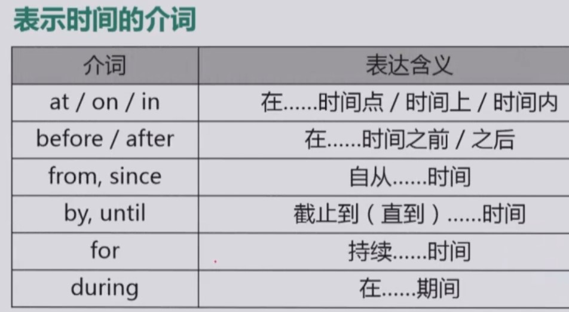
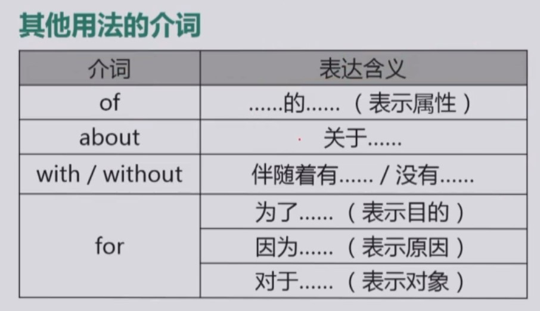
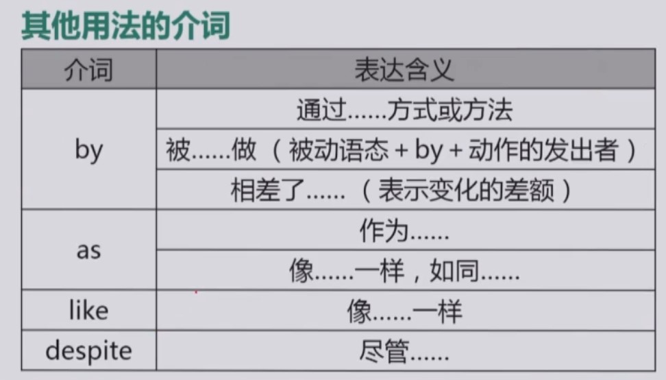

## 简单句的核心构成

表达一件事

n. + v.

主语 + 谓语动词 (古汉语中, 谓表示说话, 所以谓语动词表示说话的内容,即动作到底是什么)

### 谓语动词的分类

#### 不及物动词 vi.

1. 主谓

不涉及到别的物, 因为动词是由主语自己可以独立完成的. 跟别人没关系不涉及别的物

People live.

#### 及物动词 vt.

1. 主谓宾(涉及一个对象)

动词涉及到别的物, 不能由主语独立完成.

I love you.

2. 主谓双宾(涉及多个对象)

I brought you a present.

I brought a present for you.

3. 主谓宾补

如何判断宾补, 在宾语和补之间加个是, 如果凑成个句子就是宾补

I find Honk Kong beautiful

I find Honk Kong 是 beautiful

#### 连系动词(简称系动词)

1. 主系表

I'm very happy

系动词作用: 能帮助辨认主系表结构, 找到主系表就能找到表语, 最终还能找到表语从句

系动词分类:

(1) be 动词(只有单独出现的时候)

I'm a teacher. 就一个动词, 此时是主系表结构

I am teching english 有俩动词, 不是单独的, 所以不是主系表

(2) get become turn go grow

只有在翻译成变得的时候才是系动词

(3) look sound smell taste feel 感官动词

### 总结

:::tip
简单句就是描述一件事的句子, 核心就是名词加动词, 一主搭配一谓, 但是由于谓语动词的不同, 可以把简单句再细分成五类.

1. 主谓
2. 主谓宾
3. 主谓双宾
4. 主谓宾补
5. 主系表

:::

## 简单句的核心变化 - 谓语动词的时态/情态/语态

### 时态

共有 16 种时态

1. 一般过去时

形式: V.过去式(did)

2. 一般现在时

形式: V.原型/V.第三人称单数 (do/does)

3. 一般将来时

形式: will + V 原型 或 am / is / are going to + V 原型

4. 过去将来时

形式: would + V.原型

      was / were going to + V.原型

例句:

    Tony finished his work, and then he would leave for London

5. 过去/现在/将来进行时

形式: be + doing

例句:

    He was preparing for university  他过去正在准备考大学

    Brick by brick, six-year-old Alice is building a magical kingdom.

    A great many candidates will be meeting here at this time tomorrow.

6. 现在完成时

`定义: 截止到现在, 事情完成的结果如何`

形式: have / has + done(这里是过去分词)

例句:

He has finished his homework.

We have learned English since 1998.

7. 现在完成进行时

`定义: 现在的之前正在进行或者持续进行或者反复断断续续进行`

形式: have / has + been doing

例句:

... the global economy has been expanding at a bit over 3% a year.

全球经济现在正在持续扩张以超过 3%的速度

8. 过去完成时

形式: had + done

例句:

When he got there, she had left.

### 语态

主动和被动

被动: be + done(过去分词)

### 情态

略

### 总结

## 简单句的扩展

### 形容词和副词

### 介词 prep.

介词 + 名词 / 代词 / doing = 介词短语

1. 表示地点的介词

2. 表示时间的介词

3. 其他用法的介词

## --------

## 并列句

