## TCP/IP 协议族及 4 层分层

TCP/IP 协议其实是一系列与互联网相关联的协议集合起来的总称, 分层管理是 TCP/IP 协议的重要特征

## TCP/IP 协议族分层

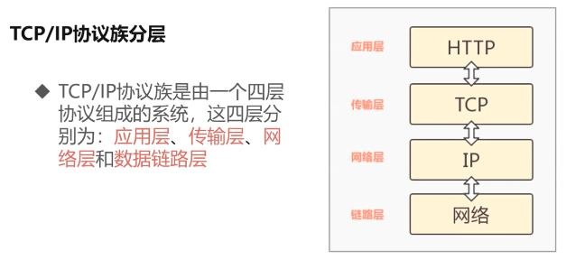

### 应用层

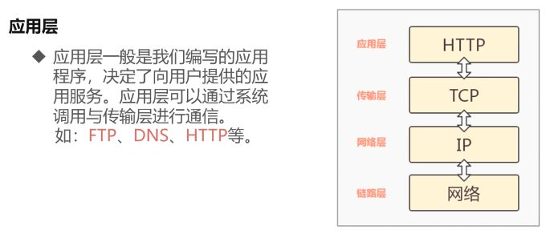

### 传输层

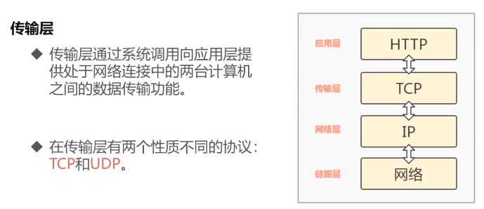

### 网络层

### 链路层

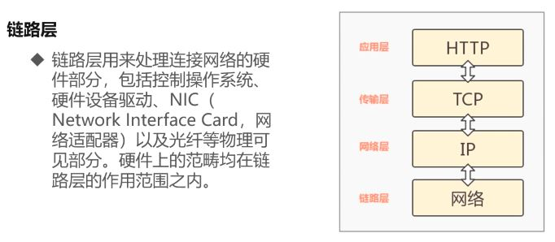

## 数据包的封装过程

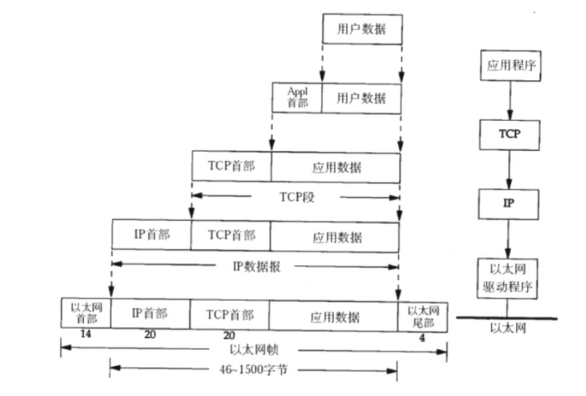

## 传输层-tcp 三次握手

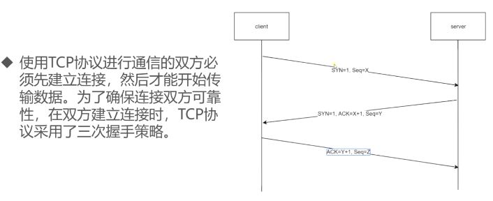

### 第一次握手

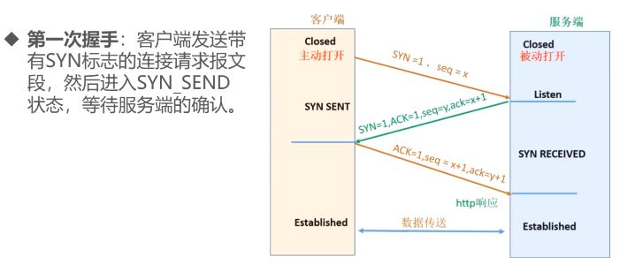

### 第二次握手

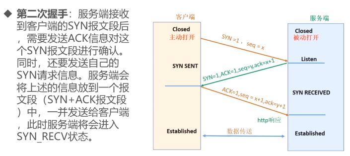

### 第三次握手

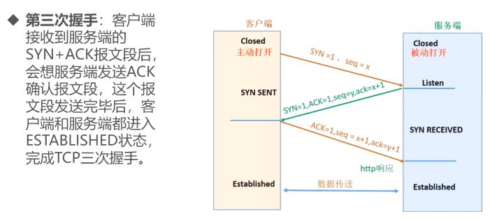

## HTTP 事务处理过程

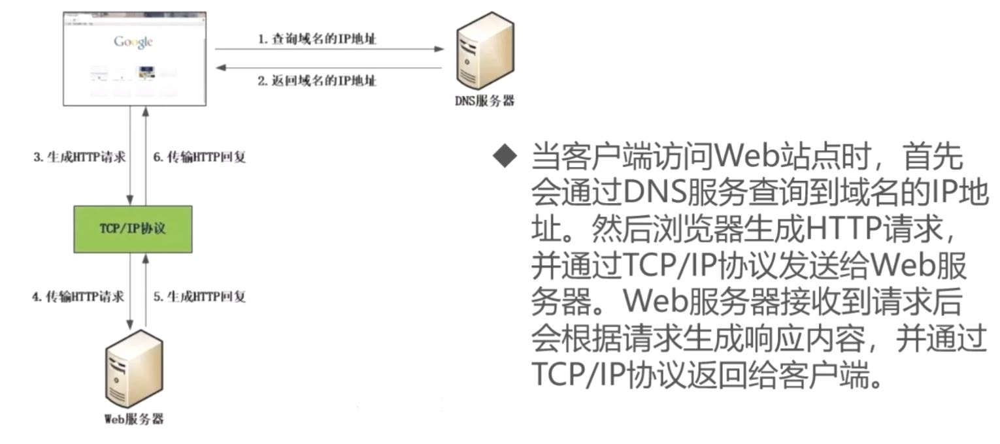

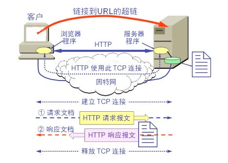

以 winshark 抓包某网站分析三次握手:

首先通过 dns 解析找到 ip 地址, 接下来客户端端口到 80 端口, 也就是 tcp 传输层的三次握手, 接下来访问某 http 请求, 如果下次再访问发现都是很快关闭再次 3 次握手再次获取

## HTTP 协议特点

### 支持客户/服务器模式

客户/服务器模式工作的方式是由客户端向服务器发出请求, 服务器端响应请求, 并进行相应服务

### 简单快速

- 客户向服务器请求服务时, 只需传送请求方法和路径
- 由于 HTTP 协议简单, 使得 HTTP 服务器的程序规模小, 因而通信速度很快

### 灵活

- HTTP 允许传输任意类型的数据对象

- 正在传输的类型由 Content-Type (Content-Type 是由 HTTP 包中用来表示内容类型的标识)加以标记

### 无连接

- 无连接的含义是限制每次连接只处理一个请求
- 服务器处理完客户的请求, 并收到客户的应答后, 即断开连接
- 采用这种方式可以节省传输时间

### 无状态

- HTTP 协议是无状态协议
- 无状态是指协议对于事务处理没有记忆能力, 缺少状态意味着如果后续处理需要前面的信息, 则它必须重传, 这样可能导致每次连接传送的数据量增大
- 另一方面, 在服务器不需要先前信息时它的应答就较快

## URI 与 URL

#### 我们在浏览器地址栏里输入的地址应该叫`URL`还是`URI`?

答案: URI = URL + URN 来自官方标准文档

### URI

URI: 一个紧凑的字符串用来标示抽象或物理资源

URI 可以进一步被分为定位符, 名字或两者都是

术语"Uniform Resource Locator" (URL)是 URI 的子集, 除了确定一个资源, 还提供一种定位该资源的主要访问机制(如其网络"位置")

### URL

URI 可以分为 URL, URN 或同时具备 locators 和 names 特性的一个东西

URN 作用就好像一个人的名字, URL 就像一个人的地址

换句话说: URN 确定了东西的身份, URL 提供了找到它的方式

URI 和 URL 最大的差别是"访问机制"

URN 是唯一标识的一部分, 是身份信息
