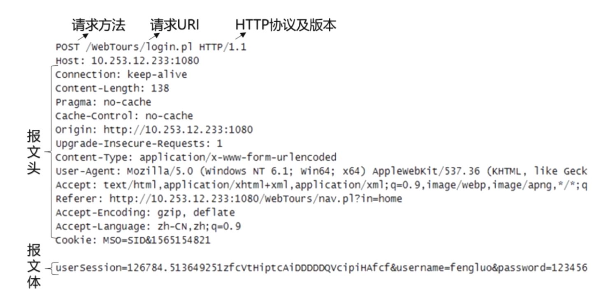
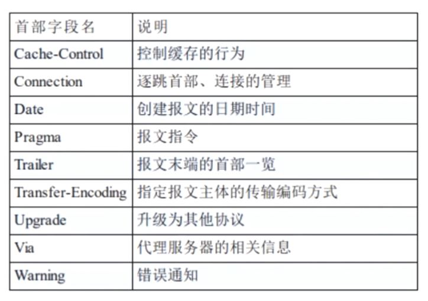
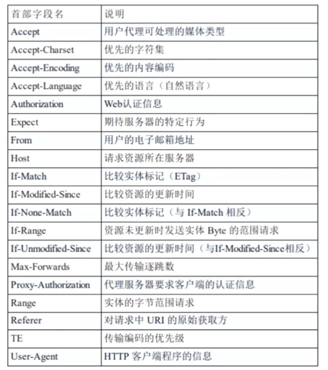
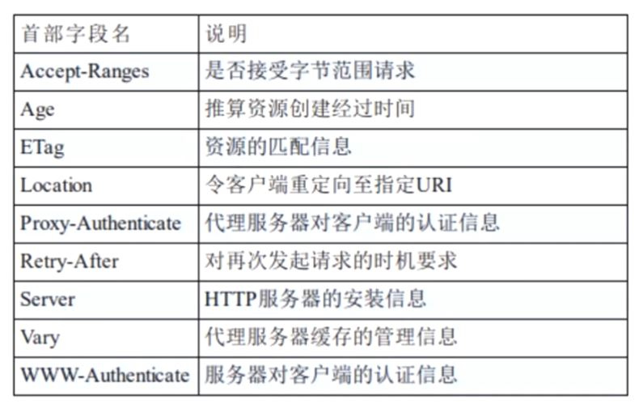
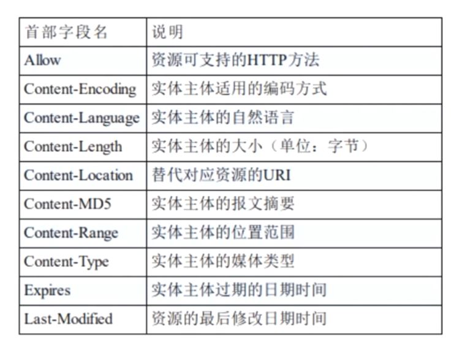
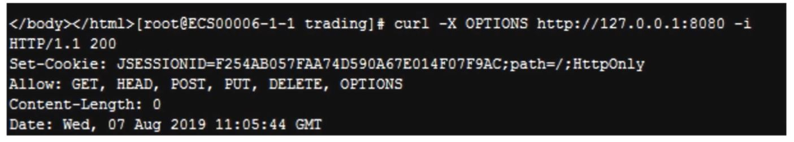
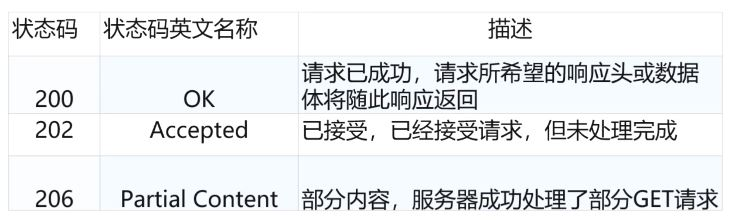

## TCP/IP 协议族及 4 层分层

TCP/IP 协议其实是一系列与互联网相关联的协议集合起来的总称, 分层管理是 TCP/IP 协议的重要特征

## TCP/IP 协议族分层

### 应用层

### 传输层

### 网络层

### 链路层

## 数据包的封装过程

## 传输层-tcp 三次握手

### 第一次握手

### 第二次握手

### 第三次握手

## HTTP 事务处理过程

以 winshark 抓包某网站分析三次握手:

首先通过 dns 解析找到 ip 地址, 接下来客户端端口到 80 端口, 也就是 tcp 传输层的三次握手, 接下来访问某 http 请求, 如果下次再访问发现都是很快关闭再次 3 次握手再次获取

## HTTP 协议特点

### 支持客户/服务器模式

客户/服务器模式工作的方式是由客户端向服务器发出请求, 服务器端响应请求, 并进行相应服务

### 简单快速

- 客户向服务器请求服务时, 只需传送请求方法和路径
- 由于 HTTP 协议简单, 使得 HTTP 服务器的程序规模小, 因而通信速度很快

### 灵活

- HTTP 允许传输任意类型的数据对象

- 正在传输的类型由 Content-Type (Content-Type 是由 HTTP 包中用来表示内容类型的标识)加以标记

### 无连接

- 无连接的含义是限制每次连接只处理一个请求
- 服务器处理完客户的请求, 并收到客户的应答后, 即断开连接
- 采用这种方式可以节省传输时间

### 无状态

- HTTP 协议是无状态协议
- 无状态是指协议对于事务处理没有记忆能力, 缺少状态意味着如果后续处理需要前面的信息, 则它必须重传, 这样可能导致每次连接传送的数据量增大
- 另一方面, 在服务器不需要先前信息时它的应答就较快

## URI 与 URL

#### 我们在浏览器地址栏里输入的地址应该叫`URL`还是`URI`?

答案: URI = URL + URN 来自官方标准文档

### URI

URI: 一个紧凑的字符串用来标示抽象或物理资源

URI 可以进一步被分为定位符, 名字或两者都是

术语"Uniform Resource Locator" (URL)是 URI 的子集, 除了确定一个资源, 还提供一种定位该资源的主要访问机制(如其网络"位置")

### URL

URI 可以分为 URL, URN 或同时具备 locators 和 names 特性的一个东西

URN 作用就好像一个人的名字, URL 就像一个人的地址

换句话说: URN 确定了东西的身份, URL 提供了找到它的方式

URI 和 URL 最大的差别是"访问机制"

URN 是唯一标识的一部分, 是身份信息

## HTTP 报文结构分析

### HTTP 报文头

- HTTP 的报文头大体可以分为四类, 分别是:

  - 通用报文头
  - 请求报文头
  - 响应报文头
  - 实体报文头

- HTTP/1.1 里一共规范了 47 种报文头字段

#### 通用报文头

可以在请求头和响应头中使用

#### 请求报文头

- Accept 作用: 浏览器端可以接受的媒体类型

Accept: text/html 代表浏览器可以接受服务器回发的类型为 text/html 也就是我们常说的 html 文档, 如果服务器无法返回 text/html 类型的数据, 服务器应该返回一个 406 错误(Non Acceptable). 现在多数是 `Accept: */*` 代表浏览器可以处理所有类型

如果想要给显示的媒体类型增加优先级, 则使用 q= 来额外表示权重值; 重值 q 的范围是 0 - 1(可精确到小数点后三位), 1 为最大值, 不指定权重 q 值时, 默认权重为 q=1.0. 当服务器提供多种内容时, 将会首先返回权重值最高的媒体类型.

- Accept-Encoding

作用: 浏览器申明自己接收的编码方法, 通常指定压缩方法, 是否支持压缩, 支持什么压缩方法(gzip, deflate)

Accept-Encoding: gzip, deflate

- Accept-Language

作用: 浏览器申明自己接收的语言

Accept-Language: zh-cn, zh; q=0.7, en-us, en;q=0.3

客户端再服务器有中文版资源的情况下, 会请求其返回中文版对应的相应, 没有中文版时, 则请求返回英文版响应

- Connection

Connention: keep-alive 当一个网页打开完成后, 客户端和服务器之间用于传输 HTTP 数据的 TCP 连接不会关闭, 如果客户端再次访问这个服务器上的网页, 会继续使用这一条已经建立的连接. 节省 3 次握手的浪费

Connention: close 代表一个 Request 完成后, 客户端和服务器之间用于传输 HTTP 数据的 TCP 连接会关闭, 当客户端再次发送 Request, 需要重新建立 Tcp 连接

- Host

作用: 请求报头域主要用于指定被请求资源的 Internet 主机和端口号, 它通常从 HTTP URL 中提取出来的

我们在浏览器中输入: http://www.xxx.com:8080

浏览器发送的请求消息中, 就会包含 Host 请求报头域, 如下: Host: www.xxx.com:8080

- Referer

当浏览器向 web 服务器发送请求的时候, 一般会带上 Referer, 告诉服务器我是从哪个页面链接过来的, 服务器籍此可以获得一些信息用于处理

- User-Agent

作用: 告诉 HTTP 服务器, 客户端使用的操作系统和浏览器的名称和版本

- Content-Type

作用: 说明了报文体内对象的媒体类型

text/html

image/xxx

application/xxx

#### 响应报文头

#### 实体报文头

## HTTP 请求方法剖析

HTTP/1.1 常用方法

1. get
2. post
3. put
4. head
5. delete
6. options
7. trace
8. connect

### head

类似于 get 请求, 只不过返回的响应中没有具体的内容, 用于获取报头

多用来测试连接能不能访问, 最近是否有更新

### delete

请求服务器删除指定的资源

### options

用来查询针对请求 URI 指定的资源支持的方法

### trace/connect

回显服务器收到的请求, 主要用于测试或诊断

### connect

开启一个客户端与所请求资源之间的双向沟通的通道, 它可以用来创建隧道

## 状态码

是用以表示网页服务器超文本传输协议响应状态的3位数字代码

### 常用状态码

