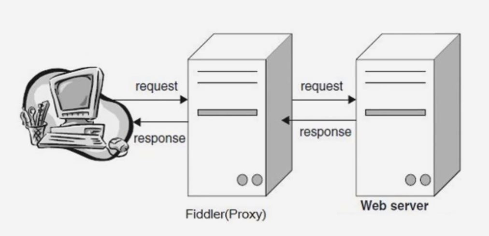

## 常见编码规范

- ASCII

  - 可表示阿拉伯数字和英文字母及一些简单符号, 只需要 1 个字节存储, 使用地址对应的二进制数表示

- GBK

  - 汉字扩展规范, 支持全部中日韩汉字, GBK 字符集所有的字符都占 2 个字节, 无论中文还是英文都占两个字节, 没有特殊编码方式

- ISO-8859-1

  - 它收录的字符是除了 ASCII 码收录的字符外, 还包括西欧, 泰, 阿拉伯, 希伯来等等对应的文字符号, 因为这种编码范围使用了单字节内的所有空间, 所以在支持它的系统中传输和存储其他的任何编码的字节流都不被抛弃, 换言之把其他任何编码当做 ISO-8859-1 进行解码时都能解开, Mysql 数据库默认编码叫做 Lating1, 那个默认编码就是利用了 ISO-8859-1 的特性. 它只占 1 个字节. 但是该编码不支持中文. 有时屏幕上的乱码就是因为利用它来进行解码的

- Unicode

  - 由上面可见各编码不兼容, 所以国际标准化组织决定制定一套通用规范, 也就是 Unicode. 要区分每个字符, 每个字符都需要 4 个字节, 这是十分浪费存储空间的, 于是程序员设计出来几种编码方式, 比如 UTF-8 , UTF-16 , UTF-32 等. Utf-8 是一种变长字符编码, 注意 UTF-8 不是编码规范, 而是一种方式, UTF-8 的优势在于, 对于只需要 1 个字节的字符, utf-8 采用 ascii 编码方式, 最多可以用 4 个字节, 32 位二进制数字来表示, 通常用的英文都是 1 个字节, 而中文都是 3 个字节, 所以在中文 utf-8 没有 gbk 编码占的空间小, 但是它胜在面向全世界

### 乱码的由来

- 解码过程:

  - 一串二进制数字, 使用一种编码方式转换成字符, 这个过程称之为解码. 程序员可以使用任意方式来解码, 但往往只有某种方式可以正确解码

- 编码过程:

  - 解码的相反过程, 编码也可能产生乱码, 一串已经解码后的字符可以选择任意类型编码方式重新转换成一串二进制数, 也可以称之为加密过程. 无论哪一种方式都是产生计算机可识别的二进制数, 但是如果编码规范的字符表里不包含目标字符,就无法在字符集中找到对应的二进制数, 就导致乱码. 比如 ISO-8859-1 它的字符表里不包含中文, 所以哪怕使用 ISO-8859-1 将中文字符进行编码, 再使用 ISO-8859-1 进行解码, 也无法显示出正确字符

- 所以乱码就是使用的编码和解码方式不一致, 或者编码的时候它的字符表里不包含相应字符导致的.

### URL 的编码与解码

- URL 是使用 ASCII 字符集进行编码的, 所以如果 URL 中含有非 ASCII 字符集中的字符, 要对它进行编码.

- 还有 URL 中好多字符是保留字, 如"&"表示参数分隔符, 如果想要在 URL 中使用这些保留字, 那就需要编码.

- 对 URL 中属于 ASCII 字符集的非保留字不做编码; 对 URL 中的保留字需要取其 ASCII 内码, 然后加上"%" 前缀将该字符进行编码; 对于 URL 中的非 ASCII 字符需要取其 Unicode 内码, 然后加上"%"前缀将该字符进行编码.

## 身份认证

### 身份认证信息

- 密码
- 动态令牌
- 数字证书
- 生物认证
- IC 卡等

### 常见认证方式

- BASIC 认证(基本认证)
- DIGEST(摘要认证)
- SSL 客户端认证
- FormBase 认证(基于表单认证)

### BASIC 认证(基本认证)

### DIGEST(摘要认证)

为弥补 BASIC 认证存在的弱点, 从 HTTP/1.1 起就有了 DIGEST 认证

DIGEST 认证同样使用质询/响应的方式, 但不会像 BASIC 认证那样直接发送明文密码

### SSL 客户端认证

SSL 客户端认证是借由 HTTPS 的客户端证书完成认证的方式. 凭借客户端证书认证, 服务器可确认访问是否来自己登录的客户端.

### FormBase 认证(基于表单认证)

基于表单的认证方法并不是在 HTTP 协议中定义的.

使用由 Web 应用程序各自实现基于表单的认证方式. 通过 cookie 和 session 的方式来保持用户的状态

## HTTP 的长链接与短连接

HTTP 协议是基于请求/响应模式的, 因此只要服务端给了响应, 本次 HTTP 请求就结束了

HTTP 协议是属于应用层协议在传输层使用的是 TCP 协议, 在网络层使用的是 IP 协议. Ip 协议解决了路由和寻址, tcp 协议解决的是如何在 ip 层之上可靠的传递数据包. 使在网络另一端收到发出的包顺序一致, 之所以说 HTTPC 长链接和短连接本质上是 TCP 长连接和短连接

TCP 连接是一个双向通道, 可以保持一段时间不关闭. 因此 TCP 连接才有长链接和短连接这么一说, 形象的例子, http 协议指快递单, 填的单子像发了一个 http 请求, 货物运到地方, 快递员根据单子发给收货人, tcp 协议就是中间运货的大货车, 它是负责运输的, 公路相当于 tcp 连接, 一个双向的通道.

### 短连接

HTTP/1.0 中, 默认使用的是短连接, 也就是说, 浏览器和服务器每进行一次 HTTP 操作, 就建立一次连接, 结束就中断. 如果客户端浏览器访问某个 html 或其他类型 web 页, 包含有其他 web 资源, 比如有 js 文件, 图像, css, 浏览器每遇到一个资源, 就建立一个会话

HTTP/1.1 起, 默认使用长连接, 用以保持连接特性. 比如 F12 中 Response Headers 的 Connection: keep-alive. 需要客户端和服务端都支持

## HTTP 中介之代理

### 典型的代理服务器

它使用代理地址比如 127.0.0.1:8888, 当 fiddler 退出的时候, 自动注销代理. 打开的时候自动启用代理, 不会影响别的程序.

## HTTP 中介之网关

网关可以作为某种翻译器使用, 它抽象出了一种能够到达资源的方法. 网关是资源和应用程序之间的粘合剂.

网关扮演的是"协议转换器"的角色

代理连接的是两个或多个使用相同协议的应用程序, 而网关连接的 是不同协议的端点, 所以网关扮演的是协议转换器的角色. 网关可以向数据库发送查询数据, 邮件, 或者生成动态内容, 比如像一个门, 进去一个请求, 出来一个响应.

### 网关的两种分类

Web 网关在一侧使用 HTTP 协议, 在另一侧使用另一种协议. `<客户端协议>/<服务器端协议>`

- (HTTP/) 服务器端网关: 通过 HTTP 协议与 客户端对话, 通过其他协议与服务器通信.

- (/HTTP) 客户端网关: 通过其他协议与客户端对话, 通过 HTTP 协议与服务器通信

## HTTP 缓存

### 缓存头部字段

#### Cache-Control

请求/响应头, 缓存控制字段

- no-store: 所有内容都不缓存
- no-cache: 缓存, 但是浏览器使用缓存前, 都会请求服务器判断缓存资源是否是最新
- max-age=x(单位秒): 请求缓存后的 X 秒不再发起请求
- s-maxage=x(单位秒): 代理服务器请求源站缓存后的 X 秒不再发起请求, 只对 CDN 缓存有效
- public 客户端和代理服务器 CDN 都可缓存
- private 只有客户端可以缓存

#### Expires

响应头, 代表资源过期时间, 由服务器返回提供, 是 http1.0 的属性, 在与 max-age 共存的情况下, 比 max-age 优先级要低.

#### Last-Modified

响应头, 刷新资源最新修改时间, 由服务器告诉浏览器

#### if-Modified-Since

请求头, 资源最新修改时间, 由浏览器告诉服务器, 和 Last-modified 是一对, 它俩进行对比

#### Etag

响应头, 资源标识, 由服务器告诉浏览器

#### if-None-Match

请求头, 缓存资源标识, 由浏览器告诉服务器(其实就是上次服务器给的 Etag), 和 Etag 是一对, 它俩进行对比

场景一:

让服务器与浏览器约定一个文件过期时间-Expires

场景二:

让服务器与浏览器在约定文件过期时间的基础上, 再加一个文件最新修改时间的对比 -- Last-Modified 与 if-Modified-Since

场景三:

让服务器与浏览器在过期时间 Expires + Last-Modified 的基础上, 增加一个文件内容唯一对比标记 - Etag 与 If-None-Match. Expires 不稳定, 再加入一个 max-age 来代替

### 缓存改进方案

#### md5/hash 缓存

通过不缓存 html, 为静态文件添加 md5 或者 hash 标识, 解决浏览器无法跳过缓存过期时间主动感知文件变化的问题

#### cdn 缓存

### 浏览器操作对 HTTP 缓存的影响

## 内容协商机制

指客户端和服务器端就响应的资源内容进行交涉, 然后提供给客户端最为合适的资源. 内容协商会以响应资源的语言, 字符集, 编码方式等作为判断的基准

### 内容协商方式

- 客户端驱动

  - 客户端发起请求, 服务器发送可选项列表, 客户端做出选择后再发送第二次请求

- 服务端驱动

  - 服务器检查客户端的请求头部集并决定提供哪个版本的页面

- 透明协商

  - 某个中间设备(通常是缓存代理)代表客户端进行协商

### 服务器驱动内容协商 - 请求首部集

#### Accept