## 回顾 HTTP 及 HTTPS

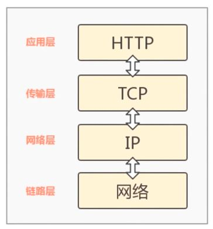

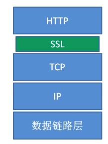

### 网络耗时

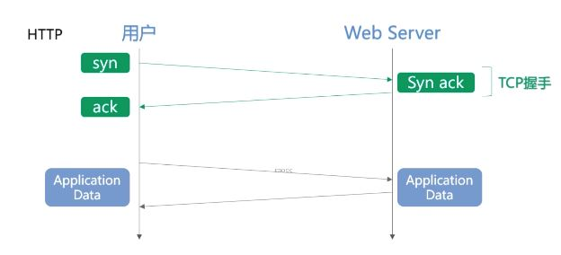

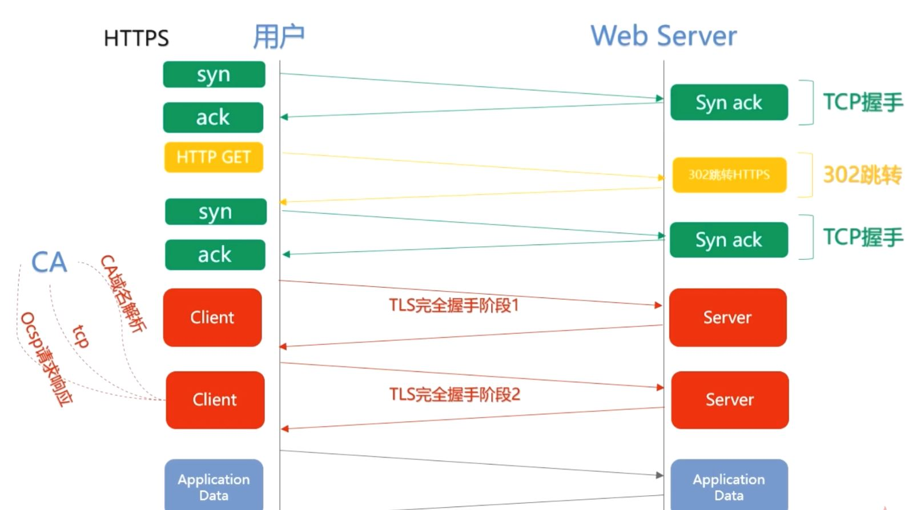

## 从 HTTP 到 HTTPS 设计属于自己的安全请求服务

```shell
1. 制作证书

keytool -genkey -v alias tomcat -keyalg RSA -keystore /usr/java/apache-tomcat-9.0.16/tomcatkey/tomcat.keystore -validity 36500 -sigalg SHA256withRSA

TODO...
```

## WebSocket 与 HTTP

WebSocket 是新协议作为 HTTP 协议的补充

### WebSocket 的握手

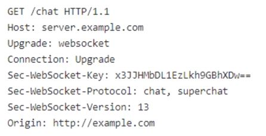

Upgrade: websocket 与 Connection: Upgrade, 这两个告诉 nginx 或者 apache, 我发起的是 Websocket 协议, 快来帮我找对应的处理, 不是 http 协议了.

从 ajax 轮询或 long pull 升级到 Websocket 之后, 在服务端有信息时可以主动推送. 只需要进行一次请求. 这种可以称为回调, 也就是说有信息来通知, 而不是每次客户端去询问, 解决了同步有延迟而且耗费资源的情况, 为什么能解决消耗资源的问题? 因为所用的程序经过两层代理, http 协议在 nginx 等服务器解析之下, 然后再传送给相应的 handler 来处理.

### WebSocket 的特点

1. 真正的全双工方式

- 建立连接之后, 客户端和服务端完全平等. 可以互相主动请求.

2. 减少通信量

- 而 HTTP 的长连接, 是传统的客户端对服务端发请求的模式. http 的这种长连接中, 每次数据交换除了真正的数据部分外, 还需要交换大量的 http header , 头部和首部有一些多余. 所以 websocket 能减少一些通信量. 这些需要服务器和客户端都进行升级才能实现, 比如 html5

3. 多路复用

- 不同的 url 可以复用同一个 websocket 连接等等功能特点.

以上都是 http 协议自身不能做到的. websocket 使得客户端和服务器之间的数据交换变得更加简单了, 允许服务器向客户端来推送数据, 在 websocket api 中浏览器和服务器只需要完成一次握手, 两者就可创建持久性连接.

## HTTP2.0

### HTTP2.0 性能增强的核心: 二进制分帧

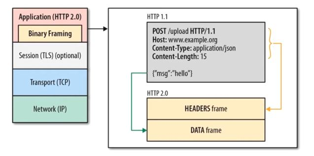

在应用层 http2.0 和传输层 tcp 之间增加了二进制分帧层, 在这个分帧层上 http2.0 将所有的传输信息分割成更小的消息和帧, 并且对他们采用二进制格式编码. 原来在 Http1.x 的请求里,它里面的首部消息会被封装到 headers frame (headers 帧), 而图上这种原来在 http1.1 的 request body(msg: hello) 的内容被封装到 data 帧, http2.0 的通信都在一个连接上完成, 这个连接可以承载任意数量的双向流. 相应的每个数据流都以消息的形式发送, 而消息由一个或多个帧组成, 这些帧可以乱序发送, 再根据每个帧首部的流标识符重新组装

### HTTP2.0 性能增强的核心: 首部压缩

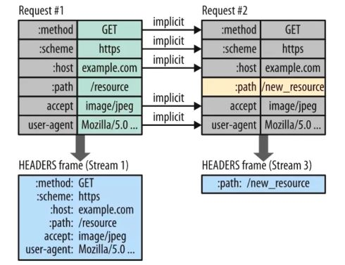

用新的首部表来跟踪和存储之前发送的键值对, 对于相同的数据不再通过每次请求和响应发送.

### 并行双向字节流的请求和响应

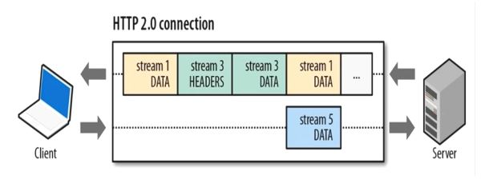

乱序发送, 另一端重新组装

### 请求优先级

高优先级的流都应该优先发送, 优先级不是绝对的, 因为如果绝对的话可能导致首部阻塞, 不同优先级的混合也是必须的

### 服务器推送

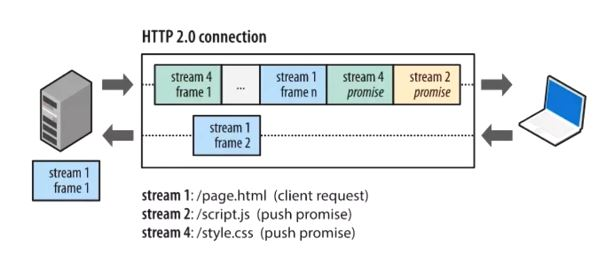

服务器可以对 1 个客户端请求发送多个响应, 换句话说除了对最初请求的响应之外, 服务器还可以额外推送其他资源, 当浏览器请求 1 个 html 的时候, 服务器其实大概知道接下来请求资源, 而不需要等待浏览器得到 html 之后, 解析页面再发送资源请求, 有了这 2.0 的服务器推送, 就会更加高效, 因为客户端还可以缓存起来, 由不同页面共享.

## WebDAV 协议

它也是 http 的扩展协议

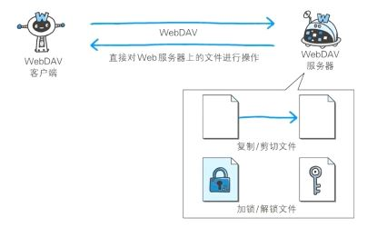

传统上网盘很多文件放在服务器上, 需要的时候下载到本地, 在网盘的发展过程中, 存在一种场景, 在线打开编辑, 不需要下载到本地, 直接映射. 这里就使用的 webdav 协议

除了传统的复制, 还有文件编辑过程中的加锁, 禁止其他用户等.

## HTTP3.0

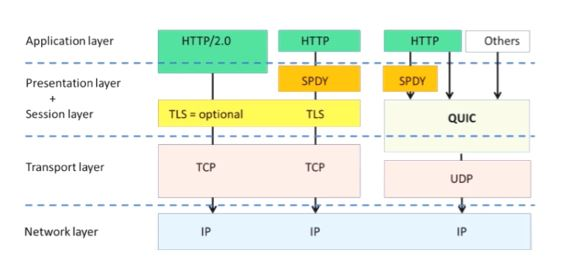

基于 UDP 的传输协议

### HTTP2.0 的问题

- 队头阻塞

  - 当连接中出现丢包情况, http2 的表现反而不如 http1 的情况, 因为出现丢包的情况下, 整个 tcp 都要等待重传, 导致后面所有数据都被阻塞住了. 但是对于 http1.1 来说, 是开启了多个 tcp 连接, 出现丢包反而只会影响其中一个 tcp 连接.

- 建立连接的握手延迟大
  - 不管是 http1.0 , 1.1 还是 https http2 都是使用的 tcp 进行传输, 那 https 还需要使用 TLS 协议进行安全传输, 这就出现了两个握手延迟

因此 QUIC 使用了 udp 协议

### QUIC 的特性

- 0 RTT 没有队头阻塞的多路复用

  - 传统的 tcp 三次握手需要 1 个到 2 个 rtt 传输 http 数据, 如果是基于 tcp 的 https 建立 1 次连接至少需要 2 个到 3 个 rtt, 而 QUIC 基于 udp, 完整握手只需要 1 个 rtt, 甚至是 0 个 rtt, 甚至在大部分情况下, 只需要 0 个 rtt 就能建立数据发送, 显著降低延迟. 所以优势对比 http2.0 没有队头阻塞的多路复用.
    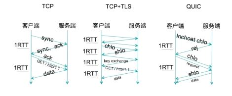

- TODO...

## Web 安全

### Web 应用的概念

web 应用是由动态脚本, 编译过的代码等组合而成, 它通常架设在 web 服务器上, 用户在 web 浏览器上发送请求, 这些请求使用 http 协议, 由 web 应用和企业后台数据库及其他动态内容通信

### Web 应用三层架构

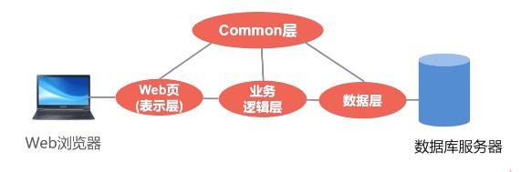

表示层用来发起 http 协议, 一旦 web 安全出现漏洞, 就会在发起 http 请求的过程中某些参数和内容发生错误, 这就是 web 安全的由来

### 验证机制概述

验证机制是 web 应用程序中最简单的一种安全机制

一般来说, 应用程序必须核实用户提交的用户名和密码是否正确. 验证机制是应用程序防御恶意攻击的核心机制

它处在安全防御的最前沿, 如果被轻易突破, 通常应用程序的全部功能, 数据都会被其控制, 缺乏安全有效的验证机制, 其他核心安全机制都无法实施.(会话管理和访问控制)

### 典型身份验证模式讨论

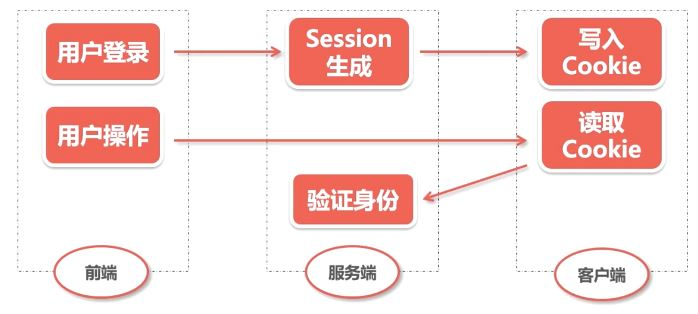

- 基于 HTML 表单的验证
- 多元机制, 如组合型密码
- 客户端 ssl 证书

常见漏洞:

- 弱密码
- 暴力破解

安全措施:

- 验证码
- cookie 和会话检测
- 双因子认证

### XSS 攻击原理

它允许恶意 web 用户将代码植入到提供给其他用户使用的页面中, 其他用户在观看网页时, 恶意脚本就会执行. 这类攻击通常通过注入 HTML 或 js 等脚本发动攻击, 攻击成功后攻击者可以得到私密网页内容和 cookie 等

XSS 分类:

1. 反射式 xss
2. 存储式 xss
3. 基于 dom 的 xss

#### 反射式 xss

也称为非永久性 xss, 是目前最流行的 xss 攻击

它出现在服务器直接使用客户端提交的数据, 如 url 的数据, html 表单中提交数据等, 并且没有对数据进行无害化处理

如果提交的数据中含有 HTML 控制字符而没有被正确处理, 那么一个简单的 xss 攻击就会发生

典型的反射式攻击可通过一个邮件或中间网站, 诱饵是一个看起来可信任的站点的链接, 其中包含 xss 攻击脚本

如果信任的网站没有正确处理这个脚本, 用户点击后就会导致浏览器执行含有恶意攻击的脚本

`例子:`

- 首先, input 的值可以用任何返回给浏览器的数据替代

- 其次, 无论服务器应用程序如何处理这些数据, 都无法阻止提交 js 代码, 一旦该页面显示, 这些代码就会执行

#### 存储式 xss

也称为永久性 xss, 危害更大

将攻击脚本上传到 web 服务器上, 使得所有访问该页面的用户都面临信息泄露的可能, 其中也包括了 web 服务器的管理员

存储式 xss 多发生在最终显示给其他用户的位置包含:

- 个人信息字段, 如姓名, 地址, 电子邮件, 电话等
- 文档, 上传文件及其他数据的名称
- 提交给应用程序管理员的反馈或问题
- 向其他应用程序用户传递的消息, 注释, 问题等
- 在用户之间共享的上传文件内容

#### 基于 DOM 的 xss 攻击

反射式 xss 攻击和存储式 xss 攻击都是通过服务器端提取用户提交的数据, 并且以不安全的方式将其返回给用户, 基于 dom 的攻击仅仅通过 js 的方式执行.

也就是说这种攻击常发生在应用程序每次返回相同的静态 html, 而通过客户端 js 动态生成信息, 并不会跟服务端交互获取的

### xss 攻击载荷

1. 会话令牌

- xss 攻击最普遍的方式
  - 截取一名受害者的会话令牌, 劫持他的会话, 进而作为受害者身份来使用应用程序, 执行任意操作并占有该用户的账户

2. 虚拟置换

- 这种攻击需要在一个 web 应用程序页面注入恶意数据, 从而向应用程序的用户传送误导性信息, 包括简单的向站点注入 html, 或者使用脚本注入精心设计的内容, 比如钓鱼网站

3. 注入木马

### xss 防御措施

1. 输入验证

- 如果应用程序在某个位置收到的用户提交的数据将来有可能被复制到它的响应中, 应用程序应根据这种情形对这些数据执行尽可能严格的确认

2. 输出编码

- 转义

### CSRF

Cross-site Request Forgery 跨站请求伪造, 也被称为"one click attack" 或者 session riding, 通常缩写为 CSRF 或者 XSRF, 是一种对网站的恶意利用

XSS 利用站点内的信任用户(受害者), 而 csrf 通过伪装来自受信任用户的请求来利用受信任的网站.

他的攻击方式通过社会工程学的手段(如通过电子邮件发送一个链接)来蛊惑受害者进行一些敏感性的操作, 如修改密码, 修改 E-mail, 转账等, 而受害者还不知道他已经中招

#### CSRF 攻击危害

CSRF 的破坏力依赖于`受害者的权限`, 如果受害者只是个`普通的用户`, 则一个成功的 CSRF 攻击会危害用户的数据以及一些功能, 而`管理员的用户`, 则会危害范围更大

与 XSS 攻击相比, CSRF 的攻击往往不太流行(因此对其进行防范的)

#### 典型的 csrf 攻击传递

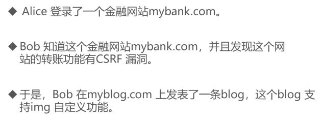

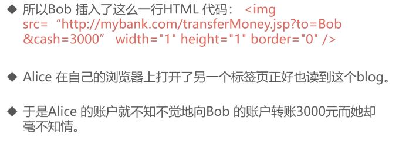

#### 攻击过程深度剖析

1. web 浏览器对于 cookie 和 http 身份验证信息之类的会话信息的处理方式:

- 目前, 浏览器会自动地发送标识用户对话的信息, 而无须用户干预

- 主要是被站点作为用户会话的标志, 即如果站点收到了带有受害者的 cookie 的请求, 那么它就会把这个请求看作是已登录的受害者发来的.

- 一般情况下, 浏览器收到站点设置的 cookie 之后, 每当向该站点发送请求的时候, 浏览器都会"自动地"连同该 cookie 一起发出.

2. 应用程序赖以管理会话的信息对浏览器的透明性问题

- 为了提高 web 应用的便利性, 用来管理会话的信息, 如 cookie 或者基于 http 的身份验证(如 http 基本认证, 非基于表单的 z 认证) 等敏感信息, 都是由浏览器来存放的, 并在每当向需要身份验证的应用程序发送请求时自动捎带上

### CSRF 攻击预防

1. 增加一些确认操作

- 比如说转账功能, 当用户调用 api 进行转账的时候, 弹出一个对话框, 让用户确认

2. 重新认证

- 在做敏感操作的时候, 要求用户重新输入密码进行二次验证

3. 使用 token

- 在用户刚登录的时候, 产生一个新的不可预知的 csrf token, 并且把此 token 存放在用户的 session 中.
- 在任何一个需要保护的表单中, 增加一个隐藏的字段来存放这个 token
- 对于需要保护的 url, 增加一个参数来存放此 token, 提交此请求的时候, 在服务器端检查提交的 token 与用户 session 中的 token 是否一致, 如果一致, 继续处理请求, 否则返回错误信息
- 在用户退出或者 session 过期的时候, 用户信息(包括 csrf token)从 session 中移除并且销毁 session
