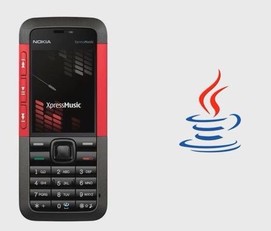
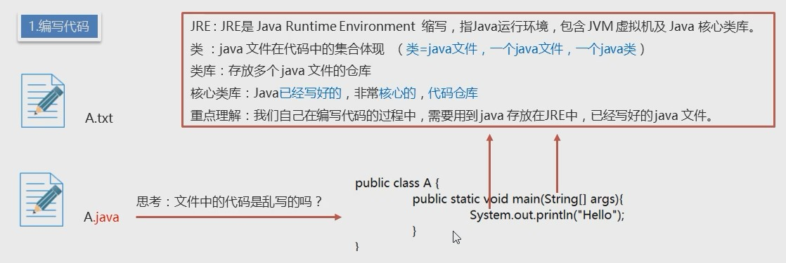
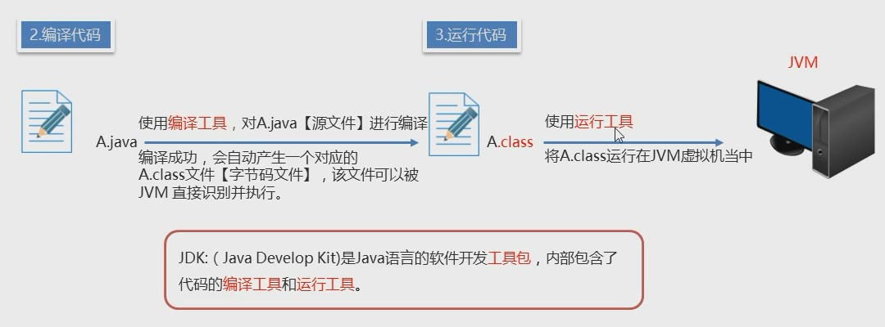
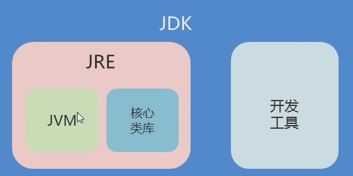

## Java 语言背景介绍

### Java SE

Java 语言的(标准版), 用于**桌面应用**的开发, 是其他两个版本的基础

### Java ME

Java 语言的(小型版), 用于嵌入式消费类电子设备

市面上这种需求已被安卓和 ios 开发取代

### Java EE

Java 语言的(企业版), 用于 web 方向的网站开发

## Java 跨平台原理

### 平台与跨平台

平台: 指的是操作系统

- windows
- Mac
- linux

跨平台: Java 程序可以在任意操作系统上执行. 对比.Net 只能存在于 windows 操作系统

### 跨平台原理

这里的翻译就是 JVM 虚拟机. 在不同操作系统中, 都安装一个与操作系统对应的 java 虚拟机(JVM Java Virtual Machine)即可

**JVM 本身是否可以跨平台?**: 不可以, 允许跨平台的是 Java 程序

## JRE, JDK, JVM

### JRE, JDK, JVM 的作用

首先开发一个 java 程序, 需要三个步骤: 编写代码, 编译代码, 运行代码

1. 编写代码过程中, 需要使用JRE中Java已经写好的代码

2. 编译代码过程中, 需要使用JDK中的翻译工具

3. 运行代码过程中, 需要使用JDK中的运行工具

4. 代码需要运行在JVM虚拟机中.

### JRE, JDK, JVM 的关系

