## Java 语言背景介绍

### Java SE

Java 语言的(标准版), 用于**桌面应用**的开发, 是其他两个版本的基础

### Java ME

Java 语言的(小型版), 用于嵌入式消费类电子设备


市面上这种需求已被安卓和 ios 开发取代

### Java EE

Java 语言的(企业版), 用于 web 方向的网站开发

## Java 跨平台原理

### 平台与跨平台

平台: 指的是操作系统

- windows
- Mac
- linux

跨平台: Java 程序可以在任意操作系统上执行. 对比.Net 只能存在于 windows 操作系统

### 跨平台原理


这里的翻译就是 JVM 虚拟机. 在不同操作系统中, 都安装一个与操作系统对应的 java 虚拟机(JVM Java Virtual Machine)即可

**JVM 本身是否可以跨平台?**: 不可以, 允许跨平台的是 Java 程序

### 高级语言的编译运行方式

#### 编译型

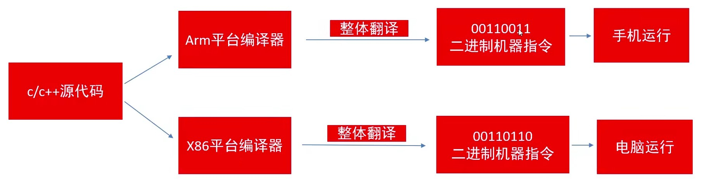

#### 解释型

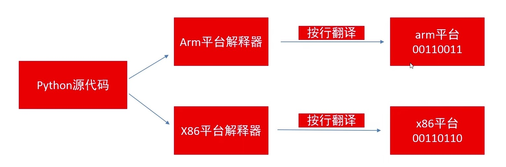

#### 混合型

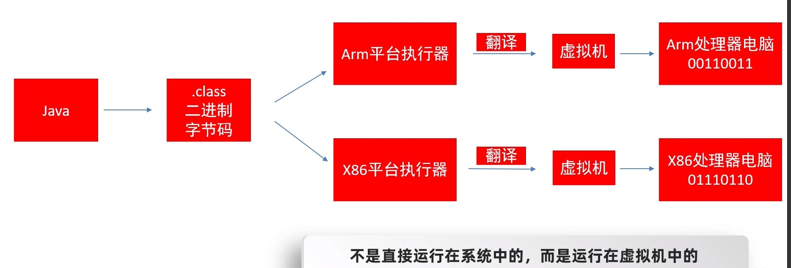

## JRE, JDK, JVM

### JRE, JDK, JVM 的作用

首先开发一个 java 程序, 需要三个步骤: 编写代码, 编译代码, 运行代码


1. 编写代码过程中, 需要使用 JRE 中 Java 已经写好的代码

2. 编译代码过程中, 需要使用 JDK 中的翻译工具

3. 运行代码过程中, 需要使用 JDK 中的运行工具

4. 代码需要运行在 JVM 虚拟机中.

### JRE, JDK, JVM 的关系


## Java 版本节点图

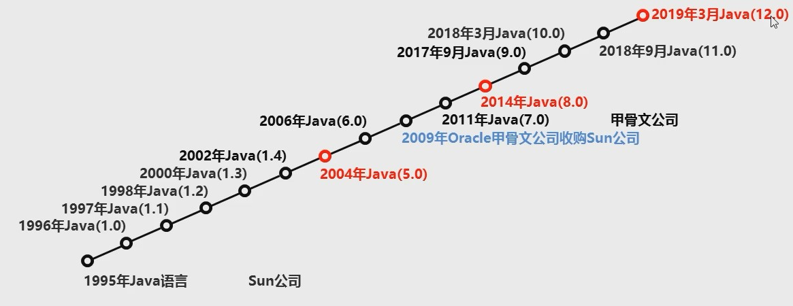

## 从零编写一个 HelloWorld

```js
// A.class

class A {

}

// 执行java A.class
// 会报错: 在类A中找不到main方法, 请将main方法定义为: public static void main(String[] args)
// main方法就是运行时的入口文件, 改写成如下

class A {
  public static void main(String[] args) {}
}

// 此时再执行不错了继续改写
class A {
  public static void main(String[] args) {
		System.out.println("Hello, World!!!");
  }
}
```

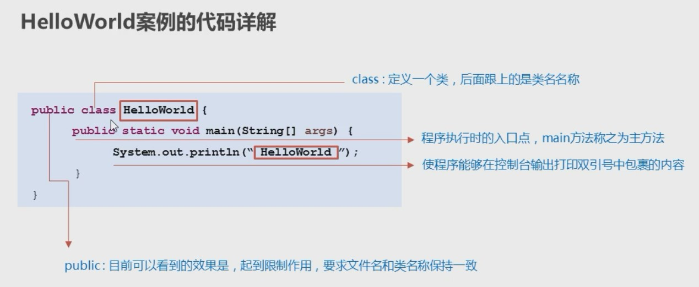

## ----------------------------

## Java 基础概念

### 字面量

字面量: 告诉程序员, 数据在程序中的书写格式

java中字面量的分类: 

- 整数
- 小数
- 字符串
- 字符
- 布尔
- 空
### 常量

常量: 在程序的执行过程中, 其值不会发生改变的量(数据)

比如 System.out.println("")里面双引号的数据是字符串常量

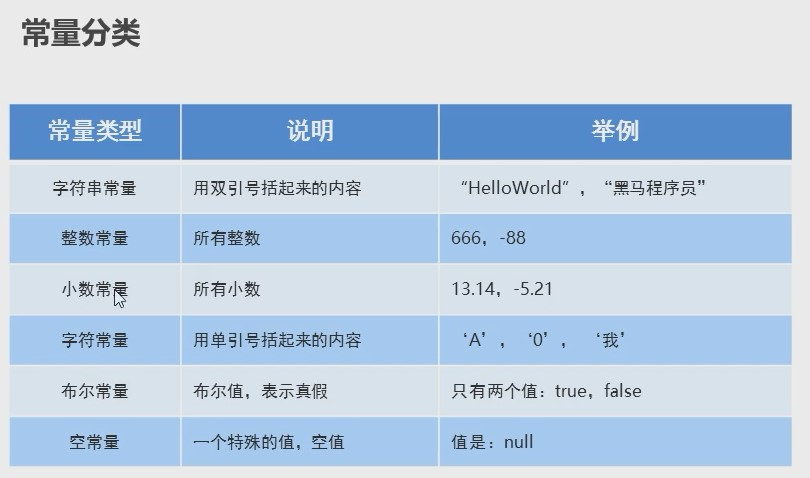

### 变量

变量的定义格式

数据类型 变量名 = 数据值

数据类型: 为空间中存储的数据, 加入类型限制

#### 计算机存储单元

无论内存还是硬盘, 计算机存储设备的最小信息单元叫 位(bit), 又称为"比特位", 通常由小写的字母"b"表示, 而计算机中最小的存储单元叫"字节(byte)", 通常用大写字母"B"表示, 字节是由连续的 8 个位组成

1B(字节) = 8bit
1KB = 1024B

#### 定义一个变量

```js
public class HelloWorld {
  public static void main(String[] args) {
  int a = 10;  // 整数类型变量
  double b = 12.2;  // 小数类型变量
  char c = 'a';  // 字符类型变量
  boolean d = true; // 布尔类型变量

  System.out.println(a);
  System.out.println(b);
  System.out.println(c);
  System.out.println(d);

}
```

#### 变量使用注意事项

1. 变量名不允许重复定义(注意可以重复赋值)
2. 一条语句可以定义多个变量, 需要使用逗号分割
3. 变量使用前一定要进行赋值
4. 定义 float 变量需要在数值后面加入 F 标识
5. 定义 none 类型变量的时候, 需要在数值后面加入 L 标识
6. 变量的作用域范围

## 数据类型

Java 是`强类型`语言, 对于每一种数据都给出了明确的数据类型, 不同的数据类型也分配了不同的内存空间, 所以它们表示的数据大小也是不一样的

### 基本数据类型
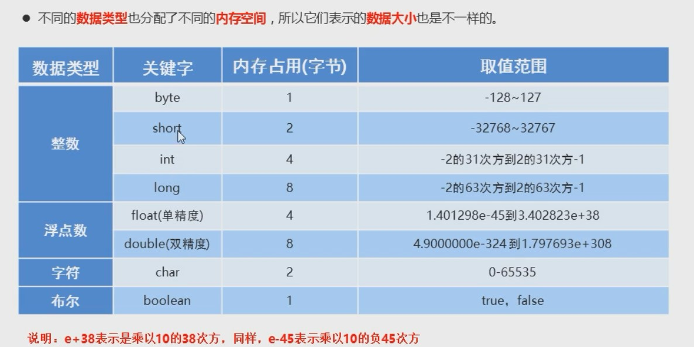

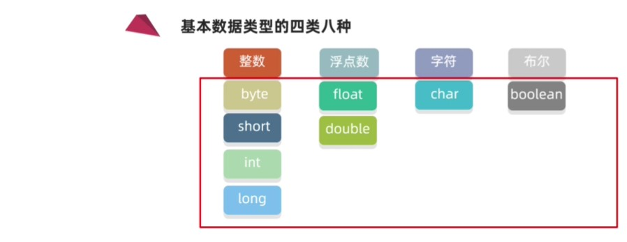

整数和小数取值范围大小关系:

double > float > long > int > short > byte

## 运算符

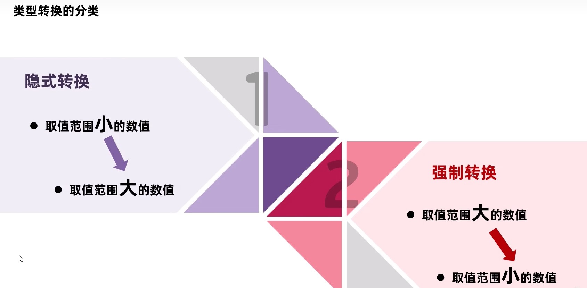

### 隐式转换

数据类型中, 取值范围小的数据, 给取值范围大的类型赋值 可以直接赋值

简单记: 小的给大的, 可以直接给

init 4 个字节 double 8 个字节, 4 升的油倒入 8 升的桶, 可以直接倒

### 隐式转换过程

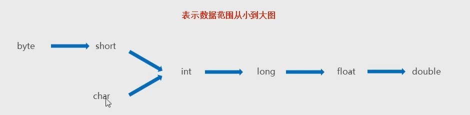

- 取值范围小的, 和取值范围大的进行运算, 小的会先提升为大的, 再进行运算
- byte short char 三种类型的数据在运算的时候, 都会先直接提升为int, 然后再进行运算

### 隐式转换的小结

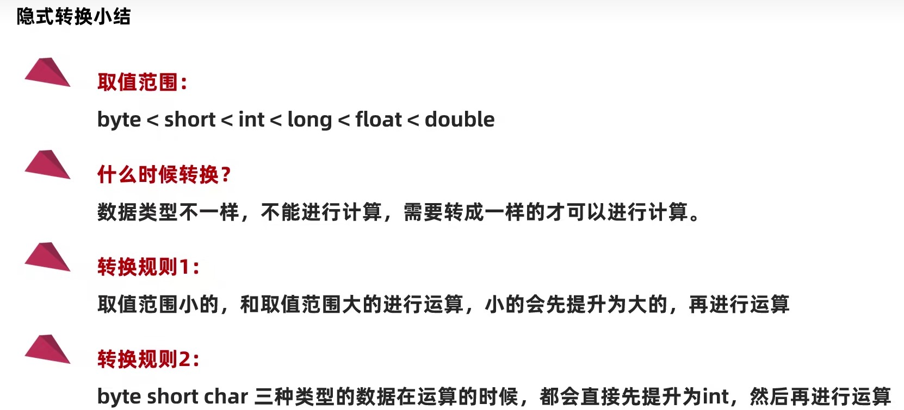

### 强制转换

如果把一个取值范围大的数值, 赋值给取值范围小的变量. 是不允许直接赋值的, 如果一定要这么做就需要加入强制转换

格式: 目标数据类型 变量名 = (目标数据类型) 被强制转换的数据;

注意: 强制类型转换, 可能发生精度损失

精度损失: 简单理解, 将容积为 8 升的容器的水, 倒入容积为 4 升的容器中, 如果水超出了 4 升, 会洒了

```java
double a = 12.3;
int b = (int) a;
```

### 自增自减运算符

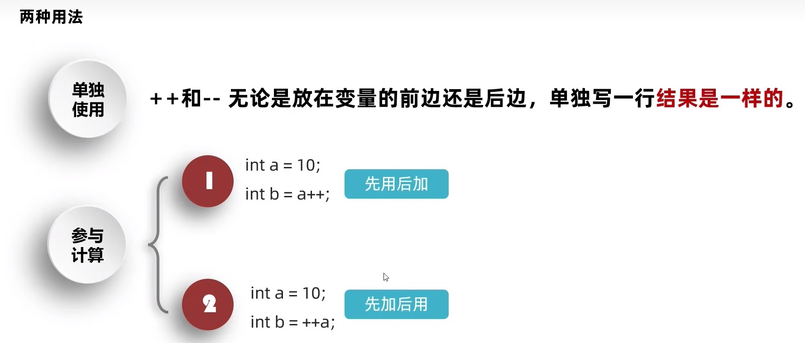

### 赋值运算符

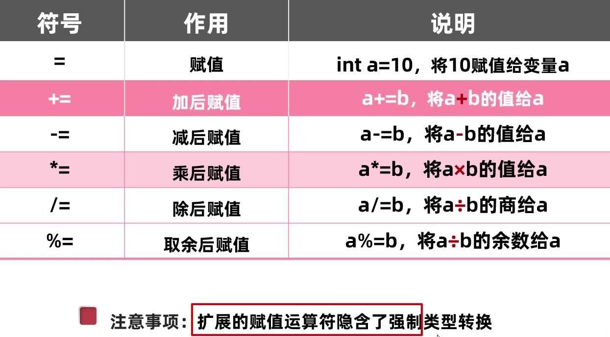

### 短路逻辑运算符

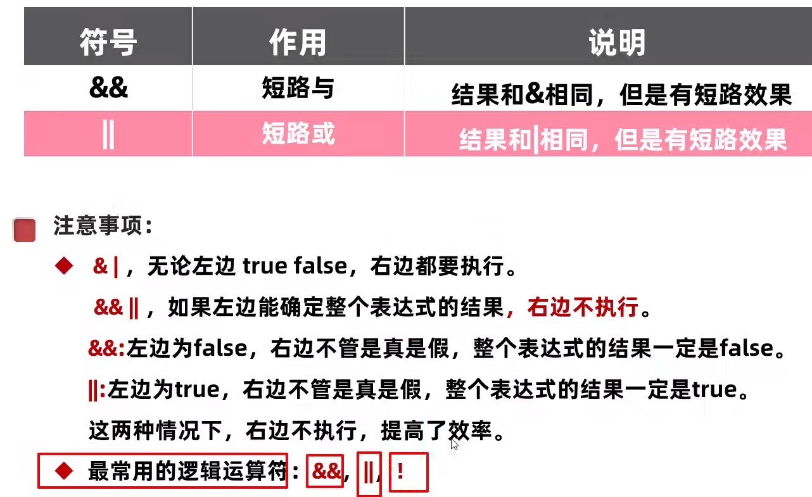

