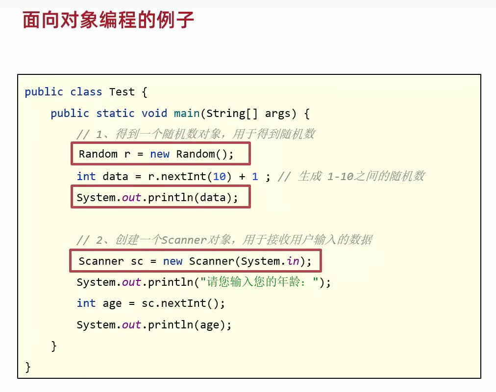
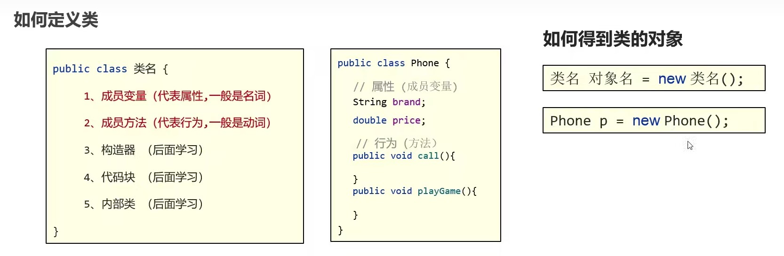
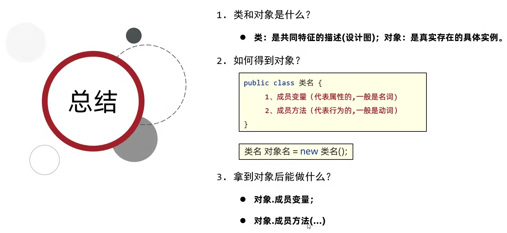
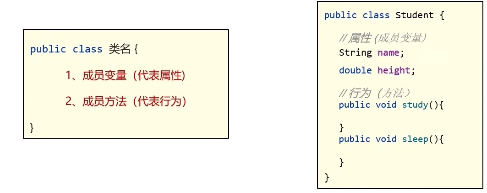
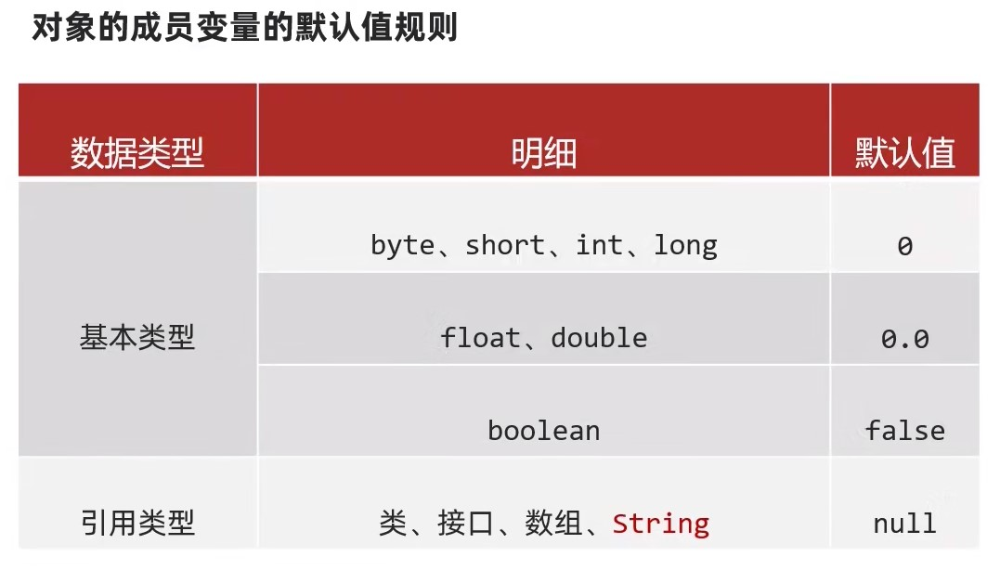
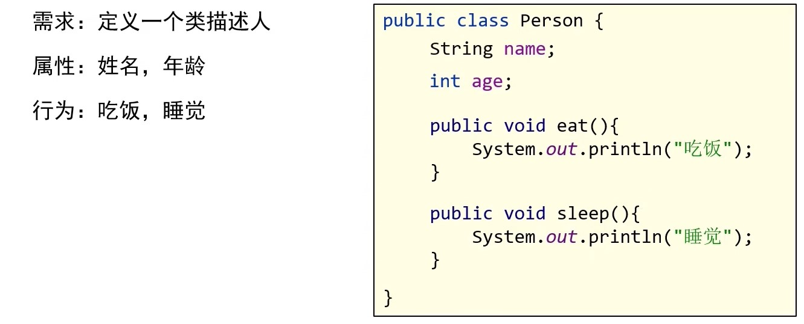
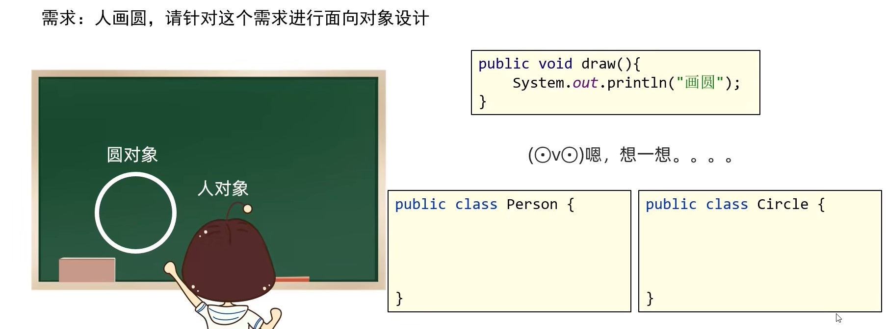
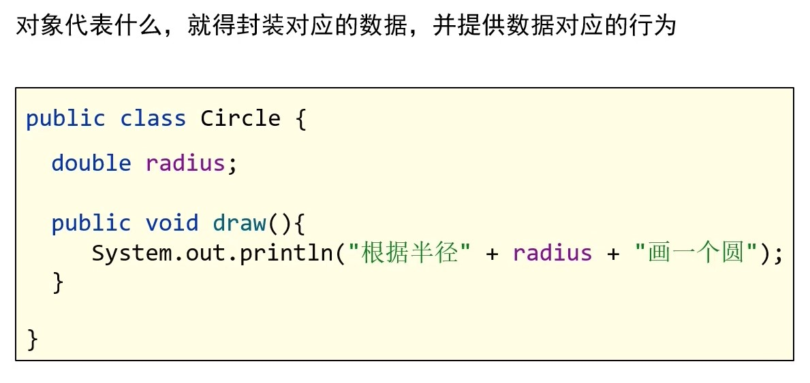
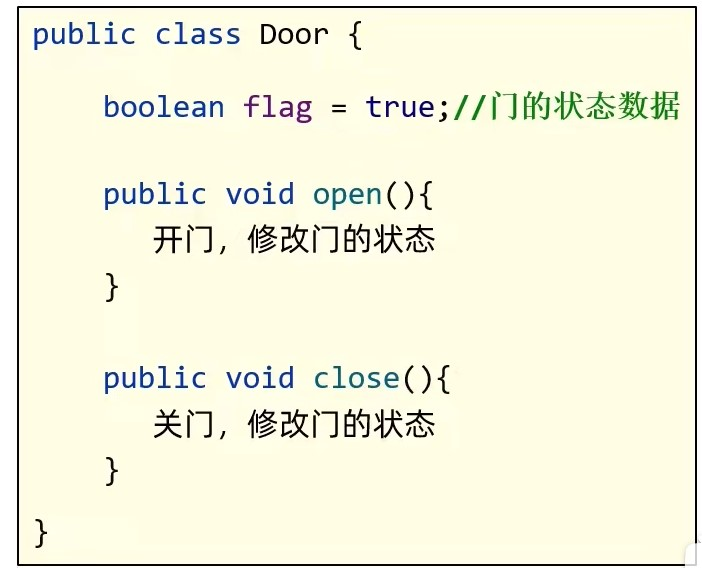

## 数组的内存图

:::tip
这个程序没有用到new关键字, 所以现在只看栈

程序在刚开始运行的时候, 程序主入口main方法进入栈里面, 然后从第一行开始逐行执行, 比如第一行定义a等于10, 
:::

## 方法

方法是程序中最小的执行单元

### 方法的注意事项

- 方法不调用就不执行
- 方法与方法之间是平级关系, 不能互相嵌套定义
- 方法的编写顺序和执行顺序无关
- 方法的返回值类型为void, 表示该方法没有返回值, 没有返回值的方法可以省略return语句不写. 如果要编写return, 后面不能跟具体的数据
- return语句下面, 不能编写代码, 因为永远执行不到, 属于无效的代码

### 方法的重载

- 在同一个类中, 定义了多个同名的方法, 这些同名的方法具有同种的功能
- 每个方法具有不同的参数类型或参数个数, 这些同名的方法, 就构成了重载关系

简单记:

在同一个类中, 方法名相同, 参数不同的方法. 与返回值无关. 
参数不同: 个数不同, 类型不同, 顺序不同

### 方法的内存

## --------------------

## 面向对象

### 面向对象和面向过程的思想对比

- 面向: 拿, 找

- 对象: 能干活的东西

- 面向对象编程: 拿东西过来做对应的事情

面向过程思想(Procedure Oriented Programming) 是一种以**过程**为中心的编程思想, 实现功能的每一步, 都是自己实现的

面向对象编程(Object Oriented Programming) 是一种以**对象**为中心的编程思想, 通过指挥对象实现具体的功能

1. 客观存在的任何一种事物, 都可以看做为程序中的对象
2. 使用面向对象思想可以将复杂的问题简单化
3. 将我们从执行者的位置, 变成了指挥者

### 设计对象并使用

### 类和对象

- 类(设计图): 是对象共同特征的描述;
- 对象: 是真实存在的具体东西

:::tip
在java中, 必须先设计类, 才能获得对象
:::

#### 定义类的补充事项

- 用来描述一类事物的类, 叫做javabean类. 在javabean类, 是不写main方法的
- 在以前, 编写main方法的类, 叫做测试类. 我们可以在测试类中创建javabean类的对象并进行赋值调用

- 一个java文件中可以定义多个class类, 且只能一个类是public修饰, 而且public修饰的类名必须成为代码文件名. `实际开发中建议还是一个文件定义一个class类`
- 成员变量的完整定义格式是: `修饰符 数据类型 变量名 = 初始化值;`, 一般无需指定初始化值, 存在默认值

#### 对象的成员变量的默认值规则

## 面向对象三大特征

### 封装

如果在需求当中如果存在多个事物, 有的行为不知道该归属哪一类, 怎么办呢?

封装: 告诉我们, `如何正确设计对象的属性和方法`

举例:

上面这个设计非常简单, 可是工作中的需求远比这复杂的多. 经常会涉及多个对象, 比如下面的人画圆

很多人会认为人画圆当然draw方法是人身上的, 但是更应该属于圆的方法.

因为封装中一个重要思想: `对象代表什么, 就得封装对应的数据, 并提供数据对应的行为`

如何理解这句话:

既然定义了一个类来代表圆的话, 肯定涉及一些圆的属性来封装一些信息, 比如圆的半径, 直径等等. 

那么画圆要根据什么画? 肯定需要半径来画, 那上面封装了半径的信息, 就要提供和半径相关的画圆的方法, 所以画圆的方法是属于圆的.

而人只是调用圆里的方法画的圆.

再举一个例子: 人关门

关门方法是门的方法, 而不是人的方法(联想弹窗开启关闭事件)

### 继承

### 多态