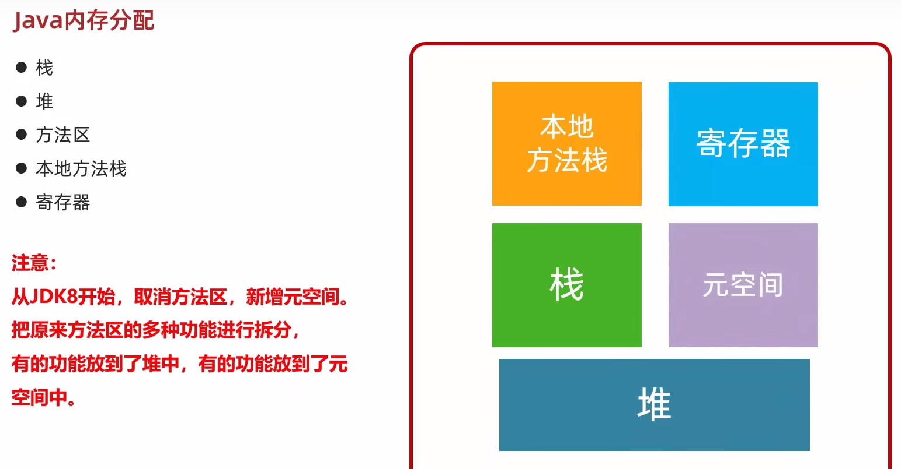
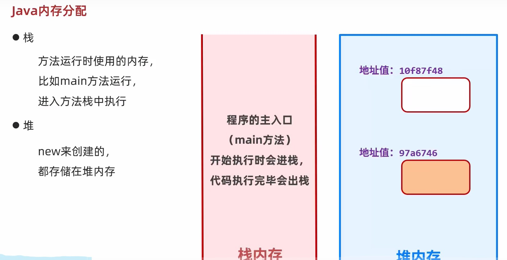
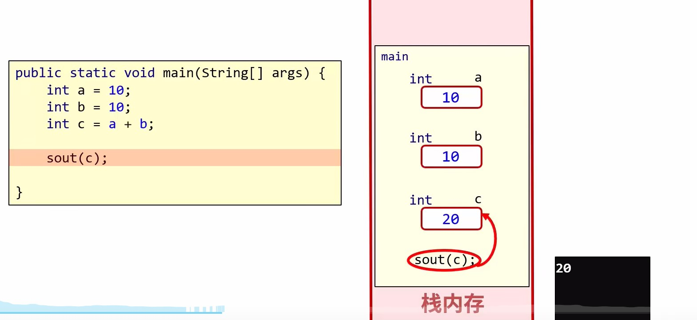
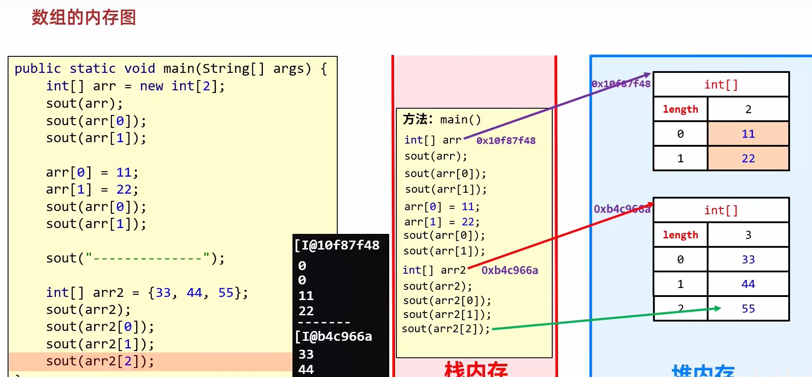
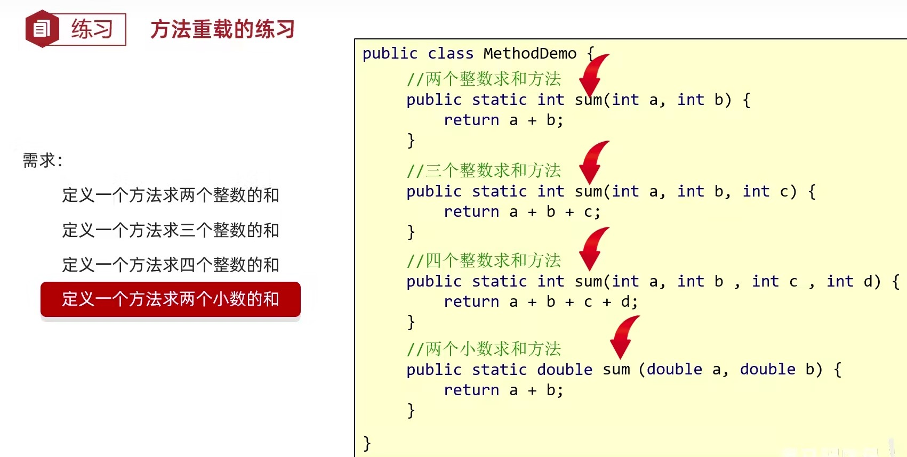
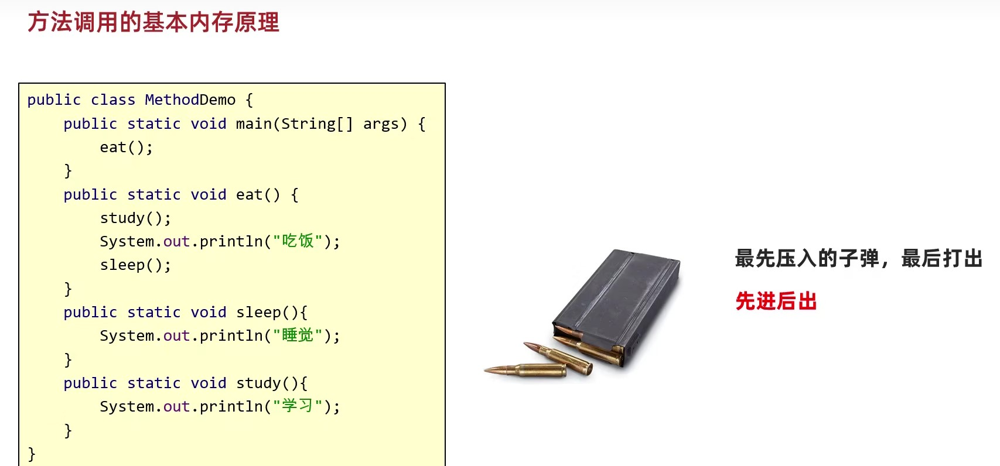

## 数组的内存图

:::tip
这个程序没有用到new关键字, 所以现在只看栈

程序在刚开始运行的时候, 程序主入口main方法进入栈里面, 然后从第一行开始逐行执行, 比如第一行定义a等于10, 
:::

## 方法

方法是程序中最小的执行单元

### 方法的注意事项

- 方法不调用就不执行
- 方法与方法之间是平级关系, 不能互相嵌套定义
- 方法的编写顺序和执行顺序无关
- 方法的返回值类型为void, 表示该方法没有返回值, 没有返回值的方法可以省略return语句不写. 如果要编写return, 后面不能跟具体的数据
- return语句下面, 不能编写代码, 因为永远执行不到, 属于无效的代码

### 方法的重载

- 在同一个类中, 定义了多个同名的方法, 这些同名的方法具有同种的功能
- 每个方法具有不同的参数类型或参数个数, 这些同名的方法, 就构成了重载关系

简单记:

在同一个类中, 方法名相同, 参数不同的方法. 与返回值无关. 
参数不同: 个数不同, 类型不同, 顺序不同

### 方法的内存

