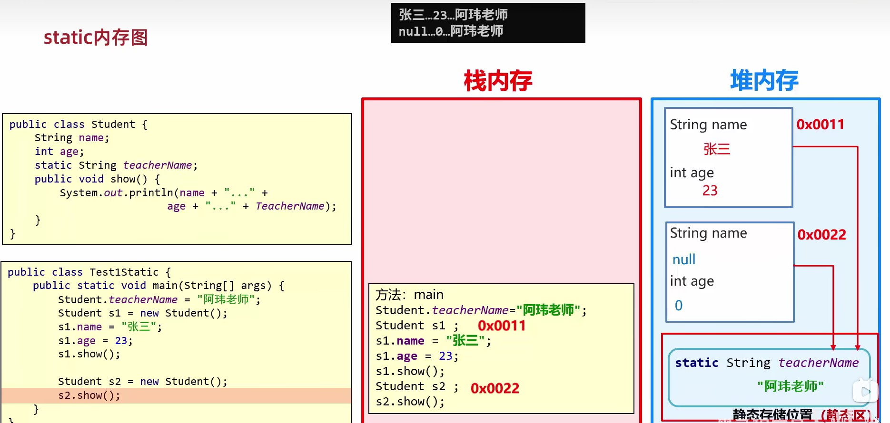

## static

### static内存图




### javabean类

- 用来描述一类事物的类. 比如, Student, Teacher, Dog, Cat等

### 测试类

- 用来检查其他类是否书写正确, 带有main方法的类, 是程序的入口

### 工具类

- 帮我们做一些事情的类

#### 编写一个工具类

```java
package com.itheima.a02;

public class ArrayUtil {

//    私有化构造方法
//    目的: 不让外界创建他的对象
    private ArrayUtil() {}

//    需要定义为静态的, 方便调用
    public static String printArr(int[] arr) {
        StringBuilder sb = new StringBuilder();
        sb.append("[");
        for (int i = 0; i < arr.length; i++) {
            if(i == arr.length - 1){
                sb.append(arr[i]);

            } else {
                sb.append(arr[i]).append(",");
            }
        }
        sb.append("]");
        return sb.toString();
    }

    public static double getAerage(double[] arr) {
        double sum = 0;
        for (int i = 0; i < arr.length; i++) {
            sum = sum + arr[i];
        }
        return sum / arr.length;
    }
}

package com.itheima.a02;

public class TestDemo {
    public static void main(String[] args) {
//        测试工具类中的两个方法是否正确

        int[] arr1 = {1,2,3,4,5};
        String str = ArrayUtil.printArr(arr1);
        System.out.println(str);

        double[] arr2 = {1.5, 3.7, 4.9, 5.9};
        double avg = ArrayUtil.getAerage(arr2);
        System.out.println(avg);
    }
}

```

### static的注意事项

- 静态方法只能访问静态
- 静态方法中没有this关键字

- 静态随着类的加载而加载
- 非静态跟对象有关

## 继承

面向对象三大特征之一

### 何时用继承?

当类与类之间, 存在相同(共性)的内容, 并满足子类是父类中的一种, 就可以考虑使用继承, 来优化代码

### 单继承

java只支持单继承, 不支持多继承, 但支持多层继承

单继承: 一个子类只能继承一个父类

java中所有的类都直接或者间接继承于Object类

### 子类到底能继承父类中的哪些内容

误区1: 父类私有的东西, 子类就无法继承

误区2: 父类中非私有的成员, 就被子类继承下来了


### ...todo

## 多态

同类型的对象, 表现出的不同形态


### 多态的应用场景

### 多态的表现形式

父类类型 对象名称 = 子类对象;

### 多态的前提

- 有继承/实现关系
- 有父类引用指向子类对象 Fu f = new Zi()
- 有方法重写


