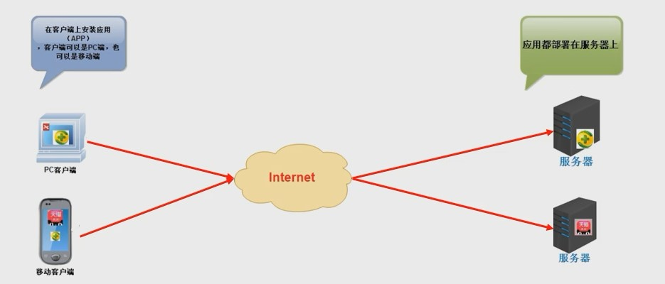
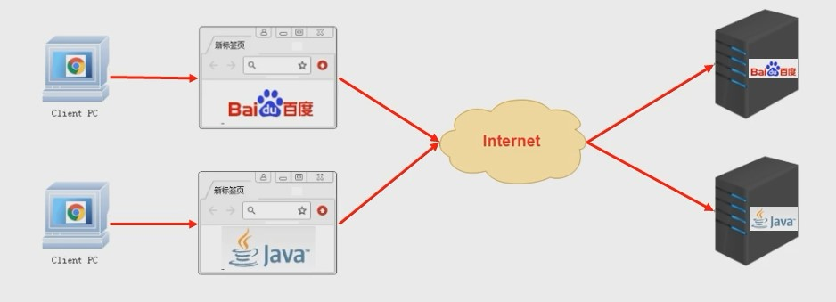

## JavaEE 规范

JavaEE(Java Enterprise Edition): Java 企业版

它是由 SUN 公司领导, 各个厂家共同制定并得到广泛认可的工业标准.

JavaEE 早期叫做 J2EE, J2EE 的版本从 1.0 开始到 1.4 结束, 而 JavaEE 版本是从 JavaEE 5 版本开始

JavaEE 规范是很多 Java 开发技术的总称, 这些技术规范都是沿用自 J2EE 的, 一共包括了 13 个技术规范: JDBC, JNDI, EJB, RMI, IDL/CORBA, JSP, Servlet, XML, JMS, JTA, JTS, JavaMail, JAF

## 系统架构

- 基础结构划分

  - CS 结构
  - BS 结构

- 技术选型划分

  - Model 模型
  - MVC 模型
  - 三层架构 + MVC 模型

- 部署方式划分
  - 一体化结构
  - 垂直拆分结构
  - 分布式结构
  - 微服务结构

### CS 结构

Client Server 客户端 + 服务器的方式

### BS 结构

Browser Server 浏览器 + 服务器的方式

