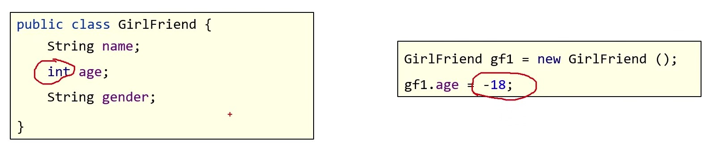

## 面向对象和面向过程的思想对比

面向过程思想(Procedure Oriented Programming) 是一种以**过程**为中心的编程思想, 实现功能的每一步, 都是自己实现的

面向对象编程(Object Oriented Programming) 是一种以**对象**为中心的编程思想, 通过指挥对象实现具体的功能

1. 客观存在的任何一种事物, 都可以看做为程序中的对象
2. 使用面向对象思想可以将复杂的问题简单化
3. 将我们从执行者的位置, 变成了指挥者

## 类和对象

类: 是对现实生活中一类具有共同属性和行为的事物的抽象

类是对事物, 也就是对象的一种描述, 可以将类理解为一张设计图, 根据设计图, 可以创建出具体存在的事物. 根据类去创建对象

### 类的组成

- 属性

该事物的各种特征, 例如公司职员事物的属性: 姓名, 年龄, 部门...

- 行为

该事物存在的功能, 例如公司职员事物的行为: 前端开发, java 开发, 运维...

### 类和对象的关系

类: 对现实生活中一类具有共同属性和行为的事物抽象

对象: 能够看得到摸得着的真实存在的实体

### 案例: 手机类


## 封装

面向对象三大特征之一: 封装, 继承, 多态

封装: 隐藏实现细节, 仅对外暴露公共的访问方式


代码体现:


new 出来的两个实例, 不需要知道 setAge 方法里做了什么样的判断才达到赋值成功或者失败, 因为调用者只负责调用, 里面怎么判断不关心.

:::tip 封装的常见体现
私有仅仅是封装的一种体现.

代码抽取到方法中, 也是一种封装.

将属性抽取到类中, 这是对数据的一种封装, 比如下图
:::

封装的好处:

1. 提高了代码的安全性
2. 提高了代码的复用性


### private

private 是一个权限修饰符, 用来修饰成员(变量, 方法). 使得只能在本类当中进行访问



针对 private 修饰的成员变量, 如果需要被其他类使用, 提供相应的操作

- 提供 get 变量名() 方法, 用于获取成员变量的值, 方法用 public 修饰
- 提供 set 变量名(参数) 方法, 用于设置成员变量的值, 方法用 public 修饰

### static

static 关键字是静态的意思, 是 java 中的一个修饰符, 可以修饰成员方法, 成员变量

被修饰的成员变量,叫做静态变量, 被修饰的成员方法, 叫做静态方法

特点:

1. 被 static 修饰的成员, 会被该类的所有对象所共享
2. 被 static 修饰的成员, 会随着类的加载而加载, 优先于对象存在
3. 多了一种调用方式, 可以通过类名.进行调用

注意事项:

1. 静态方法中, 只能访问静态成员(成员变量, 成员方法)
2. 非静态方法中, 可以使用静态成员, 也可以使用非静态成员
3. 静态方法中, 没有 this 关键字. 因为 this 代表当前对象的引用, 需要在创建对象之后才会产生 this. 而 static 存在的时候对象可能还未创建, 所以静态方法当中没有 this 关键字

## 构造方法

构建, 创建对象的时候, 所调用的方法

格式:

1. 方法名与类名相同, 大小写也要一致
2. 没有返回值类型, 连 void 都没有
3. 没有具体的返回值(不能由 return 带回结果数据)

执行时机:

1. 创建对象的时候调用, 每创建一次对象, 就会执行一次构造方法
2. 不能手动调用构造方法


### 构造方法的作用


### 构造方法的注意事项

1. 如果一个类中没有编写任何构造方法, 系统将会提供一个默认的无参数构造方法

```js
// 默认的无参数构造方法
public Student() {}
```

2. 如果手动编写了构造方法, 系统就不会再提供默认的无参数构造方法了

推荐写法:

- 无论是否使用, 都手动书写无参数构造方法, 和带参数构造方法

## 继承


之前写的学生类和老师类存在很多共同的内容, 降低了代码的复用性. 比如将来有一个需要管理班主任的信息, 那么又要写一个班主任类, 把用于封装数据的代码复制一份, 很明显需要解决这个问题. 所以把公共的内容向上抽取到一个类中, 把子类与父类建立一种关系, 可以让子类什么都不写就可以复用父类的东西

### 继承的好处和弊端

好处: 提高了代码的复用性, 维护性, 是多态的前提

弊端: 降低了代码灵活性, 增强了代码的耦合性


### Java 中继承的特点

Java 只支持单继承, 不支持多继承, 但支持多层继承

### super 关键字

super 关键字的用法和 this 关键字的用法相似

this: 代表本类对象的引用
super: 代表父类存储空间的标识(可以理解为父类对象引用)

## 多态

同一个对象, 在不同时刻表现出来的不同形态

## 后续略
