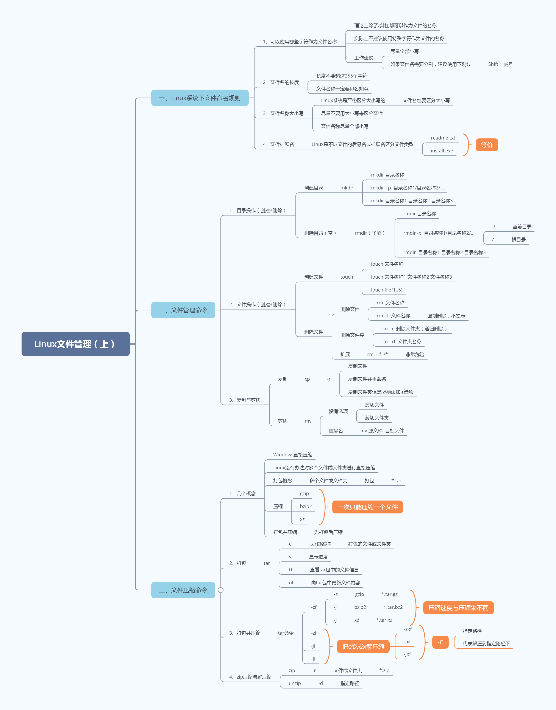

## Linux文件"扩展名"

我们都知道，Windows 是依赖扩展名区分文件类型的，比如，".txt" 是文本文件、".exe" 是执行文件，但Linux 不是。

Linux 系统通过`权限位标识`来确定文件类型，常见的文件类型有普通文件、目录、链接文件、块设备文件、字符设备文件等几种。Linux 的可执行文件就是普通文件被赋予了可执行权限。

## Linux系统的文件目录结构


### Linux系统的文件目录用途

Linux 基金会发布了 FHS （Filesystem Hierarchy Standard 文件系统层次化标准）。规定了主要文件夹的用途

/bin：系统命令目录

/sbin：超级命令目录，只能超级管理员可以执行的命令

/boot：系统目录，类似于Windows中的C盘

/dev ：设备文件目录，硬盘、光驱、U盘都属于设备文件，/dev/sr0代表光驱设备。注意，次目录下的文件没有办法直接使用，必须先挂载

/etc ：非常重要，代表系统的配置文件目录。大部分软件安装完成后，其配置文件都存放在此目录

/home：普通用户的家目录，用户登录后会自动切换到此目录

/root：超级管理员的家目录，超级管理员登录后会自动切换到此目录

/media：挂载目录，早期Linux挂载目录，用于挂载光盘以及软盘

/mnt：挂载目录，用来挂载额外的设备，如 U 盘、移动硬盘和其他操作系统的分区

/opt ：第三方软件目录，这个目录是放置和安装其他软件的位置，手工安装的源码包软件都可以安装到这个目录中。不过笔者还是习惯把软件放到 /usr/local/ 目录中，也就是说，/usr/local/ 目录也可以用来安装软件

/usr ：系统程序目录，类似Windows中的Program Files

/proc：虚拟文件系统。该目录中的数据并不保存在硬盘上，而是保存到内存中。主要保存系统的内核、进程、外部设备状态和网络状态等。

/tmp ：临时文件目录，在该目录下，所有用户都可以访问和写入。建议此目录中不能保存重要数据，最好每次开机都把该目录清理

/var ：经常变化的文件目录，网页文件、数据文件、日志文件

/lost+found/ : 当系统意外崩溃或意外关机时，产生的一些文件碎片会存放在这里。在系统启动的过程中，fsck 工具会检查这里，并修复已经损坏的文件系统。这个目录只在每个分区中出现，例如，/lost+found 就是根分区的备份恢复目录，/boot/lost+found 就是 /boot 分区的备份恢复目录

/proc/ : 虚拟文件系统。该目录中的数据并不保存在硬盘上，而是保存到内存中。主要保存系统的内核、进程、外部设备状态和网络状态等。如 /proc/cpuinfo 是保存 CPU 信息的，/proc/devices 是保存设备驱动的列表的，/proc/filesystems 是保存文件系统列表的，/proc/net 是保存网络协议信息的......

/sys/ : 虚拟文件系统。和 /proc/ 目录相似，该目录中的数据都保存在内存中，主要保存与内核相关的信息

## Linux常用命令


### 1、uname查看操作系统信息

命令：
```powershell
uname -a
```

作用：获取计算机操作系统相关信息

### 2、su切换用户
命令：
```powershell
su - root
```

### 3、ls命令查看目录下文件

  命令：ls 或 ls 目录 或 ls -lh 或 ls -a 或 ll

### 4、whoami命令 显示当前用户
命令：
```powershell
whoami
```

### 5、reboot 立即重启
命令：
```powershell
reboot
```

### 6、shutdown 关机
命令：
```powershell
shutdown -h 0或now
```

作用：立即关机

命令：
```powershell
shutdown -h 分钟数
```

作用：多少分钟后延迟关机

命令：
```powershell
shutdown -c
```

作用：取消关机

### 7、type命令 查看内部命令

命令：
```powershell
type 命令名
// 内部命令提示: 命令 is a shell buildin
```

作用：判断命令的类型(内部命令还是外部命令)

### 8、history命令 显示系统以前输入的前1000条命令

命令：
```powershell
history
```

作用：显示系统以前输入的前1000条命令

### 9、hostnamectl命令 

作用：用于设置计算机的主机名称(给计算机起名), 此命令CentOS7新增的命令

**获取计算机的主机名称**

命令：
```powershell
hostname
```

**设置计算机的主机名称**

命令：
```powershell
hostnamectl
```

Centos7中主机名分3类，静态的（static）、瞬态的（transient）、和灵活的（pretty）。

静态主机名也称为内核主机名，是系统在启动时从/etc/hostname内自动初始化的主机名。相当于永久更改  
瞬态主机名是在系统运行时临时分配的主机名，相当于临时更改  
灵活主机名则允许使用特殊字符的主机名，例如"MaYun's Host"

CentOS 7中和主机名有关的文件为/etc/hostname，它是在系统初始化的时候被读取的，并且内核根据它的内容设置瞬态主机名。

:::tip 如何更改主机名称, 让其永久生效?
方法1. 使用静态的  
方法2. 改etc/hostname文件
:::

## `文件管理`

### `创建目录`

### ① mkdir创建目录

基本语法：

```powershell
# mkdir 目录名称
```

主要功能：就是根据目录的名称创建一个目录

> mkdir = make directory

案例：在家目录下创建一个itheima的文件夹

```powershell
# mkdir itheima
```

### ② mkdir -p递归创建目录

基本语法：

```powershell
# mkdir -p /usr/local/nginx/conf
选项说明：
-p：递归创建，从左边的路径开始一级一级创建目录，直到路径结束
```

案例：在已知目录（/usr/local）下创建多级目录（nginx/conf）

```powershell
# mkdir /usr/local/nginx/conf
mkdir: cannot create directory ‘/usr/local/nginx/conf’: No such file or directory
mkdir：不能创建目录conf，为什么呢？因为/usr/local目录下并没有nginx
```

解决方案：如果我们想同时创建多级目录，必须使用-p选项，其会从左向右一级一级创建目录。

```powershell
# mkdir -p /usr/local/nginx/conf
```

### ③ 使用mkdir同时创建多个目录

```powershell
# mkdir 目录名称1 目录名称2 目录名称3 ...
```

案例：在当前目录下创建a、b、c三个目录

```powershell
# mkdir a
# mkdir b
# mkdir c
或
# mkdir a b c
```

#### 总结：

一个目录一个目录创建# mkdir 目录名称

多级目录一起创建# mkdir   -p   目录名称1/目录名称2/...

同时创建多个目录# mkdir  目录名称1  目录名称2  目录名称3

### `目录删除（必须是空目录）`

###  ① rmdir移除空目录

基本语法：

```powershell
# rmdir 目录名称
```

> rmdir = remove  directory，移除目录

案例：把家目录下的itheima删除（空目录）

```powershell
# rmdir itheima
```

### ② rmdir -p递归删除空目录

基本语法：

```powershell
# rmdir -p 目录名称1/目录名称2/目录名称3/...
```

主要功能：从右向左一级一级删除空目录

案例：递归删除itheima文件夹中的yunwei文件夹中的shenzhen3

```powershell
# rmdir -p itheima/yunwei/shenzhen3
```

### ③ 使用rmdir同时删除多个空目录

```powershell
# rmdir 目录名称1 目录名称2 目录名称3 ...
```

案例：删除家目录中的a、b、c三个空目录

```powershell
# rmdir a b c
```

#### 总结：

\# rmdir 目录名称，删除某个空目录

\# rmdir -p 目录名称1/目录名称2/目录名称3/...，同时删除多级目录（从右向左一级一级删除）

\# rmdir  目录名称1 目录名称2 目录名称3，同时删除多个空目录

### `文件创建`

### ① touch创建文件

基本语法：

```powershell
# touch 文件名称
```

主要功能：在Linux系统中的当前目录下创建一个文件

案例：在当前目录下创建一个readme.txt文件

```powershell
# touch readme.txt
```

### ② 使用touch命令同时创建多个文件

基本语法：

```powershell
# touch 文件名称1 文件名称2 文件名称3 ...
```

案例：创建一个shop商城文件夹，然后在内部创建index.php/admin.php/config.php三个文件

```powershell
# mkdir shop
# touch shop/index.php
# touch shop/admin.php
# touch shop/config.php
或
# touch shop/index.php shop/admin.php shop/config.php
```

> 提出问题：观察以下命令，看看有何区别？
>
> 第一种写法：touch  shop/index.php    shop/admin.php    shop/config.php
>
> 代表在shop目录下首先创建一个index.php，在创建一个admin.php，最后config.php
>
> 
>
> 第二种写法：touch   shop/index.php    admin.php   config.php
>
> 代表在shop目录下首先创建index.php，然后在当前目录下创建admin.php，最后在当前目录下创建config.php

### ③ {1..5}根据序号同时创建多个文件

基本语法：

```powershell
# touch 文件名称{开始序号..结束序号}
含义：
根据提供的开始序号~结束序号，一个一个创建文件
```

案例：创建file1、file2、file3、file4、file5共5个文件

```powershell
# touch file1
# touch file2
# touch file3
# touch file4
# touch file5
```

或

```powershell
# touch file{1..5}
```

#### 总结：

\# touch 文件名称

\# touch 文件名称1  文件名称2  文件名称3 ...

\# touch 文件名称{开始序号..结束序号}

### `文件删除`

### ① 普通删除

基本语法：

```powershell
# rm  [选项]  文件或文件夹的名称
选项说明：
-r ：针对文件夹，代表递归删除，先把目录下的所有文件删除，然后在删除文件夹
-f ：强制删除，不提示，初学者一定要慎重！！！
```

案例：删除readme.txt文件

```powershell
# rm readme.txt
rm: remove regular empty file ‘readme.txt’?这里可以回复y or n
y代表确认删除
n代表取消删除
```

案例：强制删除admin.php，不提示（慎重）

```powershell
# rm -f admin.php
```

案例：删除非空的文件夹（-rf强制递归删除，不提示）

```powershell
# rm -rf shop
```

提示信息：descend into directory 'itheima/'?
含义：是否进入itheima目录？

提示信息：remvoe directory 'itheima/'?
含义：是否删除itheima文件夹？


扩展：Ctrl + C在Linux下的使用方式

> 在Linux操作系统中，Ctrl + C不是复制，而是中断某个操作

总结：

\# rm  文件名称

\# rm  文件名称1  文件名称2  文件名称3 ... 

\# rm  -f   文件名称     =>    强制删除，不提示

\# rm  -rf   文件夹名称 		=>    递归删除文件夹

### ② 扩展：rm  -rf   /*，一定要慎重

```powershell
# rm -rf /*	    =>   代表删除根目录下的所有文件（如果没有备份，恢复的几率不高）
rm ：删除
-r ：递归删除（无论文件夹是否为空）
-f ：强制删除不提示
/  ：代表根分区
*  ：所有
```

### `复制操作`

① cp复制操作

基本语法：

```powershell
# cp [选项] 源文件或文件夹 目标路径
选项说明：
-r ：递归复制，主要针对文件夹
```

> cp = copy复制

案例：把readme.txt文件从当前目录复制一份放到/tmp文件夹中

```powershell
# cp readme.txt /tmp/
```


② cp复制并重命名文件

基本语法：

```powershell
# cp [选项] 源文件或文件夹 目标路径/新文件或文件夹的名称
```

案例：把readme.txt文件从当前目录复制一份放到/tmp文件夹中并重命名为readme.txt.bak

```powershell
# cp readme.txt /tmp/readme.txt.bak
```


③ cp复制文件夹到指定路径

```powershell
# cp -r 源文件夹名称 目标路径/
```

案例：把shop目录连通其内部的文件统一复制到/tmp目录下

```powershell
# mkdir shop
# touch shop/index.php shop/admin.php shop/config.php

# cp -r shop /tmp/
```

#### 总结：

复制文件# cp  源文件名称  指定路径

复制文件并重命名# cp  源文件名称 指定路径/新文件名称

复制文件夹# cp -r  源文件夹  指定路径

### `剪切操作`

基本语法：

```powershell
# mv 源文件或文件夹 目标路径/
```

> mv = move，剪切、移动的含义

案例：把readme.txt文件剪切到/tmp目录下

```powershell
# rm -rf /tmp/readme.txt

# mv readme.txt /tmp/
```

案例：把shop文件夹移动到/usr/local/nginx目录下

```powershell
# mkdir /usr/local/nginx
# mv shop /usr/local/nginx/
```

### `重命名操作`

基本语法：

```powershell
# mv  源文件或文件夹名称  新文件或文件夹的名称
```

案例：把readme.txt文件更名为README.md文件

```powershell
# mv readme.txt README.md
```

案例：把shop文件目录更名为wechat目录

```powershell
# mkdir shop
# mv shop wechat
```

总结：

剪切文件# mv  源文件名称  目标路径/

剪切文件夹# mv 源文件夹名称 目标路径/

重命名# mv  源文件或文件夹名称  新文件或文件夹名称

### `打包压缩与解压缩`

### ① 几个概念

**打包**：默认情况下，Linux的压缩概念一次只能压缩一个文件。针对多文件或文件夹无法进行直接压缩。所以需要提前对多个文件或文件夹进行打包，这样才可以进行压缩操作。

1.txt  5MB

2.txt  10MB

3.txt  15MB

1.txt + 2.txt + 3.txt  =  打包  =  123.tar = 30MB

> 打包只是把多个文件或文件夹打包放在一个文件中，但是并没有进行压缩，所以其大小还是原来所有文件的总和。

**压缩**：也是一个文件和目录的集合，且这个集合也被存储在一个文件中，但它们的不同之处在于，压缩文件所占用的磁盘空间**比集合中所有文件大小的总和要小。**

1.txt  5MB

2.txt  10MB

3.txt  15MB

1.txt + 2.txt + 3.txt = 压缩 = 123.tar.gz = 20MB（体积变小了）

### ② Linux打包操作

基本语法：

```powershell
# tar [选项]  打包后的名称.tar  多个文件或文件夹
选项说明：
-c ：打包
-f ：filename，打包后的文件名称
-v ：显示打包的进度
-u ：update缩写，更新原打包文件中的文件（了解）
-t ：查看打包的文件内容（了解）
```

案例：把a.txt、b.txt、c.txt文件打包到abc.tar文件中

```powershell
# tar -cvf abc.tar a.txt b.txt c.txt
```

案例：把wechat文件夹进行打包wechat.tar

```powershell
# tar -cvf wechat.tar wechat
```

### ③ tar -tf以及tar -uf

```powershell
# tar -tf 打包后的文件名称
```

主要功能：查看tar包中的文件信息

案例：查看abc.tar包中的文件信息

```powershell
# tar -tf abc.tar
```


```powershell
# tar -uf 打包后的文件名称
```

> u = update，更新，如果还想往tar包中更新或追加内容都可以通过-u选项

案例：向abc.tar包中添加一个d.txt文件

```powershell
# touch d.txt
# tar -uf abc.tar d.txt
查看是否添加成功
# tar -tf abc.tar
```

扩展：如何把tar包中的文件释放出来

```powershell
打包
# tar -cf  abc.tar  a.txt  b.txt  c.txt

打包 => 释放（-c 变成 -x）

释放
# tar -xf  abc.tar
```

### ④ 打包并压缩

基本语法：

```powershell
# tar [选项]  压缩后的压缩包名称  要压缩的文件或文件夹
选项说明：
-cf ：对文件或文件夹进行打包

-v  ：显示压缩进度

-z	：使用gzip压缩工具把打包后的文件压缩为.gz
-j  ：使用bzip2压缩工具把打包后的文件压缩为.bz2
-J	：使用xz压缩工具把打包后的文件压缩为.xz

压缩速度：gzip > bzip2 > xz
压缩率：gzip < bzip2 < xz
100M   90M     80M	  70M
```

案例：把a.txt、b.txt、c.txt文件打包并压缩为abc.tar.gz

```powershell
# tar -zcf abc.tar.gz a.txt b.txt c.txt
```

案例：把wechat文件夹压缩为wechat.tar.gz格式的压缩包

```powershell
# tar -zcf wechat.tar.gz wechat
```

### ⑤ 对压缩包进行解压

解压过程非常简单，就是把压缩的参数中的c换成x就可以实现解压缩了

```powershell
*.tar.gz格式的压缩包
# tar -zxf 名称.tar.gz

*.tar.bz2格式的压缩包
# tar -jxf 名称.tar.bz2

*.tar.xz格式的压缩包
# tar -Jxf 名称.tar.xz
```

案例：把abc.tar.gz格式的压缩包进行解压缩操作

```powershell
# tar -zxf abc.tar.gz
```

案例：把wechat.tar.gz格式的压缩包进行解压缩操作

```powershell
# tar -zxf wechat.tar.gz
```

### `zip压缩与解压缩`

### ① zip压缩

基本语法：

```powershell
# zip [选项] 压缩后的文件名称.zip  文件或文件夹
选项说明：
-r ：递归压缩，主要针对的是文件夹
```

> Linux下已经有gzip、bzip2以及xz压缩命令了，为什么还需要使用zip压缩呢？
>
> 答：zip格式在Windows以及Linux中都是可以正常使用的。

案例：把a.txt、b.txt、c.txt进行压缩为abc.zip

```powershell
# zip abc.zip a.txt b.txt c.txt
```

案例：把wechat文件夹压缩为wechat.zip

```powershell
# zip -r wechat.zip wechat
```

### ② unzip解压缩

基本语法：

```powershell
# unzip 压缩包名称		=>     解压到当前目录
# unzip 压缩包名称 -d 指定路径		=>   解压到指定路径下
```

案例：对abc.zip文件进行解压缩

```powershell
# unzip abc.zip
```

案例：把wechat.zip解压到/usr/local/nginx目录下

```powershell
# unzip wechat.zip -d /usr/local/nginx/
```

#### 总结：

在Linux操作系统中，其拥有很多压缩工具，如gzip、bzip2、xz等等，但是其有一个缺点：

一次只能压缩一个文件（而且无法压缩文件夹）

① 打包，把一个或多个文件打成tar包，并不是压缩，只是把文件合并在一个tar文件中

1.txt  5MB

2.txt  10MB

3.txt  15MB

打包123.tar = 5MB + 10MB + 15MB = 30MB

为什么要打包，就是为了后期的压缩操作。

② 打包并压缩

```powershell
# tar -zcf 压缩包名称.tar.gz 文件或文件夹名称
# tar -jcf 压缩包名称.tar.bz2 文件或文件夹名称
# tar -Jcf 压缩包名称.tar.xz 文件或文件夹名称
```

③ 解压缩

```powershell
# tar 把c参数更换为x，就可以实现解压缩  压缩包名称.tar.gz
```

扩展：

```powershell
# tar -zxf 压缩包名称.tar.gz [参数] 指定路径
```

第一种解决思路：随用随查，百度、Google

```powershell
# tar -zxf 压缩包名称.tar.gz -C 指定路径
```

第二种解决思路：可以使用man命令（manual缩写，手册）

```powershell
# man tar命令

# tar -zxf 压缩包名称.tar.gz -C 指定路径
```

④ zip压缩与解压缩

给我们提供一种既可以在Windows中使用的，也可以提供一种在Linux中使用的通用的压缩格式。

```powershell
# zip [-r]  压缩包名称.zip  要压缩的文件或文件夹
```

解压缩：

```powershell
# unzip 压缩包名称.zip  -d 指定路径
```

## 总结

