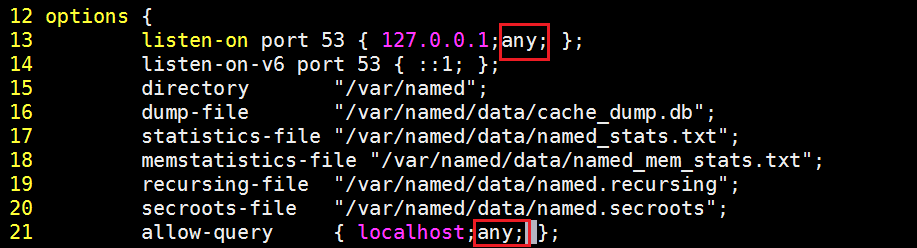
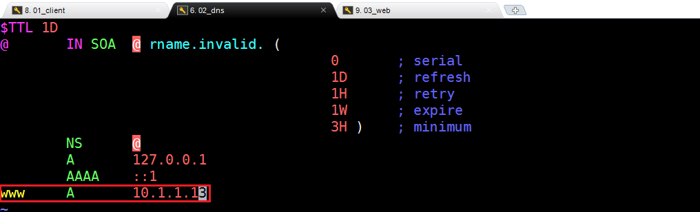

## 任务背景

公司内网中需要通过域名访问到开发的web应用. 所以需要在内网中搭建DNS服务器解析域名, 开发, 测试, 运维人员, 可以通过内网DNS服务, 访问到公司内部应用. 

也就是解析内网域名, 能够访问到内网应用, 比如把www.公司自定义.com 解析到服务器ip

## 任务拆解

1. 搭建dns服务

2. 客户端配置dns服务地址

## 理论储备

### 1. DNS概述

**DNS（domain name system ） 域名管理系统**

- 域名：

由特定的格式组成，用来表示互联网中`某一台计算机或者计算机组的称`，能够使人更方便的访问互联网，而不用记住能够被机器直接读取的IP地址。

计算机 => IP地址，互联网中的计算机都是通过IP地址进行互相访问的。(IP地址过于复杂)

域名：代替IP实现计算机的访问（高级 => 上层应用，底层还是IP地址）

每个域名 =>  DNS服务器  => 对应的IP地址

### ☆ DNS的正向解析

域名的==正向解析==

将主机域名转换为对应的IP 地址，以便网络程序能够通过主机域名访问到对应的服务器主机

**域名——>IP**		A记录

### ☆ DNS的反向解析

域名的==反向解析==

将主机的IP地址转换为对应的域名，以便网络（服务）程序能够通过IP地址查询到主机的域名

**IP——>域名**		PTR记录

### 2. DNS的结构

```powershell
域名：www.itheima.com
DNS结构：www.itheima.com.  =>  从右向左解析
```


### ☆ 根域（.）

- 在整个 DNS 系统的最上方一定是 . (小数点) 这个 DNS 服务器 (称为 root)，也叫”根域“。
- 根域 （13台 全世界只有13台。1个为主根服务器，放置在美国。其余12个均为辅根服务器，其中9个放置在美国，欧洲2个，位于英国和瑞典，亚洲1个，位于日本。）

### **☆ 一级域名<顶级域|国家域>**

com net edu gov org cc  io| cn uk us ru ja ko 

.com ： 商业公司

.net  ：互联网公司

.edu ：教育（中小学、高中、大学...）

.gov ：政府

.io	：存储设备，redis

.cn   ：中国域名（国家域）

### ☆ **二级域名**(自己购买管理)

qq.com**.**   baidu.com.    google.com. 

### **☆ 域名机构**

收费（新网|万网）
老牌免费域名：TK顶级域名、TK域名DNS、TK域名商

### 3、DNS工作原理

客户端访问dns服务器后, dns服务器从cache中查找. 分为 `递归查询` 这种查询比较耗时, 所以现在一般采用 `迭代查询` 

`一次递归 多次迭代`

### 4、dig工具使用

```
# dig +trace www.itcast.cn	  追踪DNS的解析过程
# dig www.itcast.cn			  正向解析
# dig -x IP地址			    反向解析
```

-----

## DNS服务器的搭建

### 1、DNS服务器端软件

DNS 的`域名解析`都是 **==udp/53==** . 主从之间的`数据传输`默认使用**==tcp/53==**

DNS服务器端软件：

==Bind==是一款开放源码的DNS服务器软件，Bind由美国加州大学Berkeley（伯克利）分校开发和维护的，全名为Berkeley Internet Name Domain它是目前世界上使用最为广泛的DNS服务器软件，支持各种unix平台和windows平台。BIND现在由互联网系统协会（Internet Systems Consortium）负责开发与维护。

### 2、DNS服务器搭建
### ☆ 第一步：环境准备

| 编号 | 主机名称         | IP地址    | 备注信息                       |
| ---- | ---------------- | --------- | ------------------------------ |
| 1    | client.lenovo.cn | 10.1.1.11 | client客户端，用于测试         |
| 2    | dns.lenovo.cn    | 10.1.1.12 | dns服务器，用于实现域名解析    |
| 3    | web.lenovo.cn    | 10.1.1.13 | web服务器，用于搭建内部web服务 |

① 更改主机名称与IP地址

```powershell
# hostnamectl set-hostname client.lenovo.cn
# hostnamectl set-hostname dns.lenovo.cn
# hostnamectl set-hostname web.lenovo.cn

# su

# vim /etc/sysconfig/network-scripts/ifcfg-ens33
BOOTPROTO=none
IPADDR=10.1.1.11/10.1.1.12/10.1.1.13
更改UUID编号的后3位，必须是唯一的
```

② 使用MX进行连接

③ 关闭防火墙与SELinux

```powershell
# systemctl stop firewalld
# systemctl disable firewalld

# setenforce 0
# vim /etc/selinux/config
SELINUX=disabled
```

④ 配置YUM源（有网配置公网YUM源、无网就配置光盘或自建YUM源）

```powershell
# yum clean all
# yum makecache
```
### ☆ 第二步：安装DNS软件

DNS服务器：

```powershell
# yum install bind -y
```

安装完毕后，可以使用rpm  -q查询是否安装成功：

```powershell
# rpm -q bind

# rpm -ql bind
# 日志轮转文件
/etc/logrotate.d/named
# 配置文件目录
/etc/named
# 主配置文件
/etc/named.conf
# zone文件,定义域
/etc/named.rfc1912.zones
# 服务管理脚本
/usr/lib/systemd/system/named.service
# 二进制程序文件
/usr/sbin/named
# 检测配置文件
/usr/sbin/named-checkconf
# 检测域文件
/usr/sbin/named-checkzone
# 根域服务器
/var/named/named.ca
# 正向解析区域文件模板
/var/named/named.localhost
# 反向解析区域文件模板
/var/named/named.loopback
# dns服务器下载文件的默认路径
/var/named/slaves
# 进程pid
/var/rum/named
```

> find主要用来搜索计算机中的文件，rpm主要用来检查计算机中是否安装过某个软件

### ☆ 第三步：DNS正向解析配置(域名=>IP)


/etc/named.conf主要配置访问权限控制（哪些IP或哪些主机可以访问DNS服务器）

/etc/named.rfc1912.zones主要定义域名如何解析（正向解析），解析到具体哪个IP地址

① 对named.conf以及named.rfc1912.zones进行备份

```powershell
cp /etc/named.conf /etc/named.conf.bak
cp /etc/named.rfc1912.zones /etc/named.rfc1912.zones.bak
```

② named.conf主配置文件详解（访问权限控制）

```powershell
# vim /etc/named.conf
```

添加任何主机都可以访问的权限：



③ zones子配置文件详解（域名应该指向哪个IP地址）

```powershell
# vim /etc/named.rfc1912.zones
...
zone "itcast.cluster" IN {
        type master;
        file "itcast.cluster.zone";
        allow-update { none; };
};
```

> 扩展 => vim => ：19，23  co  42，把19-23行，copy到42行的后面

④ 在/var/named目录创建itcast.cluster.zone文件定义正向解析

```powershell
# cd /var/named
# cp -p named.localhost itcast.cluster.zone
```


> 扩展：-p代表复制文件时保留文件的原有属性

⑤ 编辑itcast.cluster.zone文件，定义域名的指向

```powershell
# vim itcast.cluster.zone
```



> 扩展：zone文件的格式说明

```powershell
zone文件详解
# $TTL  缓存的生存周期
# @ = zonename = itcast.com  当前域
# IN  互联网
# SOA 开始授权
# NS  dns服务端	nameserver
# A   ipv4 正向
# AAAA IPV6
# CNAME 别名
# MX  邮件交互记录  5 数字代表优先级 数字越小优先级越高

# 0       ; serial    更新序列号	
# 1D      ; refresh   更新间隔（从服务器下载数据）
# 1H      ; retry     失败重试
# 1W      ; expire    区域文件的过期时间
# 3H )    ; minimum   缓存的最小生存周期

# D Day、H Hour、W Week
```

### ☆ 第四步：检查named.conf与zones文件

```powershell
# named-checkconf /etc/named.conf
# named-checkconf /etc/named.rfc1912.zones

检查itcast.cluster.zone文件
# cd /var/named
# named-checkzone itcast.cluster.zone itcast.cluster.zone
```

### ☆ 第五步：启动DNS服务（named）

```powershell
# systemctl restart named
# netstat -tnlp |grep named
```

### 3、Web服务搭建

```powershell
# yum install httpd -y
# systemctl start httpd

# echo 'DNS Test ...' > /var/www/html/index.html
```

### 4、测试DNS服务器的正向解析

Client：客户端服务器操作

### ☆ 添加DNS服务器

```powershell
# 临时添加
echo 'nameserver 10.1.1.12' > /etc/resolv.conf
注：电脑重启，网络刷新restart network，VMware挂起，临时DNS都会失效

# 永久添加
vim /etc/sysconfig/network-scripts/ifcfg-ens33
DNS=10.1.1.12
```

### ☆ 使用nslookup检测正向解析是否生效

```powershell
# nslookup www.itcast.cluster
```

### ☆ 使用elinks命令行浏览器或curl来实现访问

```powershell
# yum install elinks -y
# elinks
输入www.itcast.cluster
```

```powershell
# curl http://www.itcast.cluster
```