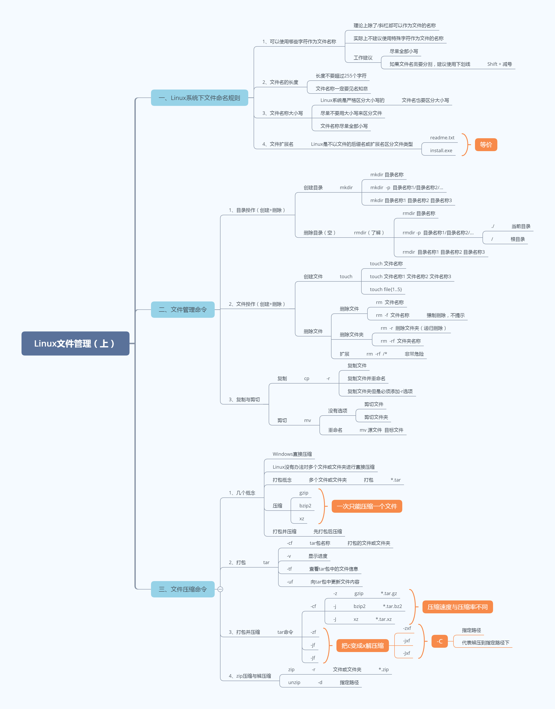

## `文件管理`

### `创建目录`

### ① mkdir创建目录

基本语法：

```powershell
# mkdir 目录名称
```

主要功能：就是根据目录的名称创建一个目录

> mkdir = make directory

案例：在家目录下创建一个itheima的文件夹

```powershell
# mkdir itheima
```

### ② mkdir -p递归创建目录

基本语法：

```powershell
# mkdir -p /usr/local/nginx/conf
选项说明：
-p：递归创建，从左边的路径开始一级一级创建目录，直到路径结束
```

案例：在已知目录（/usr/local）下创建多级目录（nginx/conf）

```powershell
# mkdir /usr/local/nginx/conf
mkdir: cannot create directory ‘/usr/local/nginx/conf’: No such file or directory
mkdir：不能创建目录conf，为什么呢？因为/usr/local目录下并没有nginx
```

解决方案：如果我们想同时创建多级目录，必须使用-p选项，其会从左向右一级一级创建目录。

```powershell
# mkdir -p /usr/local/nginx/conf
```

### ③ 使用mkdir同时创建多个目录

```powershell
# mkdir 目录名称1 目录名称2 目录名称3 ...
```

案例：在当前目录下创建a、b、c三个目录

```powershell
# mkdir a
# mkdir b
# mkdir c
或
# mkdir a b c
```

#### 总结：

一个目录一个目录创建# mkdir 目录名称

多级目录一起创建# mkdir   -p   目录名称1/目录名称2/...

同时创建多个目录# mkdir  目录名称1  目录名称2  目录名称3

### `目录删除（必须是空目录）`

###  ① rmdir移除空目录

基本语法：

```powershell
# rmdir 目录名称
```

> rmdir = remove  directory，移除目录

案例：把家目录下的itheima删除（空目录）

```powershell
# rmdir itheima
```

### ② rmdir -p递归删除空目录

基本语法：

```powershell
# rmdir -p 目录名称1/目录名称2/目录名称3/...
```

主要功能：从右向左一级一级删除空目录

案例：递归删除itheima文件夹中的yunwei文件夹中的shenzhen3

```powershell
# rmdir -p itheima/yunwei/shenzhen3
```

### ③ 使用rmdir同时删除多个空目录

```powershell
# rmdir 目录名称1 目录名称2 目录名称3 ...
```

案例：删除家目录中的a、b、c三个空目录

```powershell
# rmdir a b c
```

#### 总结：

\# rmdir 目录名称，删除某个空目录

\# rmdir -p 目录名称1/目录名称2/目录名称3/...，同时删除多级目录（从右向左一级一级删除）

\# rmdir  目录名称1 目录名称2 目录名称3，同时删除多个空目录

### `文件创建`

### ① touch创建文件

基本语法：

```powershell
# touch 文件名称
```

主要功能：在Linux系统中的当前目录下创建一个文件

案例：在当前目录下创建一个readme.txt文件

```powershell
# touch readme.txt
```

### ② 使用touch命令同时创建多个文件

基本语法：

```powershell
# touch 文件名称1 文件名称2 文件名称3 ...
```

案例：创建一个shop商城文件夹，然后在内部创建index.php/admin.php/config.php三个文件

```powershell
# mkdir shop
# touch shop/index.php
# touch shop/admin.php
# touch shop/config.php
或
# touch shop/index.php shop/admin.php shop/config.php
```

> 提出问题：观察以下命令，看看有何区别？
>
> 第一种写法：touch  shop/index.php    shop/admin.php    shop/config.php
>
> 代表在shop目录下首先创建一个index.php，在创建一个admin.php，最后config.php
>
> 
>
> 第二种写法：touch   shop/index.php    admin.php   config.php
>
> 代表在shop目录下首先创建index.php，然后在当前目录下创建admin.php，最后在当前目录下创建config.php

### ③ {1..5}根据序号同时创建多个文件

基本语法：

```powershell
# touch 文件名称{开始序号..结束序号}
含义：
根据提供的开始序号~结束序号，一个一个创建文件
```

案例：创建file1、file2、file3、file4、file5共5个文件

```powershell
# touch file1
# touch file2
# touch file3
# touch file4
# touch file5
```

或

```powershell
# touch file{1..5}
```

#### 总结：

\# touch 文件名称

\# touch 文件名称1  文件名称2  文件名称3 ...

\# touch 文件名称{开始序号..结束序号}

### `文件删除`

### ① 普通删除

基本语法：

```powershell
# rm  [选项]  文件或文件夹的名称
选项说明：
-r ：针对文件夹，代表递归删除，先把目录下的所有文件删除，然后在删除文件夹
-f ：强制删除，不提示，初学者一定要慎重！！！
```

案例：删除readme.txt文件

```powershell
# rm readme.txt
rm: remove regular empty file ‘readme.txt’?这里可以回复y or n
y代表确认删除
n代表取消删除
```

案例：强制删除admin.php，不提示（慎重）

```powershell
# rm -f admin.php
```

案例：删除非空的文件夹（-rf强制递归删除，不提示）

```powershell
# rm -rf shop
```

提示信息：descend into directory 'itheima/'?
含义：是否进入itheima目录？

提示信息：remvoe directory 'itheima/'?
含义：是否删除itheima文件夹？


扩展：Ctrl + C在Linux下的使用方式

> 在Linux操作系统中，Ctrl + C不是复制，而是中断某个操作

总结：

\# rm  文件名称

\# rm  文件名称1  文件名称2  文件名称3 ... 

\# rm  -f   文件名称     =>    强制删除，不提示

\# rm  -rf   文件夹名称 		=>    递归删除文件夹

### ② 扩展：rm  -rf   /*，一定要慎重

```powershell
# rm -rf /*	    =>   代表删除根目录下的所有文件（如果没有备份，恢复的几率不高）
rm ：删除
-r ：递归删除（无论文件夹是否为空）
-f ：强制删除不提示
/  ：代表根分区
*  ：所有
```

### `复制操作`

① cp复制操作

基本语法：

```powershell
# cp [选项] 源文件或文件夹 目标路径
选项说明：
-r ：递归复制，主要针对文件夹
```

> cp = copy复制

案例：把readme.txt文件从当前目录复制一份放到/tmp文件夹中

```powershell
# cp readme.txt /tmp/
```


② cp复制并重命名文件

基本语法：

```powershell
# cp [选项] 源文件或文件夹 目标路径/新文件或文件夹的名称
```

案例：把readme.txt文件从当前目录复制一份放到/tmp文件夹中并重命名为readme.txt.bak

```powershell
# cp readme.txt /tmp/readme.txt.bak
```


③ cp复制文件夹到指定路径

```powershell
# cp -r 源文件夹名称 目标路径/
```

案例：把shop目录连通其内部的文件统一复制到/tmp目录下

```powershell
# mkdir shop
# touch shop/index.php shop/admin.php shop/config.php

# cp -r shop /tmp/
```

#### 总结：

复制文件# cp  源文件名称  指定路径

复制文件并重命名# cp  源文件名称 指定路径/新文件名称

复制文件夹# cp -r  源文件夹  指定路径

### `剪切操作`

基本语法：

```powershell
# mv 源文件或文件夹 目标路径/
```

> mv = move，剪切、移动的含义

案例：把readme.txt文件剪切到/tmp目录下

```powershell
# rm -rf /tmp/readme.txt

# mv readme.txt /tmp/
```

案例：把shop文件夹移动到/usr/local/nginx目录下

```powershell
# mkdir /usr/local/nginx
# mv shop /usr/local/nginx/
```

### `重命名操作`

基本语法：

```powershell
# mv  源文件或文件夹名称  新文件或文件夹的名称
```

案例：把readme.txt文件更名为README.md文件

```powershell
# mv readme.txt README.md
```

案例：把shop文件目录更名为wechat目录

```powershell
# mkdir shop
# mv shop wechat
```

总结：

剪切文件# mv  源文件名称  目标路径/

剪切文件夹# mv 源文件夹名称 目标路径/

重命名# mv  源文件或文件夹名称  新文件或文件夹名称

### `打包压缩与解压缩`

### ① 几个概念

**打包**：默认情况下，Linux的压缩概念一次只能压缩一个文件。针对多文件或文件夹无法进行直接压缩。所以需要提前对多个文件或文件夹进行打包，这样才可以进行压缩操作。

1.txt  5MB

2.txt  10MB

3.txt  15MB

1.txt + 2.txt + 3.txt  =  打包  =  123.tar = 30MB

> 打包只是把多个文件或文件夹打包放在一个文件中，但是并没有进行压缩，所以其大小还是原来所有文件的总和。

**压缩**：也是一个文件和目录的集合，且这个集合也被存储在一个文件中，但它们的不同之处在于，压缩文件所占用的磁盘空间**比集合中所有文件大小的总和要小。**

1.txt  5MB

2.txt  10MB

3.txt  15MB

1.txt + 2.txt + 3.txt = 压缩 = 123.tar.gz = 20MB（体积变小了）

### ② Linux打包操作

基本语法：

```powershell
# tar [选项]  打包后的名称.tar  多个文件或文件夹
选项说明：
-c ：打包
-f ：filename，打包后的文件名称
-v ：显示打包的进度
-u ：update缩写，更新原打包文件中的文件（了解）
-t ：查看打包的文件内容（了解）
```

案例：把a.txt、b.txt、c.txt文件打包到abc.tar文件中

```powershell
# tar -cvf abc.tar a.txt b.txt c.txt
```

案例：把wechat文件夹进行打包wechat.tar

```powershell
# tar -cvf wechat.tar wechat
```

### ③ tar -tf以及tar -uf

```powershell
# tar -tf 打包后的文件名称
```

主要功能：查看tar包中的文件信息

案例：查看abc.tar包中的文件信息

```powershell
# tar -tf abc.tar
```


```powershell
# tar -uf 打包后的文件名称
```

> u = update，更新，如果还想往tar包中更新或追加内容都可以通过-u选项

案例：向abc.tar包中添加一个d.txt文件

```powershell
# touch d.txt
# tar -uf abc.tar d.txt
查看是否添加成功
# tar -tf abc.tar
```

扩展：如何把tar包中的文件释放出来

```powershell
打包
# tar -cf  abc.tar  a.txt  b.txt  c.txt

打包 => 释放（-c 变成 -x）

释放
# tar -xf  abc.tar
```

### ④ 打包并压缩

基本语法：

```powershell
# tar [选项]  压缩后的压缩包名称  要压缩的文件或文件夹
选项说明：
-cf ：对文件或文件夹进行打包

-v  ：显示压缩进度

-z	：使用gzip压缩工具把打包后的文件压缩为.gz
-j  ：使用bzip2压缩工具把打包后的文件压缩为.bz2
-J	：使用xz压缩工具把打包后的文件压缩为.xz

压缩速度：gzip > bzip2 > xz
压缩率：gzip < bzip2 < xz
100M   90M     80M	  70M
```

案例：把a.txt、b.txt、c.txt文件打包并压缩为abc.tar.gz

```powershell
# tar -zcf abc.tar.gz a.txt b.txt c.txt
```

案例：把wechat文件夹压缩为wechat.tar.gz格式的压缩包

```powershell
# tar -zcf wechat.tar.gz wechat
```

### ⑤ 对压缩包进行解压

解压过程非常简单，就是把压缩的参数中的c换成x就可以实现解压缩了

```powershell
*.tar.gz格式的压缩包
# tar -zxf 名称.tar.gz

*.tar.bz2格式的压缩包
# tar -jxf 名称.tar.bz2

*.tar.xz格式的压缩包
# tar -Jxf 名称.tar.xz
```

案例：把abc.tar.gz格式的压缩包进行解压缩操作

```powershell
# tar -zxf abc.tar.gz
```

案例：把wechat.tar.gz格式的压缩包进行解压缩操作

```powershell
# tar -zxf wechat.tar.gz
```

### `zip压缩与解压缩`

### ① zip压缩

基本语法：

```powershell
# zip [选项] 压缩后的文件名称.zip  文件或文件夹
选项说明：
-r ：递归压缩，主要针对的是文件夹
```

> Linux下已经有gzip、bzip2以及xz压缩命令了，为什么还需要使用zip压缩呢？
>
> 答：zip格式在Windows以及Linux中都是可以正常使用的。

案例：把a.txt、b.txt、c.txt进行压缩为abc.zip

```powershell
# zip abc.zip a.txt b.txt c.txt
```

案例：把wechat文件夹压缩为wechat.zip

```powershell
# zip -r wechat.zip wechat
```

### ② unzip解压缩

基本语法：

```powershell
# unzip 压缩包名称		=>     解压到当前目录
# unzip 压缩包名称 -d 指定路径		=>   解压到指定路径下
```

案例：对abc.zip文件进行解压缩

```powershell
# unzip abc.zip
```

案例：把wechat.zip解压到/usr/local/nginx目录下

```powershell
# unzip wechat.zip -d /usr/local/nginx/
```

#### 总结：

在Linux操作系统中，其拥有很多压缩工具，如gzip、bzip2、xz等等，但是其有一个缺点：

一次只能压缩一个文件（而且无法压缩文件夹）

① 打包，把一个或多个文件打成tar包，并不是压缩，只是把文件合并在一个tar文件中

1.txt  5MB

2.txt  10MB

3.txt  15MB

打包123.tar = 5MB + 10MB + 15MB = 30MB

为什么要打包，就是为了后期的压缩操作。

② 打包并压缩

```powershell
# tar -zcf 压缩包名称.tar.gz 文件或文件夹名称
# tar -jcf 压缩包名称.tar.bz2 文件或文件夹名称
# tar -Jcf 压缩包名称.tar.xz 文件或文件夹名称
```

③ 解压缩

```powershell
# tar 把c参数更换为x，就可以实现解压缩  压缩包名称.tar.gz
```

扩展：

```powershell
# tar -zxf 压缩包名称.tar.gz [参数] 指定路径
```

第一种解决思路：随用随查，百度、Google

```powershell
# tar -zxf 压缩包名称.tar.gz -C 指定路径
```

第二种解决思路：可以使用man命令（manual缩写，手册）

```powershell
# man tar命令

# tar -zxf 压缩包名称.tar.gz -C 指定路径
```

④ zip压缩与解压缩

给我们提供一种既可以在Windows中使用的，也可以提供一种在Linux中使用的通用的压缩格式。

```powershell
# zip [-r]  压缩包名称.zip  要压缩的文件或文件夹
```

解压缩：

```powershell
# unzip 压缩包名称.zip  -d 指定路径
```

## 总结



## --------------------------------


## 查看文件内容

### head显示文件开头

命令：head

作用：查看一个文件的前n 行，如果不指定n，则默认显示前10 行。

语法：#head  [参数选项]   文件名

常见参数：-n  表示显示前n行的内容，n等于行数

```powershell
用法一：head 文件名
示例代码：
#head /var/log/boot.log
含义：显示/var/log/boot.log文件的内容，默认为前10行

用法二：head -n 文件名
示例代码：
#head -3 /var/log/boot.log
含义：显示/var/log/boot.log文件的前3行内容
```

### tail显示文件结尾


命令：tail

作用：查看一个文件的最后n 行，如果n 不指定默认显示最后10 行

语法：# tail   -n   文件路径 【n 表示数字】

常见参数：-n  显示最后n行的内容，n等于行数

​                    -f  输出文件变化后新增加的数据

```powershell
用法一：tail 文件名
示例代码：
#tail /var/log/boot.log
含义：显示/var/log/boot.log文件的内容，默认为最后10行

用法二：tail -n 文件名
示例代码：
#tail -5 /var/log/boot.log
含义：显示/var/log/boot.log文件的最后5行内容
```

<!--  -->


```powershell
用法二：tail -f 文件名
示例代码：
#tail -f /var/log/messages
含义：显示/var/log/messages文件中，执行tail -f 命令后，新增的数据。
注意：作用相当于查看一个文件动态变化的内容，一般用于查看系统的日志的变化
     按下ctrl+c可以退出查看状态
```

<!--  -->

注意：ctrl+c 键，在命令行中c 不再表示copy，而表示cancel（取消），在程序执行过程中，==通常都可以使用ctrl+c来终止程序运行或者退出程序==


## 统计文件信息

### ①wc统计文件内容数量

命令：wc，wc = word count

作用：用于统计文件内容信息（包含行数、单词数、字节数）

语法：# wc   [参数选项]   文件名

常见参数：

-l：表示lines，行数（以回车/换行符为标准）

-w：表示words，单词数 依照空格来判断单词数量

-c：表示bytes，   字节数（空格，回车，换行）

```powershell
用法一：wc -lwc 文件名
示例代码：
#wc -lwc /var/log/boot.log
含义：统计/var/log/boot.log文件的行数，单词数，字节数
注意：wc命令选项可以混在一起搭配使用，但选项的顺序不影响输出结果，第一个是行数，第二个是单词数，第三个数字节数。
```


### ②du统计文件大小

命令：du

作用：查看文件或目录(会递归显示子目录)占用磁盘空间大小

语法：# du  [参数选项]  文件名或目录名

常见参数：-s ：summaries，只显示汇总的大小，统计文件夹的大小

​        	   -h：表示以高可读性的形式进行显示，如果不写-h，默认以KB的形式显示文件大小


```powershell
用法一：du 文件名
示例代码：
#du /var/log/boot.log
含义：统计/var/log/boot.log文件的大小

用法二：du -h 文件名
示例代码：
#du -h /var/log/boot.log
含义：统计/var/log/boot.log文件的大小,以高可读性显示
```

<!--  -->


示例代码：统计 /var/log 目录大小

```powershell
用法三：du 目录名
示例代码：
#du /var/log/
含义：统计/var/log/目录的大小，包含目录下每一个单独文件的大小

用法四：du -s 目录名
示例代码：
#du -s /var/log/
含义：统计/var/log/boot.log文件的大小,汇总只显示目录大小

用法五：du -sh 目录名
示例代码：
#du -sh /var/log/
含义：统计/var/log/boot.log文件的大小,汇总只显示目录大小,并采用高可读性
```

<!--  -->


## 文本处理


### ①find文件查找

作用：用于查找文档（其选项有55 个之多）

语法：# find  路径范围 选项1 选项1的值  [选项2  选项2 的值…]

常用参数：

-name：按照文档名称进行搜索（支持模糊搜索）

> \* ： 通配符，匹配任意个任意字符

-type：按照文档的类型进行搜索，文档类型的值，f（file)表示文件，d(directory)表示文件夹


```powershell
用法一：find 路径范围 选项1 选项1的值 选项2 选项2的值
示例代码：
#find /var/ -name boot.log -type f
含义：在/var/目录下，查找名称等于boot.log，类型是文件的文档
```

<!--  -->


A var表示要查找的目录名字

B var表示，在var目录内查找


```powershell
用法二：find 路径范围 选项1 选项1的值使用通配符 选项2 选项2的值
示例代码：
#find /var/log -name "*.log" -type f
含义：在/var/log目录下，查找所有.log结尾，类型是文件的文档，*.log需要用引号引起来。
```

<!--  -->


```powershell
用法一：find 路径范围 选项1 选项1的值
示例代码：
#find /var/log -type d
含义：在/var/log目录下，查找所有文件夹
```

<!--  -->


### ②grep搜索文件内容 

作用：在文件中直接找到包含指定信息的那些行，并把这些信息显示出来

语法：#grep 要查找的内容 文件名

```powershell
用法一：grep 查找的内容 文件名
示例代码：
#grep network boot.log
含义：在boot.log文件中，查找包含network的行
```


```powershell
用法二：grep 查找的内容 多个文件
示例代码：
#grep network /var/log/*
含义：在/var/log目录下的所有文件中，查找包含network的行
```


### ③输出重定向

场景：一般命令的输出都会显示在终端中，有些时候需要将一些命令的执行结果想要保存到文件中进行后续的分析/统计，则这时候需要使用到的输出重定向技术。

\>：标准输出重定向 :覆盖输出，会覆盖掉原先的文件内容

\>>：追加重定向 :追加输出，不会覆盖原始文件内容，会在原始内容末尾继续添加

语法：#有输出的命令 重定向符号 文件名

```powershell
用法一：使用 > 进行覆盖输出
示例代码：
#ll > llroot.txt
含义：将ll命令输出的内容，写入到llroot.txt文件中，如果llroot.txt文件中有其他内容，则先清空，在写入
注意：文件路径中的文件可以是不存在的文件，例如llroot.txt可以不存在，执行命令时会自动创建这个文件
```


```powershell
用法二：使用 >> 进行追加输出
示例代码：
#ll >> llroot.txt
含义：将ll命令输出的内容，追加写入到llroot.txt文件中
注意：文件路径中的文件可以是不存在的文件，例如llroot.txt可以不存在，执行命令时会自动创建这个文件
```


