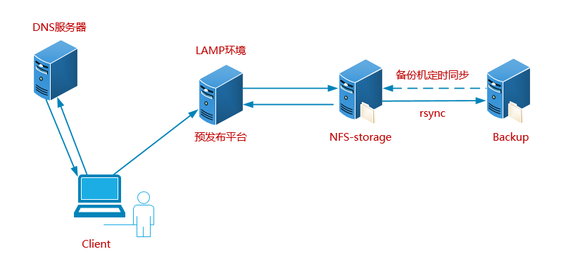

# LAMP 源码构建

## 任务要求

为企业内部的开发人员，部署一套“预发布系统”，要求其环境与线上环境一模一样。



- **源码**部署 LAMP 环境，和生产保持一致
- 静态资源文件同步生产环境（生产发生改变立马同步到预发布平台）

## 系统环境

| 编号 | 主机名称      | IP 地址   | 备注信息        |
| ---- | ------------- | --------- | --------------- |
| 1    | web.itcast.cn | 10.1.1.13 | LAMP 预发布环境 |

① 更改主机名称、配置 IP 地址（静态 IP、更改 UUID 编号、关闭 NetworkManager）

② 关闭防火墙、SELinux

③ 配置 YUM 源（有网配公网，没网配光盘或自建 YUM 源）

## 依赖软件安装

```powershell
# yum install cmake pcre-devel ncurses-devel openssl-devel libcurl-devel
```

## AMP 软件安装注意事项

编译安装顺序：

```powershell
Linux+Apache(2.4)+MySQL(5.6.31)+PHP(7.2.17)

Apache——>MySQL——>PHP 或者  MySQL——>Apache——>PHP
```

## 编译安装MySQL软件

### 1、安装需求

| 软件版本     | 安装目录         | 数据目录              | 端口 |
| ------------ | ---------------- | --------------------- | ---- |
| mysql-5.6.31 | /usr/local/mysql | /usr/local/mysql/data | 3306 |

### 2、MySQL安装详解

第一步：创建一个mysql系统账号（没有这个账号mysql无法运行）

```powershell
# useradd -r -s /sbin/nologin mysql
```

第二步：对软件进行解压

```powershell
# tar xf mysql-5.6.31.tar.gz
# cd mysql-5.6.31
```

第三步：使用cmake配置MySQL的安装向导

```powershell
# vim cmake.sh
cmake . \
-DCMAKE_INSTALL_PREFIX=/usr/local/mysql/ \
-DMYSQL_DATADIR=/usr/local/mysql/data \
-DENABLED_LOCAL_INFILE=1 \
-DWITH_INNOBASE_STORAGE_ENGINE=1 \
-DMYSQL_TCP_PORT=3306 \
-DDEFAULT_CHARSET=utf8mb4 \
-DDEFAULT_COLLATION=utf8mb4_general_ci \
-DWITH_EXTRA_CHARSETS=all \
-DMYSQL_USER=mysql

# chmod +x cmake.sh
# ./cmake.sh
```

第四步：make && make install

```powershell
# make && make install
```

第五步：更改目录权限以及初始化数据库

```powershell
# chown -R mysql.mysql /usr/local/mysql

# cd /usr/local/mysql
删除/etc/my.cnf文件，如果不删除此文件，会导致初始化失败
# rm -f /etc/my.cnf
初始化就是给mysql数据库一些初始化的数据（如账号、密码、数据文件，ll data）
# ./scripts/mysql_install_db --user=mysql
# ll data
这个目录如果产生了一个mysql的文件夹就代表初始化成功了
```

第六步：把mysql的启动脚本copy到/etc/init.d目录下，起一个名称叫做mysql

```powershell
# cp support-files/mysql.server /etc/init.d/mysql
# service mysql start
```

第七步：设置密码与环境变量

```powershell
# cd /usr/local/mysql
# bin/mysqladmin -u root password '123'
```

> 生产环境下，密码一定要越复杂越好

第八步：把/usr/local/mysql/bin目录添加到环境变量

```powershell
# echo 'export PATH=$PATH:/usr/local/mysql/bin' >> /etc/profile
# source /etc/profile

# mysql -uroot -p
Enter password:123
mysql> exit;
```