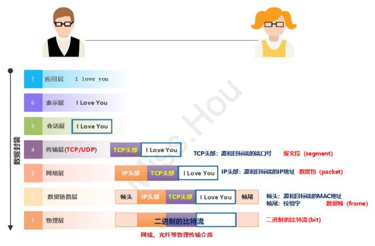
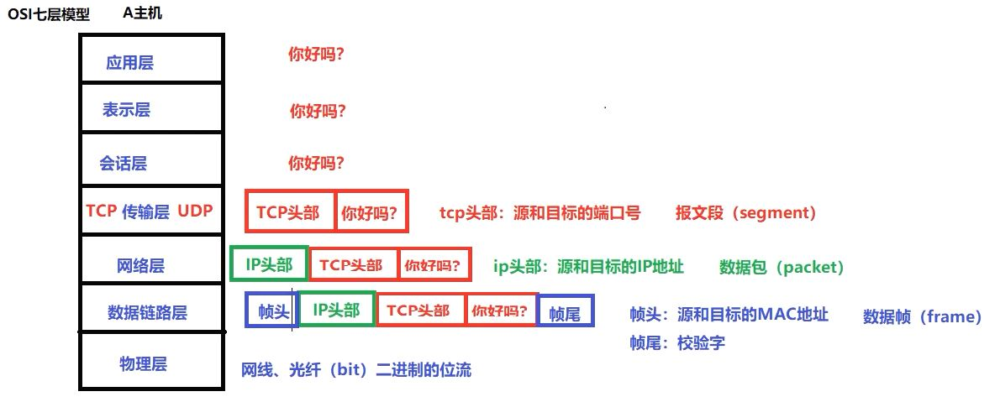

## 1. 什么是 OSI 模型

**OSI:**

- 开放系统互连参考模型,是国际标准化组织(ISO)和国际电报电话咨询委员会(CCITT)联合制定的开放系统互连参考模型。

目的: 为开放式互连信息系统提供了一种功能结构的框架和参考。

OSI 采用了分层的结构化技术，共分七层：

**物理层、数据链路层、网络层、传输层、会话层、表示层、应用层**

## 2. OSI 的七层介绍

### 1 应用层

- 应用层是计算机用户，以及各种应用程序和网络之间的接口，其功能是直接向用户提供服务，完成用户希望在网络上完成的各种工作。

- 应用层为用户提供的`服务和协议`：文件传输服务（FTP）、远程登录服务（ssh）、网络管理服等。

- 上述的各种网络服务由该层的不同应用协议和程序完成。

- 应用层的`主要功能`如下：
  - `用户接口`：应用层是用户与网络，以及应用程序与网络间的直接接口，使得用户能够与网络进行交互式联
  - `实现各种服务`：该层具有的各种应用程序可以完成和实现用户请求的各种服务。

### 2 表示层

- 表示层是`对来自应用层的命令和数据进行解释，对各种语法赋予相应的含义，并按照一定的格式传送给会话层。`

- 其主要功能是`处理用户信息的表示问题`，如编码、数据格式转换和加密解密等。

- 表示层的具体功能如下：
  - 数据格式处理：协商和建立数据交换的格式，解决各应用程序之间在数据格式表示上的差异。
  - 数据的编码：处理字符集和数字的转换。
  - 压缩和解压缩：为了减少数据的传输量，这一层还负责数据的压缩与解压缩。
  - 数据的加密和解密：可以提高网络的安全性。

### 3 会话层

- 会话层是用户应用程序和网络之间的接口，主要任务是：组织和协调两个会话进程之间的通信，并对数据交换进行管理。

- 当建立会话时，用户必须提供他们想要连接的远程地址。

### 4 传输层

- OSI 上 3 层：应用层、表示层、会话层的主要任务是数据处理——`资源子网`

- OSI 下 3 层：网络层、数据链路层、物理层的主要任务是数据通讯——`通讯子网`

- 传输层是 OSI 模型的第 4 层，它是通信子网和资源子网的接口和桥梁，起到承上启下的作用

- 传输层的主要任务是：`向用户提供可靠的端到端的差错和流量控制，保证报文的正确传输`

`报文`：报文(message)是网络中交换与传输的

`报文段`:组成报文的每个分组。我们将运输层分组称为报文段(segment)

### 5 网络层

- 主要任务是：`数据链路层的数据在这一层被转换为数据包，然后通过路径选择、分段组合、顺序、进/出路由等控制，将信息从一个网络设备传送到另一个网络设备。`

- 一般情况下，数据链路层是解决`同一网络`(局域网)内节点之间的通信，而网络层主要解决`不同子网`间的通信。

### 6 数据链路层

`在计算机网络中由于各种干扰的存在，物理链路是不可靠的。因此，这一层的主要功能是:`

- 在物理层提供的比特流的基础上，通过差错控制、流量控制方法，使有差错的物理线路变为无差错的数据链路，即`向网络层提供可靠的通过物理介质传输数据的方法。`

- 具体工作是：接收来自物理层的位流（比特流）形式的数据，通过差错控制等方法传到网络层；同样，也将来自上层的数据，封装成帧转发到物理层；并且，还负责处理接收端发回的确认帧的信息，以便提供可靠的数据传输。

### 7 物理层

- 主要功能是：利用传输介质为数据链路层提供物理连接，实现`比特流的透明传输`。尽可能屏蔽掉具体传输介质和物理设备的差异。

## 总结

- 在7层模型中，每一层都提供一个特殊的网络功能。

- 从网络功能的角度观察：
  - 物理层、数据链路层、网络层：主要提供数据传输和交换功能，即节点到节点之间通信为主；
  - 传输层（第4层）：作为上下两部分的桥梁，是整个网络体系结构中最关键的部分；
  - 会话层、表示层和应用层：以提供用户与应用程序之间的信息和数据处理功能为主；

## 数据的传输过程

