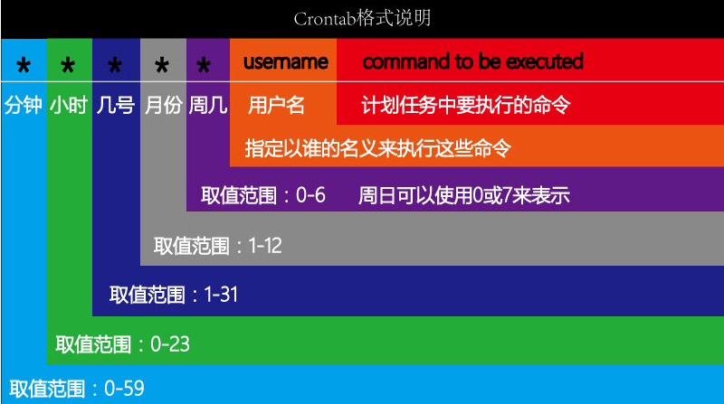

# 常用自有服务（ntp,firewalld,crond)

| 服务名    | 含义                           |
| --------- | ------------------------------ |
| ntpd      | 用于同步计算机的系统时间的服务 |
| firewalld | 防火墙服务                     |
| crond     | 计划任务服务                   |

## 1、ntp 时间同步服务

​ NTP 是网络时间协议(Network Time Protocol)，它是用来同步网络中各个计算机的时间的协议。

工作场景：

​ 公司开发了一个电商网站，由于访问量很大，网站后端由 100 台服务器组成集群。50 台负责接收订单，50 台负责安排发货，接收订单的服务器需要记录用户下订单的具体时间，把数据传给负责发货的服务器，由于 100 台服务器时间各不相同，记录的时间经常不一致，甚至会出现下单时间是明天，发货时间是昨天的情况。

### 1）NTP 同步服务器原理

​ 标准时间是哪里来的？

​ 现在的标准时间是由原子钟报时的国际标准时间 UTC（Universal Time Coordinated，世界协调时)，所以 NTP 获得 UTC 的时间来源可以是原子钟、天文台、卫星，也可以从 Internet 上获取。

​ 在 NTP 中，定义了时间按照服务器的等级传播，**Stratum 层的总数限制在 15 以内**

​ 工作中，==通常我们会直接使用各个组织提供的，现成的 NTP 服务器==

### 2）到哪里去找 NTP 服务器

NTP 授时网站：http://www.ntp.org.cn/pool

### 3）时间同步操作

同步服务器时间方式有 2 个：一次性同步手动同步、通过服务自动同步。

**手动同步**

```powershell
用法一：ntpdate 时间服务器IP
示例代码：
#ntpdate 120.25.108.11
含义：从服务器120.25.108.11同步标准网络时间到服务器（120.25.108.11服务器由阿里云提供，可以从http://www.ntp.org.cn/pool.php网站获取）
注意：从网络同步时间，要确保自己的服务器可以访问互联网
```

错误信息：no servers can be used

含义：服务器不可用，这里的服务器是指网络上的时间服务器，不可用，不代表是对方服务器有问题，也有可能是你自己的服务器网络不通，无法连接到网络上的时间服务器。

**自动同步**

```powershell
用法二：启动ntpd服务，并配置为开机启动
示例代码：
#systemctl start ntpd
#systemctl enable ntpd
含义：启动ntpd服务，并配置为开机启动，服务启动后，系统会自动同步网络时间
注意：从网络同步时间，要确保自己的服务器可以访问互联网
```

问题 1：启动 ntpd 服务后，是不是时间就自动同步了？

启动后就自动同步了

问题 2：需不需要让 ntpd 服务，开机自动运行？

需要

ntpd 服务配置文件位置 /etc/ntp.conf

---

## 2、Linux 中的计划任务

作用：操作系统不可能 24 小时都有人在操作，有些时候想在指定的时间点去执行任务（例如：每天凌晨 2 点去重新启动 httpd=>阿帕奇），此时不可能真有人每天夜里 2 点去执行命令，这就可以交给计划任务程序去执行操作了。

> 在指定的时间执行指定的操作！

### Linux 中的计划任务

基本语法：

```powershell
# crontab [选项]
-l ：list，显示目前已经设置的计划任务
-e ：使用vim编辑器编辑计划任务的文件
```

案例：显示当前账号下的计划任务

```powershell
# crontab -l
no crontab for root => root账号下没有创建计划任务
```

案例：编写计划任务

```powershell
# crontab -e
```

### 计划任务的编辑

crontab -e进入计划任务编辑文件

打开计划任务编辑文件后，可以在此文件中编写我们自定义的计划任务：

==计划任务的规则语法格式，以行为单位，一行则为一个计划==

```powershell
分  时  日  月  周  要执行的命令（要求必须使用命令的完整路径，可以使用which查看）

取值范围（常识）：
分：0~59
时：0~23
日：1~31
月：1~12
周：0~7，0 和 7 表示星期天

四个符号：
*：表示取值范围中的每一个数字
-：做连续区间表达式的，要想表示1~7，则可以写成：1-7
/：表示每多少个，例如：想每 10 分钟一次，则可以在分的位置写：*/10
,：表示多个取值，比如想在 1 点，2 点 6 点执行，则可以在时的位置写：1,2,6
```



:::tip
在Linux系统中, 有些命令不能直接在计划任务中使用, 使用后, 其也不会生效. 入useradd命令. 如果想让其生效必须使用完整路径
:::

```
问题: 如何查询一个命令的真实路径在哪个位置?

使用whereis 命令
```

### 几个小案例

问题1：每月1、10、22 日的4:45 重启network 服务

```powershell
第一步：定制格式
分  时  日      月   周 /usr/bin/systemctl restart network
第二步：定制时间
45  4  1,10,22  *   *  /usr/bin/systemctl restart network
```

问题2：每周六、周日的1:10 重启network 服务

```powershell
第一步：定制格式
分 时 日 月 周 /usr/bin/systemctl restart network
第二步：定制时间
10 1  * *  6,7 /usr/bin/systemctl restart network
```

问题3：每天18:00 至23:00 之间每隔30 分钟重启network 服务

```powershell
第一步：定制格式
分 时 日 月 周 /usr/bin/systemctl restart network
第二步：定制时间
*/30 18-23 * * * /usr/bin/systemctl restart network
```

问题4：每隔两天的上午8 点到11 点的第3 和第15 分钟执行一次重启

```powershell
第一步：定制格式
分 时 日 月 周 /usr/sbin/reboot
第二步：定制时间
3,15  8-11 */2 * * /usr/sbin/reboot
```

案例：每1 分钟往 root 家目录中的 readme.txt 中输一个1，为了看到效果使用追加输出【输出使用echo 命令，语法：# echo 输出的内容】

```powershell
# crontab -e
* * * * * /usr/bin/echo 1 >> /root/readme.txt
```

提示：为了看到计划任务的效果，你可以单独开一个选项卡，使用tail  -f  /root/readme.txt


### 计划任务权限

### ☆ 黑名单

crontab是任何用户都可以创建的计划任务，但是超级管理员可以通过配置来设置某些用户不允许设置计划任务 。

提出问题：如果我们想限定某个用户（如itheima）使用计划任务，如何处理呢？

答：可以使用计划任务的黑名单，黑名单文件路径 => ==/etc/cron.deny==文件

案例：把普通账号itheima加入到cron.deny黑名单中，禁止其创建计划任务

第一步：切换到超级管理员root

```powershell
# su - root
```

第二步：使用vim打开/etc/cron.deny文件

```powershell
# vim /etc/cron.deny
```

第三步：把你需要禁止的用户名单，加入此文件（如itheima）

```powershell
itheima
```

切换到itheima账号，测试是否可以使用crontab命令

### ☆ 白名单

在Linux的计划任务中，除了拥有黑名单以外，还有白名单。作用：允许哪些用户使用计划任务。

白名单文件的路径 => ==/etc/cron.allow==，但是要特别注意，此文件需要手工创建。

> 注意：白名单优先级高于黑名单，如果一个用户同时存在两个名单文件中，则会被默认允许创建计划任务。

### 查看计划任务的保存文件

问题：计划任务文件具体保存在哪里呢？

答：`/var/spool/cron/用户名称`，如果使用root用户编辑计划任务，则用户文件名为root

```powershell
# ll /var/spool/cron
total 4
-rw-------. 1 itheima itheima  0 Mar 24 09:50 itheima
-rw-------. 1 root    root    40 Mar 24 10:21 root
```

### 计划任务的日志程序

问题：在实际应用中，我们如何查看定时任务运行情况？

答：通过计划任务日志，日志文件位于`/var/log/cron`

案例：演示计划任务的日志程序

第一步：使用root账号创建一个计划任务

```powershell
# su - root
# crontab -e
* * * * * echo 1 >> ~/readme.txt
```

第二步：使用tail -f命令监控/var/log/cron日志程序

```powershell
# tail -f /var/log/cron
```

### 扩展内容：at命令

在Linux系统下，有两个命令可以实现计划任务：crontab与at（第三方需要额外安装）

crontab ：每天定时执行计划任务（最小单元分钟）

at ：一次性定时执行任务

### ☆ 安装at命令

CentOS7自带，其他版本可能需要手工安装

```powershell
# yum install at -y
```

### ☆ 启动底层服务

```powershell
# systemctl start atd
# systemctl enable atd
```

> atd = at + d = at命令 + daemon缩写

### ☆ 案例演示

案例1：三天后下午5点执行/bin/ls

```powershell
# at 5pm+3 days
at>/bin/ls >/root/readme.txt
at>按Ctrl+D
```

> am = 上午、pm = 下午、3 days = 3天

案例2：明天17点，输出时间到指定的文件中

```powershell
# at 17:00 tomorrow
at>date>/root/readme.txt
at>按Ctrl+D
```

> tomorrow = 明天

案例3：使用atq查看没有执行的计划任务

```powershell
# atq
```

> atq = at + q = at命令 + query查询

案例4：删除指定的计划任务

```powershell
# atq
# atrm 任务号
```

> atrm = at + rm = at命令 + remove移除

---

## Linux 下的软件包管理

### Linux 下软件的安装方式

① RPM 软件包安装 => 软件名称.rpm

② YUM 包管理工具 => yum install 软件名称 -y

③ 源码安装 => 下载软件的源代码 => 编译 => 安装（最麻烦的，但是也最稳定）

### 二进制软件包

​ 二进制包，也就是源码包经过成功编译之后产生的包。

​ 二进制包是 Linux 下默认的软件安装包，目前主要有以下 2 大主流的二进制包管理系统：

- ==RPM 包==管理系统：功能强大，安装、升级、査询和卸载非常简单方便，因此很多 Linux 发行版都默认使用此机制作为软件安装的管理方式，例如 Fedora、==CentOS==、SuSE 等。
- DPKG 包管理系统：由 Debian Linux 所开发的包管理机制，通过 DPKG 包，Debian Linux 就可以进行软件包管理，主要应用在 Debian 和 Ubuntu 中。

​ **RPM**是 RedHat Package Manager（RedHat 软件包管理工具）的缩写

​ 作用：rpm 的作用类似于豌豆荚，华为应用市场，App Store，主要作用是对 linux 服务器上的软件包进行对应管理操作，管理分为：查询、卸载、安装/更新。

### 获取\*.rpm 软件包

a. 去官网去下载；

b. 不介意老版本的话，可以从光盘（或者镜像文件）中读取；CentOS7.6\*.iso

### 查询系统中已安装的 rpm 软件

```powershell
# rpm -qa |grep 要搜索的软件名称
选项说明：
-q ：query，查询操作
-a ：all，代表所有
```

案例 1：查询计算机中已安装的 rpm 软件包

```powershell
# rpm -qa
```

案例 2：搜索计算机中已安装的 firefox 软件包

```powershell
# rpm -qa |grep firefox
```

### 卸载 CentOS 系统中的 rpm 软件包

```powershell
# rpm -e 软件名称 [选项]
选项说明：
--nodeps ：强制卸载
```

案例：把系统中的 firefox 浏览器进行卸载操作

```powershell
# rpm -qa |grep firefox
firefox-60.2.2-1.el7.centos.x86_64

# rpm -e firefox-60.2.2-1.el7.centos.x86_64
```

### rpm 软件包的安装

基本语法：

```powershell
# rpm -ivh 软件包的名称.rpm
选项说明：
-i：install，安装
-v：显示进度条
-h：表示以"#"形式显示进度条
```

### rpm 软件包的升级

基本语法：

```powershell
# rpm -Uvh 升级后的软件包名称.rpm
选项说明：
-U ：Update，更新操作
```

案例：使用 rpm -Uvh 对 firefox-60.2.2 版本进行升级

```powershell
# rpm -Uvh firefox-68.4.1-1.el7.centos.x86_64.rpm
```

### ☆ 查看文件所属的包名

基本语法：f = file

```powershell
# rpm -qf 文件名称
```

主要功能：判断某个文件所属的包名称

案例：查询/etc/ntp.conf 属于哪个软件包

```powershell
# rpm -qf /etc/ntp.conf
ntp-4.2.6p5-28.el7.centos.x86_64
```

### ☆ 查询软件安装完成后，生成了哪些文件

基本语法：l = list，显示这个软件安装后生成了哪些文件

```powershell
# rpm -ql 软件名称
```

案例 1：查询 firefox 软件生成了哪些文件

```powershell
# rpm -ql firefox

特别说明：软件安装完成后，一共生成了以下几类文件
配置文件类：/etc目录
程序文件本身，二进制文件命令：/usr/bin或/usr/sbin目录
文档手册：/usr/share/doc或man目录
```

案例 2：查询 openssh 软件生成了哪些文件

```powershell
# rpm -ql openssh
```
