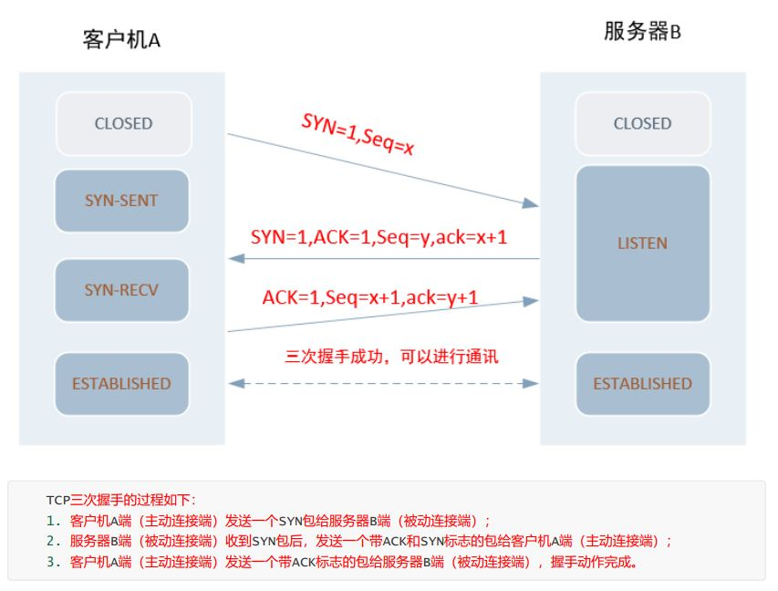
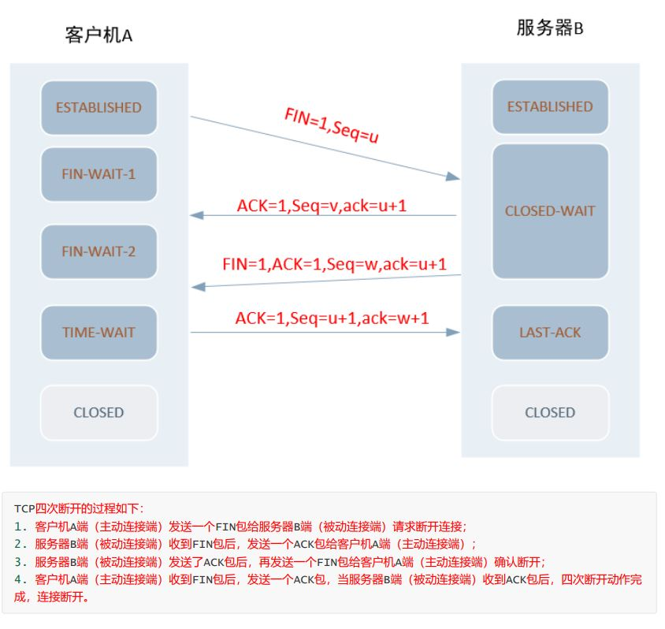

## 1. 了解相关名词

序列号：Seq序号，占32位，用来标识从TCP源端向目的端发送的字节流，发起方发送数据时对此进行标记。

确认序号：Ack序号，占32位，只有ACK标志位为1时，确认序号字段才有效，Ack=Seq+1。
常见的标志位：

ACK：确认序号有效。  
SYN：发起一个新连接。  
FIN：释放一个连接。  

## 2. 了解netstat中的网络状态

CLOSED 初始（无连接）状态。  
LISTEN 侦听状态，等待远程机器的连接请求。  
SYN_SEND 在TCP三次握手中，主动连接端发送了SYN包后，进入SYN_SEND状态，等待对方的ACK包。  
SYN_RECV 在TCP三次握手中，主动连接端收到ACK包后，进入SYN_RECV状态。
ESTABLISHED 完成TCP三次握手后，主动连接端进入ESTABLISHED状态。此时，TCP连接已经建立，可以进行通信。  
FIN_WAIT_1 在TCP四次断开时，主动关闭端发送FIN包后，进入FIN_WAIT_1状态。  
FIN_WAIT_2 在TCP四次断开时，主动关闭端收到ACK包后，进入FIN_WAIT_2状态。

## 3. TCP/IP三次握手

## 4. TCP/IP四次断开

