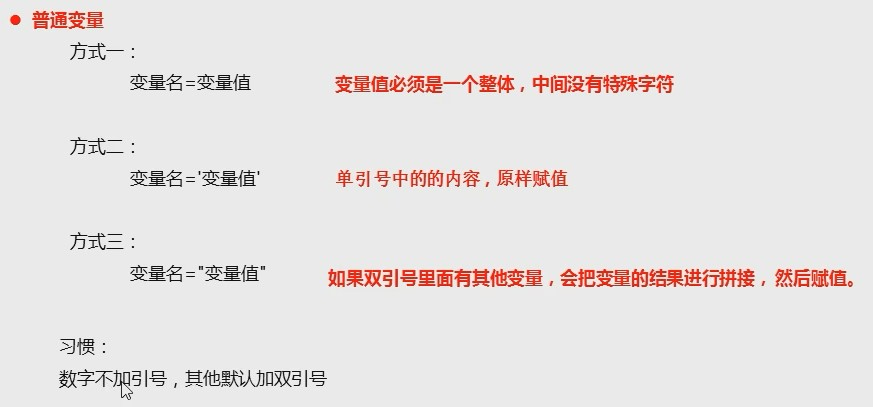
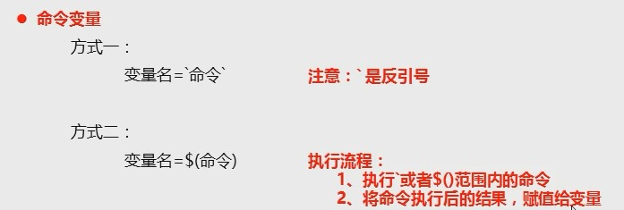
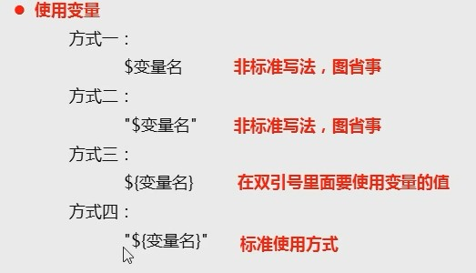
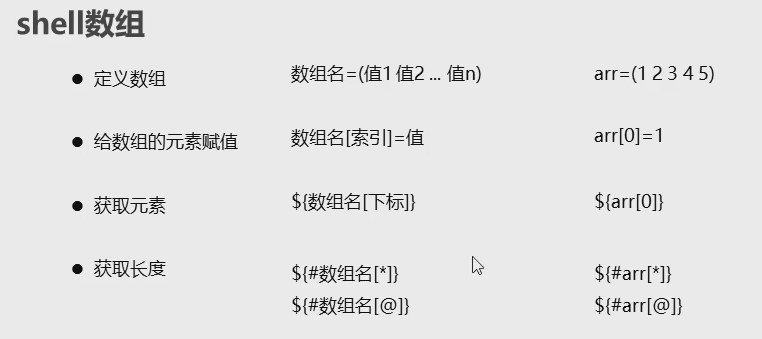
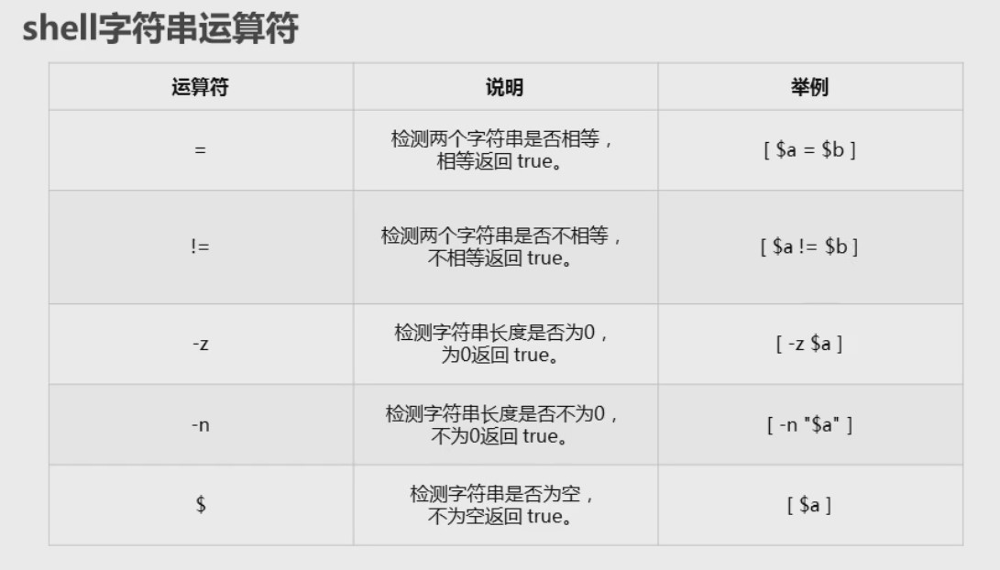
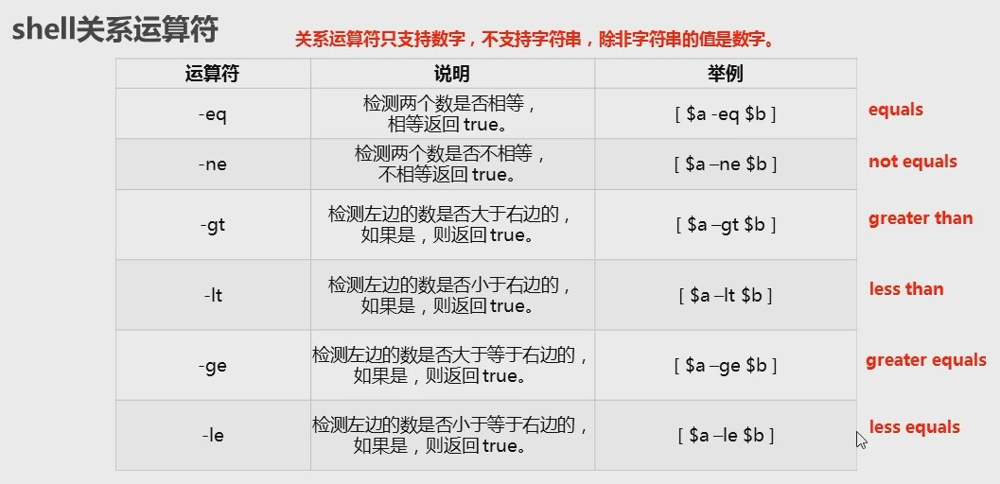
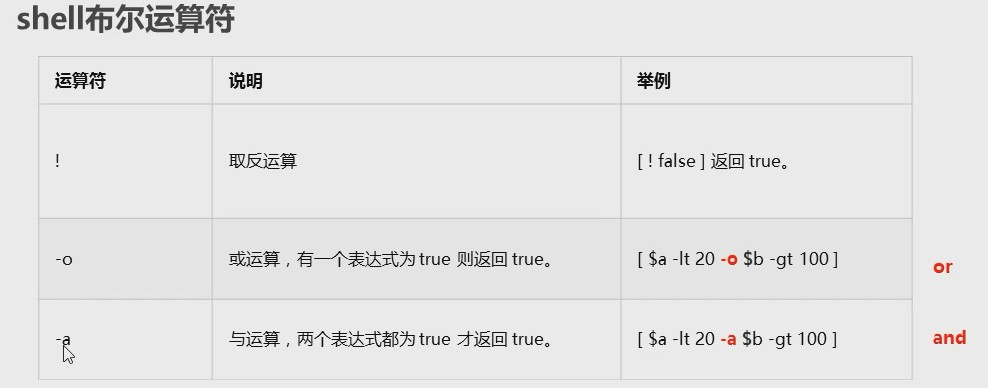

shell 就是一个**命令解释器**

shell 是位于操作系统和应用程序之间, 是他们二者最主要的接口

shell 负责把应用程序的输入命令信息解释给操作系统, 将操作系统指令处理后的结果解释给应用程序

一句话, shell 就是在操作系统和应用程序之间的一个命令翻译工具

windows 系统: cmd.exe

linux 系统: sh/csh/ksh/bash/...

## 编写第一个 shell

1. 新建 a.sh 文件
2. 书写内容

```shell
#!/bin/bash
# 这是第一个shell脚本
echo 'nihao'
```

3. ls -al 查看权限如果不够, 使用 chmod 777 文件名更改权限后 执行 ./a.sh

## shell 变量

### 定义变量

1. 普通变量



2. 命令变量



### 使用变量



### 只读变量

readonly 变量名

### 删除变量

unset 变量名

## shell 数组



## shell字符串运算符



## shell关系运算符



## shell布尔运算符

