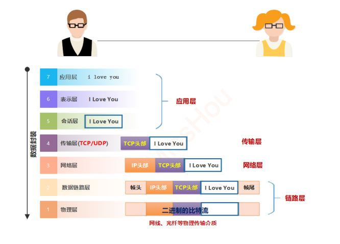
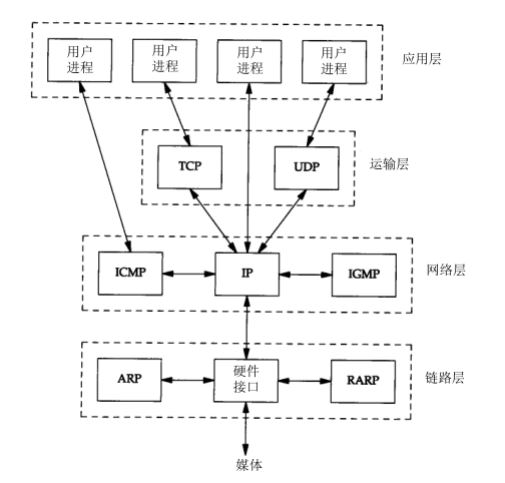
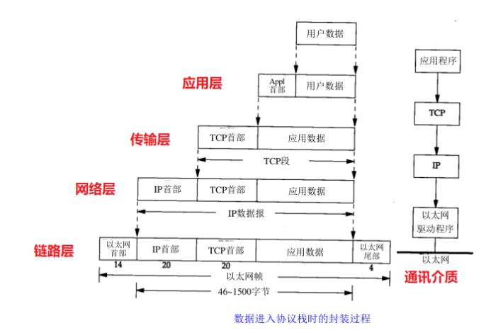

## 1. 什么是TCP/IP模型

TCP/IP协议模型（Transmission Control Protocol/Internet Protocol），包含了一系列构成互联网基础的网络协议，是Internet的核心协议，通过20多年的发展已日渐成熟，并被广泛应用于局域网和广域网中，目前已成为一种国际标准。

TCP/IP协议簇是一组不同层次上的多个协议的组合，该协议采用了4层的层级结构，每一层都呼叫它的下一层所提供的协议来完成自己的需求，与OSI的七层模型相对应。

尽管通常称该协议族为TCP/IP，但TCP和IP只是其中的两种协议而已（该协议族的另一个名字是Internet协议族(Internet Protocol Suite)）

## 2. TCP/IP的分层结构

### 2.1 链路层

**OSI的物理层和数据链路层**

- 链路层中ARP（地址解析协议IP-MAC）和RARP（逆地址解析协议MAC-IP）是某些网络接口（如以太网）使用的特殊协议，用来转换IP层和网络接口层使用的地址。

### 2.2 网络层

- 也称作互联网层或网际层，处理分组在网络中的活动，例如分组的选路。

- 在TCP/IP协议族中，网络层协议包括IP协议（网际协议），ICMP协议（Internet互联网控制报文协议），以及IGMP协议（Internet组管理协议）。

  - IP是一种网络层协议，提供的是一种不可靠的服务，它只是尽可能快地把分组从源结点送到目的结点，但是并不提供任何可靠性保证。同时被TCP和UDP使用。

  - TCP和UDP的每组数据都通过端系统和每个中间路由器中的IP层在互联网中进行传输。

  - ICMP是IP协议的附属协议。IP层用它来与其他主机或路由器交换错误报文和其他重要信息。它主要是用来提供有关通向目的地址的路径信息。Ping和Traceroute工具，它们都使用了ICMP协议。

  - IGMP是Internet组管理协议。它用来把一个UDP数据报多播到多个主机。该协议运行在主机和组播路由器之间。

### 2.3 运输层

**主要为两台主机上的应用程序提供端到端的通信。在TCP/IP协议族中，有两个互不相同的传输协议：TCP（传输控制协议）和UDP（用户数据报协议）**

TCP协议：

为两台主机提供高可靠性的数据通信。TCP是面向连接的通信协议，通过三次握手建立连接，通讯完成时要断开连接，由于TCP是面向连接的所以只能用于端到端的通讯。TCP提供的是一种可靠的数据流服务，采用“带重传的肯定确认”技术来实现传输的可靠性。也就是TCP数据包中包括序号（seq）和确认（ack），所以未按照顺序收到的包可以被排序，而损坏的包可以被重传。 

UDP协议：

则为应用层提供一种非常简单的服务。它是面向无连接的通讯协议，UDP数据包括目的端口号和源端口号信息，由于通讯不需要连接，所以可以实现广播发送。 UDP通讯时不需要接收方确认，不保证该数据报能到达另一端，属于不可靠的传输，可能会出现丢包现象。UDP与TCP位于同一层，但它不管数据包的顺序、错误或重发。

### 2.4 应用层

OSI会话层、表示层、应用层

应用层负责处理特定的应用程序细节。

HTTP、FTP、SSH、DHCP、DNS.....

-----

## 3. 数据封装过程

### 数据格式

TCP数据信息：TCP头部+实际数据 (TCP头包括源和目标主机端口号、顺序号、确认号、校验字等）

IP数据包：IP头部+TCP数据信息（IP头包括源和目标主机IP地址、类型、生存期等）

数据帧：帧头+IP数据包+帧尾 （帧头包括源和目标主机MAC初步地址及类型，帧尾是校验字）

### 数据的封装与解封装

封装：数据要通过网络进行传输，要从高层一层一层的向下传送，如果一个主机要传送数据到别的主机，先把数据装到一个特殊协议报头中，这个过程叫-----`封装`。 解封装：上述的逆向过程

当数据以TCP/IP协议传输时的封装与街封装过程如下图：

