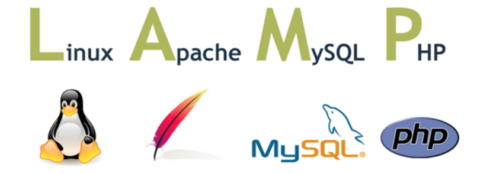
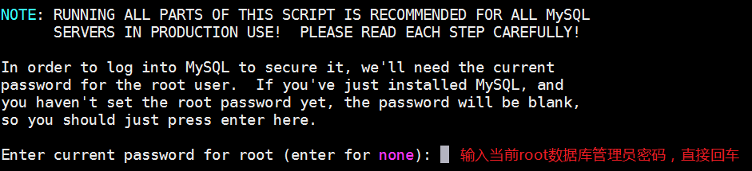
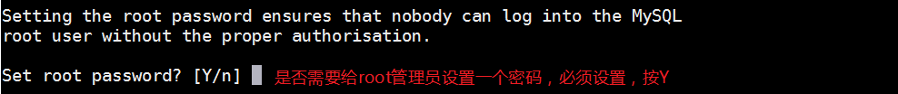
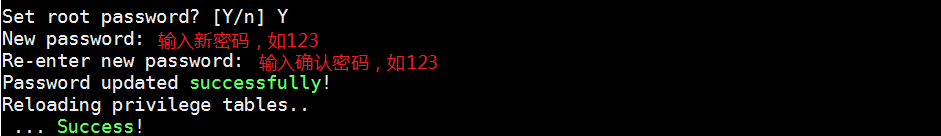
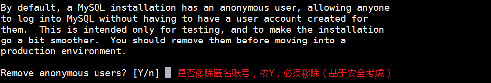
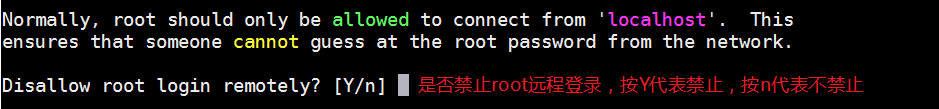
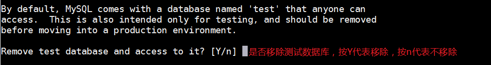

## YUM 概述

### 1、Linux 软件的安装方式

在 CentOS 系统中，软件管理方式通常有三种方式：`rpm安装`、`yum安装`以及`编译安装`。

```powershell
编译安装，从过程上来讲比较麻烦，包需要用户自行下载，下载的是源码包，需要进行编译操作，编译好了才能进行安装，这个过程对于刚接触Linux的人来说比较麻烦，而且还容易出错。好处在于是源码包，对于有需要自定义模块的用户来说非常方便。
```

### 2、什么是 yum

​ Yum（全称为 `Yellow dog Updater, Modified`）是一个在 Fedora 和 RedHat 以及 CentOS 中的 Shell 前端软件包管理器。

​ 基于 rpm 包管理，能够从**指定的服务器**(yum 源）自动下载 RPM 包并且安装，可以==自动处理依赖性关系==，并且==一次安装所有依赖的软件包==，无须繁琐地一次次下载、安装。

:::tip rpm 和 yum 区别?
1. yum 底层也是基于 rpm 进行安装的(yum 安装的软件, 可以通过 rpm -qa 进行查询)
2. yum 相对于 rpm 最大的优势, 可以解决依赖关系
:::

yum 配置文件位置

```powershell
#cd /etc/yum.repos.d/
#ll
```

### 3、配置阿里 yum 源

​ 使用阿里 yum 源代替系统默认的 yum 源

```powershell
① 备份默认源
#cd /etc/yum.repos.d/
#mv CentOS-Base.repo CentOS-Base.repo.bak

② 下载新CentOS-Base.repo
#wget -O /etc/yum.repos.d/CentOS-Base.repo http://mirrors.aliyun.com/repo/Centos-7.repo
含义:使用阿里云的yum源代替默认的yum源，下载软件更快


③ 清除所有缓存
#yum clean all 

④ 重新生成缓存
#yum makecache
```

<http://mirrors.aliyun.com/repo/>选择不同centos版本的yum源

---------------------------------

## LAMP 概述

### 1、什么是LAMP

LAMP：Linux + Apache + MySQL + PHP LAMP 架构（组合）  
LNMP：Linux + Nginx + MySQL + php-fpm LNMP 架构（组合）  
LNMPA：Linux + Nginx(80) + MySQL + PHP + Apache Nginx 代理方式



### 2、部署LAMP环境

### ☆ 检查系统中是否已安装Apache

```powershell
# rpm -qa |grep httpd

如果安装过可以使用以下命令进行删除
# rpm -e httpd-2.4.6-90.el7.centos.x86_64
# rpm -e httpd-tools-2.4.6-90.el7.centos.x86_64
```

### ☆ 检查系统中是否已安装MySQL

```powershell
# rpm -qa |grep mysql
```

### ☆ 检查系统中是否已安装PHP

```powershell
# rpm -qa |grep php
```

> AMP安装指南：在Linux中安装AMP必须先安装Apache，在安装MySQL，最后安装PHP


### 3、LAMP环境之Apache安装

Apache：阿帕奇，Apache基金会

httpd软件 => 前身apache，随着时间的推移以及互联网行业的发展，越来越多的软件加入到了Apache的基金会。

第一步：安装httpd软件

```powershell
# yum install httpd -y
```

第二步：配置/etc/httpd/conf/httpd.conf文件

```powershell
# vim /etc/httpd/conf/httpd.conf
/ServerName => 搜索
96 ServerName localhost:80
```

> localhost ： 代表本机，对应的IP地址可以使127.0.0.1或本机的公网IP

第三步：启动httpd服务

```powershell
# systemctl start httpd
```

第四步：把httpd服务添加到开机启动项中

```powershell
# systemctl enable httpd
```

第五步：使用ss或netstat命令查询httpd占用的端口

```powershell
# netstat -tnlp |grep httpd
或
# ss -naltp |grep httpd
```

第六步：在浏览器中，使用公网IP访问云服务器


### 4、LAMP环境之MySQL安装

### ☆ 下载MySQL的官网yum源

由于yum源上默认没有mysql-server。所以必须去官网下载后在安装

```powershell
# wget http://dev.mysql.com/get/mysql-community-release-el7-5.noarch.rpm
```

### ☆ 安装MySQL的官网镜像源

```powershell
# rpm -ivh mysql-community-release-el7-5.noarch.rpm
```

### ☆ 使用yum安装mysql最新版软件

```powershell
# yum install mysql-community-server -y
```

> MySQL软件是一个C/S架构的软件，拥有客户端与服务器端。mysql-server服务器端（内部也包含了客户端），community代表社区版（免费开源）

### ☆ 启动mysql，查看端口占用情况

```powershell
# systemctl start mysqld
# netstat -tnlp |grep mysqld
```

### ☆ MySQL数据库初始化（重要）

默认情况下，数据库没有密码，也没有任何数据，必须要初始化

#### ① 初始化数据，设置root密码（MySQL管理员）

```powershell
# mysql_secure_installation
```



> 扩展：以上说的root和Linux中的root不是同一个用户，这个root代表MySQL数据库的管理员，只不过这个管理员也叫root。











