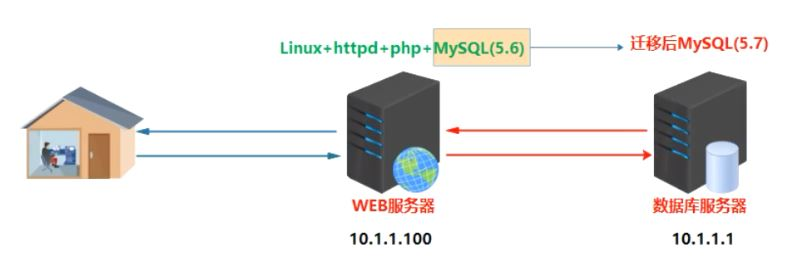

## 任务背景

​ 公司现在有几套不同版本的 MySQL 数据库，现在大部分的生产和测试环境都已经切换到 5.7 版本，由于历史原因，有一套测试环境版本为 MySQL-5.5。现为了将测试环境版本统一，需要将原来测试环境数据库 MySQL5.5 版本升级到现在的 MySQL5.7.31，并且保证数据完整。

## 案例背后的核心技术

1）不同版本 MySQL 的安装（花样安装 MySQL）

2）MySQL 数据库版本升级（升级需要注意什么）

3）如何经过自己思考，找到一种合适的解决方案

## 今日任务场景

​由于用户访问量以及用户数据越来越多，原有的单机服务器（LAMP 环境）已不能满足需求，在

需要保证数据完整的前提下，现需要将原有数据库迁移到另外一台单独的服务器上。迁移后，保证业务正常访问。

| 服务器角色        | IP         | 系统版本  | 数据库版本   |
| ----------------- | ---------- | --------- | ------------ |
| 老服务器（LAMP）  | 10.1.1.100 | Centos7.6 | MySQL-5.6.47 |
| 新服务器（MySQL） | 10.1.1.1   | Centos7.6 | MySQL-5.7.31 |

## 任务要求

1. 在业务维护时间段对数据库进行备份
2. 将MySQL数据库从老服务器（LAMP）中迁移到新的单独MySQL数据库服务器，版本升级为5.7.31

### 任务拆解

1. 新服务器安装Centos7.6，并且安装MySQL-5.7.31版本数据库
2. 停止监控、停止前端应用、停止MySQL数据库
3. 备份数据库（省略）
4. 迁移数据库——>同步数据库文件到新的环境中（rsync/scp）
5. 测试验证

### 涉及知识点

1. 官方下载mysql软件包（根据需求）
2. MySQL数据库的安装部署
3. MySQL数据库管理员用户root密码的设置及修改
4. mysql客户端工具的使用
