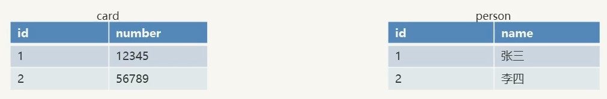
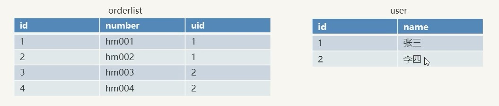
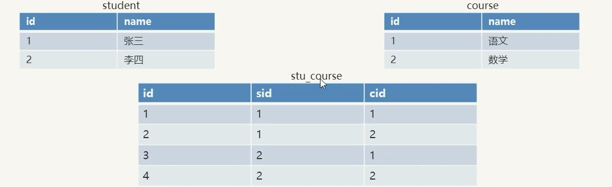

## 多表操作

### 一对一

适用场景: 人和身份证. 一个人只有一个身份证, 一个身份证对应一个人

建表原则: 在任意一个表建立外键, 去关联另外一个表的主键

### 一对多

适用场景: 用户和订单, 一个用户可以有多个订单

商品分类和商品, 一个分类下可以有多个商品

建表原则: 在多的地方, 建立外键约束, 来关联一的一方主键

### 多对多

适用场景: 学生和课程, 一个学生可以选择多个课程, 一个课程也可以被多个学生选择

建表原则: 需要借助第三张中间表, 中间表至少包含两个列, 这两个列作为中间表的外键, 分别关联两张表的主键

## 多表查询

### 多表查询分类

- 内连接查询
- 外连接查询
- 子查询
- 自关联查询

### 1.内连接查询

略