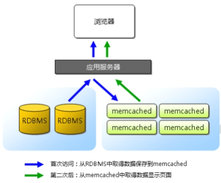

## 大型网站优化

### 1、网站访问流程

随着网站迭代开发，访问会变慢

LNMP 架构中网站应用访问流程

> 浏览器（app）=>web 服务器=>后端服务（php)=>数据库（mysql）

访问流程越多，访问速度和出现问题的几率也越大

优化访问速度，就需要减少访问步骤或者提高单步骤的速度

### 2、如何优化

根据网页的访问流程，可以进行以下优化：

① 提高 web 服务器并发 负载均衡（多台服务器架构） nginx

② 页面静态化 把经常访问，但是数据不经常发生变动的动态页面，制作为静态页面

③ 内存缓存优化 把经常访问的数据，加载到内存中使用

④ 数据库优化 很多时候，还需要取数据库信息，所以优化数据库本身

## 背景描述及其方案设计

随着业务量增加，访问量越来越大，用户在访问某些页面数据时，通过慢查询日志发现慢查询 SQL，经过优化之后效果还是不够明显。而此类数据发生变动的频率又较小，故提出使用缓存中间件（一般会将数据存储到内存中）的方式，降低 MySQL 的读压力，提高整个业务架构集群的稳定和快速响应能力

### 2、模拟运维设计方案

根据以上业务需求，准备加入缓存中间件服务器


根据以上业务需求和方案，服务器架构升级为如下示意图


在本次业务架构中，使用缓存中间件解决以下两个问题：

①session 共享

② 缓存热点数据，首页面的分类信息

## memcached 介绍和安装启动

### 1、介绍

memory cache cache in memory 缓存放入内存中

Memcached 是国外 社区 网站 LiveJournal 的开发团队开发的 ==高性能的分布式内存缓存服务器==。一般的使用目的是，通过==缓存数据库查询结果，减少数据库访问次数==，以==提高动态 Web 应用的速度==、提高可扩展性



关于缓存的过期，有效期问题，由业务编程代码实现

### 2、安装启动软件

**官方网址**：<http://memcached.org/>

**① 上传软件到服务器**

软件包名称 memcached-1.5.8.tar.gz

**② 解压并编译安装**

```shell
#memcache依赖libevent  安装libevent-devel解决
shell > yum -y install libevent-devel
#编译安装memcached
shell > tar xvf memcached-1.5.8.tar.gz
shell > cd memcached-1.5.8
shell > ./configure --prefix=/usr/local/memcached
shell > make && make install
```

**③ 查看软件启动参数，并启动**

```shell
shell > cd /usr/local/memcached/bin
shell > ./memcached -h
```

> -p 是设置 Memcache 监听的端口，最好是 1024 以上的端口；
>
> -d 是启动一个守护进程；
>
> -m 是分配给 Memcache 使用的内存数量，单位是 MB；
>
> -u 是运行 Memcache 的用户；
>
> -l 是监听的服务器 IP 地址，可以有多个地址；
>
> -c 是最大运行的并发连接数，默认是 1024；
>
> -P 是设置保存 Memcache 的 pid 文件

启动 memcached

```shell
#进入memcached文件目录
shell > cd /usr/local/memcached/bin
#后台启动memcached  可以创建一个普通用户（memcached）  用来启动管理memcached软件
shell > ./memcached -uroot -d
#进程查看是否启动成功
shell > ps aux |grep memcached
```

---

## memcached 使用

### telnet 连接使用

memcached 默认使用启动服务占用 tcp 11211 端口。可以通过 telnet 进行连接使用。

```shell
#安装telnet客户端
shell > yum -y install telnet
#通过telnet连接11211端口
shell > telnet 127.0.0.1 11211
#连接之后敲击多次，如果看到error，即为连接成功
#显示error的原因是，没有输入命令，所以memcached服务器回复error
```

### 存储命令

略

**缓存命中率**：命中数（get 获取到数据）/获取次数（get 的次数）

**get_hits/cmd_get**,如果命中率低，业务代码缓存有问题，命中率为 0，缓存没有起作用

==缓存穿透==

​ 访问的数据，数据库不存在的数据，每次都不能够生成缓存，每次请求都直接访问数据库，穿透了缓存，缓存没有起到作用。数据库压力没有得到缓解。

​ 解决方案，数据库查不到的，也做一个空缓存。

==缓存雪崩==

​ 缓存具有失效时间，如果缓存失效时间都是一样，本来应该请求缓存的，但是因为缓存失效了，全部请求到了数据库，数据库压力剧增，可能会造成数据库宕机，进而造成系统崩溃。

​ 解决方案，设置缓存的失效时间均匀分布。

## 失效机制

**① 如果 key 过期了，value 会及时删除么，空间会及时清空么？**

**② 如果分配的存储空间，写满了，还允许写么?**

### Lazy Expiration

memcached 内部不会监视记录是否过期，而是在 get 时查看记录的时间戳，检查记录是否过期。这种技术被称为 lazy（惰性）expiration。因此，memcached 不会在过期监视上耗费 CPU 时间

比如 php 的里 session 机制 懒惰机制 php 垃圾回收机制 gc 回收 python 变量垃圾回收机制

编程语言中，变量分配 栈空间（变量名称） 堆空间（变量值）

==memcached1.4.25 之后 就不是懒惰机制了。==

### LRU

memcached 会优先使用已超时的记录的空间，但即使如此，也会发生追加新记录时空间不足的情况，此时就要使用名为 Least Recently Used（LRU）机制来分配空间。顾名思义，这是删除“最近最少使用”的记录的机制。因此，当 memcached 的内存空间不足时，就从最近未被使用的记录中搜索，并将其空间分配给新的记录。从缓存的实用角度来看，该模型十分理想

不过，有些情况下 LRU 机制反倒会造成麻烦。memcached 启动时通过“­M”参数可以禁止 LRU
